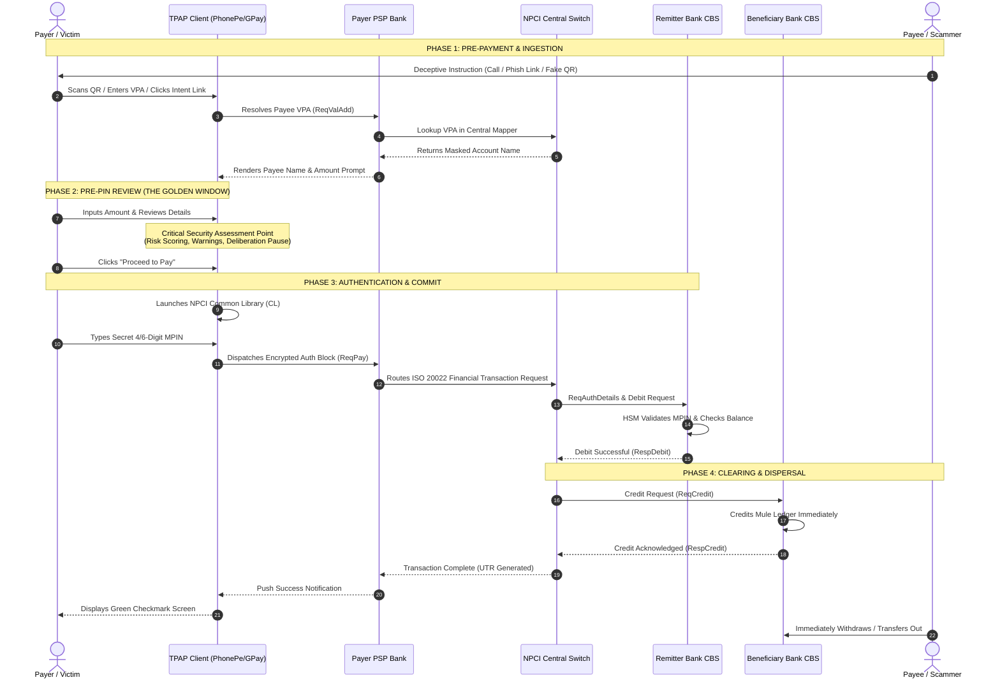

# End-to-End Payment Lifecycle: Phases, States, Timing, and the Interception Window

---

## 1. Executive Understanding (Layer 1)
A retail digital payment is not an instantaneous atomic event; it is a multi-stage distributed transaction executing across independent sovereign networks within tight latency bounds ($1.5\text{s} - 4.0\text{s}$). The lifecycle begins in the physical/cognitive realm (when a payer forms an intent or is subjected to social engineering) and terminates in central bank reserve ledgers.

From a cybersecurity and fraud prevention perspective, the lifecycle is strictly divided into two operational epochs:
1. **The Pre-Authorization Epoch (Mutable & Interceptable):** The transaction payload is being composed and reviewed. The funds remain securely in the payer's account. Interventions, warnings, pauses, and cancellations can be executed with zero systemic friction or financial loss.
2. **The Post-Authorization Epoch (Immutable & Irreversible):** The user has submitted their cryptographic authorization (MPIN). Funds are transferred across institutional ledgers within milliseconds. At this point, "interception" is technically impossible; only post-facto recovery and law-enforcement freezing remain.

---

## 2. Mermaid Lifecycle Architecture & Step-by-Step Flow (Layer 2)

---

## 3. Detailed Phase Analysis & Timing Profiles (Layer 3)

| Stage | Actors Involved | Information Manifested | State in Protocol | Typical Duration | Interception Feasibility |
| :--- | :--- | :--- | :--- | :--- | :--- |
| **1. Intent Trigger** | Payer, Scammer | Social manipulation script, deceptive claims, urgency context. | Off-rail / Cognitive | Seconds to Hours | **Impossible** (Off-rail communication). |
| **2. Payload Staging** | Payer, TPAP App | Payee VPA, raw Payee Name (`pn`), Amount, Note (`tn`), QR metadata. | Client Local State | $200\text{ ms} - 500\text{ ms}$ | **High:** App parses and inspects input parameters. |
| **3. VPA Resolution** | TPAP, PSP, NPCI | Registered Bank Name, VPA existence, account status. | `ReqValAdd` / `RespValAdd` | $150\text{ ms} - 350\text{ ms}$ | **High:** Counterparty verification signals emerge here. |
| **4. Pre-PIN Review** | Payer, TPAP App | Confirmation screen with Payee, Amount, and Bank selection. | `PENDING_AUTH` | **$2\text{ s} - 15\text{ s}$** (Human Dwell Time) | **CRITICAL GOLDEN WINDOW:** System can reason, challenge, or pause! |
| **5. MPIN Capture** | Payer, NPCI CL | Encrypted PIN block, Device Hardware Binding token. | `AUTH_CAPTURED` | $1.5\text{ s} - 4\text{ s}$ | **Zero:** Isolated in NPCI Common Library sandbox. |
| **6. Switch Routing** | PSP, NPCI | ISO 20022 XML packet with RRN/UTR, timestamp, terminal ID. | `IN_FLIGHT_SWITCH` | $50\text{ ms} - 150\text{ ms}$ | **Low:** Microsecond switch timeouts forbid heavy LLM calls. |
| **7. Core Debit** | Remitter Bank CBS | Customer balance, daily debit velocity, bank internal FRM score. | `DEBIT_COMMITTED` | $100\text{ ms} - 400\text{ ms}$ | **None:** Bank processes valid PIN instruction. |
| **8. Core Credit** | Beneficiary CBS | Beneficiary account number, inward credit velocity, freeze flags. | `CREDIT_COMMITTED` | $100\text{ ms} - 400\text{ ms}$ | **None:** Irreversible credit to recipient. |
| **9. Post-Completion** | Payer, TPAP, Bank | Success confirmation, UTR reference number. | `SETTLED_RETAIL` | Instantaneous | **Zero:** Money has changed sovereign ownership. |

---

## 4. Boundaries, Misconceptions & Epistemic Realities (Layer 4)

### 4.1 The Myth of the "In-Flight Switch Interceptor"
* **The Concept:** Engineers often propose putting an AI agent inside the payment switch (NPCI) that pauses a transaction while it runs a 5-second deep learning analysis.
* **The Reality:** NPCI's core switch processes over **4,000 transactions per second (TPS)** with peak bursts exceeding 8,000 TPS. The switch enforces an end-to-end network response timeout of **$5,000\text{ ms}$**. If a bank or middleware does not respond within $2,000\text{ ms}$, the switch automatically drops the connection with a `Transaction Timed Out (Decline)` code. Injecting multi-second reasoning into the network switch causes systemic transaction drops and violates national payment SLAs.
* **The Epistemic Takeaway for PS09:** Complex contextual reasoning, user interaction, and deliberative pause mechanisms **must be placed on the client application prior to MPIN capture (Stage 4)**, where human interaction naturally accommodates deliberative pacing.

---
**Primary References:**
1. NPCI: *UPI Unified Settlement & Clearing Architecture Manual v3.0*.
2. ISO 20022: *Financial Services – Universal Financial Industry Message Scheme: Payments Clearing and Settlement*.
3. Reserve Bank of India: *Master Direction – Operational Risk Management in Payment Systems*.
