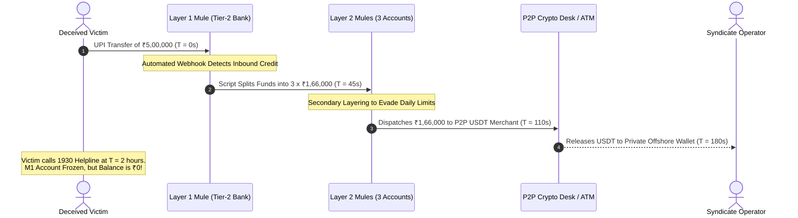

# Money Mules & Liquidity Dissipation: The Infrastructure of Financial Cybercrime

---

## 1. Executive Understanding (Layer 1)
A **money mule** is an individual or corporate shell entity whose bank account or digital wallet is used by criminal syndicates to receive, transfer, and launder illicitly obtained funds. In payment scams, money mules represent the indispensable **liquidity extraction layer**. Without a vast, disposable network of mule accounts, cybercriminals could not convert the victim's electronic payment into untraceable cash or cryptocurrency.

In India, money mule networks have evolved into a sophisticated parallel shadow industry. Accounts are systematically recruited, rented, or fabricated using forged KYC, and operated remotely via automated netbanking scripts. The defining operational characteristic of mule networks is **high-velocity layering**: scam proceeds rarely remain in the initial receiving account for more than **180 seconds**, making post-transaction police freezes virtually ineffective.

---

## 2. Structural Taxonomy of Money Mules (Layer 2)

```
┌─────────────────────────────────────────────────────────────────────────────┐
│                         MONEY MULE RECRUITMENT TYPES                        │
├─────────────────────────┬─────────────────────────┬─────────────────────────┤
│ 1. UNWITTING MULES      │ 2. COMPLICIT MULES      │ 3. FABRICATED / SHELL   │
│ • "Work from Home" task │ • Students / Daily wage │ • "Current Accounts"    │
│   workers receiving and │   laborers selling ATM  │   opened with forged    │
│   forwarding commissions│   cards for ₹2,000/mo   │   GST/MSME certificates │
│ • Romance scam victims  │ • Fully aware of fraud; │ • High transaction limit│
│ • Believe it is legal   │   treat as easy income  │ • Used for large scams  │
└─────────────────────────┴─────────────────────────┴─────────────────────────┘
```

---

## 3. The 180-Second Dissipation Cycle (Layer 3)



### 3.1 Forensic Invariants of Indian Mule Accounts
Financial intelligence units (FIU-IND) and banking security teams have identified specific empirical traits that distinguish mule accounts from legitimate consumer accounts:

| Behavioral Dimension | Legitimate Consumer Account | Money Mule Account |
| :--- | :--- | :--- |
| **Inward/Outward Velocity** | Receives salary monthly; spends gradually over 30 days. | **Immediate Pass-Through:** Inbound ₹50,000 is debited within 90 seconds. |
| **End-of-Day Balance** | Retains balance; positive median balance. | **Near-Zero Balance:** Account balance rests at ₹10–₹50 between bursts. |
| **Counterparty Diversity** | Transacts with recurring circle of friends/merchants. | **Extreme Diversity:** Receives money from 30 completely unrelated remitters across India. |
| **Geographic Dispersion** | Account opened in Bihar; ATM withdrawals in Bihar. | **Cross-Border Anomaly:** Account opened in Odisha; immediate ATM cash-out in Mewat or Dubai. |
| **Account Lifespan** | Active for years with steady transaction history. | **"Burner" Lifecycle:** Dormant for months, spikes to ₹20 lakhs in 48 hours, then frozen. |

---

## 4. Boundaries & Operational Reality for PS09 (Layer 4)

### 4.1 The Role of Mule Intelligence in Pre-Transaction Interception
* **The Traditional Limitation:** A consumer's mobile app cannot see the recipient's bank statement or inward/outward velocity.
* **The Derivable Signals:** Even without internal bank statements, a recipient verification engine can detect critical **proxy signals of mule accounts**:
  1. **VPA Creation Age:** Many mule VPAs are created immediately prior to the scam campaign.
  2. **VPA Handle Domain:** Mules disproportionately cluster around specific banks or neo-banking partners that have automated, low-friction digital onboarding.
  3. **Name Inconsistency:** The name registered on the VPA (`RespValAdd`) belongs to a rural individual in an unrelated state, while the user was told they were paying an institutional utility board.

---
**Primary References:**
1. Financial Action Task Force (FATF): *Money Laundering Through Money Mules (Typologies Report)*.
2. Financial Intelligence Unit - India (FIU-IND): *Strategic Analysis Report: Trends in Digital Lending and Mule Account Networks (2023)*.
3. Reserve Bank of India: *Advisory to Banks on Strengthening Inward Credit Monitoring and Mule Account Freezing*.
