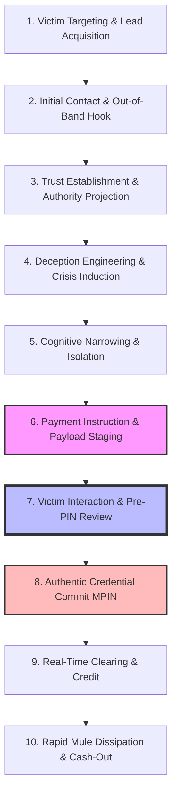

# Scam Attack Anatomy: End-to-End Chain, Operational Mechanics, and Observable Signals

---

## 1. Executive Understanding (Layer 1)
To intercept a payment scam, security engineers cannot view the attack as an isolated click on a "Pay" button. A payment scam is a **disciplined, multi-stage kill chain** that begins days or hours before the transaction and ends minutes after it. 

The attacker's objective is to navigate the victim through a psychological funnel that converts skepticism into obedience, guides the victim through the digital payment interface, and extracts irreversible liquidity before the victim realizes they have been defrauded. 

By deconstructing the scam into discrete operational stages, we can pinpoint the exact moments where **evidence becomes observable** and where **interception is mathematically and operationally viable**.

---

## 2. The 10-Stage Scam Kill Chain Architecture (Layer 2)

---

## 3. Deep Stage Analysis & Signal Observability (Layer 3)

| Stage in Kill Chain | Attacker Operations | Victim Cognitive State | Observable Data & Technical Signals | Observability Locus |
| :--- | :--- | :--- | :--- | :--- |
| **1. Targeting** | Purchases leaked phone numbers from telecom/job breaches. | Normal baseline. | Leaked credentials circulating on dark web forums. | Threat Intelligence Feeds |
| **2. Initial Contact** | Inbound VoIP call (spoofed caller ID), bulk SMS header (`VK-POWER`), WhatsApp bot. | Mild curiosity or initial confusion. | Telecom SMS header mismatch; unfamiliar WhatsApp country code (`+84`, `+92`, `+234`). | Telco / Messaging Layer (Out-of-Band) |
| **3. Trust Projection**| Sends forged ID cards, CBI warrants, official seals, professional legal vocabulary. | Initial skepticism yields to deference. | Forged PDF documents; reverse image search match on known scam templates. | Document Scanner / Image OCR |
| **4. Crisis Induction**| "Power cut in 10 mins", "Aadhaar tied to money laundering", "Arrest warrant issued". | **Acute panic, adrenaline surge, anxiety.** | High-urgency keywords in chat ("immediate", "FIR", "disconnection", "confidential"). | Semantic NLU on Chat (If accessible) |
| **5. Isolation** | "Stay on this call. Do not hang up. Move to a private room. Do not speak to family." | Complete cognitive tunneling; tunnel vision on resolving crisis. | Active phone call ongoing during app open; screen-sharing software active in background. | Mobile OS Telephony & Accessibility State |
| **6. Payload Staging** | Sends UPI Intent link, dictates personal VPA, or sends malicious "credit" QR. | Following orders mechanically to escape danger. | **URI syntax, Payee VPA, Payee display name, Payment note, Amount.** | **Payment App / Client Engine** |
| **7. Pre-PIN Review** | Scammer coaches: "Ignore any warning, click confirm and enter PIN." | Desperate to complete instruction. | **Dwell time, interaction hesitations, recipient verification results, risk score.** | **THE GOLDEN INTERCEPTION CHOKEPOINT** |
| **8. PIN Commit** | Scammer waits silently on call. | Relieved that "fine/fee" is being submitted. | Valid 2FA MPIN encrypted block sent to PSP. | NPCI Common Library |
| **9. Clearing** | Automated switch routing. | App displays success checkmark. | ISO 20022 message routed; Remitter debited, Beneficiary credited. | Central Switch / Core Banking |
| **10. Dissipation** | Mule syndicate bot triggers immediate sub-transfers. | Realization of scam dawns (minutes to hours later). | Immediate outbound IMPS/UPI velocity from recipient account; ATM cash withdrawal. | Beneficiary Bank FRM |

---

## 4. Boundaries, Misconceptions & Epistemic Realities (Layer 4)

### 4.1 The Observability Cliff
* **Stages 1 to 5** occur **out-of-band** (via phone calls, WhatsApp, Telegram, SMS). Because mobile operating systems enforce strict application sandboxing, a payment app running at Stage 6 usually has **zero access** to the preceding conversation history unless:
  1. The user explicitly copies and pastes text into the payment note field (`tn`).
  2. The OS provides specialized APIs (e.g., detecting if an active phone call is present or if screen-sharing software like AnyDesk is running).
* **Stages 6 and 7** represent the **only window** where the payment app, the payment metadata, and the user's attention converge.
* **The Epistemic Mandate for PS09:** An effective Guardian must maximize signal extraction from **what is observable at Stage 6 & 7**—specifically, extracting latent risk from the counterparty VPA structure, the semantic tone of the payment note, the payment channel (QR vs Collect vs Push), and real-time recipient verification.

---
**Primary References:**
1. Hutchings, Alice et al.: *Understanding the Cybercrime Kill Chain: Social Engineering and Financial Extraction*.
2. US Federal Bureau of Investigation (FBI) Internet Crime Complaint Center (IC3): *Annual Cyber Crime Report: Anatomy of Impersonation Fraud*.
3. Reserve Bank of India: *Report on Currency and Finance: Digital Innovations and Cyber Risk Management*.
