# Domain Evidence Model: Multi-Modal Signals, Graph Relations, and Hypothesis Testing

---

## 1. Executive Understanding (Layer 1)
In complex security systems, an individual data point is rarely sufficient to identify a sophisticated scam. An isolated amount of ₹5,000 is meaningless. A transaction to an unverified recipient is usually benign. A fast payment is normal. A scam signature emerges only when **multiple weak, disparate evidence signals are cross-correlated across the user, transaction, counterparty, and environmental interaction layers**.

The **Domain Evidence Model** formalizes the structural relationships between these signal categories. It provides the epistemic foundation for how an intelligent security assistant reasons under uncertainty: mapping observable data attributes into structured evidentiary claims that either support or refute specific threat hypotheses.

---

## 2. The Multi-Layer Evidence Graph Architecture (Layer 2)

```mermaid
graph TD
    subgraph Payer Tier
        P1[Payer Behavioral Baseline]
        P2[Payer Historical Graph]
        P3[Payer Device Integrity]
    end

    subgraph Transaction Intent Tier
        T1[Payment Amount & Velocity]
        T2[Payment Note Semantic Tokens]
        T3[Payment Channel: QR / Push / Collect]
    end

    subgraph Recipient Counterparty Tier
        R1[VPA Handle & Domain Type]
        R2[Bank-Verified Legal Name]
        R3[Levenshtein Distance vs Claimed Brand]
        R4[National Cyber Blacklist Status]
    end

    subgraph Environmental & Interaction Tier
        E1[Screen Dwell Time & Hesitation]
        E2[Active Telephony Call Status]
        E3[Active Remote Desktop / Screen Share]
    end

    P1 & T1 --> H1[Financial Anomaly Hypothesis]
    T2 & R2 & R3 --> H2[Impersonation Hypothesis]
    E1 & E2 & T2 --> H3[Psychological Coercion Hypothesis]
    R1 & R4 --> H4[Mule Counterparty Hypothesis]

    H1 & H2 & H3 & H4 --> ThreatSynthesis[Composite Scam Threat Vector]
```

---

## 3. Deep Analysis of Evidence Categories (Layer 3)

| Evidence Category | Primary Feature Attributes | Signal Polarity | Evidentiary Weight | Hypothesis Supported |
| :--- | :--- | :--- | :--- | :--- |
| **Identity Divergence** | Bank Name (`RespValAdd`) vs Claimed Display Name (`pn`) or Note (`tn`). | Negative Correlation with Safety | **Extremely High** | **Impersonation Attack:** Claiming to be utility/police while account belongs to private individual. |
| **Handle Category Mismatch**| Individual P2P handle (`@ybl`) receiving payments claiming to be institutional fees. | Negative Correlation with Safety | **High** | **Fake Official Collect / Phishing:** Official bodies do not collect via personal VPA handles. |
| **Semantic Urgency Density**| Occurrence of high-stress words (`disconnection`, `immediate`, `warrant`, `FIR`). | Negative Correlation with Safety | **High if Present** | **Urgency-Based Social Engineering:** Coercing victim before cognitive reflection can occur. |
| **Interaction Telemetry** | Screen dwell time $>3\times$ normal baseline combined with active phone call. | Anomaly Indicator | **Medium** | **Active Phone-Guided Manipulation (Vishing):** Scammer coaching user through PIN screen. |
| **Relational Novelty** | Payer has zero prior transactions with this VPA in 365-day history. | Contextual Baseline | **Low on its own; High when coupled with High Amount** | **First-Time Transfer Vulnerability:** Normal for new merchants, dangerous for high-value transfers. |
| **Amount Disparity** | Amount significantly exceeds user's 90-day median transaction value. | Loss Severity Indicator | **Medium** | **High Financial Stakes:** Amplifies risk score based on expected loss severity. |

---

## 4. Boundaries, Misconceptions & Epistemic Realities (Layer 4)

### 4.1 The Dangerous "Single Strong Signal" Fallacy
* **The Trap:** An engineer writes a rule: `if "urgent" in note: return SCAM`.
* **The Failure:** A college student sending ₹500 to a friend with note `"urgent lunch money pay back soon"` is falsely blocked!
* **The Synthesis Principle:** Evidence must be evaluated **probabilistically and relationally**. A single signal is merely a trigger for deeper investigation. True scam certainty requires the intersection of **Intent Divergence + Counterparty Anomaly + Urgency Context**:
  $$\text{Scam Likelihood} \propto f(\text{Name Mismatch}) \times g(\text{Urgency Semantics}) \times h(\text{Counterparty Novelty})$$

---
**Primary References:**
1. Schum, David A.: *The Evidential Foundations of Probabilistic Reasoning (John Wiley & Sons)*.
2. Pearl, Judea: *Causality: Models, Reasoning, and Inference (Cambridge University Press)*.
3. IEEE Security & Privacy: *Multi-Modal Fraud Detection: Combining Graph, Semantic, and Behavioral Telemetry*.
