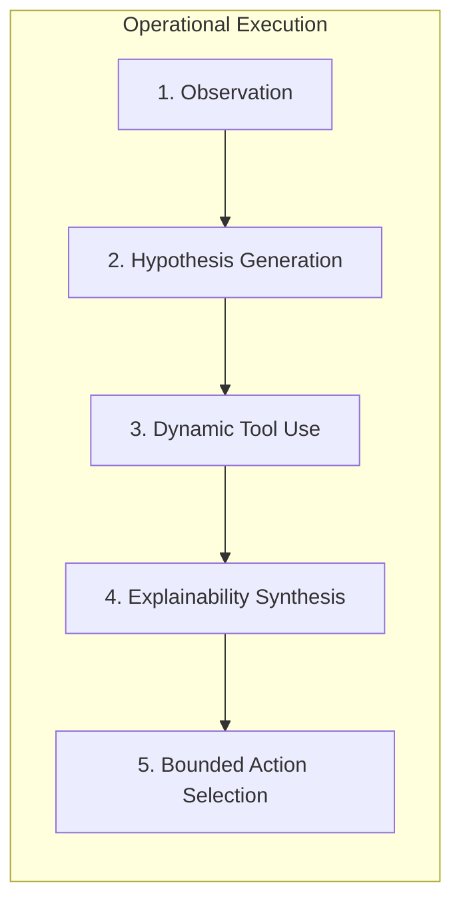

# Agentic Concepts in Payment Security: Agency, Tool Use, and Bounded Autonomy

---

## 1. Executive Understanding (Layer 1)
In the modern artificial intelligence lexicon, the word "agent" has suffered severe semantic dilution. Marketing materials routinely label basic API wrappers, static chatbots, and simple Python scripts as "autonomous agents." 

In systems engineering and artificial intelligence, an **Agent** is defined by **Agency**: the capacity of an entity to perceive its environment, maintain internal state, formulate intermediate hypotheses, dynamically select and execute tools, adapt its trajectory based on observation, and choose bounded actions to achieve an objective.

In payment scam interception, an **Agentic Guardian** is fundamentally different from a static classifier. A static model takes fixed inputs and emits an opaque score. An agentic guardian **actively investigates**: it parses an incoming payment intent, realizes the display name claims to be a government utility, autonomously dispatches a query to verify the recipient VPA, calculates phonetic divergence, evaluates the payment note for coercive urgency, synthesizes a multi-vector risk hypothesis, generates a plain-English explanation of the deception, and deploys a calibrated cognitive friction challenge.

---

## 2. Conceptual Paradigm Comparison Matrix (Layer 2)

```
┌─────────────────────────────────────────────────────────────────────────────┐
│                    THE SPECTRUM OF COMPUTATIONAL AGENCY                     │
├───────────────────┬─────────────────────────────────────────────────────────┤
│ PARADIGM          │ OPERATIONAL DEFINITION & TECHNICAL BEHAVIOR             │
├───────────────────┼─────────────────────────────────────────────────────────┤
│ **1. Static**     │ Mathematical function: $y = f(\mathbf{x})$.             │
│ **Model**         │ Evaluates fixed feature vector; outputs scalar score.   │
│                   │ Zero tool use; zero state; zero adaptability.           │
├───────────────────┼─────────────────────────────────────────────────────────┤
│ **2. Decision**   │ Deterministic business logic tree (Drools / FICO).      │
│ **Engine**        │ Executes compiled rules; fast and deterministic.        │
│                   │ Completely brittle to novel semantic variation.         │
├───────────────────┼─────────────────────────────────────────────────────────┤
│ **3. Conversational│ Natural language interface (Chatbot).                  │
│ **Assistant**     │ Explains concepts to user when asked. Reactive only;   │
│                   │ cannot autonomously intervene in payment transactions.  │
├───────────────────┼─────────────────────────────────────────────────────────┤
│ **4. Agentic**    │ **Goal-directed autonomous runtime:**                   │
│ **Guardian**      │ **Perceive $\rightarrow$ Hypothesize $\rightarrow$      │
│                   │ **Tool Lookup $\rightarrow$ Synthesize $\rightarrow$    │
│                   │ **Explain $\rightarrow$ Calibrate Intervention.**       │
└───────────────────┴─────────────────────────────────────────────────────────┘
```

---

## 3. The 5 Core Capabilities of an Agentic Guardian (Layer 3)



| Agentic Capability | Operational Mechanism in PS09 | Contrast with Non-Agentic Approach |
| :--- | :--- | :--- |
| **1. Observation & State** | Maintains multi-step session memory: tracking intent origin (QR vs collect), dwell time, and user hesitation. | Static models evaluate each HTTP packet in total isolation with zero session context. |
| **2. Hypothesis Generation**| Synthesizes initial cues into competing threat models: e.g., *"Is this Impersonation, a Task Scam, or a Benign Gift?"* | Legacy engines compute a single generic anomaly number with zero causal hypothesis. |
| **3. Dynamic Tool Use** | Dynamically decides *which* verification tools to invoke (e.g., calls Levenshtein brand matcher only if handle looks suspicious). | Procedural pipelines execute all hardcoded lookups sequentially, wasting compute. |
| **4. Explainability Synthesis**| Formulates targeted, human-readable rationale that directly punctures the scammer's narrative. | Black-box classifiers emit SHAP values or opaque numbers (`Risk = 0.88`). |
| **5. Action Selection** | Selects a proportional intervention from a 6-tier spectrum (from silent pass-through to cognitive challenge). | Legacy systems are binary: either blindly approve or destructively block. |

---

## 4. Boundaries & Epistemic Realities for PS09 (Layer 4)

### 4.1 The Imperative of Bounded Autonomy
* In safety-critical distributed systems (aerospace, medical devices, financial ledgers), **unbounded agent autonomy is strictly unacceptable**.
* An AI agent that has free rein to write its own rules, modify transaction payloads, or invent arbitrary actions will inevitably hallucinate, violate central bank regulations, or be tricked by adversarial prompt injection.
* **The Production Invariant:** An Agentic Guardian must operate under **Bounded Autonomy (Deterministic Guardrails)**:
  $$\text{Agency in Investigation and Explanation} \quad \Big| \quad \text{Deterministic Bounds in Policy and Intervention}$$
* The agent may possess wide cognitive autonomy to investigate, call tools, and craft human explanations, but its final permitted actions (Allow, Warn, Challenge, Hold, Block) must be **strictly bounded by a deterministic, mathematically verifiable policy engine**.

---
**Primary References:**
1. Russell, Stuart and Norvig, Peter: *Artificial Intelligence: A Modern Approach (Chapter on Intelligent Agents)*.
2. Wooldridge, Michael: *An Introduction to MultiAgent Systems (John Wiley & Sons)*.
3. National Institute of Standards and Technology (NIST): *AI 100-1: Trustworthy and Responsible AI Guidelines*.
