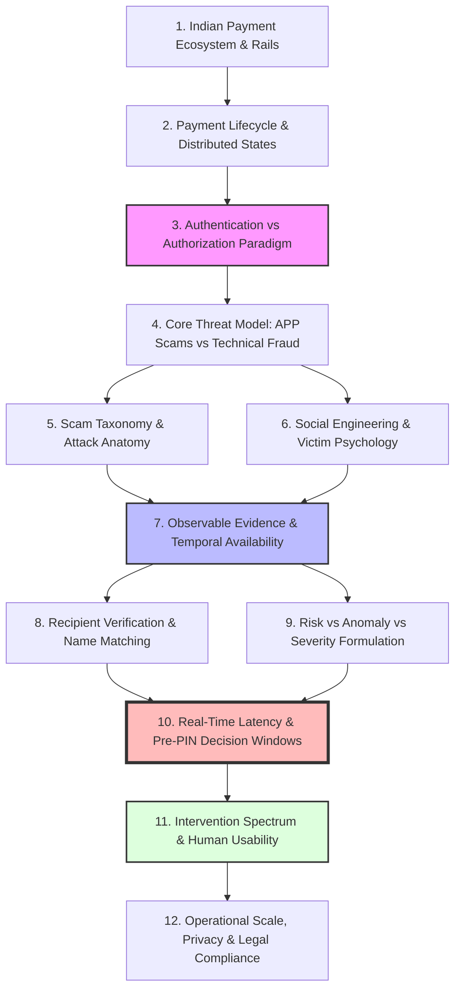

# Domain Knowledge Dependencies: Conceptual Structure and Research Progression

---

## 1. Executive Understanding (Layer 1)
In complex systems engineering, domain knowledge is hierarchical and interconnected. A failure to respect conceptual dependencies leads to **architectural blind spots**: teams attempt to design user interventions without understanding the payment lifecycle; they formulate machine learning loss functions without understanding label lag; or they propose network blocking without understanding payment switch timeout SLAs.

The **Domain Dependency Map** formalizes the epistemic architecture of Phase 1. It outlines the precise sequence through which payment concepts, threat vectors, data constraints, and operational realities build upon one another to form a coherent foundation for downstream engineering.

---

## 2. Structural Dependency Architecture (Layer 2)

---

## 3. Deep Analysis of Critical Domain Dependencies (Layer 3)

| Dependency Step | Upstream Foundation Required | Downstream Consequence if Skipped | Real-World Engineering Failure Mode |
| :--- | :--- | :--- | :--- |
| **Step 2 $\rightarrow$ Step 3** | Understanding that PIN entry is the Point of Irreversible Commit. | Treating authentication as ongoing throughout settlement. | Proposing an algorithm that attempts to cancel a payment after the PIN has already been verified! |
| **Step 3 $\rightarrow$ Step 4** | Understanding that valid authentication $\neq$ genuine authorization. | Treating scams as an account takeover or stolen credential problem. | Training models on device anomalies; assigning near-zero risk to scams executed by legitimate users. |
| **Step 5/6 $\rightarrow$ Step 7** | Deconstructing social engineering playbooks and linguistic patterns. | Assuming all scams can be spotted from numerical transaction amount alone. | Relying on crude statistical threshold rules that fail against micro-scams (₹10 electricity tokens). |
| **Step 7 $\rightarrow$ Step 8** | Understanding temporal availability: what is known Pre-PIN vs Post-Settlement. | Relying on downstream mule layering patterns for real-time blocking. | Building graph detection algorithms that require 15 minutes of post-payment ledger data to detect scams. |
| **Step 9 $\rightarrow$ Step 10** | Disambiguating Anomaly from Scam Likelihood and Loss Severity. | Conflating statistical distance with fraud; blocking all unusual transactions. | Blocking emergency medical payments or festive gifting, triggering massive user backlash. |
| **Step 10 $\rightarrow$ Step 11** | Enforcing strict Pre-PIN latency budgets ($<1,500\text{ ms}$). | Deploying heavy cloud LLM multi-agent chains inline on mobile checkouts. | Mobile apps timing out on cellular connections; catastrophic cart abandonment rates. |
| **Step 11 $\rightarrow$ Step 12** | Calibrating the intervention spectrum (challenge vs pause vs block). | Assuming private apps have legal authority to freeze bank accounts. | Violating Indian banking law and facing lawsuits for wrongful dishonor. |

---

## 4. Boundaries & Epistemic Invariants for Phase 2 (Layer 4)

### 4.1 The Non-Negotiable Sequential Invariant
* Teams cannot design threat modeling (Phase 2) without mastering the **Authentication vs. Authorization paradox (Step 3)**.
* Teams cannot evaluate existing defenses (Phase 3) without mastering the **Information Availability Matrix (Step 7)**.
* Teams cannot engineer solution architecture (Phase 4) without mastering the **Pre-PIN Latency Budget and Intervention Boundaries (Steps 10, 11, 12)**.
* This dependency chain guarantees that downstream engineering remains grounded in **mathematical, legal, and operational reality**.

---
**Primary References:**
1. Systems Engineering Handbook: *A Guide for System Life Cycle Processes and Activities (INCOSE)*.
2. Parnas, David Lorge: *On the Criteria To Be Used in Decomposing Systems into Modules (Communications of the ACM)*.
