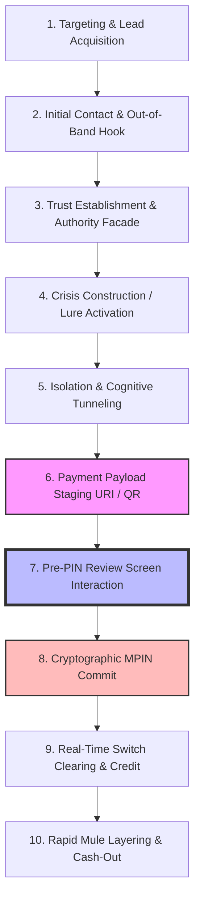

# Attack Anatomy: The 10-Stage Cybercrime Kill Chain and Signal Observability

---

## 1. Executive Understanding
To intercept an Authorized Push Payment (APP) scam in real time, security systems must not treat the transaction as an isolated event. A scam is a **structured, progressive kill chain**. 

By tracing the technical, behavioral, and psychological state transitions from initial targeting to final liquidity laundering, this document establishes **where evidence is generated, which signals are observable, and where intervention is mathematically and operationally viable**.

---

## 2. The 10-Stage Financial Cybercrime Kill Chain

---

## 3. Detailed Stage-by-Stage Signal Observability Matrix

| Kill Chain Stage | Attacker Action & Technical Tactic | Victim Mental State | Information Generated | System Observability Status | Detection Feasibility | Intervention Feasibility |
| :--- | :--- | :--- | :--- | :--- | :--- | :--- |
| **1. Targeting** | Scrapes leaked databases; buys leads on dark web Telegram channels. | Normal baseline. | Leaked PII records in cybercrime forums. | External threat intelligence feeds. | **Low** (No active threat event yet). | **None** |
| **2. Initial Contact** | Inbound VoIP call (spoofed CLI), bulk SMS via rogue aggregator, WhatsApp message. | Mild curiosity or minor confusion. | Telecom signaling logs, SMS header text (`VK-POWER`). | Telecom carrier / Messaging app sandbox. | **Low for Payment App** (Out-of-band communication). | **None** |
| **3. Trust Facade** | Sends forged identity cards, fake CBI warrants, official seals, legal jargon. | Skepticism yields to institutional deference. | Forged PDF documents, official logos. | Messaging app UI; device local filesystem. | **Zero for Payment App** (App sandboxing limits). | **None** |
| **4. Crisis / Lure** | "Power cut in 10 mins", "Aadhaar linked to narcotics parcel", "Earn ₹5k today". | **Acute panic, adrenaline surge, or excitement.** | High-urgency keywords in chat / audio stream. | Isolated in third-party communications app. | **Zero for Payment App** (Cannot monitor audio/chat). | **None** |
| **5. Isolation** | "Stay on this call. Do not hang up. Move to private room. Tell no one." | Severe cognitive tunneling; loss of critical judgment. | Active voice call flag; screen-sharing package running. | Local Android OS Telephony & Accessibility APIs. | **Medium** (Can detect active call/remote app). | **Low** |
| **6. Payload Staging** | Sends UPI intent link, dictates personal VPA, or sends malicious "credit" QR. | Following orders mechanically to escape danger. | **URI string: `pa`, `pn`, `am`, `tn`, `mc`, QR bitmap.** | **Directly Ingested by Payment App UI.** | **HIGH:** Primary input features manifest here! | **Low** (Pre-review stage). |
| **7. Pre-PIN Review** | Scammer coaches: "Ignore any warning, click confirm and enter PIN." | Desperate to complete transaction. | **Screen dwell time, interaction hesitation, bank legal name.** | **MAXIMUM OBSERVABILITY AT THE CLIENT INTERACTION LAYER.** | **MAXIMUM:** Cross-correlate name, note, amount, dwell time! | **MAXIMUM (THE GOLDEN WINDOW):** Challenge, Pause, Block! |
| **8. MPIN Commit** | Scammer waits silently on call. | Relieved that "fine/fee" is being submitted. | Encrypted PIN block, hardware SIM binding token. | Isolated inside NPCI Common Library sandbox. | **Zero** (Encrypted hardware view). | **None** (PIC crossed). |
| **9. Clearing** | Automated switch routing. | App displays success checkmark. | ISO 20022 message routed; CBS debited and credited. | NPCI Switch Core & Bank Core Banking Systems. | **Medium** (Switch-level velocity checks). | **Zero for Client App; Low for Switch.** |
| **10. Dissipation** | Mule bot triggers immediate sub-transfers to Layer 2 mules / crypto desks. | Scam realized minutes to hours later. | Immediate outbound IMPS transfers; ATM withdrawals. | Beneficiary Bank CBS Ledger. | **High for Beneficiary Bank; Zero for Payer.** | **Zero for Victim; Forensic recovery only.** |

---

## 4. Boundaries & Epistemic Realities for PS09

### 4.1 The Observability Invariant
* **Before Stage 6:** The attack is entirely out-of-band. A payment application has zero visibility into phone calls, WhatsApp messages, or forged letters due to OS sandboxing and privacy laws.
* **After Stage 7:** The transaction crosses the Point of Irreversible Commit (PIC). Funds are debited and credited within 2 seconds.
* **THE STRATEGIC REALITY:** **Stage 6 (Payload Staging) and Stage 7 (Pre-PIN Review) represent the ONLY operational window where an Agentic Guardian can observe evidence and intervene.** The entire detection and intervention architecture must be engineered around this narrow, high-leverage temporal junction.

---
**Primary References:**
1. Hutchings, Alice et al.: *Understanding the Cybercrime Kill Chain: Social Engineering and Financial Extraction (IEEE S&P)*.
2. National Payments Corporation of India: *UPI Technical Specification v2.1: Pre-Auth Transaction Flows*.
3. UK Payment Systems Regulator: *APP Scams: Mapping the Customer Journey from Initiation to Loss*.
