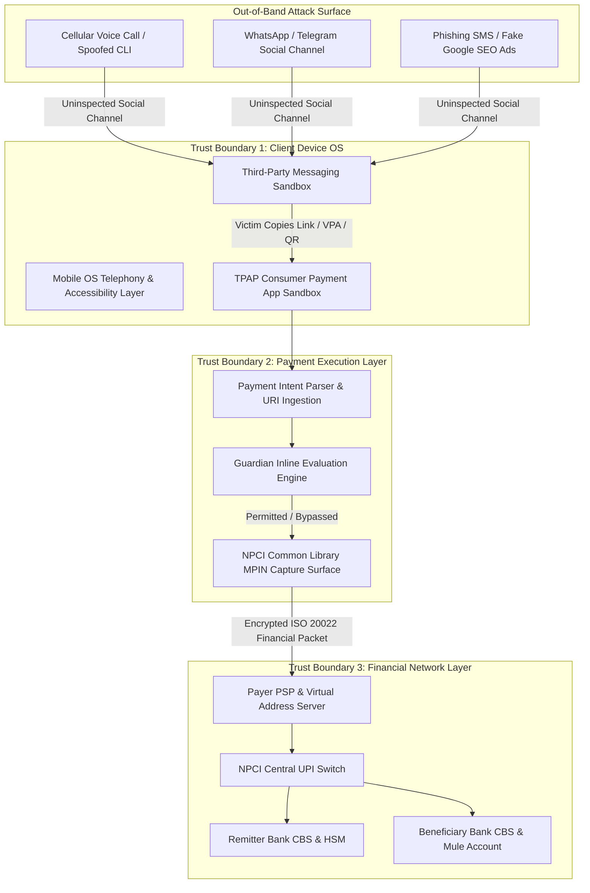

# Threat Model: Threat Vectors, Trust Boundaries, and Attack Surfaces in Digital Payments

---

## 1. Executive Understanding
This threat model formalizes the security and deception landscape confronting **PS09 — Agentic Guardian for Real-Time Payment Scam Interception**. Unlike classical threat modeling frameworks (e.g., STRIDE, DREAD) that focus predominantly on software exploits, unauthorized access, and protocol tampering, the threat model for Authorized Push Payment (APP) scams must accommodate **cognitive subversion**: attacks where cryptographic and software integrity remains 100% intact, but the human operating the software is psychologically compromised.

The primary objective of this threat model is to map the **threat actors, trust boundaries, entry points, cognitive vulnerabilities, and financial extraction mechanisms** operating in the Indian digital payment ecosystem (primarily UPI).

---

## 2. Threat Actor Profiles & Capabilities Matrix

```
┌─────────────────────────────────────────────────────────────────────────────┐
│                         THREAT ACTOR PROFILES                               │
├───────────────────┬─────────────────────────┬───────────────────────────────┤
│ Actor Class       │ Organizational Scale    │ Primary Tactics & Assets      │
├───────────────────┼─────────────────────────┼───────────────────────────────┤
│ **Tier 1: Script  │ Loose local cells       │ • Bulk SMS scraping           │
│  Kiddies / Nuh**  │ (Jamtara, Mewat, Nuh)   │ • OLX reverse QR scams        │
│                   │                         │ • Deceptive collect requests  │
├───────────────────┼─────────────────────────┼───────────────────────────────┤
│ **Tier 2: Organ-  │ Inter-state syndicates  │ • Fake customer care SEO      │
│  ized Call Ctr**  │ (Kolkata, Delhi NCR)    │ • Electricity bill panic SMS  │
│                   │                         │ • Remote APK access (AnyDesk) │
├───────────────────┼─────────────────────────┼───────────────────────────────┤
│ **Tier 3: Trans-  │ Transnational syndicates│ • "Digital Arrest" extortion  │
│  national Cartels**│ (Cambodia, Myanmar, Laos│ • Multi-tier investment Ponzi │
│                   │  SE Asia compounds)     │ • Multi-hop mule networks/USDT│
└───────────────────┴─────────────────────────┴───────────────────────────────┘
```

| Dimension | Tier 1: Local Script Cells | Tier 2: Domestic Organized Call Centers | Tier 3: Transnational Industrial Cartels |
| :--- | :--- | :--- | :--- |
| **Primary Vectors** | OLX fake defense QR, deceptive collect requests. | Electricity bill cutoffs, bank KYC update SMS, courier vishing. | "Digital Arrest" (CBI/Police), fake institutional stock apps. |
| **Financial Stakes** | ₹5,000 to ₹50,000 per incident. | ₹50,000 to ₹5,00,000 per incident. | ₹25,00,000 to ₹10,00,00,000+ per incident. |
| **Technical Stack** | Burner SIMs, basic Android phones, public Telegram. | PBX VoIP spoofing, bulk SMS gateways, custom phishing APKs. | Deepfake audio/video, dedicated laundering bots, crypto bridges. |
| **Mule Account Tier**| 1 to 2 hops (local village student/farmer accounts). | 3 to 5 hops (rented current accounts, regional rural banks). | 8 to 15 hops (shell corporate accounts, automated crypto desks). |
| **Adaptive Velocity**| Days to weeks to modify script. | Hours to days to rotate VPA handles and numbers. | Real-time script modification based on live victim responses. |

---

## 3. Trust Boundaries & Attack Surfaces



### 3.1 Attack Surface Breakdown
1. **The Inbound Payment Intent Surface:**
   * Attackers inject malicious parameters via `upi://pay` URIs, manipulated QR bitmaps, and collect requests.
   * *Vulnerabilities Exploited:* Deceptive display names (`pn`), spoofed Merchant Category Codes (`mc`), and crafted remarks (`tn`).
2. **The Cognitive Interaction Surface:**
   * The victim's visual attention on the confirmation screen.
   * *Vulnerabilities Exploited:* Inattentional blindness, visual truncation of long VPAs, habituated dismissals of generic red warning badges.
3. **The Recipient Naming Surface:**
   * Inconsistencies between the bank-registered legal account name and the name rendered on the client UI.
4. **The Adversarial AI Surface:**
   * If an LLM or ML classifier is deployed inline, attackers embed adversarial text perturbations, homoglyphs, or indirect prompt injections into payment notes.

---

## 4. Attacker Objectives & Economics

```text
[Revenue per Attack] = (Average Victim Extraction) x (Success Rate)
                      - (Cost of Mule Accounts + Cost of Leads + PBX VoIP Cost)
```

* **Mule Account Cost:** Rented Indian savings accounts cost cybercrime syndicates approximately ₹2,000 to ₹5,000 per month; corporate current accounts with high RTGS limits cost ₹50,000 to ₹1,00,000.
* **Lead Acquisition Cost:** Leaked databases of telecom users or demat account holders cost under ₹0.10 per record on Telegram.
* **Economic Invariant:** Because attack operational costs are trivial ($<\text{₹}500$ per targeted victim), syndicates can afford high failure rates ($>95\%$). A single successful "Digital Arrest" or investment extraction (₹50 Lakhs) subsidizes months of operational infrastructure.

---
**Primary References:**
1. Microsoft Threat Intelligence: *The Anatomy of Social Engineering and Authorized Payment Fraud (2024)*.
2. Indian Cyber Crime Coordination Centre (I4C): *Threat Assessment Report on Cyber-Enabled Financial Crimes*.
3. OWASP: *Automated Threat Handbook: Web and Mobile Applications (OAT-012, OAT-015)*.
