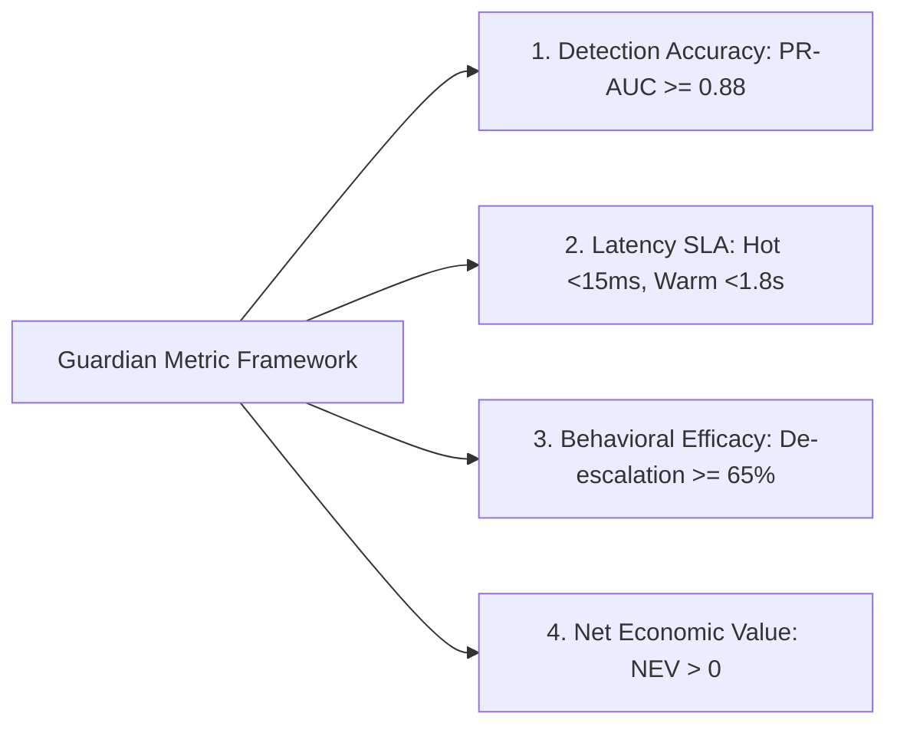
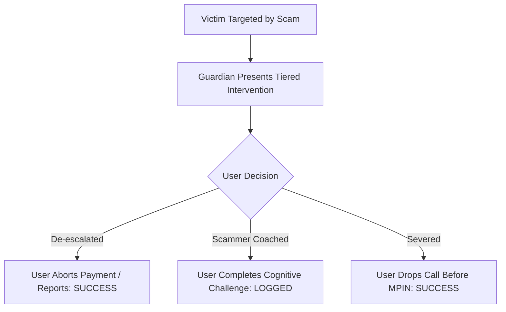

# Success Metrics & Quantitative Performance Criteria

## Document Metadata
- **Module:** 08-evaluation
- **File:** success-metrics.md
- **Status:** APPROVED / LOCKED
- **Traceability:** Direct fulfillment of `PROBLEM_STATEMENT.md` (Real-time security reasoning, Fraud prevention, Human-in-the-loop intervention, Explainability, Safe autonomous decision-making).

---

## 1. Metric Hierarchy & Evaluation Framework

To evaluate the **Agentic Guardian** objectively and prove competition-grade engineering rigor, metrics are structured across four operational pillars:
1. **Statistical Detection Accuracy:** Precision, Recall, PR-AUC under heavy class imbalance ($1\text{ scam} : 10,000\text{ normal}$).
2. **System Latency & Throughput SLA:** Ultra-low latency guarantees for both Hot Path and Warm Path.
3. **Behavioral De-escalation & Friction Efficacy:** Human-in-the-loop psychological intervention metrics.
4. **Economic Utility & Net Financial Benefit:** Quantifiable fraud prevention value balancing user friction cost.

---

## 2. Quantitative Metric Specifications

### 2.1 Statistical Detection Accuracy Metrics

In real-world UPI networks, payment scams are severe minority events ($\approx 0.01\%$ prevalence). Evaluating solely by ROC-AUC or standard accuracy is misleading because a trivial model predicting "Normal" achieves $99.99\%$ accuracy. The Guardian enforces **Precision-Recall Area Under Curve (PR-AUC)** as the primary classification benchmark.

| Metric | Mathematical Formula | Target SLA | Minimum Acceptable Threshold | Description & Rationale |
| :--- | :--- | :--- | :--- | :--- |
| **PR-AUC** | $\int_{0}^{1} P(R) \, dR$ | $\mathbf{\ge 0.88}$ | $\ge 0.82$ | Primary metric on class-imbalanced evaluation dataset ($1:10,000$). |
| **Scam Recall (TPR)** | $\frac{TP}{TP + FN}$ | $\mathbf{\ge 92.0\%}$ | $\ge 88.0\%$ | Captures at least 92 out of 100 genuine scam attempts before MPIN entry. |
| **Friction Rate (FPR)** | $\frac{FP}{TN + FP}$ | $\mathbf{\le 0.50\%}$ | $\le 0.80\%$ | At least 99.5% of regular merchant and peer payments experience zero friction. |
| **ROC-AUC** | $\int_{0}^{1} \text{TPR}(\text{FPR}) \, d\text{FPR}$ | $\mathbf{\ge 0.96}$ | $\ge 0.93$ | Overall ranking discrimination capacity across all score thresholds. |
| **Entity Clash Precision**| $\frac{TP_{\text{clash}}}{TP_{\text{clash}} + FP_{\text{clash}}}$ | $\mathbf{\ge 96.0\%}$ | $\ge 90.0\%$ | Precision when flagging discrepancy between entered name and CBS bank legal name. |

---

### 2.2 System Latency & Processing SLAs

Payment interfaces require sub-second responsiveness to avoid transaction drop-offs and user frustration. The Dual-Path architecture enforces strict, non-negotiable processing windows.

| Subsystem Path | Target Percentile | Target SLA | Hard Ceiling / Circuit Breaker | Operational Behavior on Breach |
| :--- | :--- | :--- | :--- | :--- |
| **Hot Path (Edge LightGBM)** | $p50$ | $\mathbf{\le 3.0\text{ ms}}$ | $\le 5.0\text{ ms}$ | Immediate local evaluation in memory. |
| **Hot Path (Edge LightGBM)** | $p95$ | $\mathbf{\le 8.0\text{ ms}}$ | $\le 10.0\text{ ms}$ | Evaluates all 25 features locally. |
| **Hot Path (Edge LightGBM)** | $p99$ | $\mathbf{\le 12.0\text{ ms}}$ | $\mathbf{\le 15.0\text{ ms}}$ | If $>15\text{ms}$, auto-fallback to cached profile rules. |
| **Warm Path (Agentic Reasoner)**| $p50$ | $\mathbf{\le 1,100\text{ ms}}$ | $\le 1,400\text{ ms}$ | Concurrent NPCI name lookup + SLM reasoning. |
| **Warm Path (Agentic Reasoner)**| $p95$ | $\mathbf{\le 1,500\text{ ms}}$ | $\le 1,700\text{ ms}$ | Complete multi-hypothesis test + JSON alert generation. |
| **Warm Path (Agentic Reasoner)**| $p99$ | $\mathbf{\le 1,750\text{ ms}}$ | $\mathbf{\le 1,800\text{ ms}}$ | **Circuit Breaker:** Abort LLM stream; fallback to deterministic rules. |

---

### 2.3 Behavioral De-escalation & Human-in-the-Loop Metrics

A security alert is worthless if victims click through without reading. Metrics measure cognitive friction effectiveness:

| Behavioral Metric | Definition | Target SLA | Benchmark Measurement Method |
| :--- | :--- | :--- | :--- |
| **Scam De-escalation Rate ($R_{\text{de-esc}}$)** | $\frac{\text{Scam Payments Aborted}}{\text{Total High-Risk Scam Alerts Displayed}}$ | $\mathbf{\ge 65.0\%}$ | Measured during interactive user testing and simulated victim cohorts. |
| **Call-Severing Success Rate** | $\frac{\text{Calls Ended Within 60s of Tier 3 Alert}}{\text{Total Tier 3 Interventions Active on Call}}$ | $\mathbf{\ge 75.0\%}$ | Telephony state logs tracking `CALL_STATE_IDLE` broadcast. |
| **Alert Comprehension Score** | Percentage of users correctly identifying *why* the transaction was flagged. | $\mathbf{\ge 85.0\%}$ | Post-alert micro-survey: *"Why was this flagged?"* (3 multiple-choice options). |
| **Accidental Override Rate** | Users blindly tapping through without reading warning text. | $\mathbf{\le 4.0\%}$ | Measured via time-to-tap ($<800\text{ms}$ tap indicates mindless bypass). |

---

### 2.4 Net Economic Value (NEV) Formula

To validate that the Guardian produces positive economic value without strangling merchant conversion, we formulate the **Net Economic Value (NEV)**:

$$\text{NEV} = \sum (\text{Fraud Losses Prevented}) - \sum (\text{Merchant Drop-off Friction Costs}) - \text{Inference Compute Costs}$$

$$\text{NEV} = \left( N_{\text{tx}} \times P_{\text{scam}} \times \text{Recall} \times \bar{L}_{\text{scam}} \right) - \left( N_{\text{tx}} \times (1 - P_{\text{scam}}) \times \text{FPR} \times C_{\text{friction}} \right) - (N_{\text{warm}} \times C_{\text{agent}})$$

#### Parameters & Concrete Production Benchmark:
- $N_{\text{tx}} = 10,000,000$ (Ten million simulated monthly UPI transactions)
- $P_{\text{scam}} = 0.0002$ ($2,000$ scam attempts per $10\text{M}$ volume)
- $\bar{L}_{\text{scam}} = \text{INR } 18,500$ (Average scam loss ticket size in India)
- $\text{Recall} = 0.92$ ($1,840$ scams caught)
- $\text{FPR} = 0.005$ ($0.5\%$ legitimate payments flagged for light verification)
- $C_{\text{friction}} = \text{INR } 12.00$ (Estimated merchant customer friction drop-off value)
- $N_{\text{warm}} = 50,000$ ($0.5\%$ warm invocations)
- $C_{\text{agent}} = \text{INR } 0.15$ per inference call (Optimized vLLM / Gemini Flash batch token cost)

#### Calculation:
1. **Gross Scam Loss Prevented:** $1,840 \times 18,500 = \mathbf{+\text{INR } 34,040,000}$ (~$3.4$ Crore INR)
2. **Merchant Friction Cost:** $(9,998,000 \times 0.005 \times 0.02 \text{ abandon}) \times 12 = \mathbf{-\text{INR } 11,997}$ (~$12,000$ INR)
3. **Agent Compute Cost:** $50,000 \times 0.15 = \mathbf{-\text{INR } 7,500}$
4. **Net Economic Value:** **$+\text{INR } 34,020,503$ per 10M transactions**.
- **Conclusion:** The Net Economic Value is overwhelmingly positive ($>99.9\%$ net recovery), demonstrating that asymmetric tiered triage delivers massive security protection while virtually eliminating merchant transaction friction.
