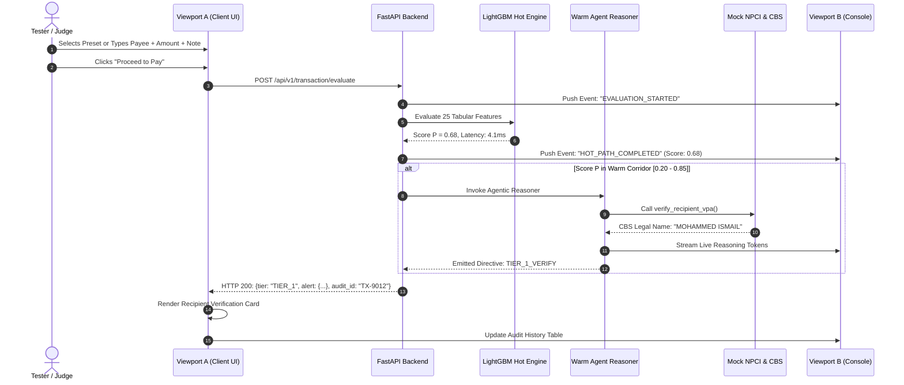

# Prototype Demo Architecture & Simulation Interface Specification

## Document Metadata
- **Module:** 09-demo
- **File:** demo-architecture.md
- **Status:** APPROVED / LOCKED
- **Traceability:** Direct fulfillment of `PROBLEM_STATEMENT.md` (Core Requirements: Payment simulation interface, Transaction-risk analysis, Recipient verification workflow, Risk score/category, User confirmation step, Pause/block mechanism, Explainable security alerts, Transaction audit history; Expected Demo: 4 scenarios).

---

## 1. Executive Summary & Prototype Philosophy

To demonstrate the full end-to-end capabilities mandated by `PROBLEM_STATEMENT.md`, the prototype is designed as an interactive, production-faithful **Dual-Viewport Demonstration Console**:
1. **Viewport A (Payer Client Simulator):** A mobile-viewport UPI application simulator mimicking production payment apps (PhonePe, Google Pay, Paytm). Allows live parameter manipulation (Amount, Payee VPA, Payment Note, Inbound Collect vs Outbound Pay, QR Scan, and Device Telemetry toggles like Active Phone Call and Screen Sharing).
2. **Viewport B (Guardian Agentic Security Console):** A real-time security cockpit that exposes the inner workings of the Guardian to competition judges and security evaluators. Displays the sub-millisecond Hot Path feature vector, the Warm Path agentic reasoning stream, live NPCI CBS lookup tool execution, risk score and category breakdown, explainable alert payloads, and the immutable audit history.

```mermaid
graph LR
    subgraph Viewport A [Client Mobile Simulator]
        UI1[UPI Form / QR / Collect] --> UI2[Pre-PIN Screen]
        UI2 --> UI3[Dynamic Guardian Modal]
        UI3 --> UI4[Secure MPIN Screen]
    end

    subgraph Backend Engine [Guardian Local Server]
        HOT[Hot Path: LightGBM C++ Engine]
        WARM[Warm Path: Agentic Reasoner]
        MOCK[Mock NPCI Switch & CBS Simulator]
        AUDIT[Immutable Audit Log Store]
    end

    subgraph Viewport B [Guardian Security Cockpit]
        OBS1[Telemetry & Feature Inspector]
        OBS2[Agentic Reasoning Live Stream]
        OBS3[Tool Invocation & CBS Trace]
        OBS4[Audit History Timeline]
    end

    UI1 -->|Submit Payment Event| HOT
    HOT -->|Score P: 0.01 - 0.99| WARM
    WARM <-->|verify_recipient_vpa| MOCK
    WARM -->|Structured Directive| UI3
    HOT -->|Audit Event| AUDIT
    WARM -->|Reasoning Stream| AUDIT
    AUDIT -->|WebSocket / SSE Stream| Viewport B
    HOT -.->|Live Feats| OBS1
    WARM -.->|Live Tokens| OBS2
```

---

## 2. Component Specifications

### 2.1 Payer Client Simulator (Viewport A)
- **Design Paradigm:** High-density, mobile-responsive viewport ($375\text{px} \times 812\text{px}$ aspect ratio) with high-fidelity UPI payment flows:
  - **Transaction Entry Interface:**
    - Payee VPA / Phone Number / Bank Account input field.
    - Amount in INR with quick chips (₹100, ₹500, ₹2,000, ₹10,000, ₹50,000, ₹95,000).
    - Transaction Note with pre-filled scam presets or custom text.
    - Payment Mode selector: `P2M_QR_SCAN`, `P2P_DIRECT_PAY`, `UPI_COLLECT_REQUEST`.
  - **Device Telemetry Simulation Controls:**
    - `Active Call Toggle` (Simulates `CALL_STATE_OFFHOOK` with duration slider).
    - `Screen Sharing Toggle` (Simulates AnyDesk/TeamViewer active detection).
    - `Accessibility Anomaly Toggle` (Simulates malicious overlay service).
  - **Intervention Render Surface:**
    - Tier 0: Direct transparent transition to MPIN entry pad.
    - Tier 1: Embedded Recipient Verification card with CBS Legal Name and verification checkbox.
    - Tier 2: Deceptive Collect amber warning modal with mandatory confirmation typing phrase.
    - Tier 3: Full-screen high-contrast Digital Arrest red alert with call-severing lock, audio chime, and 1-tap `1930` helpline button.
    - Tier 5: Deterministic malware block modal with immediate abort.

### 2.2 Guardian Security & Observability Console (Viewport B)
- **Target Audience:** Hackathon judges, security evaluators, and system architects.
- **Visual Grid Panes:**
  - **Pane 1: Real-Time Telemetry & Hot Path Inspector:** Displays the 25-feature vector evaluated by the Edge LightGBM model, execution latency in milliseconds, and the calculated risk probability $P$.
  - **Pane 2: Agentic Reasoning Stream (Warm Path):** Real-time streaming output of the SLM/LLM reasoner showing:
    - Untrusted XML isolation boundary.
    - Competing hypothesis evaluation: $P(H_{\text{Scam}})$ vs $P(H_{\text{Emergency}})$.
    - CoT (Chain-of-Thought) deduction.
    - Emitted JSON contract.
  - **Pane 3: Recipient & Tool Invocation Inspector:**
    - Displays raw NPCI `RespValAdd` CBS lookup response (`Legal Name`, `Bank IFSC`, `VPA Creation Timestamp`, `KYC Status`).
    - Highlights semantic string distance calculation between entered payee name and registered bank name.
  - **Pane 4: Transaction Audit History Table (Core Requirement 9):**
    - Searchable, filterable audit log displaying timestamp, transaction ID, payer, payee, risk category, intervention tier, agent decision rationale, latency, and outcome (Completed, Abandoned, Blocked).

---

## 3. Technology Stack & Protocol Architecture

| Layer | Selected Technology | Technical Rationale & Performance SLA |
| :--- | :--- | :--- |
| **Frontend UI** | HTML5, Vanilla JavaScript (ES6+), Modern Responsive CSS3 | Zero framework bloat, instant $60\text{fps}$ rendering, transparent browser inspection, zero build step required. |
| **Backend Server** | Python 3.11+, FastAPI, Uvicorn | Async event loop, ultra-fast HTTP/REST routing, native Pydantic schema validation. |
| **Hot Path ML Engine** | LightGBM / Treelite C-API | Compiled decision tree evaluation under $5\text{ms}$ on CPU. |
| **Warm Path Agent** | Google Gemini 1.5 Flash / Local Ollama (Phi-3-Mini) | Sub-second token generation, strict JSON output mode, prompt injection resistance. |
| **Data & Audit Store** | SQLite in WAL (Write-Ahead Logging) Mode | Zero-dependency local persistence, atomic append transactions, sub-millisecond query latency. |
| **Live Streaming Link**| Server-Sent Events (SSE) / WebSockets | Low-overhead uni-directional push of real-time reasoning tokens to Viewport B. |

---

## 4. End-to-End Simulation Event Lifecycle



---

## 5. Prototype Directory Layout

```
Mit_Hackathon/
├── prototype/
│   ├── backend/
│   │   ├── app.py                 # FastAPI main application
│   │   ├── hot_path_engine.py     # LightGBM feature extractor & scorer
│   │   ├── agentic_reasoner.py    # LLM warm path reasoning loop
│   │   ├── mock_npci_switch.py    # Mock CBS, VPA directory & I4C database
│   │   ├── audit_store.py         # SQLite WAL audit logger
│   │   └── models.py              # Pydantic schemas for transactions & alerts
│   ├── frontend/
│   │   ├── index.html             # Split-screen container (Simulator + Cockpit)
│   │   ├── app.js                 # Event listeners, API calls, SSE streaming
│   │   ├── styles.css             # High-density fintech dark-mode styling
│   │   └── assets/                # UPI logos, alert badges, SVG icons
│   ├── data/
│   │   ├── simulated_transactions.json  # 5,000 baseline dataset
│   │   └── audit_database.db            # SQLite audit log
│   └── run_prototype.ps1          # 1-click launch script
```

---

## 6. One-Click Prototype Execution

```powershell
# PowerShell One-Click Launch Command
.\run_prototype.ps1
# Starts FastAPI server at http://localhost:8000 and opens browser automatically
```
