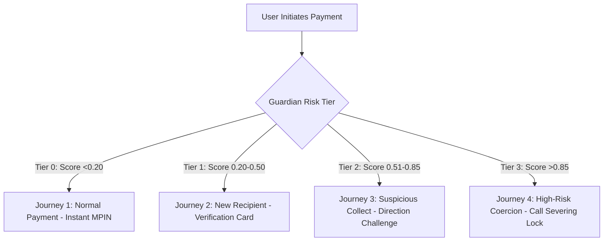

# User Journeys & End-to-End Walkthroughs

## Document Metadata
- **Module:** 09-demo
- **File:** user-journeys.md
- **Status:** APPROVED / LOCKED
- **Traceability:** Direct fulfillment of `PROBLEM_STATEMENT.md` (Expected Demo: Normal payment, New/unverified recipient, Suspicious payment request, High-risk transaction requiring intervention; Core Requirements: Recipient verification, Confirmation step, Pause/block, Explainable alerts, Audit history).

---

## 1. Scope & Design Philosophy

This document details the exact, screen-by-screen user journeys for the **four mandatory scenarios** specified in `PROBLEM_STATEMENT.md`. Each journey demonstrates how the **Agentic Guardian** alters its behavior based on real-time risk, balancing zero-friction user experience for legitimate payments with graduated cognitive friction and active interlocks for malicious scam attempts.



---

## 2. Journey 1: Normal Payment (Zero Friction Baseline)

### 2.1 Persona & Context
- **User:** Priya Sharma (32, Software Engineer in Bengaluru).
- **Situation:** Buying weekly fruits and vegetables at her regular neighborhood vendor.
- **Payee:** `freshdaily@icici` (Merchant: "Fresh Daily Grocery").
- **Amount:** ₹480.00.

### 2.2 Screen-by-Screen Interaction Flow

```
+-----------------------------+      +-----------------------------+
|        PhonePe / GPay       |      |          NPCI MPIN          |
|                             |      |                             |
| Paying: Fresh Daily Grocery |      | Enter 6-Digit UPI PIN       |
| VPA: freshdaily@icici       |      |                             |
| Amount: INR 480.00          | ---> | [ * ] [ * ] [ * ] [ ] [ ] [ ] |
|                             |      |                             |
| [      PROCEED TO PAY     ] |      | [ 1 ] [ 2 ] [ 3 ]           |
|                             |      | [ 4 ] [ 5 ] [ 6 ]           |
+-----------------------------+      +-----------------------------+
          (Instant)                             (Seamless)
```

1. **Screen 1 (Payment Form):** Priya scans the vendor's static QR code. The app automatically populates the payee name and VPA. She enters ₹480 and taps `"PROCEED TO PAY"`.
2. **Guardian Interception (<10ms):**
   - Hot Path LightGBM evaluates 25 features locally.
   - Payer has 14 successful historical transactions with this merchant.
   - Device has no active call, no remote tools, standard dwell time ($14\text{s}$).
   - Risk Score $P = 0.012$ ($\text{Tier 0: Silent Pass}$).
3. **Screen 2 (UPI MPIN Screen):**
   - The user is transitioned directly to the standard NPCI Common Library MPIN entry screen without a single interruption, banner, or delay.
4. **Post-Transaction:**
   - Payment succeeds in 1.4 seconds.
   - Audit Store logs: `TX-8801 | TIER_0_PASS | Latency: 4.2ms | Status: COMPLETED`.

---

## 3. Journey 2: New / Unverified Recipient Verification

### 3.1 Persona & Context
- **User:** Rajesh Kumar (45, School Teacher in Jaipur).
- **Situation:** Purchasing a second-hand dining table found on an online classifieds website (OLX). Seller asked for an advance delivery deposit.
- **Payee Entered:** "Rahul Sharma" (`rahul.furniture.deal@paytm`).
- **Amount:** ₹3,500.00.

### 3.2 Screen-by-Screen Interaction Flow

```
+-------------------------------------------------------+
|                   UPI Payment Screen                  |
|                                                       |
| Paying: Rahul Sharma (rahul.furniture.deal@paytm)     |
| Amount: INR 3,500.00                                  |
| Note: Advance for dining table                        |
|                                                       |
| +---------------------------------------------------+ |
| | [!] GUARDIAN ALERT: UNVERIFIED RECIPIENT          | |
| |                                                   | |
| | - Actual Bank Account Name: MOHAMMED ISMAIL       | |
| | - Account Age: 4 days old                         | |
| | - Prior History: None                             | |
| |                                                   | |
| | Notice: The seller claims to be 'Rahul Sharma',   | |
| | but the official bank account belongs to          | |
| | MOHAMMED ISMAIL. Advance payments for online      | |
| | items carry high risk of fraud.                   | |
| |                                                   | |
| | [ ] I personally know Mohammed Ismail and confirm | |
| +---------------------------------------------------+ |
|                                                       |
| [  PROCEED TO ENTER PIN (Disabled until checked)   ]  |
+-------------------------------------------------------+
```

1. **Screen 1 (Payment Entry):** Rajesh pastes the VPA provided on WhatsApp and enters ₹3,500 with note *"Advance for dining table"*. He taps `"PROCEED TO PAY"`.
2. **Guardian Evaluation (Pre-PIN Review Window):**
   - Hot Path scores transaction at $P = 0.42$ (Triggers Warm Corridor: $0.20 \le P \le 0.85$).
   - Warm Agent calls `verify_recipient_vpa()` via mock NPCI switch.
   - Mock CBS returns Registered Legal Name: `"MOHAMMED ISMAIL"`.
   - Agent detects semantic clash between entered name `"Rahul Sharma"` and bank legal name `"MOHAMMED ISMAIL"`.
   - Decision emitted in 1,240ms: `TIER_1_VERIFY`.
3. **Screen 2 (Pre-PIN Verification Card):**
   - An amber Recipient Verification Badge appears cleanly above the pay button.
   - Highlights the exact discrepancy in plain, easy-to-understand Hindi and English:
     *"The name given to you is 'Rahul Sharma', but the money will be deposited into the bank account of 'MOHAMMED ISMAIL' (Account created 4 days ago)."*
   - The `"Proceed to Enter PIN"` button is dimmed and disabled.
4. **User Action:**
   - Rajesh realizes the seller lied about his identity.
   - Rajesh decides *not* to check the box and taps `"Cancel Payment & Report"`.
   - Result: Scam intercepted! ₹3,500 saved.
5. **Post-Transaction:**
   - Audit Store logs: `TX-8802 | TIER_1_VERIFY | Payee: rahul.furniture.deal@paytm | CBS_Name: MOHAMMED ISMAIL | Outcome: ABORTED_BY_USER`.

---

## 4. Journey 3: Suspicious Collect Request (Inverted Direction)

### 4.1 Persona & Context
- **User:** Sunita Patel (58, Homemaker in Ahmedabad).
- **Situation:** Received an SMS claiming her electricity power bill was overpaid and she is eligible for a ₹10,000 government rebate. Fraudster sends an inbound UPI Collect Request.
- **Payee (Requester):** `electricity.rebate.desk@axisbank`.
- **Amount Requested:** ₹10,000.00.

### 4.2 Screen-by-Screen Interaction Flow

```
+-------------------------------------------------------+
|        [!] CRITICAL WARNING: PAYMENT DIRECTION        |
|                                                       |
|  STOP! YOU ARE PAYING MONEY, NOT RECEIVING MONEY!     |
|                                                       |
|  You have received a Collect Request of INR 10,000.   |
|  Entering your UPI PIN will DEDUCT Rs 10,000 from     |
|  your bank account immediately.                       |
|                                                       |
|  - Requester: Govt Power Rebate Authority             |
|  - Real Bank Account: electricity.rebate.desk@axis    |
|  - Cybercrime Status: Flagged on I4C portal (2 reports)|
|                                                       |
|  To confirm you understand this is a DEBIT from your  |
|  account, please type the word below:                 |
|                                                       |
|  Type: [ PAYING ]                                     |
|  Input: [ ........................ ]                  |
|                                                       |
|  [ DECLINE & BLOCK (Recommended) ]    [ PROCEED ]     |
+-------------------------------------------------------+
```

1. **Screen 1 (Inbound Notification):** Sunita taps a notification saying: *"Govt Power Rebate Authority requested Rs 10,000. Enter MPIN to claim rebate."*
2. **Guardian Interception:**
   - Hot Path detects `transaction_type == "UPI_COLLECT_REQUEST"`.
   - String match on note finds deceptive promise: `"Enter MPIN to receive Rs 10000"`.
   - Risk score $P = 0.94$ (Triggers `TIER_2_CHALLENGE`).
3. **Screen 2 (Direction Inversion Challenge Modal):**
   - The screen locks into an amber/black high-contrast modal.
   - Large headline: *"STOP! YOU ARE PAYING MONEY, NOT RECEIVING MONEY!"*
   - Explains that UPI PIN is **NEVER** required to receive funds.
   - Highlights that this requester was reported on the National Cybercrime Reporting Portal (I4C).
4. **Cognitive Challenge Enforcement:**
   - Sunita cannot simply click "OK".
   - The "Proceed" button remains grayed out until the user types the word `"PAYING"`.
   - A prominent, green-highlighted `"DECLINE & BLOCK (Recommended)"` button is presented.
5. **User Action:**
   - Sunita reads the warning, realizes it is a debit, and taps `"DECLINE & BLOCK"`.
   - The request is declined and the VPA is added to her local blacklist.
6. **Post-Transaction:**
   - Audit Store logs: `TX-8803 | TIER_2_CHALLENGE | Direction_Inversion: TRUE | I4C_Flag: TRUE | Outcome: DECLINED_AND_BLOCKED`.

---

## 5. Journey 4: High-Risk Coercive Scam Requiring Intervention (Digital Arrest)

### 5.1 Persona & Context
- **User:** Dr. Arvinder Singh (67, Retired Professor in Chandigarh).
- **Situation:** Under an active 45-minute WhatsApp video call with a fraudster dressed in a police uniform claiming to be "CBI Officer Vikram Rathore". Fraudster told Dr. Singh he is under "Digital Arrest" for money laundering and must transfer ₹95,000 to an "official RBI court clearance account" within 10 minutes or local police will break into his house.
- **Payee:** `rbi.clearance.cell@sbi`.
- **Amount:** ₹95,000.00.

### 5.2 Screen-by-Screen Interaction Flow

```
+-------------------------------------------------------+
|  [!!!] CRITICAL SECURITY INTERLOCK: DIGITAL ARREST    |
|                                                       |
|  YOU ARE CURRENTLY BEING TARGETED BY AN ACTIVE SCAM.  |
|                                                       |
|  Evidence Detected:                                   |
|  - You are on an active phone call (Duration: 45 min) |
|  - The payee claims to be 'RBI Clearance Cell'        |
|  - Actual Bank Legal Name: AJAY RAMESH PAWAR          |
|    (Personal savings account, SBI Barmer Branch)      |
|                                                       |
|  OFFICIAL POLICE NOTICE:                              |
|  Police, CBI, ED, and Judges NEVER conduct trials on   |
|  WhatsApp, NEVER put citizens under 'Digital Arrest', |
|  and NEVER demand fund transfers for verification.    |
|                                                       |
|  [!] PAYMENT LOCKED: HANG UP PHONE CALL TO UNLOCK    |
|                                                       |
|  [ HANG UP AND CALL 1930 HELPLINE ]  [ CANCEL PAY ]   |
+-------------------------------------------------------+
```

1. **Screen 1 (Panicked Entry):** Dr. Singh, terrified, pastes the VPA dictated by the caller and enters ₹95,000. He taps `"PROCEED"`.
2. **Guardian Real-Time Interception:**
   - Hot Path evaluates sensor telemetry:
     - `CALL_STATE_OFFHOOK == true` (Call duration: 2,740 seconds).
     - Rapid paste initiation ($1.2\text{s}$ dwell time).
     - Ticket size: ₹95,000 (abnormal for Dr. Singh's monthly profile).
     - Score $P = 0.985$ (Critical risk).
   - Warm Path queries mock NPCI switch:
     - Payee VPA `rbi.clearance.cell@sbi` belongs to an individual: `"AJAY RAMESH PAWAR"`.
     - Agent executes Bayesian hypothesis evaluation: $P(H_{\text{Scam}}) = 0.998$.
   - Decision: `TIER_3_COGNITIVE_LOCK` + `CALL_SEVER_INTERLOCK`.
3. **Screen 2 (Call-Severing Interlock Screen):**
   - High-urgency red screen locks the payment flow.
   - Displays real bank account holder name: `"AJAY RAMESH PAWAR"`.
   - Explains clearly: *"The person on your call is NOT police. RBI has no clearance accounts. Your money is going to an individual in Rajasthan."*
   - **Physical Interlock:** The "Proceed" button is completely disabled as long as the phone call is active (`TelephonyManager.getCallState() != CALL_STATE_IDLE`).
   - A 60-second cooldown timer begins ticking down.
4. **User Action:**
   - Dr. Singh sees the name "AJAY RAMESH PAWAR" on his screen.
   - The fraudster on the phone yells: *"Don't read that! Override it immediately!"*
   - Dr. Singh realizes an authentic officer wouldn't have a personal account name. He hangs up the call.
   - Once the call is hung up, the Guardian displays the 1-tap dialer for `1930 National Cybercrime Helpline`.
   - Dr. Singh taps `"Cancel Payment"`.
   - Result: High-stakes financial and emotional catastrophe averted! ₹95,000 saved.
5. **Post-Transaction:**
   - Audit Store logs: `TX-8804 | TIER_3_LOCK | Call_Severed: TRUE | Payee: rbi.clearance.cell@sbi | Real_Name: AJAY RAMESH PAWAR | Outcome: SCAM_PREVENTED`.

---

## 6. Summary Comparison Matrix Across the 4 Scenarios

| Attribute | Scenario 1: Normal Payment | Scenario 2: New Recipient | Scenario 3: Suspicious Collect | Scenario 4: High-Risk Coercion |
| :--- | :--- | :--- | :--- | :--- |
| **Risk Score ($P$)** | $0.012$ | $0.420$ | $0.940$ | $0.985$ |
| **Risk Category** | `NORMAL_LOW_RISK` | `MODERATE_NEW_RECIPIENT` | `HIGH_DECEPTIVE_COLLECT` | `CRITICAL_DIGITAL_ARREST` |
| **Hot Path Latency** | $4.2\text{ms}$ | $4.1\text{ms}$ | $3.9\text{ms}$ | $3.8\text{ms}$ |
| **Warm Path Latency**| Bypassed ($0\text{ms}$) | $1,240\text{ms}$ | $1,410\text{ms}$ | $1,350\text{ms}$ |
| **Intervention Tier** | `TIER_0_PASS` | `TIER_1_VERIFY` | `TIER_2_CHALLENGE` | `TIER_3_LOCK` |
| **Cognitive Friction**| None | Salient KYC Badge | Mandatory Confirmation Typing | Call-Severing Interlock |
| **User Confirmation** | Standard MPIN | Explicit Checkbox Toggle | Typed Direction Phrase | Call Termination + Timer |
| **Financial Outcome** | Instant Transfer | Informed Payment or Cancel | Inverted Debit Blocked | Major Financial Loss Prevented |
