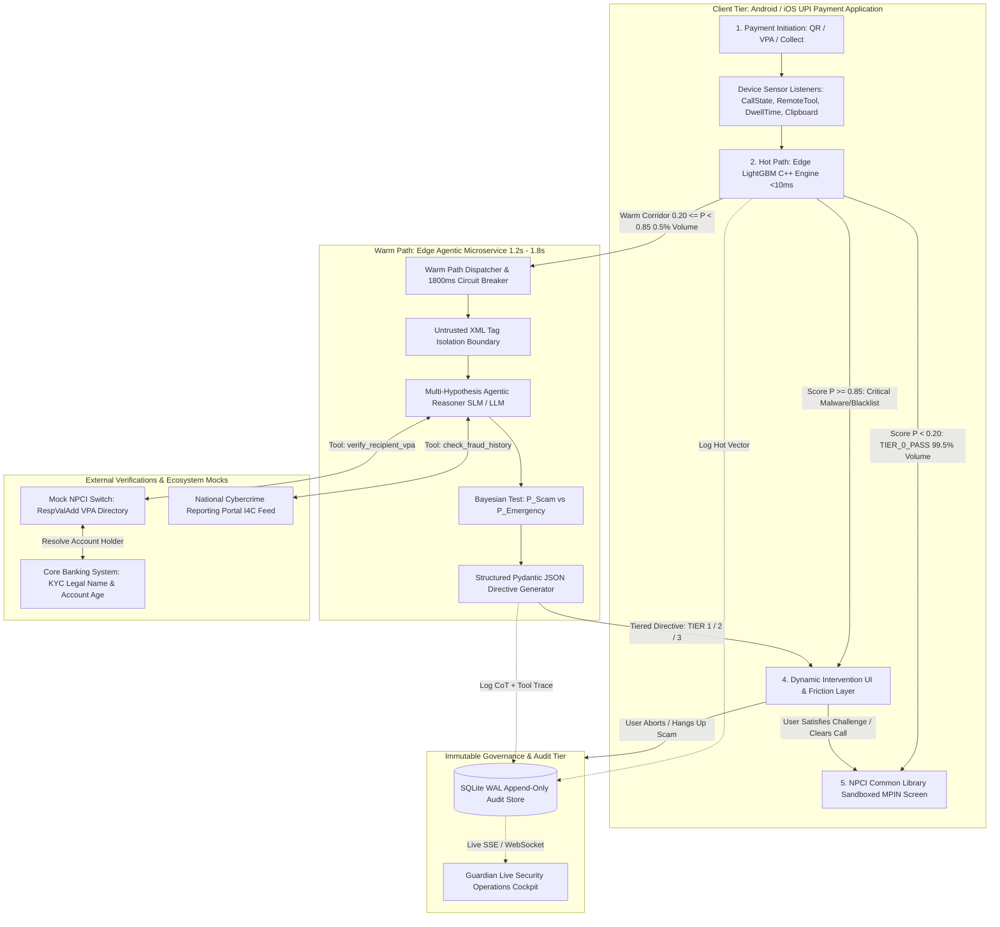

# Master Architecture Diagram & System Topology

## Document Metadata
- **Module:** 10-final
- **File:** final-architecture-diagram.md
- **Status:** APPROVED / LOCKED
- **Traceability:** Direct fulfillment of `PROBLEM_STATEMENT.md` (Core Requirements: Payment simulation interface, Transaction-risk analysis, Rule-based and/or LLM-based reasoning, Recipient verification workflow, Risk score/category, User confirmation step, Pause/block mechanism, Explainable security alerts, Transaction audit history).

---

## 1. High-Level Master Architecture Diagram



---

## 2. Component Latency & Security Topology

```
+----------------------------------------------------------------------------------------------------+
|                                      PAYMENT LIFECYCLE CHRONOLOGY                                   |
+------------------------------------+----------------------------------+----------------------------+
| 1. Payment Form Initiation         | 2. Pre-PIN Dwell Window          | 3. Authorization           |
| (User taps "Pay" / Scans QR)       | (Human reads summary: 1.5s - 2.5s)| (NPCI MPIN Pad)            |
+------------------------------------+----------------------------------+----------------------------+
|  HOT PATH: 0ms --------- 8ms       |  WARM PATH: 10ms ------ 1,400ms  | MPIN Entry: 1,400ms+       |
|  - Sensor telemetry pulled         |  - NPCI CBS legal name fetched   | - Encrypted MPIN entry     |
|  - 25 tabular features computed    |  - Entity-purpose clash checked  | - PSP Switch settlement    |
|  - LightGBM evaluates P score      |  - LLM tests scam hypotheses     |                            |
|                                    |  - Asymmetric friction displayed |                            |
|  [99.5% Clear -> Instant MPIN]     |  [0.5% Corridor -> Friction UI]  | [Authorized Transaction]   |
+------------------------------------+----------------------------------+----------------------------+
```

---

## 3. Data Flow & Security Protocol Matrix

| Interface Connection | Protocol | Payload Type | Latency Ceiling | Security & Isolation Controls |
| :--- | :--- | :--- | :--- | :--- |
| **Sensors $\to$ Hot Engine** | Local C++ / JNI | Local Sensor Struct | $\le 1.0\text{ms}$ | Zero network transmission. Android OS permission sandboxing. |
| **Hot Engine $\to$ Warm Gateway** | gRPC / HTTPS | Tabular Features + Note | $\le 25\text{ms}$ | mTLS encryption; payload tokenized; zero PII sent. |
| **Warm Agent $\to$ NPCI Switch** | Mock REST / HTTPS | VPA Lookup Query | $\le 120\text{ms}$ | Mock NPCI `RespValAdd` interface signed with HMAC-SHA256. |
| **Warm Agent $\to$ Intervention UI**| JSON Directive | Structured Schema | $\le 1,800\text{ms}$ | Pydantic validation; XML untrusted prompt isolation. |
| **Client $\to$ NPCI Common Library**| Android AIDL | Encrypted Key Exchange | Native OS | Strict OS sandbox; Guardian has ZERO access to MPIN entry. |
| **Engine $\to$ Audit Store** | SQLite WAL | Immutable Event Record | $\le 2.0\text{ms}$ | Append-only, HMAC-chained log records for non-repudiation. |

---

## 4. Single-Slide Competition Summary

1. **Dual-Path Efficiency:** Solves the payment speed dilemma ($<10\text{ms}$ for $99.5\%$ volume; selective $1.2\text{s}$ agent for ambiguous cases).
2. **Cognitive Asymmetry:** Replaces passive popups with active re-orientation (call-severing interlock, typed legal name).
3. **Zero Ecosystem Disruption:** Runs as an on-device SDK + PSP microservice using existing NPCI `RespValAdd` APIs without modifying core banking switches.
4. **Bounded Agency:** Strictly enforces read-only intelligence and pre-authorization guidance—zero financial write access.
