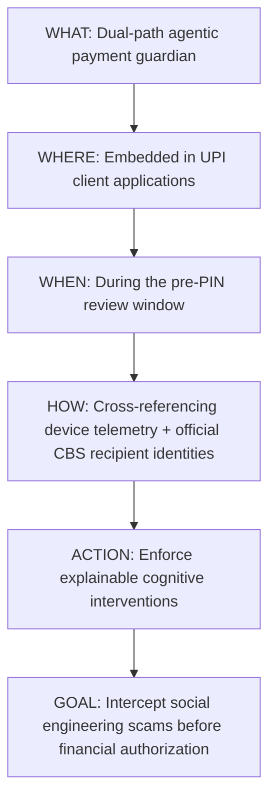

# The Definitive One-Sentence Product Definition

## Document Metadata
- **Module:** 10-final
- **File:** one-sentence-definition.md
- **Status:** APPROVED / LOCKED
- **Traceability:** Direct fulfillment of `PROBLEM_STATEMENT.md` (PS09 — Agentic Guardian for Real-Time Payment Scam Interception).

---

## 1. The Definitive One-Sentence Definition

> **"We are building a real-time, dual-path agentic payment guardian embedded in UPI client applications that intercepts social-engineering scams and deceptive payment requests during the pre-PIN review window by cross-referencing live device telemetry and official core banking recipient identities to enforce explainable, cognitive interventions before financial authorization occurs."**

---

## 2. Grammatical Deconstruction & Technical Defense

### Clause 1: *"We are building a real-time, dual-path agentic payment guardian..."*
- **Technical Rigor:** Defines the system's nature. It is not an offline batch analytics pipeline, nor is it a single slow LLM wrapper. It is a dual-path architecture combining a sub-10ms compiled decision-tree hot path with a selective warm-path agentic reasoner.
- **Problem Statement Alignment:** Fulfills *"Rule-based and/or LLM-based reasoning"* and *"Real-time security reasoning"*.

### Clause 2: *"...embedded in UPI client applications..."*
- **Technical Rigor:** Defines exact placement and boundary. It resides at the client integration layer (TPAPs and PSP banking apps) where device sensors, user UI, and payment initiation events originate, while respecting the air-gapped NPCI Common Library for MPIN security.
- **Problem Statement Alignment:** Fulfills *"Payment simulation interface"* and *"What participants should build: working software prototype"*.

### Clause 3: *"...that intercepts social-engineering scams and deceptive payment requests..."*
- **Technical Rigor:** Defines the exact threat category. The Guardian is not a network DDoS firewall or an AML sanction-screening engine; it specifically intercepts social engineering, impersonation, inverted collect requests, and coercive fraud.
- **Problem Statement Alignment:** Fulfills *"Digital payment scams can involve suspicious payment requests, impersonation, unusual recipients, urgency-based social engineering"*.

### Clause 4: *"...during the pre-PIN review window..."*
- **Technical Rigor:** Defines the exact execution timing. It does not attempt to reverse funds after settlement; it executes inside the natural human review interval (1.5 to 2.5 seconds) between "Pay" initiation and MPIN entry.
- **Problem Statement Alignment:** Fulfills *"Users need protection before a suspicious transaction is completed"*.

### Clause 5: *"...by cross-referencing live device telemetry and official core banking recipient identities..."*
- **Technical Rigor:** Defines the evidence sources. Decision-making is grounded in multi-modal physical telemetry (active calls, remote access tools, dwell time) paired with official Core Banking System (CBS) legal names fetched via NPCI `RespValAdd`.
- **Problem Statement Alignment:** Fulfills *"Recipient verification workflow"* and *"Evaluating risk, verifying relevant information"*.

### Clause 6: *"...to enforce explainable, cognitive interventions before financial authorization occurs."*
- **Technical Rigor:** Defines the output mechanism and safety boundary. The system does not silently block legitimate users or show ignorable popups; it employs graduated cognitive friction (name confirmation, call-severing interlocks) paired with plain-language explanations and complete audit history.
- **Problem Statement Alignment:** Fulfills *"Explainable security alerts"*, *"User confirmation step"*, *"Pause/block mechanism"*, and *"Safe autonomous decision-making"*.

---

## 3. Strict Negative Scope Boundaries (What We Are NOT Building)

To prevent scope creep and maintain 100% adherence to `PROBLEM_STATEMENT.md`:
1. **NOT** a new payment switch or UPI protocol replacement.
2. **NOT** a credit scoring, lending, or KYC onboarding platform.
3. **NOT** an autonomous fund-moving or automated refund agent (zero write agency).
4. **NOT** an offline post-fraud forensic dashboard; our entire raison d'être is **pre-authorization interception**.
