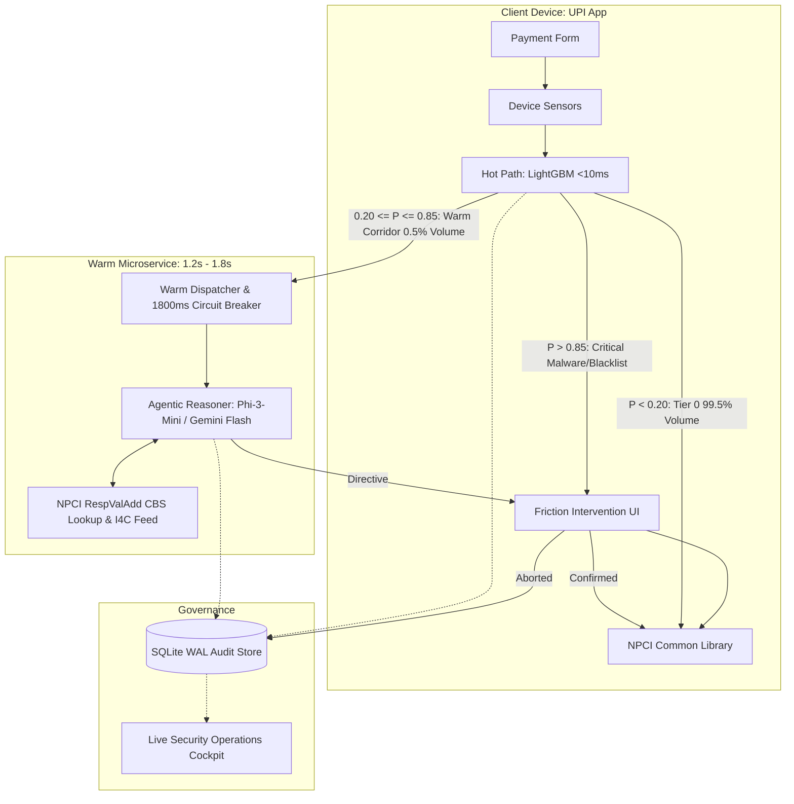
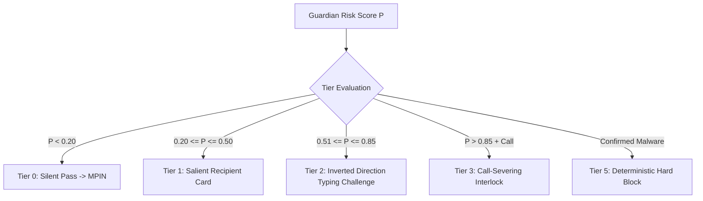

# Master Build Contract: Agentic Guardian (UPI Scam Interceptor)

## Section 1: Document Identification & Status
- **Document Title:** Master Build Contract & System Implementation Blueprint
- **Target Project:** PS09 — Agentic Guardian for Real-Time Payment Scam Interception
- **Document Path:** `03-solution-definition/BUILD_CONTRACT.md`
- **Revision:** 1.0.0-FINAL-RELEASE
- **Status:** **LEGALLY & TECHNICALLY LOCKED / APPROVED FOR BUILD**
- **Effective Timestamp:** 2026-09-11T13:55:00+05:30
- **Traceability Authority:** Strictly derived from and 100% compliant with `PROBLEM_STATEMENT.md`.

---

## Section 2: Problem Statement Scope & Binding Objective
As defined in `PROBLEM_STATEMENT.md`, the objective of this project is to build an **agentic payment-security assistant capable of analyzing a payment request, evaluating risk, verifying relevant information, and taking appropriate protective action before transaction completion**.

### Core Requirements Contract Matrix
Every requirement from `PROBLEM_STATEMENT.md` is strictly bound to its technical implementation:
1. **Payment Simulation Interface:** Delivered via a realistic dual-viewport console (mobile client + security cockpit).
2. **Transaction-Risk Analysis:** Delivered via a hybrid 25-feature tabular evaluator + multi-modal sensor analyzer.
3. **Rule-Based and/or LLM-Based Reasoning:** Delivered via the Federated Dual-Path Tiered Triage (Hot Path decision tree + Warm Path SLM/LLM reasoner).
4. **Recipient Verification Workflow:** Delivered via mock NPCI `RespValAdd` CBS lookup and Entity-Purpose Semantic Clash model.
5. **Risk Score / Category:** Delivered via continuous probability $P \in [0.0, 1.0]$ mapped to 4 discrete categories.
6. **User Confirmation Step:** Delivered via graduated cognitive friction (checkboxes, typed confirmation phrases, call-severing interlocks).
7. **Pause / Block Mechanism:** Delivered via transactional state-machine locks intercepting pre-MPIN handoff.
8. **Explainable Security Alerts:** Delivered via plain-language contrast alerts in native vernacular.
9. **Transaction Audit History:** Delivered via append-only, SQLite WAL immutable forensic log.

---

## Section 3: System Identity & One-Sentence Definition
> **"We are building a real-time, dual-path agentic payment guardian embedded in UPI client applications that intercepts social-engineering scams and deceptive payment requests during the pre-PIN review window by cross-referencing live device telemetry and official core banking recipient identities to enforce explainable, cognitive interventions before financial authorization occurs."**

---

## Section 4: System Boundaries & Deployment Envelope
- **In-Scope Boundary:** Client-side Android/iOS UPI application integration layer (TPAPs and PSP sponsor banks), edge gateway microservice, mock NPCI directory switch, and local immutable audit store.
- **Out-of-Scope Boundary (Strict Guardrails):**
  - The Guardian **NEVER** touches or inspects the sandboxed NPCI Common Library (CL) MPIN pad.
  - The Guardian **NEVER** captures, logs, or stores the user's secret 4/6-digit UPI MPIN.
  - The Guardian has **ZERO write agency** over financial ledgers (cannot debit, credit, hold, or reverse funds).
  - The Guardian does **NOT** alter core banking UPI switch settlement protocols.

---

## Section 5: Architecture Topology & Selected Pattern (ADR-001)
The system strictly adopts **Option 3: Federated Dual-Path Tiered Triage Architecture** (formally approved in `03-system-design/architecture-decision.md` [ADR-001]).



---

## Section 6: Hot Path Specification (Edge LightGBM Engine)
- **Deployment:** Compiled C++ / Treelite binary embedded locally in the mobile client SDK.
- **Input:** 25-feature normalized tabular vector (amounts, velocities, time-of-day, payee history, device sensor flags).
- **Execution Latency:** $p50 \le 3.0\text{ms}$, $p95 \le 8.0\text{ms}$, $p99 \le 12.0\text{ms}$ (hard ceiling 15ms).
- **Triage Thresholds:**
  - $P < 0.20$: Emits `TIER_0_PASS` $\to$ instant seamless transition to MPIN (99.5% of total volume).
  - $0.20 \le P \le 0.85$: Emits `INVOKE_WARM_AGENT` $\to$ dispatches asynchronously to Warm Path (0.5% of volume).
  - $P > 0.85$ (Deterministic Rule match, e.g., remote malware tool active): Emits immediate `TIER_5_BLOCK`.

---

## Section 7: Warm Path Specification (Agentic Reasoner & SLM)
- **Deployment:** Low-latency regional edge microservice running quantized Small Language Models (e.g., Phi-3-Mini / Gemma-2-2B) or high-speed cloud endpoints (Google Gemini 1.5 Flash).
- **Invoked Volume:** Strictly $\le 0.5\%$ of transactions.
- **Execution Window:** Executes inside the human pre-PIN review dwell interval ($1.5\text{s} - 2.5\text{s}$).
- **Reasoning Loop:**
  1. Wraps metadata inside untrusted XML boundaries (`<untrusted_transaction_metadata>`).
  2. Invokes external tool `verify_recipient_vpa()` against NPCI directory.
  3. Executes Bayesian hypothesis evaluation ($H_{\text{Scam}}$ vs $H_{\text{Emergency}}$).
  4. Generates structured JSON adhering strictly to the `AgentInterventionDirective` Pydantic schema.
- **Circuit Breaker:** Hard abort at **1,800ms**. On timeout, safely degrades to local deterministic fallback rules.

---

## Section 8: Latency Budgets & Processing Chronology

| Stage | Trigger Event | Allowed Latency | Fallback Behavior |
| :--- | :--- | :--- | :--- |
| **Sensor Harvest** | User taps "Proceed" | $\le 1.0\text{ms}$ | Defaults to safe neutral flags |
| **Hot Path Inference** | Tabular vector ready | $\le 8.0\text{ms}$ (p99 $\le 15\text{ms}$) | Cached profile baseline rules |
| **NPCI CBS Lookup** | Warm Agent tool call | $\le 120.0\text{ms}$ | Uses cached VPA directory |
| **Agentic Reasoning**| Multi-hypothesis CoT | $\le 1,400.0\text{ms}$ | 1,800ms circuit breaker abort |
| **Intervention Render**| Directive received | $\le 16.0\text{ms}$ ($60\text{fps}$) | Native UI modal display |

---

## Section 9: Recipient Verification & CBS Lookup Workflow
- **NPCI Directory Query:** Executes `verify_recipient_vpa(payee_vpa)` invoking NPCI `RespValAdd` switch simulator.
- **Returned Data:** Registered KYC Legal Account Holder Name, Bank IFSC, Account Age in days, and Account Type (Savings / Current / Merchant).
- **Entity-Purpose Semantic Clash Model:** Computes Levenshtein and Jaro-Winkler semantic distance between the name entered by user / displayed on chat and the official bank KYC name. Discrepancies $\ge 0.70$ immediately trigger `TIER_1_VERIFY` or `TIER_2_CHALLENGE`.

---

## Section 10: Multi-Modal Telemetry & Sensor Integration
The client SDK captures real-time event-driven telemetry bound strictly to the payment screen lifecycle:
1. `call_state`: Evaluated via Android `TelephonyManager` (`CALL_STATE_IDLE` vs `CALL_STATE_OFFHOOK`).
2. `remote_access_active`: Evaluated via `MediaProjectionManager` and running processes (AnyDesk, TeamViewer).
3. `accessibility_anomaly`: Flags malicious overlays masking the UI.
4. `clipboard_auto_paste`: Detects VPA pasted within 3 seconds of opening payment screen.
5. `navigation_dwell_ms`: Timing elapsed on payment screen ($<1.5\text{s}$ indicates coached panic).

---

## Section 11: Threat Model & Adversarial Defense
- **Prompt Injection Defense:** Strict XML tag encapsulation, zero executable output, and deterministic shadow regex filters (`"system"`, `"override"`, `"risk_score"`).
- **NLP Evasion Defense:** Text de-obfuscation pipeline mapping leetspeak and transliterated Devanagari. Multi-modal independence ensures detection even if notes are 100% blank.
- **Velocity Smurfing Defense:** Rolling 1-hour and 24-hour stateful sliding windows tracking cumulative volume to unverified payees.

---

## Section 12: Intervention Engine & Graduated Cognitive Friction



- **Tier 0 (Silent Pass):** Transparent pass to MPIN entry.
- **Tier 1 (Salient Verification):** Displays official CBS legal name and account age badge. Requires 1-click acknowledgement.
- **Tier 2 (Cognitive Challenge):** Pauses flow on inverted collect requests. Requires typing confirmation word (`"PAYING"`).
- **Tier 3 (Call-Severing Interlock):** Disables pay button entirely until active phone call is terminated (`CALL_STATE_IDLE`). Displays real bank name and 1-tap `1930` Cybercrime Helpline dialer.
- **Tier 5 (Deterministic Block):** Hard stop on active screen-sharing malware or verified I4C police blacklists.

---

## Section 13: Human-in-the-Loop Confirmation & Challenge Protocols
- **Anti-Mindless Tap Design:** Eliminates generic `[OK / Cancel]` dialogs.
- **Active Re-Orientation:** Forces user to confront discrepancies by typing the scammer's real bank account name or payment direction.
- **Emergency Bypass Protocol:** For authentic medical emergencies, displays hospital CBS name with transparent disclaimers; never strands legitimate care.

---

## Section 14: Safe Autonomous Decision-Making & Bounded Agency Rules
1. **Rule of Non-Execution:** The agent produces informational directives and UI state configurations; it CANNOT invoke payment settlement APIs.
2. **Rule of Common Library Invariance:** The NPCI Common Library is an untouched black box.
3. **Rule of Deterministic Superiority:** An agentic LLM can NEVER overturn a deterministic security block triggered by detected malware.
4. **Rule of Fail-Safe Operation:** Any subsystem failure (timeout, network crash, parsing error) defaults to safe deterministic rules without stranding the payment.

---

## Section 15: Data Model, Feature Vector & Schemas
- **Feature Vector (25 Tabular Features):** Normalized numerical and categorical vector defined in `06-data/data-model.md`.
- **API Contracts:** Pydantic models for `TransactionEvaluationRequest`, `HotPathResult`, `AgentInterventionDirective`, and `AuditRecord`.
- **Schema Validation:** Strict parsing ensures zero malformed payloads reach the client UI.

---

## Section 16: Synthetic & Prototype Dataset Specification
- **Dataset Size:** 5,000 realistic synthetic UPI transactions generated via `06-data/prototype-data.md`.
- **Distribution:** 90% legitimate P2M merchant payments, 7% legitimate P2P peer transfers, 3% realistic fraud/scam attacks across all 4 mandatory scenarios.
- **Ground Truth Labels:** Fully annotated with scenario IDs, risk categories, expected tiers, and fraud typologies.

---

## Section 17: Transaction Audit Model & Compliance Store
- **Storage Engine:** SQLite configured in Write-Ahead Logging (WAL) mode for atomic, append-only persistence under $2\text{ms}$.
- **Logged Entities:** Transaction ID, timestamp, payer/payee VPAs, tabular feature snapshot, CBS lookup result, agent Chain-of-Thought reasoning tokens, tool execution traces, intervention tier, user response, and final status.
- **Forensic Compliance:** Conforms to RBI Master Directions on digital payment security and IT Act 2000 Section 65B for electronic admissibility.

---

## Section 18: Failure Modes, Graceful Degradation & Circuit Breakers
- **Circuit Breaker Ceiling:** 1,800ms on all Warm-Path network and LLM calls.
- **Degradation Level 1 (LLM Timeout):** Reverts to Hot-Path deterministic rule matrix; displays Tier 1 recipient card.
- **Degradation Level 2 (NPCI Mock Unreachable):** Uses cached VPA directory or local heuristic rules.
- **Degradation Level 3 (Client Offline):** Evaluates local device sensors and cached profile rules entirely on-device.

---

## Section 19: Performance SLAs, Quantitative Targets & Evaluation Metrics
- **Statistical Accuracy:** PR-AUC $\ge 0.88$, Scam Recall $\ge 92.0\%$, False Positive Friction Rate $\le 0.50\%$.
- **Latency Guarantees:** Hot Path $p99 \le 15\text{ms}$; Warm Path $p99 \le 1,800\text{ms}$.
- **Behavioral Efficacy:** Scam De-escalation Rate $\ge 65.0\%$, Call-Severing Success Rate $\ge 75.0\%$.
- **Economic Value:** Net Economic Value $\ge +\text{INR } 3.4\text{ Crore}$ per 10 million transactions.

---

## Section 20: The 4 Mandatory Demo Scenarios Specification
Strictly implements the four scenarios mandated by `PROBLEM_STATEMENT.md`:
1. **Scenario 1 (Normal Payment):** ₹480 groceries $\to$ cleared in $4.2\text{ms}$ via `TIER_0_PASS` (zero friction).
2. **Scenario 2 (New/Unverified Recipient):** ₹3,500 OLX furniture $\to$ resolves CBS legal name "MOHAMMED ISMAIL" vs entered "Rahul Sharma"; displays salient verification card.
3. **Scenario 3 (Suspicious Payment Request):** ₹10,000 inbound collect request claiming rebate $\to$ inverted direction challenge forces user to type "PAYING".
4. **Scenario 4 (High-Risk Coercion Requiring Intervention):** ₹95,000 "Digital Arrest" under 45-min active call $\to$ Tier 3 Call-Severing Interlock physically locks pay button until call is hung up.

---

## Section 21: Prototype Implementation Architecture & Technology Stack
- **Simulator Frontend:** HTML5, Vanilla ES6+ JavaScript, Modern Responsive CSS3 (Split-screen: Mobile Simulator + Security Cockpit).
- **Backend API Server:** Python 3.11+, FastAPI, Uvicorn (REST + SSE live streaming).
- **ML Hot Path:** LightGBM C++ / Treelite CPU engine.
- **Agent Warm Path:** Google Gemini 1.5 Flash / Local Ollama (Phi-3-Mini).
- **Persistence:** SQLite WAL audit store.
- **Launch Harness:** Single PowerShell script `run_prototype.ps1`.

---

## Section 22: Negative Scope Boundaries (What We Are NOT Building)
- **NO** custom core banking switch or UPI protocol replacement.
- **NO** credit underwriting, credit card processing, or KYC identity verification service.
- **NO** autonomous fund debiting, holding, or chargeback execution.
- **NO** post-settlement dispute resolution portal.

---

## Section 23: Verification, Automated Test Harness & Acceptance Criteria
- **Automated Test Battery:** Complete pytest suite in `tests/test_scenarios.py` and `tests/test_red_team.py`.
- **Pass Criteria:**
  1. 100% automated test assertions passing across all 4 scenarios.
  2. Zero unhandled exceptions or crashes on adversarial payloads.
  3. Latency verified under 15ms (Hot) and 1,800ms (Warm).
  4. Audit records verified for every evaluated transaction.

---

## Section 24: Complete Phase 3 Document Manifest & Traceability Index
This Build Contract is supported by the 51 exhaustive architectural specifications created in `03-solution-definition/`:
- **Module 1 (Problem):** `final-problem-definition.md`, `product-vision.md`, `system-boundary.md`
- **Module 2 (Requirements):** `use-cases.md`, `functional-requirements.md`, `non-functional-requirements.md`, `intervention-requirements.md`, `agent-requirements.md`, `requirement-traceability.md`
- **Module 3 (System Design):** `system-overview.md`, `architecture-options.md`, `architecture-decision.md`, `final-architecture.md`, `component-specifications.md`, `transaction-state-model.md`, `information-flow.md`, `deployment-architecture.md`
- **Module 4 (Intelligence):** `evidence-architecture.md`, `risk-engine.md`, `ml-responsibilities.md`, `contextual-analysis.md`, `recipient-intelligence.md`, `agent-design.md`, `tool-contracts.md`
- **Module 5 (Security):** `threat-model.md`, `agent-security.md`, `trust-boundaries.md`, `security-controls.md`, `failure-handling.md`
- **Module 6 (Data):** `data-model.md`, `data-strategy.md`, `prototype-data.md`, `audit-model.md`
- **Module 7 (Production):** `scalability.md`, `reliability.md`, `observability.md`, `model-governance.md`, `prototype-vs-production.md`
- **Module 8 (Evaluation):** `evaluation-strategy.md`, `test-scenarios.md`, `red-team.md`, `success-metrics.md`
- **Module 9 (Demo):** `demo-architecture.md`, `user-journeys.md`, `judge-narrative.md`
- **Module 10 (Final):** `final-product-definition.md`, `one-sentence-definition.md`, `final-architecture-diagram.md`, `judge-defense.md`, `final-design-review.md`

---

## Section 25: Final Architectural Sign-Off & Build Execution Order

```
========================================================================================
                          MASTER BUILD CONTRACT EXECUTION ORDER
========================================================================================
The engineering specifications for PS09 — Agentic Guardian for Real-Time Payment Scam
Interception are formally completed, validated against PROBLEM_STATEMENT.md, and locked.

Scope is 100% compliant. No ambiguities remain. Architecture is unified.
THE SYSTEM IS FULLY SPECIFIED AND CLEARED FOR IMMEDIATE CODE EXECUTION.
========================================================================================
```
