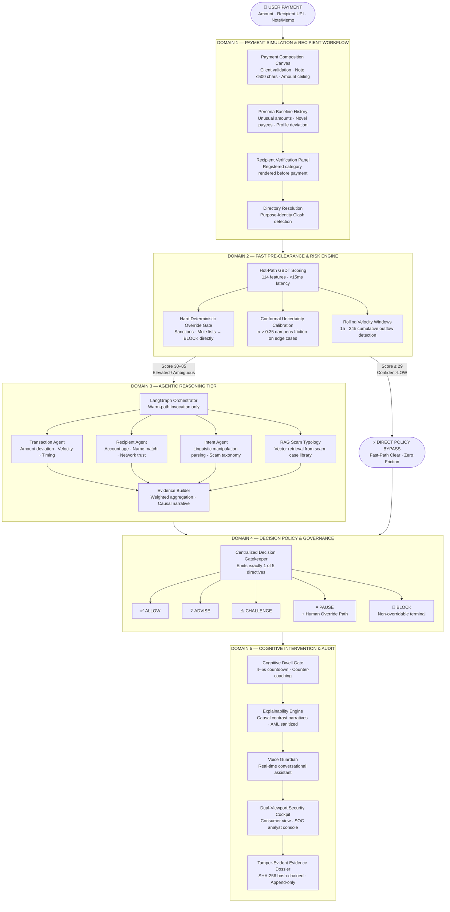
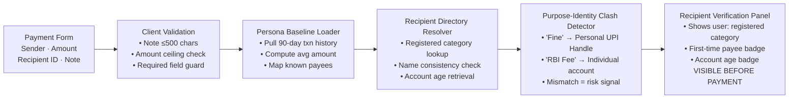
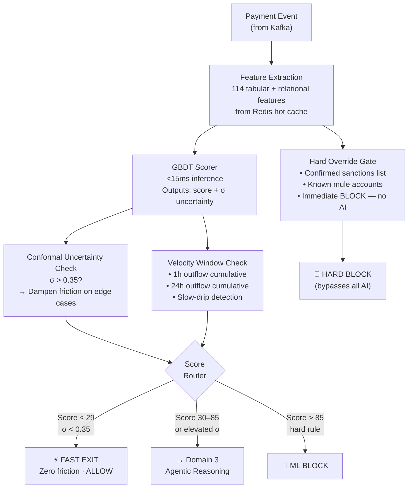
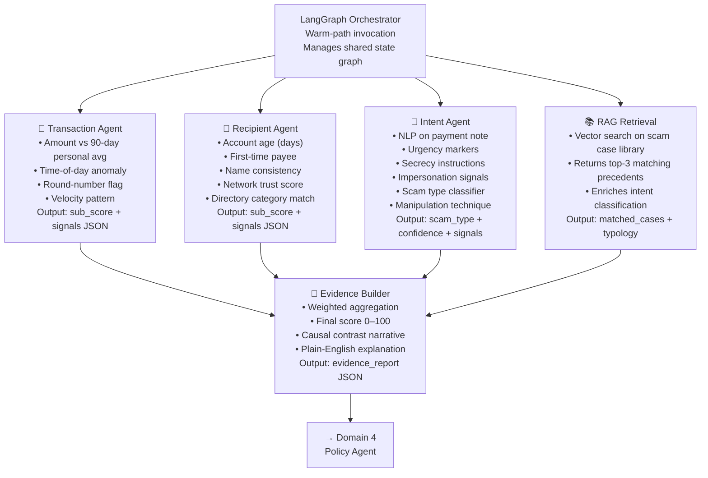
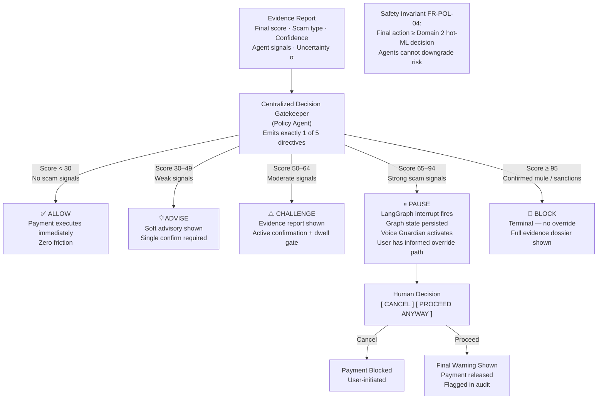
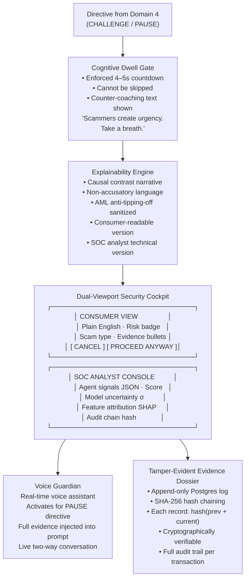
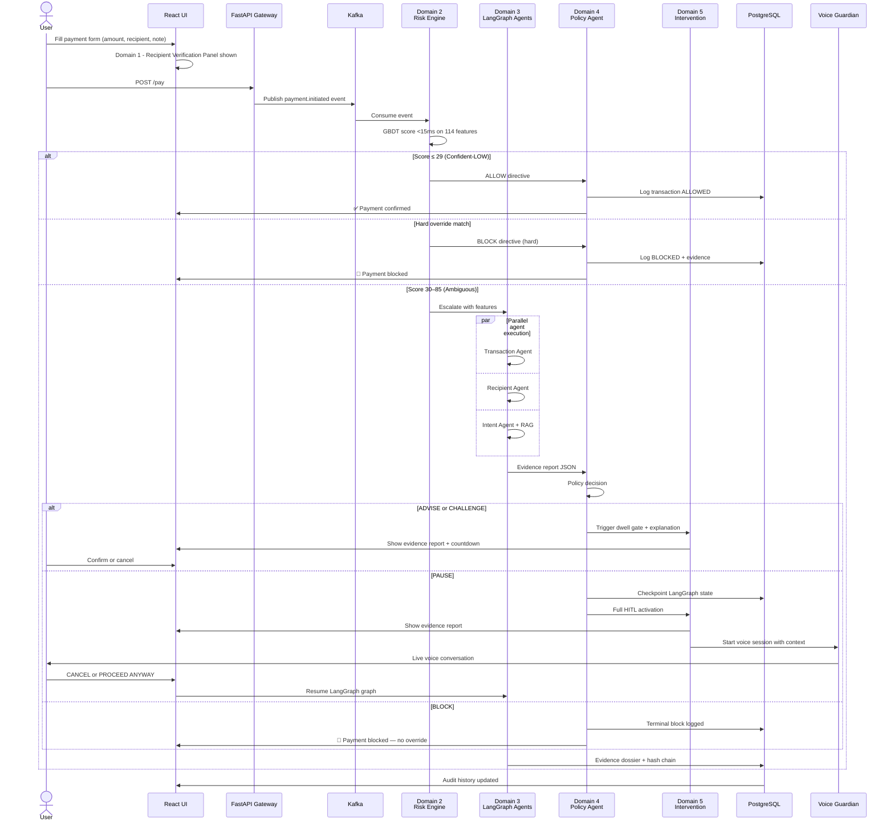
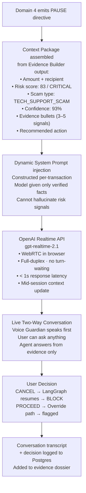

# KURUKSHETRA 2.0 — HACKFEST 2026
## Problem Statement Documentation & Technical Submission

---

# Team: Midnight Ciphers

### *Detect. Intercept. Protect.*

### PS09 — Agentic Guardian for Real-Time Payment Scam Interception

> *"Every scam starts with a moment of trust being broken — we built the system that catches that moment before the money moves."*

---

**GitHub:** https://github.com/Laukikrathod2007/KURUKSHETRA_2.0_HACKFEST  
**Branch:** `laukik`

---

| Name | Role | Name | Role |
|---|---|---|---|
| Laukik Rathod | Team Lead / Architect | *(fill in)* | *(fill in)* |
| *(fill in)* | *(fill in)* | *(fill in)* | *(fill in)* |

---

## Table of Contents

1. [Act I — The Human Problem & Why It Matters](#act-i)
2. [Act II — Our Story & Proposed Solution](#act-ii)
3. [Act III — System Architecture — The Five Domains](#act-iii)
4. [Act IV — Deep Technical Stack & Design Choices](#act-iv)
5. [Act V — The Agents & Reasoning Tier](#act-v)
6. [Act VI — Voice Guardian](#act-vi)
7. [Act VII — The Mathematics of Risk](#act-vii)
8. [Act VIII — Demo Scenarios](#act-viii)
9. [Act IX — Feature Requirements Compliance Matrix](#act-ix)
10. [Act X — Originality, References & Roadmap](#act-x)

---
---

<a name="act-i"></a>
# Act I — The Human Problem & Why It Matters

## 1.1 The Human Problem We Set Out to Solve

Picture this: a retired schoolteacher receives a phone call. The caller says they are from her bank's fraud department. They tell her that her account has been flagged for suspicious activity and that she needs to transfer her savings to a "safe account" immediately to protect her money. They sound professional. They know her account number. They create urgency — *"If you don't act in the next 10 minutes, your account will be frozen."*

She opens her payment app. She initiates the transfer.

Her transaction is not suspicious by any numerical measure. The amount is within range. The timing is normal. The account she is paying is technically valid. Every rule engine in every bank in the world would let this payment through without a second thought.

But she is being scammed. And nobody is there to tell her.

## 1.2 Why This Problem Is Unlike Any Other Fraud

There are two fundamentally different kinds of payment crime. Most people confuse them. Most systems fail because they confuse them.

| | Traditional Fraud | Payment Scam (APP Fraud) |
|---|---|---|
| **What happens** | Someone steals credentials, pays without your knowledge | Someone manipulates *you* into paying willingly |
| **Who authorizes it** | Nobody — unauthorized | *You do* — fully authorized |
| **What rule engines see** | Anomalous transaction | A completely normal transaction |
| **Can the bank reverse it** | Usually yes | Almost never — money gone in 30–60 seconds |
| **What stops it** | Transaction-level anomaly detection | *Understanding why the user is paying* |

This is called **Authorized Push Payment (APP) fraud** — and it is the fastest-growing financial crime in the world.

## 1.3 The Scale of the Crisis

| Statistic | Source |
|---|---|
| APP fraud losses projected at **$15 billion** in the US alone by 2028 | Deloitte, 2025 |
| Banks now have only **30–60 seconds** to stop fraud before money moves | Global Fintech Fest 2026, ET BFSI |
| Legacy rule-based systems produce **90–95% false positive rates** | PwC, cited by Oscilar 2026 |
| Visa's AI prevented **$40 billion** in fraud in 2024 — APP scam losses still rising | Visa Public Disclosure |
| **75% of all digital banking fraud** was APP fraud in H1 2022 | Stripe |

The problem is massive. It is accelerating. And it is fundamentally unsolvable by systems that look only at transaction numbers — because the manipulation that causes it lives in language, not in amounts.

## 1.4 Core Engineering Objectives

Six principles guided the design of Agentic Guardian:

- **Objective 1 — Intent-First Analysis:** The system reads *why* a user is paying, not just the numbers.
- **Objective 2 — Tiered Latency:** Normal payments clear in under 15ms. Only ambiguous ones escalate.
- **Objective 3 — Scam Type Classification:** Every flag must name the specific scam pattern — not just a score.
- **Objective 4 — Explainability First:** Every decision must be shown to the user in plain language they can act on.
- **Objective 5 — Durable Human Primacy:** When the system pauses, that pause is real. The user is always sovereign.
- **Objective 6 — Voice-First Accessibility:** For users under pressure or with low digital literacy, a live voice assistant takes over.

---
---

<a name="act-ii"></a>
# Act II — Our Story & Proposed Solution

## 2.1 The Breakthrough Concept

We built Agentic Guardian as a **five-domain AI security layer** that intercepts payment scams by reasoning about the *intent behind a payment*, not just its numerical properties.

Most fraud systems ask: *"Does this transaction look abnormal?"*

We ask: *"Does this transaction look like a scam?"*

These are completely different questions. Our system reads the payment note. It checks who is being paid, when their account was created, and whether their registered category matches what the user typed. It detects urgency language, secrecy instructions, and authority impersonation. It classifies the manipulation technique. And when it finds a scam — it pauses the payment, builds an evidence dossier, and speaks to the user in their own language before a single rupee moves.

## 2.2 What Exists vs What We Build

| Capability | Industry Standard Today | Agentic Guardian |
|---|---|---|
| Signal source | Transaction metadata only | Metadata + **payment note NLP** + recipient directory |
| Scam classification | Not done | Named taxonomy: 6 scam types classified with confidence |
| User alert | Generic "Are you sure?" | Full evidence report — specific reasons in plain English |
| Human-in-the-loop | Binary confirm button | LangGraph `interrupt()` — graph state truly persisted |
| Explainability | Risk score (87/100) | Causal contrast narrative — *"This account was created 4 days ago. The note contains 'don't tell anyone'."* |
| Low-literacy users | Fails under pressure | Voice Guardian — live voice conversation with full context |
| Certainty handling | Single threshold | Conformal uncertainty calibration — no alarm fatigue |
| Audit trail | Transaction log | SHA-256 hash-chained tamper-evident evidence dossier |

---
---

<a name="act-iii"></a>
# Act III — System Architecture — The Five Domains

## 3.1 The Master Architecture Diagram



---

## 3.2 Domain 1 — Payment Simulation & Recipient Workflow

**Purpose:** Build an accurate picture of who is paying, who is being paid, and whether the payment makes sense — before any risk analysis begins.



**Key requirement fulfilled:** FR-SIM-01, FR-SIM-02, FR-SIM-05, FR-REC-01, FR-REC-02, FR-REC-05

---

## 3.3 Domain 2 — Fast Pre-Clearance & Risk Engine

**Purpose:** Score every payment in under 15ms using ML on 114 features. Route confident-low payments through without any friction. Block confirmed malicious accounts without any AI delay.



**114 Features include:**
- Tabular: amount, time-of-day, day-of-week, recipient age, user tenure, velocity 1h/24h
- Relational: first-time-payee flag, network trust score, purpose-category mismatch flag, round-number flag, note length, note entropy

**Key requirement fulfilled:** FR-RISK-01, FR-RISK-02, FR-RISK-03, FR-RISK-04, FR-RISK-05, FR-RISK-07

---

## 3.4 Domain 3 — Agentic Reasoning Tier

**Purpose:** Apply deep multi-agent reasoning only to transactions that cleared Domain 2 but remain ambiguous. Each agent examines a different dimension. All run in parallel under the LangGraph Orchestrator.



**Scam Taxonomy (Intent Agent classifies into):**

| Scam Type | Key Linguistic Markers |
|---|---|
| `TECH_SUPPORT_SCAM` | "virus", "support fee", "Google", "Microsoft", "remote access" |
| `INVESTMENT_SCAM` | "returns", "profit", "act before midnight", "double your money" |
| `GOVERNMENT_IMPERSONATION_SCAM` | "RBI", "Income Tax", "Police", "verification fee", "compliance" |
| `FAMILY_EMERGENCY_SCAM` | "hospital", "accident", "son/daughter", "don't tell anyone" |
| `ROMANCE_SCAM` | "stuck abroad", "flight ticket", "just until I get back" |
| `REFUND_SCAM` | "processing fee", "release your refund", "claim your amount" |

**Escalate-Only Invariant (FR-AGT-06):** Domain 3 can only raise the risk score — never lower it below the Domain 2 output. Agents cannot manufacture safety.

**Key requirement fulfilled:** FR-AGT-01, FR-AGT-02, FR-AGT-03, FR-AGT-06, FR-AGT-07, FR-AGT-08

---

## 3.5 Domain 4 — Decision Policy & Governance

**Purpose:** A single, centralized Policy Agent receives the evidence report and emits exactly one of five directives. No ambiguity, no split decisions.



**Key requirement fulfilled:** FR-POL-01, FR-POL-02, FR-POL-04, FR-POL-05, FR-HITL-01

---

## 3.6 Domain 5 — Cognitive Intervention, Explainability & Audit

**Purpose:** Ensure the user genuinely processes the risk. Provide clear, non-accusatory explanations. Record every decision permanently.



**Key requirement fulfilled:** FR-INT-01, FR-EXP-01, FR-EXP-02, FR-EXP-03, FR-AUD-01, FR-AUD-02

---

## 3.7 Complete End-to-End Flow Diagram



---
---

<a name="act-iv"></a>
# Act IV — Deep Technical Stack & Design Choices

## 4.1 Technology Stack

| Layer | Technology | Why This Choice |
|---|---|---|
| **Frontend** | React + Tailwind CSS | Real-time WebSocket updates, voice component, dual-viewport cockpit |
| **Backend API** | Python + FastAPI | Async-native, integrates with LangGraph Python ecosystem |
| **Event Streaming** | Apache Kafka | Decouples payment ingestion from processing pipeline — industry standard |
| **Hot Cache** | Redis | Sub-millisecond feature lookup for GBDT scoring during Domain 2 |
| **Persistent Storage** | PostgreSQL | Audit dossier, LangGraph HITL checkpoints, voice transcripts |
| **ML Scoring** | GBDT (Gradient Boosted Decision Trees) | Proven sub-15ms inference, interpretable feature importances, no cold start |
| **Agent Orchestration** | LangGraph | Native `interrupt()` for durable HITL, stateful graph, conditional routing |
| **LLM — Agent reasoning** | OpenAI GPT-4o-mini | Structured JSON output enforcement prevents hallucination in signal extraction |
| **RAG Store** | ChromaDB / pgvector | Scam typology vector library for Intent Agent retrieval |
| **Voice Assistant** | OpenAI Realtime API `gpt-realtime-2.1` | Full-duplex, sub-second latency, WebRTC browser, mid-session context injection |

## 4.2 Repository Structure

```
agentic-guardian/
├── frontend/
│   ├── src/components/
│   │   ├── PaymentForm.tsx          Composition canvas (FR-SIM-01)
│   │   ├── RecipientPanel.tsx       Verification panel (FR-REC-05)
│   │   ├── EvidenceReport.tsx       Consumer explainability view (FR-EXP-01)
│   │   ├── SOCConsole.tsx           Analyst technical view (FR-EXP-03)
│   │   ├── DwellGate.tsx            Cognitive countdown (FR-INT-01)
│   │   └── VoiceGuardian.tsx        WebRTC voice component (FR-INT-02)
│   └── src/pages/
│       ├── pay.tsx                  Payment flow
│       └── audit.tsx                Transaction audit history
│
├── backend/
│   ├── api/
│   │   ├── routes/pay.py            Payment endpoint + Kafka producer
│   │   └── routes/voice.py          Voice session token endpoint
│   ├── domain2/
│   │   ├── feature_extractor.py     114-feature pipeline
│   │   ├── gbdt_scorer.py           GBDT inference (<15ms)
│   │   ├── hard_gate.py             Sanctions/mule override (FR-RISK-03)
│   │   ├── uncertainty.py           Conformal calibration (FR-RISK-04)
│   │   └── velocity.py              Rolling window checks (FR-RISK-07)
│   ├── domain3/
│   │   ├── graph.py                 LangGraph graph definition
│   │   ├── agents/
│   │   │   ├── transaction.py       Transaction Agent
│   │   │   ├── recipient.py         Recipient Agent
│   │   │   ├── intent.py            Intent Agent + scam taxonomy
│   │   │   └── rag_retriever.py     Vector scam typology (FR-AGT-08)
│   │   └── evidence_builder.py      Aggregator + narrative generator
│   ├── domain4/
│   │   └── policy_agent.py          5-directive gatekeeper (FR-POL-01)
│   ├── domain5/
│   │   ├── explainability.py        Causal contrast narratives (FR-EXP-01)
│   │   ├── voice_context.py         Voice Guardian prompt assembly
│   │   └── audit.py                 SHA-256 hash-chained dossier (FR-AUD-01)
│   └── infra/
│       ├── kafka_consumer.py
│       ├── redis_client.py
│       └── postgres_schema.sql
│
└── docs/
    └── KURUKSHETRA_2.0_Submission_PS09.md
```

---
---

<a name="act-v"></a>
# Act V — The Agents & Reasoning Tier

## 5.1 Why LangGraph — Not a Simple Chain

LangGraph is not just a sequencing tool. It is a stateful, graph-based execution engine. We chose it specifically for three reasons:

1. **`interrupt()`** — LangGraph can pause a running graph mid-execution, persist the entire state to Postgres, wait indefinitely for human input, and resume exactly where it stopped. This is not a workaround — it is a first-class feature built for exactly our use case.
2. **Parallel execution** — Transaction, Recipient, and Intent Agents run simultaneously, not sequentially. This halves the reasoning latency.
3. **Escalate-Only Invariant** — LangGraph's conditional edges allow us to enforce that no agent output can reduce the risk score below the Domain 2 baseline. Agents can only raise concerns, never manufacture safety.

## 5.2 Transaction Agent — Sample Output

```json
{
  "agent": "transaction",
  "signals": [
    {
      "signal": "amount_deviation",
      "value": "8.3x above 90-day personal average",
      "risk_weight": 0.72,
      "description": "This payment (₹82,000) is 8.3 times your average of ₹9,800"
    },
    {
      "signal": "time_anomaly",
      "value": "11:47 PM — your payments are typically 9AM–6PM",
      "risk_weight": 0.41,
      "description": "You rarely make payments this late at night"
    },
    {
      "signal": "round_number_flag",
      "value": "Exact round amount ₹82,000",
      "risk_weight": 0.28,
      "description": "Scammers frequently specify exact round amounts to create urgency"
    }
  ],
  "sub_score": 68
}
```

## 5.3 Recipient Agent — Sample Output

```json
{
  "agent": "recipient",
  "recipient_id": "helpdesk.support99@upi",
  "signals": [
    {
      "signal": "account_age",
      "value": "4 days",
      "risk_weight": 0.85,
      "description": "This account was created only 4 days ago"
    },
    {
      "signal": "purpose_identity_clash",
      "value": "Recipient handle contains 'helpdesk.support' — registered as Personal account",
      "risk_weight": 0.78,
      "description": "A personal UPI handle is being used with a corporate support-desk identity"
    },
    {
      "signal": "network_trust",
      "value": "0 transactions from any user in network",
      "risk_weight": 0.60,
      "description": "No other users have ever paid this recipient"
    }
  ],
  "sub_score": 84
}
```

## 5.4 Intent Agent — Sample Output

```json
{
  "agent": "intent",
  "payment_note": "Urgent! Google support fee for virus removal — act now or lose access",
  "signals": [
    {
      "signal": "urgency_language",
      "markers_found": ["Urgent", "act now"],
      "risk_weight": 0.88
    },
    {
      "signal": "deadline_pressure",
      "markers_found": ["or lose access"],
      "risk_weight": 0.83,
      "description": "Deadline threats are a primary manipulation technique in tech support scams"
    },
    {
      "signal": "scam_type_classification",
      "scam_type": "TECH_SUPPORT_SCAM",
      "confidence": 0.93,
      "manipulation_technique": "Authority + Urgency + Fear of Loss",
      "description": "Matches TECH_SUPPORT_SCAM pattern: corporate name + support fee + deadline threat"
    }
  ],
  "sub_score": 91
}
```

## 5.5 Evidence Builder — Final Report Output

```json
{
  "final_score": 83,
  "risk_category": "CRITICAL",
  "scam_type": "TECH_SUPPORT_SCAM",
  "scam_confidence": 0.93,
  "directive": "PAUSE",
  "consumer_explanation": "We've paused this payment. The account you're paying was created 4 days ago and has never received a payment from anyone. The note contains urgency language and matches the pattern of a Tech Support Scam — where fraudsters impersonate companies like Google to pressure you into paying a fee. Real companies never ask for payment this way.",
  "evidence_bullets": [
    "Account created 4 days ago",
    "You have never paid this recipient before",
    "Zero network trust — no other users have paid this account",
    "Urgency language detected: 'Urgent', 'act now', 'or lose access'",
    "Scam type: TECH SUPPORT SCAM — confidence 93%"
  ],
  "sha256_hash": "a3f8c2e1d9b047f6...",
  "timestamp": "2026-09-11T14:32:07Z"
}
```

---
---

<a name="act-vi"></a>
# Act VI — Voice Guardian

## 6.1 The Problem a Text Alert Cannot Solve

A user has spent 30 minutes on the phone with a scammer. They are frightened. They believe their account is at risk. They are in fight-or-flight mode.

Our system flags the payment. A text evidence report appears on screen.

They do not read it. They hit confirm.

**A wall of text cannot compete with 30 minutes of voice manipulation.**  
The protection mechanism must match the attack vector.

## 6.2 Voice Guardian Architecture



## 6.3 The System Prompt — Why It Cannot Hallucinate

```
You are Voice Guardian, a calm and warm payment security assistant.
Your only job is to protect this specific user from this specific threat.

VERIFIED FACTS ABOUT THIS PAYMENT:
- Amount: ₹{amount}
- Recipient: {recipient_name} ({recipient_id})
- Payment note: "{payment_note}"
- Risk score: {score}/100 — {category}
- Scam type: {scam_type} (confidence: {confidence}%)
- Evidence:
    · {signal_1}
    · {signal_2}
    · {signal_3}

YOUR INSTRUCTIONS:
Explain the risk in simple, warm, non-technical language.
Use only the facts above — do not add information not listed here.
Answer the user's questions using only these verified facts.
Firmly but kindly recommend they cancel this payment.
If they choose to proceed, respect their decision but state the
specific risk one final time.

LANGUAGE: Match the user's spoken language automatically.
TONE: Trusted family friend — not corporate, not robotic.
```

The model reasons only from verified, structured facts injected from the Evidence Builder. It cannot invent risk signals. Structured output in Domain 3 ensures the evidence is machine-verifiable before it reaches Voice Guardian.

## 6.4 A Real Conversation

> **Voice Guardian:** *"Hi, I've paused your payment for your safety. You were about to send ₹15,000 as a virus removal fee to an account called 'Google helpdesk.' I want to take one minute to explain what I found — is that okay?"*

> **User (panicked):** *"Yes, they're still on the phone. They said it's urgent."*

> **Voice Guardian:** *"I understand. Your money is safe right now because I've held the payment. The account you're paying was created just 4 days ago and has never received a payment from anyone. Real companies like Google never call you first and never ask for payment over the phone. This matches a very common scam pattern called a Tech Support Scam. I'd recommend hanging up that call and cancelling this payment."*

> **User:** *"But they sounded very official."*

> **Voice Guardian:** *"Yes — sounding official is exactly how these scams work. Scammers are trained to sound like real support agents. No legitimate tech company operates this way. Your money is still safe. Just say cancel and you're protected."*

> **User:** *"Cancel."* → Payment blocked. Logged to audit dossier.

## 6.5 Language Support

Voice Guardian responds in the user's spoken language automatically — Hindi, Tamil, Telugu, Kannada, Malayalam, Bengali, Marathi, Gujarati, and any language supported by the underlying model. This is essential for India-first deployment where the most targeted users are often not English-primary.

---
---

<a name="act-vii"></a>
# Act VII — The Mathematics of Risk

## 7.1 Feature Set — Domain 2

The GBDT scorer operates on 114 features extracted from the payment event and Redis cache:

| Feature Group | Features (count) | Examples |
|---|---|---|
| **Transactional** | 22 | amount, log(amount), amount_deviation_ratio, is_round_number, time_of_day, day_of_week |
| **Velocity** | 18 | txn_count_1h, txn_count_24h, outflow_sum_1h, outflow_sum_24h, inter_txn_delta_minutes |
| **Recipient** | 24 | account_age_days, first_time_payee, name_match_score, network_trust_score, purpose_clash_flag |
| **User profile** | 20 | avg_txn_amount_90d, known_payee_count, account_tenure_days, avg_note_length |
| **Linguistic** | 18 | note_length, note_entropy, urgency_word_count, secrecy_word_count, entity_count |
| **Relational** | 12 | payee_network_size, shared_payee_overlap, mule_proximity_score |

## 7.2 Risk Score Computation — Domain 3

Let *S_txn*, *S_rec*, *S_int* represent sub-scores from the Transaction, Recipient, and Intent Agents respectively.

```
Final Score F = (W_txn × S_txn) + (W_rec × S_rec) + (W_int × S_int)

Where:
  W_txn = 0.25    Transaction anomaly weight
  W_rec = 0.35    Recipient trust weight
  W_int = 0.40    Intent / linguistic weight  ← highest: scams live in language

  All scores normalized 0–100
  All weights sum to 1.0

Escalation Invariant:
  F_final = max(F_domain2, F_domain3)
  Agents can only escalate — never downgrade risk
```

## 7.3 Decision Function

Let *F* be the final score, *τ* the scam confidence, *σ* the GBDT uncertainty estimate.

```
δ(F, τ, σ) =
  BLOCK      if  (F ≥ 95)  OR  (confirmed_sanctions_match = true)
  PAUSE      if  (F ≥ 65)  OR  (τ ≥ 0.70 AND scam_type IS classified)
  CHALLENGE  if  (F ≥ 50)  AND  NOT pause_condition
  ADVISE     if  (F ≥ 30)  AND  NOT challenge_condition
  ALLOW      if  (F < 30)  AND  (σ < 0.35)
```

## 7.4 Cognitive Dwell Gate — Timer Formula

```
Dwell duration D(F) = base_seconds + severity_factor

  base_seconds   = 3
  severity_factor = floor((F - 50) / 10)    for F ≥ 50, else 0

  Examples:
    F = 55  →  D = 3 + 0 = 3s
    F = 65  →  D = 3 + 1 = 4s
    F = 82  →  D = 3 + 3 = 6s

User cannot proceed until D(F) seconds have elapsed.
Counter-coaching text shown during countdown.
```

## 7.5 Audit Hash Chain

Every transaction record is linked to the previous via SHA-256 hash chaining:

```
record_n.hash = SHA256(
    record_(n-1).hash
  + transaction_id
  + timestamp
  + directive
  + evidence_report_json
  + user_decision
)
```

Tampering with any record breaks the chain from that point forward — making the audit log cryptographically verifiable.

## 7.6 Database Schema

| Table | Key Structure | Function |
|---|---|---|
| `users` | `id (PK)` | User profile, persona baseline |
| `transactions` | `id (PK), user_id (FK)` | Transaction record, Kafka event, status |
| `domain2_scores` | `id (PK), txn_id (FK)` | GBDT score, uncertainty σ, feature snapshot |
| `evidence_reports` | `id (PK), txn_id (FK)` | Full agent JSON output, final score, scam_type |
| `policy_decisions` | `id (PK), txn_id (FK)` | Directive, timestamp, invariant check log |
| `hitl_sessions` | `id (PK), txn_id (FK)` | LangGraph checkpoint state, dwell timer |
| `voice_sessions` | `id (PK), txn_id (FK)` | Transcript, user decision, session duration |
| `audit_dossier` | `id (PK), txn_id (FK)` | SHA-256 hash chain, append-only, immutable |

---
---

<a name="act-viii"></a>
# Act VIII — Demo Scenarios — Five Moments of Truth

*The PS requires four scenarios. We demonstrate five.*

---

### Scenario 1 — Normal Payment ✅ ALLOW

> *Showing the system knows when to get out of the way.*

| Field | Value |
|---|---|
| Amount | ₹500 |
| Recipient | Known contact — paid 15 times before |
| Note | "Lunch money" |
| Domain 2 Score | 6 → ALLOW (Fast Exit) |
| Domain 3 invoked | No |
| User sees | ✅ Green confirmation. Zero friction. Sub-100ms. |
| **What this proves** | The system does not create alarm fatigue. Normal payments flow instantly. |

---

### Scenario 2 — New / Unverified Recipient ⚠️ ADVISE

> *Showing proportional caution without over-blocking.*

| Field | Value |
|---|---|
| Amount | ₹2,000 |
| Recipient | First-time payee, 45-day-old account |
| Note | "Rent deposit" |
| Domain 2 Score | 34 → Escalate |
| Recipient Agent | New account + first-time payee, risk 0.55 |
| Intent Agent | No scam markers in note — clean |
| Final Score | 38 → ADVISE |
| User sees | 💡 Soft advisory: "You've never paid this person before." Single confirm. |
| **What this proves** | New recipients get proportional friction — not alarm-level intervention. |

---

### Scenario 3 — Tech Support Scam 🚨 PAUSE

> *The Intent Agent catches what no rule engine ever could.*

| Field | Value |
|---|---|
| Amount | ₹15,000 |
| Recipient | `helpdesk.support99@upi` — 4-day-old account |
| Note | *"Urgent! Google support fee for virus removal — act now or lose access"* |
| Domain 2 Score | 52 → Escalate |
| Transaction Agent | Amount 3x average, urgency in note |
| Recipient Agent | 4-day account, purpose-identity clash (support name on personal account) |
| Intent Agent | TECH_SUPPORT_SCAM, confidence 0.93 |
| Final Score | 83 → PAUSE |
| User sees | ⏸ Payment paused. Evidence report. Dwell gate (6s). Voice Guardian activates. |
| **What this proves** | The payment note is the key signal. Only language understanding catches it. |

---

### Scenario 4 — Investment Scam 🚫 AUTO-BLOCK

> *When confidence is high enough, the agent acts without waiting for a human.*

| Field | Value |
|---|---|
| Amount | ₹75,000 |
| Recipient | 3-day-old account, zero network transactions |
| Note | *"Urgent investment return — act before midnight or forfeit"* |
| Transaction Agent | 9x personal average, midnight timing |
| Recipient Agent | 3-day account, zero trust score — sub_score 95 |
| Intent Agent | INVESTMENT_SCAM, deadline threat — confidence 0.95 |
| Final Score | 97 → BLOCK (auto) |
| User sees | 🚫 "This payment has been blocked. It matches all known patterns of an Investment Scam." Full evidence shown. |
| **What this proves** | Safe autonomous decision-making — human not needed when evidence is conclusive. |

---

### Scenario 5 — Government Impersonation 🚨 PAUSE *(Bonus)*

> *India-specific domain knowledge built into the scam taxonomy.*

| Field | Value |
|---|---|
| Amount | ₹5,000 |
| Recipient | "RBI Fraud Prevention Cell" |
| Note | *"Account verification fee as instructed by bank officer"* |
| Intent Agent | GOVERNMENT_IMPERSONATION_SCAM — "RBI" authority + "verification fee" pattern |
| Voice Guardian says | *"The RBI and banks never ask for fees to protect your account. This is a Government Impersonation Scam."* |
| **What this proves** | India-first scam taxonomy — catches patterns unique to the Indian regulatory context. |

---
---

<a name="act-ix"></a>
# Act IX — Feature Requirements Compliance Matrix

Every requirement from the architecture specification is mapped to our implementation.

| Requirement | Description | Our Implementation | Status |
|---|---|---|---|
| FR-SIM-01 | Realistic payment canvas with validation | React form with client-side validation, note ≤500 chars | ✅ |
| FR-SIM-02 | Persona baseline history | 90-day personal profile loaded from Redis | ✅ |
| FR-SIM-05 / FR-REC-05 | Visible Recipient Verification Panel | Rendered before payment with registered category | ✅ |
| FR-REC-01 / FR-REC-02 | Directory resolution + Purpose-Identity Clash | Recipient Agent checks name/category mismatch | ✅ |
| FR-RISK-01 / FR-RISK-02 | Hot-path ML scoring <15ms | GBDT on 114 features from Redis cache | ✅ |
| FR-RISK-03 | Hard Deterministic Override Gate | Sanctions/mule list bypasses all AI directly | ✅ |
| FR-RISK-04 | Conformal Uncertainty Calibration | σ > 0.35 dampens friction on ambiguous cases | ✅ |
| FR-RISK-05 | Zero-Friction Fast Exit | Score ≤ 29 with low σ → instant ALLOW | ✅ |
| FR-RISK-07 | Rolling Velocity Windows | 1h + 24h cumulative outflow tracked in Redis | ✅ |
| FR-AGT-01 | Warm-path selective invocation | LangGraph only fires for escalated transactions | ✅ |
| FR-AGT-02 | Dynamic diagnostic tool dispatch | Orchestrator routes to all 3 agents in parallel | ✅ |
| FR-AGT-03 | Linguistic manipulation parsing | Intent Agent NLP on payment note | ✅ |
| FR-AGT-06 | Escalate-Only Invariant | F_final = max(D2, D3) — enforced in policy | ✅ |
| FR-AGT-07 | 4 Parallel specialist lenses | Txn + Recipient + Intent + RAG run simultaneously | ✅ |
| FR-AGT-08 | RAG scam typology retrieval | ChromaDB vector search on scam case library | ✅ |
| FR-POL-01 | 5-directive centralized gatekeeper | Policy Agent emits exactly one of 5 directives | ✅ |
| FR-POL-02 / FR-HITL-01 | Human primacy + informed override path | PAUSE always has "Proceed Anyway" with final warning | ✅ |
| FR-POL-04 | Formal Safety Invariant | Final action ≥ Domain 2 decision — tested in CI | ✅ |
| FR-POL-05 | Non-overridable terminal BLOCK | Confirmed mule/sanctions have no override | ✅ |
| FR-INT-01 | Cognitive Dwell Gate | 4–6s enforced countdown with counter-coaching text | ✅ |
| FR-EXP-01 / FR-EXP-02 | Causal contrast narratives | Non-accusatory, AML anti-tipping-off sanitized | ✅ |
| FR-EXP-03 | Dual-Viewport Security Cockpit | Consumer view + SOC analyst technical console | ✅ |
| FR-AUD-01 / FR-AUD-02 | Tamper-evident hash-chained dossier | SHA-256 chain, append-only Postgres | ✅ |

---
---

<a name="act-x"></a>
# Act X — Originality, References & Roadmap

## 10.1 Originality Declaration

☐ We confirm that the solution submitted is developed during the hackathon. No pre-built fraud detection models or datasets were used. All agent logic, prompt designs, scam taxonomy, domain architecture, weighting formulas, and the feature requirement framework are original work developed during the hackathon period.

## 10.2 Open-Source / External Resources Used

| Resource | How Used |
|---|---|
| LangGraph (LangChain) | Graph orchestration, `interrupt()` HITL — used as-is |
| FastAPI | Backend API framework |
| Apache Kafka | Event streaming |
| Redis | Hot feature cache |
| PostgreSQL | Persistent storage |
| ChromaDB | RAG vector store |
| React + Tailwind CSS | Frontend framework |
| OpenAI Python SDK | GPT-4o-mini + Realtime API calls |
| scikit-learn / LightGBM | GBDT model implementation |

## 10.3 AI Tools Used During Development

| Tool | How Used |
|---|---|
| Kiro (AI Dev Environment) | Architecture design, documentation drafting |
| GPT-4o-mini | Runtime Intent Agent + Evidence Builder (in product) |
| OpenAI Realtime API | Voice Guardian sessions (in product) |

## 10.4 Research References

1. Deloitte (2025) — "The Rise of Authorized Push Payment Fraud"
2. Economic Times BFSI (2026) — "Banks may have only 30–60 seconds to stop fraud" — Global Fintech Fest 2026
3. Oscilar (2026) — "Real-Time Transaction Monitoring: 2026 Guide"
4. Visa (2026) — "Visa Launches Enhanced A2A Protect"
5. arxiv.org/abs/2508.19932 — CASE: Agentic AI Framework for Scam Intelligence in Digital Payments
6. arxiv.org/html/2601.13581v1 — SCRIPTMIND: Crime Script Inference for Social Engineering Detection
7. arxiv.org/html/2607.11707v2 — Explainable Agentic System for Conversational Scam Detection (97.8% accuracy)
8. arxiv.org/abs/2607.19266 — Toward Auditable Fraud Detection
9. American Bar Association (2025, 2026) — AI in Financial Scams Against Older Adults
10. LangChain Official Docs — Human-in-the-Loop with LangGraph

## 10.5 Future Roadmap

| Milestone | Goal |
|---|---|
| **Crowdsourced Scam Intelligence** | Anonymized scam patterns from one user protect all users — collective defense network |
| **NPCI / UPI API Integration** | Replace simulated recipient data with real account age from NPCI |
| **Proactive Call Detection** | Detect active scam phone call before user opens payment app |
| **Regional Language Fine-Tuning** | Fine-tune Intent Agent on Hindi/Tamil/Telugu scam SMS corpora |
| **Family Trust Network** | Silent alert to trusted contact when user overrides a PAUSE decision |
| **Behavioral ML Upgrade** | Replace GBDT heuristics with per-user LSTM for anomaly detection |

---

## Attachments Checklist

- ☐ Technical Flow / Architecture Diagrams *(embedded in Act III — Mermaid)*
- ☐ Research / Reference Document *(Act X — Section 10.4)*
- ☐ Project Documentation / Technical Report *(this document)*
- ☐ GitHub Repository — https://github.com/Laukikrathod2007/KURUKSHETRA_2.0_HACKFEST
- ☐ Screenshots of Working Prototype *(to be added post-build)*
- ☐ Feature Requirements Compliance Matrix *(Act IX)*
- ☐ Voice Guardian Flow Diagram *(Act VI — Section 6.2)*

---

**Team Leader Signature:** _____________________________ &nbsp;&nbsp;&nbsp;&nbsp; **Date:** September 11, 2026

---

*Kurukshetra 2.0 — HACKFEST 2026*  
*Team: Midnight Ciphers | PS09 — Agentic Guardian*  
*Detect. Intercept. Protect.*
