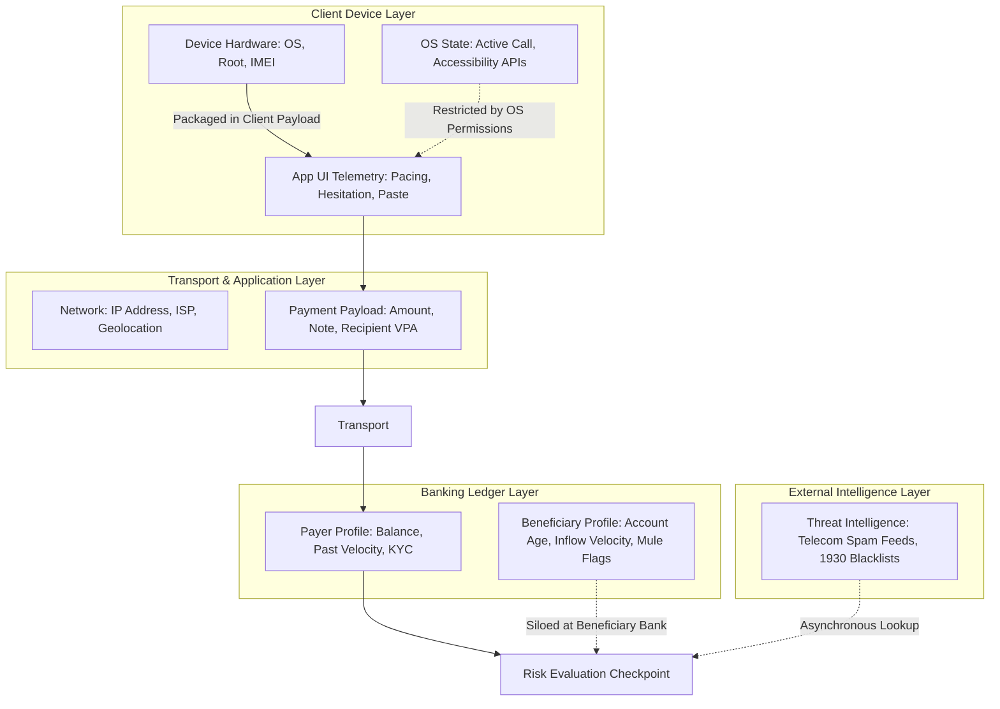

# Data & Information Fundamentals: Telemetry, Signals & Observable Context

---

## 1. Executive Understanding (Layer 1)

A digital payment transaction is more than an exchange of monetary numbers; it is accompanied by an extensive, multi-dimensional **telemetry envelope**. This envelope comprises hardware metadata, network transmission parameters, behavioral interaction traces, historical ledger baselines, and counterparty graph relationships.

However, in real-world banking ecosystems, **no single system node possesses access to this entire envelope**. Telemetry is deeply fragmented across decoupled architectural layers: the mobile operating system sees hardware and running apps; the payment application sees user interface interaction; the remitter bank sees balance and account history; the central payment switch sees interbank routing; and the beneficiary bank sees recipient account age and cash-out patterns.

For real-time scam interception, understanding this data landscape is essential. System accuracy depends not merely on sophisticated reasoning algorithms, but on the **observational fidelity** of the signals available at the decision checkpoint.

---

## 2. The Multi-Tiered Data Landscape (Layer 2)

---

## 3. Comprehensive Analysis of Data Categories (Layer 3)

The following taxonomy outlines the core data categories generated across a payment lifecycle:

| Data Category | What It Represents | Source / Origin | Generation Moment | Sensitivity Level | Access & Legal Limitations |
| :--- | :--- | :--- | :--- | :--- | :--- |
| **Transaction Information** | Core payload: Amount, Currency, Timestamp, Payment Remarks/Notes, Channel (P2P/P2M). | Payment Application UI. | At transaction formulation. | **High** (Financial Data) | Fully available in transit payload; notes may be unstructured text or emojis. |
| **Account Information** | Payer balance, historical turnover, KYC tier, account opening date, account status. | Remitter Bank Core Banking System. | Stored at rest in bank DB. | **Critical** (Bank Secret) | Strictly restricted to the account-holding bank; cannot be broadcast across networks. |
| **Beneficiary Information** | Recipient identifier (VPA, IBAN, Account), registered legal name, receiving bank IFSC/BIC. | Central Address Directory / Payee Bank. | Resolved during address entry. | **Moderate to High** | Payer sees resolved name; payer bank typically does not see account tenure or mule flags. |
| **Device Information** | Hardware model, OS version, root/jailbreak status, emulator flags, unique device hash. | Mobile OS via native SDKs. | At application launch and API calls. | **High** (PII / Hardware ID) | Mobile OS privacy rules (e.g., Apple IDFA/IDFV restrictions; Android MAC address masking). |
| **Authentication Telemetry**| MPIN validity, cryptographic signature, biometric match score, 2FA challenge status. | Secure Enclave / Bank HSM. | At moment of credential submission. | **Maximum** (Crypto Secrets) | Raw PIN never exposed; system only receives a binary `Success / Failure` or cryptogram. |
| **Behavioral Biometrics** | Keystroke dynamics, typing cadence, screen touch pressure, hesitation duration, clipboard copy-paste. | Client App UI event listeners. | Throughout the in-app user session. | **Moderate** (User Behavior) | Requires explicit client instrumentation; computational overhead on low-end smartphones. |
| **Operating System State** | Whether a phone call is active, whether remote screen-sharing tools (AnyDesk) are executing. | Mobile OS Telephony / Accessibility APIs. | Real-time during app use. | **Critical** (Privacy Intrusion)| Modern Android/iOS strictly restrict background call logging and screen surveillance without explicit user permissions. |
| **Network & Geolocation** | IP address, Autonomous System Number (ASN), proxy/VPN detection, GPS coordinates, cell tower ID. | Client network socket & OS Location Services. | At HTTP request transmission. | **Moderate to High** | GPS requires active user permission; IP geolocation is coarse and easily spoofed by local proxies. |
| **Interbank Graph Telemetry**| Previous transaction frequency between payer and payee; shared phone number clusters. | Interbank risk databases / Switch archives. | Looked up via historical index. | **High** (Commercial Secret) | Highly siloed; banks rarely share interbank graph data in real time due to competition and antitrust laws. |
| **Threat Intelligence** | Known scam phone numbers, blacklisted VPAs, reported mule accounts from police databases. | External registries (e.g., Indian I4C, UK CIFAS). | Polled via API or cached locally. | **Moderate** | Data freshness latency; high risk of false positives if blacklists are not pruned dynamically. |

---

## 4. Operational & Information Asymmetry Realities (Layer 3)

### 4.1 The Locus-to-Data Mismatch
A critical finding in payment domain research is that **the entity with the highest intervention power often has the lowest situational context**:
*   *The Mobile App* has the richest real-time behavioral data (sees the user hesitating, sees a phone call active) but has **zero regulatory authority** to legally freeze accounts and zero visibility into the beneficiary's history.
*   *The Remitter Bank* has the legal power to decline the transaction, but its server-side risk engine only sees sterile transaction attributes (Payer ID, Payee VPA, Amount) and knows nothing about the user’s real-world environment.
*   *The Beneficiary Bank* has the decisive data (knows the receiving account is a 3-day-old mule), but receives the transaction only at the very end of the clearing chain when settlement is already underway.

---

## 5. Boundaries and Exceptions (Layer 4)

### 5.1 Privacy vs. Security Tradeoffs
*   Attempts to extract deep client-side telemetry (such as inspecting SMS inboxes, reading WhatsApp chat text, or recording microphone audio) violate basic mobile OS developer policies (Google Play Developer Distribution Agreement, Apple App Store Guidelines) and trigger immediate app bans.
*   Under modern privacy legislation (e.g., EU GDPR, India DPDP Act 2023), processing behavioral biometrics or device telemetry requires **explicit purpose specification, user consent, and strict data minimization**. A fraud prevention exemption exists in many laws, but it does not permit unchecked client surveillance.

### 5.2 Common Misconceptions
*   *Misconception*: "The bank knows the GPS location of every UPI payment."
    *   *Reality*: In standard UPI, GPS coordinates are optional metadata. Most transactions transmit only IP addresses and cell network parameters, which provide city-level or regional accuracy at best.
*   *Misconception*: "The payment payload contains the complete chat history with the scammer."
    *   *Reality*: Payment protocols carry only the payment message. They contain zero information regarding external communications occurring on WhatsApp, Telegram, or cellular phone calls.

---

## 6. Traceability & Authoritative Sources

*   **ISO 20022**: *Universal financial industry message scheme: Business Application Header and Payments Clearing and Settlement Message Standards*.
*   **Android Open Source Project (AOSP)**: *Security and Privacy Architecture: Privacy Changes in Android 13/14 regarding Accessibility and Telephony APIs*.
*   **Apple Developer Documentation**: *App Privacy Details and Device Fingerprinting Declarations*.
*   **European Data Protection Board (EDPB)**: *Guidelines 02/2021 on the Processing of Personal Data under the Payment Services Directive (PSD2)*.
*   **National Payments Corporation of India (NPCI)**: *UPI Message Specification (UMS) Interface Control Document*.
