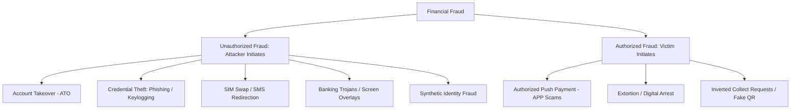
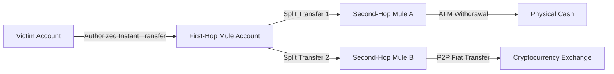

# Fraud Fundamentals in Digital Payment Systems

---

## 1. Executive Understanding (Layer 1)

In financial systems, **fraud** is broadly defined as any intentional act of deception, misrepresentation, or concealment perpetrated by an individual or organization to secure an unlawful financial gain or cause an unlawful loss to another party. 

Within electronic banking, **payment fraud** specifically denotes illicit transactions executed to siphon monetary value from accounts, lines of credit, or payment instruments. Traditionally, the overwhelming majority of payment fraud has been categorized as **unauthorized fraud**—situations where an adversary gains illicit access to a victim's account credentials, payment instruments, or authentication tokens and executes transfers without the knowledge, consent, or physical agency of the legitimate account holder.

For researchers working on real-time scam interception, understanding fraud fundamentals is critical because modern bank risk engines, regulatory liability statutes, and security controls were designed almost entirely to solve *unauthorized fraud*. When confronted with *scams* (authorized fraud), these traditional fraud defenses fail systematically because their foundational assumptions do not apply.

---

## 2. Taxonomy of Payment Fraud (Layer 2)



### 2.1 Core Typologies Defined

| Fraud Category | Primary Perpetrator Action | Victim Knowledge at Transaction Time | Primary Exploited Vulnerability |
| :--- | :--- | :--- | :--- |
| **Account Takeover (ATO)** | Adversary logs into account using stolen/compromised credentials; changes recovery phone/email; initiates transfers. | **Zero Knowledge** (Victim is offline or unaware). | Weak passwords, reused credentials, lack of behavioral biometric detection. |
| **SIM Swap Fraud** | Adversary tricks telco carrier into reassigning victim's phone number to a new SIM card to intercept 2FA SMS OTPs. | **Zero Knowledge** (Victim experiences sudden loss of cell service). | Telco carrier customer service social engineering; reliance on insecure SMS 2FA. |
| **Banking Trojan / Malware** | Malware on mobile device detects payment app launch, injects transparent overlay, logs keystrokes, or silently triggers transfers via Accessibility APIs. | **Partial / Zero Knowledge** (Victim's device is technically compromised). | Mobile OS permission vulnerabilities, malicious APK sideloading. |
| **Synthetic Identity Fraud** | Adversary creates a fictitious identity combining real (stolen SSN/Aadhaar) and fabricated information to open fraudulent bank accounts. | **Zero Knowledge** (Victim whose data was stolen is not the transactor). | Credit bureau data gaps, identity verification loopholes during e-KYC onboarding. |
| **Card-Not-Present (CNP) Fraud**| Adversary uses stolen credit/debit card numbers and CVVs to purchase goods on e-commerce gateways. | **Zero Knowledge** (Discovered later via bank statements). | Insecure merchant storage, merchant lack of 3D Secure / MFA enforcement. |

---

## 3. Mechanisms of Traditional Fraud Defense (Layer 3)

Because unauthorized fraud relies on an unauthorized party accessing the account, traditional fraud detection systems (FDS) look for **discontinuities in identity, location, and device signature**:

```
+-----------------------------------------------------------------------------------------------+
| Traditional Fraud Detection System (FDS) Evaluation Vector                                    |
|                                                                                               |
| Signal Category          Legitimate Pattern                     ATO / Unauthorized Pattern    |
| -----------------------  -------------------------------------  ----------------------------- |
| Device Fingerprint       Known iPhone 14 (IMEI, IDFV cached)    New unbranded Android emulator|
| IP & Geolocation         Home Wi-Fi (Bangalore, India)          Datacenter VPN (Frankfurt, DE)|
| Keystroke Biometrics     Standard typing speed & cadence        Instant clipboard paste / bot |
| App Navigation           Browses recents, checks balance first  Direct navigation to transfer |
| Authentication           FaceID or known biometric hash         Password reset attempt + OTP  |
|                                                                                               |
| Result: FDS FLAGS HIGH RISK -> Blocks transaction, challenges with step-up auth, or locks ATO.|
+-----------------------------------------------------------------------------------------------+
```

### 3.1 Why Traditional FDS Fails Against Scams
When an Authorized Push Payment (APP) scam occurs:
1.  **Device Signature**: 100% Legitimate (the victim's everyday personal smartphone).
2.  **Geolocation**: 100% Legitimate (victim is sitting in their living room or office).
3.  **Authentication**: 100% Legitimate (victim manually inputs their authentic MPIN, hardware token, or biometric).
4.  **Network Connection**: 100% Legitimate (victim's regular cellular data or home Wi-Fi).

To a traditional fraud detection engine, a $10,000 scam payment looks identical to a legitimate high-value personal transfer. The attacker does not hack the software or the server; **the attacker hacks the human operator**.

---

## 4. Fraudulent Beneficiaries & The Mule Layer (Layer 3)

No payment fraud can succeed without an **off-ramp**—a destination where stolen electronic funds can be received and converted into untraceable assets.



*   **Mule Account Definition**: An account at a financial institution operated (wittingly or unwittingly) to receive illicit funds and rapidly move them elsewhere to obscure the audit trail.
*   **The Velocity Gap**: Scammers typically program bot-driven mule networks to disperse incoming funds within **90 to 180 seconds** of receipt. This means that even if a victim realizes they have been scammed 10 minutes after authorization, the funds have already been layered across 3 banking tiers and withdrawn as physical cash or converted into non-custodial crypto assets.

---

## 5. Boundaries and Exceptions (Layer 4)

### 5.1 What Constitutes "Fraud" Legally vs. Operationally
*   *Legal Distinction*: Under criminal law (e.g., Indian Penal Code Sections 415/420, UK Fraud Act 2006), fraud requires proof of mens rea (criminal intent) and deceitful inducement.
*   *Banking Operational Distinction*: In bank accounting, "fraud loss" is strictly partitioned by liability rules:
    *   If unauthorized (e.g., skimming, hacking), the bank absorbs the loss under zero-liability mandates.
    *   If authorized by the customer (scam), banks traditionally classify it as customer negligence, shifting the loss entirely to the consumer unless specific statutory mandates (such as the UK PSR mandate) intervene.

### 5.2 Common Misconceptions
*   *Misconception*: "Scams are just a sub-type of identity theft."
    *   *Reality*: In a scam, the victim's identity is never stolen. The victim acts under their own true legal identity. It is the *scammer* whose identity is concealed or fabricated.
*   *Misconception*: "Strong Customer Authentication (SCA) eliminates payment fraud."
    *   *Reality*: SCA (mandating passwords, OTPs, or biometrics) virtually eliminates simple unauthorized credential stuffing, but it does nothing to prevent scams, because the customer willingly supplies the second factor.

---

## 6. Traceability & Authoritative Sources

*   **Federal Reserve System**: *FraudClassifier Model: A categorical framework for classifying payment fraud* (2020).
*   **European Banking Authority (EBA)**: *Guidelines on the reporting of fraud data under PSD2 (EBA/GL/2018/05)*.
*   **Reserve Bank of India (RBI)**: *Circular on Limiting Liability of Customers in Unauthorised Electronic Banking Transactions (DBR.No.Leg.BC.78/09.07.005/2017-18)*.
*   **UK Finance**: *Annual Fraud Report 2024: The Definitive Overview of Payment Industry Fraud*.
*   **Interpol**: *Global Financial Fraud Assessment 2024*.
