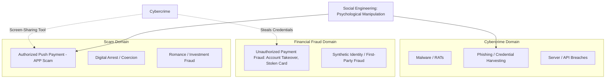

# Conceptual Demarcation: Fraud vs. Scam vs. Cybersecurity Incident

---

## 1. Executive Understanding (Layer 1)

In popular media and loose industry discussions, the terms **"fraud"**, **"scam"**, **"hack"**, and **"cybercrime"** are often used interchangeably to describe any situation where money is lost electronically. In domain engineering and regulatory compliance, however, these concepts represent fundamentally distinct operational mechanisms with differing threat actors, attack vectors, technical signatures, legal liabilities, and defensive postures.

Confusing these concepts leads directly to engineering failure. Designing an AI system to stop "payment fraud" typically results in building device-fingerprinting, IP-reputation, and bot-detection models. While highly effective against **unauthorized cyber intrusions**, such models are entirely blind to **authorized payment scams**, where the legitimate user executes the payment from their authentic device.

This document establishes the precise boundaries, overlaps, and distinctions separating financial fraud, scams, and cybersecurity incidents.

---

## 2. The Overlap and Boundary Model (Layer 2)



---

## 3. Comprehensive Comparison Matrix (Layer 3)

The following table provides the formal reference taxonomy for the project:

| Dimension | Cybersecurity Incident | Unauthorized Payment Fraud | Authorized Payment Scam |
| :--- | :--- | :--- | :--- |
| **Primary Target** | Computer systems, network infrastructure, software protocols, authentication tokens. | Account ledger balance via compromised access credentials. | The cognitive decision-making faculty and emotional state of the human user. |
| **Who Initiates Transaction?** | Malicious actor, automated script, or bot via stolen session. | Attacker, criminal syndicate, or credential purchaser. | **The legitimate, authorized account holder.** |
| **Device Used** | Adversary’s hardware, proxy server, cloud emulator, or headless browser. | Stolen or spoofed device, remote emulator, or SIM-swapped device. | **The victim’s authentic, everyday smartphone or PC.** |
| **Authentication Result** | Stolen credentials, forged tokens, or bypassed authentication. | Stolen password, intercepted SMS OTP, or brute-forced PIN. | **Valid, authentic credentials correctly entered by the legitimate user.** |
| **Exploited Flaw** | Software vulnerability, zero-day bug, weak cipher, misconfiguration. | Broken access control, credential reuse, lack of multi-factor authentication. | **Human cognitive biases: Fear, authority, urgency, affection, greed.** |
| **Technical Signature** | Network anomaly, unrecognized IP, foreign device hash, rapid API calls. | Geolocation mismatch, velocity spike, new device binding alert. | **Completely normal technical signature; indistinguishable from regular user activity.** |
| **Traditional Banking Response** | Perimeter firewall, WAF, endpoint detection & response (EDR). | Fraud Detection System (FDS), device fingerprinting, behavioral biometrics. | **Advisory warning dialogues (easily bypassed); branch questioning.** |
| **Regulatory Liability** | Regulated entity bears remediation; notification under data breach laws. | **Bank absorbs loss** under Zero-Liability regulations (e.g., RBI 2017 circular, Reg E). | **Customer traditionally absorbs loss**, unless mandatory APP reimbursement mandates exist. |

---

## 4. Hybrid Scenarios & Edge Cases (Layer 3)

While the three categories are conceptually distinct, modern cyber syndicates frequently chain them into **hybrid multi-stage attacks**:

```
+-----------------------------------------------------------------------------------------------+
| The Multi-Stage Hybrid Scam Attack Sequence                                                   |
|                                                                                               |
| Stage 1: Cyber Incident          Stage 2: Social Engineering        Stage 3: APP Scam         |
| [Data Broker Leak] ------------> [Phone Call Impersonation] ------> [Authorized Transfer]     |
| Criminal purchases stolen        Scammer calls victim quoting       Victim enters MPIN and    |
| Aadhaar, phone, and bank name    exact leaked details to establish  transfers life savings    |
| leaked from a corporate breach.  credible authority ("Police Dept"). to "Safe Custody Mule".  |
| (Exploit: System breach)         (Exploit: Psychological trust)     (Exploit: Valid payment)  |
+-----------------------------------------------------------------------------------------------+
```

### 4.1 Deconstructing Tricky Scenarios

1.  **Screen-Sharing Remote Access (AnyDesk / TeamViewer)**:
    *   *Is it a cyber hack or a scam?* It is an **authorized scam with a technical tool**. The software installed is legitimate remote desktop software, not malicious malware. The user voluntarily downloads the tool and reads out the access code because they have been deceived. If the scammer then uses the connection to click "Pay", it crosses into unauthorized access; if the scammer tells the user "Now open your app and enter your PIN to verify", it remains an authorized scam.
2.  **Inverted Collect Request ("Enter PIN to receive money")**:
    *   *Is it unauthorized fraud or a scam?* It is an **authorized scam**. The user believed they were receiving money, but technically they executed a valid cryptographic authorization to debit their own account. The payment rail functioned flawlessly; the user’s mental model was inverted.
3.  **Malicious APK Sideloading (Android Banking Trojan)**:
    *   *Is it a scam or a cyber incident?* It is a **cybersecurity incident resulting in unauthorized fraud**. Although the user was socially engineered into installing the APK, the APK uses Android Accessibility APIs to silently inject transactions and read OTPs without user awareness at transaction time.

---

## 5. Boundaries, Misconceptions, and Semantic Rules (Layer 4)

To maintain rigorous scientific and engineering standards, the project team must enforce the following semantic rules across all documentation:

### 5.1 Rules of Vocabulary
*   **NEVER say**: *"The user was hacked into sending money."*
    *   *Correct phrasing*: *"The user was socially engineered into authorizing a payment."*
*   **NEVER say**: *"We need to prevent unauthorized transactions."*
    *   *Correct phrasing*: *"We need to intercept authorized push payments induced by deceptive schemes."*
*   **NEVER assume**: *"If 2FA passes, the transaction is non-fraudulent."*
    *   *Domain reality*: 100% of APP scams pass 2FA with flying colors.

### 5.2 Common Misconceptions
*   *Misconception*: "Improving encryption and network security will stop scams."
    *   *Reality*: Better TLS encryption or quantum-resistant cryptography has zero impact on scams. The connection is already encrypted; the user is already authenticated.
*   *Misconception*: "Scams are a user education problem, not a technical problem."
    *   *Reality*: While scams exploit psychology, technical payment architectures provide the instant, irrevocable settlement and identity-concealed mule infrastructure that makes scams commercially viable. Technology created the vulnerability; technical and behavioral intervention must help solve it.

---

## 6. Traceability & Authoritative Sources

*   **Payment Systems Regulator (UK)**: *Authorised Push Payment Scams: Terminology and Taxonomy Guidance (CP21/10)*.
*   **Federal Reserve Bank of Boston**: *Synthetic Identity Fraud and Payment Fraud Taxonomy Definition*.
*   **NIST Special Publication 800-63-3**: *Digital Identity Guidelines: Authentication and Lifecycle Management*.
*   **ENISA (European Union Agency for Cybersecurity)**: *Threat Landscape: Social Engineering and Human Exploitation Analysis* (2023).
*   **Basel Committee on Banking Supervision (BCBS)**: *Operational Resilience and Cyber Security Guidelines for Financial Institutions*.
