# Interception Fundamentals: Response Mechanisms, Primitives & Loci of Control

---

## 1. Executive Understanding (Layer 1)

In financial crime defense, **interception** refers to the active disruption, diversion, suspension, or termination of an in-flight transaction before economic value is irreversibly transferred to an adversary. It represents the operational transition from passive surveillance to active defensive intervention.

While detection answers the question *"Is this transaction malicious?"*, interception answers the question *"What physical or logical action must be executed to prevent financial loss?"* In payment systems, response mechanisms form a progressive spectrum ranging from **purely advisory communication** (warning banners displayed to the user) to **interactive cognitive friction** (mandatory cooldown timers, reflective verification questions) to **hard architectural termination** (programmatically declining the transaction at the network gateway).

For scam interception research, precise mastery of interception vocabulary is critical. Terms like "block", "hold", "warn", and "cancel" have distinct legal, technical, and operational consequences under banking law and payment scheme operating rules.

---

## 2. The Interception Response Spectrum (Layer 2)

Interception mechanisms can be categorized along a spectrum of **coercion vs. user autonomy**:

```mermaid
graph LR
    subgraph Advisory Tier: User Autonomous
        Detect[Detection: Risk Identified] --> Alert[Alert: Internal System Log]
        Alert --> Warn[Warning: UI Dialogue Displayed]
    end

    subgraph Interactive Friction Tier: User Challenged
        Warn --> Challenge[Challenge: Cognitive / Identity Friction]
        Challenge --> StepUp[Step-Up Auth / Out-of-Band Call]
        StepUp --> Cooldown[Mandatory Cooldown / Delay Window]
    end

    subgraph Coercive Interception Tier: System Mandated
        Cooldown --> Hold[Hold / Escrow: Funds Quarantined]
        Hold --> Block[Hard Block / Transaction Decline]
        Block --> Freeze[Beneficiary Account Freeze]
    end
```



---

## 3. Comprehensive Taxonomy of Interception Primitives (Layer 3)

The following reference matrix defines the full domain vocabulary of defensive responses:

| Operational Primitive | Technical Mechanism | User Experience Impact | System Execution Point | Legal / Scheme Viability |
| :--- | :--- | :--- | :--- | :--- |
| **Detection** | Algorithmic classification or rule evaluation resulting in a risk score. | **Zero** (Completely invisible to user). | Risk engine inside App, Bank CBS, or Switch. | Fully viable; foundational to all risk systems. |
| **Alerting** | Dispatching an event notification or ticket to an internal queue or logging service. | **Zero** (Internal operational event). | Message bus / SIEM / Case management tool. | Fully viable. |
| **Warning (Advisory)** | Rendering a contextual visual banner or modal dialogue (e.g., *"This payee is unverified"*). | Low to Moderate (User must tap *"Continue"*). | Client Mobile App (TPAP) UI layer. | Highly standard; ubiquitous across consumer apps. |
| **Challenge (Cognitive Friction)** | Demanding the user answer interactive questions to break psychological capture (e.g., *"Did someone call you asking for this?"*). | Moderate (Interrupts transaction momentum). | Client Mobile App UI prior to MPIN capture. | High viability; requires careful UX design to avoid fatigue. |
| **Step-Up Authentication** | Forcing an additional, higher-assurance authentication factor (e.g., FaceID, secondary OTP). | Moderate to High (Requires second factor). | Client App or Issuing Bank CBS. | Standard under PSD2 SCA rules; less effective if victim has all factors. |
| **Holding / Cooldown (Delay)** | Pausing the transaction execution for a fixed duration (e.g., 2 to 4 hours) before dispatching to the rail. | **High** (User cannot execute immediate transfer). | Payer PSP or Remitter Bank before switch submission. | Complex; only viable if held **pre-clearing** by the bank, not inside the switch. |
| **Blocking / Decline** | Programmatically rejecting the transaction payload with an error code (e.g., `DECLINE_RISK_SUSPECTED`). | **Total** (Transaction fails completely; money does not move). | Remitter Bank CBS or Payment Switch. | Requires bank contractual authority under account terms of service. |
| **Cancellation** | Payer aborts transaction in draft state before submitting credentials. | Voluntary (User elects to walk away). | Client Mobile App. | Fully viable; primary desired outcome of cognitive warnings. |
| **Beneficiary Freeze** | Receiving bank locks destination account or places a lien on incoming funds. | Zero for payer; total for payee (Mule cannot withdraw). | Beneficiary Bank CBS. | Requires statutory legal authority, police directive, or AML freeze rule. |
| **Reversal** | Automated cryptographic rollback executed by the switch when clearing fails. | Neutral (Debited funds returned to payer). | Central Switch / Clearinghouse. | Automatic for technical drops; **non-existent** for settled APP scams. |

---

## 4. The Five Physical Loci of Interception (Layer 3)

Interception can theoretically occur at five distinct architectural boundaries, each presenting unique capabilities and limitations:

```
+----------------------------------------------------------------------------------------------------+
| THE FIVE LOCI OF INTERCEPTION CONTROL                                                              |
|                                                                                                    |
| [ LOCUS 1: Mobile Client Device / OS ]                                                             |
| - Capabilities: Sees active calls, screen-sharing apps, typing hesitation, clipboard paste.       |
| - Limitations: Cannot see beneficiary account age; cannot execute interbank freezes.              |
|                                                                                                    |
| [ LOCUS 2: Mobile Payment Application (TPAP) ]                                                     |
| - Capabilities: Controls the UI screens, warning dialogues, payment note parsing, friction hooks.  |
| - Limitations: Barred from inspecting the secure MPIN enclave; blind to receiving bank history.   |
|                                                                                                    |
| [ LOCUS 3: Remitter / Issuing Bank Core Banking System ]                                           |
| - Capabilities: Final authority to approve or decline debit; knows customer account balance history|
| - Limitations: Has sub-500ms decision window; blind to user screen state and phone calls.         |
|                                                                                                    |
| [ LOCUS 4: Central Payment Network Switch (NPCI / FedNow / Pay.UK) ]                              |
| - Capabilities: Macro visibility of interbank network flows, high-velocity target VPAs.            |
| - Limitations: Strict latency budget (<100ms); zero client context; cannot hold payments.         |
|                                                                                                    |
| [ LOCUS 5: Beneficiary / Receiving Bank Core Banking System ]                                      |
| - Capabilities: Knows mule account history, age of account, velocity of incoming credits.         |
| - Limitations: Intervenes after credit or during final hop; blind to payer identity and grooming.  |
+----------------------------------------------------------------------------------------------------+
```

---

## 5. Boundaries and Exceptions (Layer 4)

### 5.1 The Legal Duty of Mandate vs. Intervention Authority
*   Under common law and banking jurisprudence (e.g., the *Quincecare duty* in UK banking law), a financial institution has a **strict contractual duty to execute the valid, authenticated mandates of its account holder**.
*   If a bank or software tool arbitrarily intercepts and blocks an authentic transaction without clear regulatory cover or contractual terms of service, the customer can sue the bank for breach of mandate, consequential financial damages (e.g., failure to settle a commercial real estate contract), or loss of business.
*   *Relevance to Scam Interception*: Hard blocking requires legally defensible thresholds. Soft intervention (advisory warnings, voluntary cooling periods, interactive questioning) carries drastically lower legal liability because the ultimate choice remains with the user.

### 5.2 Common Misconceptions
*   *Misconception*: "Interception means pressing an 'Undo' button after the user sends money."
    *   *Reality*: In real-time gross settlement systems, there is no technical "Undo" command. Interception is strictly a **pre-settlement** action. Post-settlement actions are legal recovery, asset tracking, and criminal forfeiture workflows.
*   *Misconception*: "If a warning is big and red, users will read it."
    *   *Reality*: Decades of human-computer interaction (HCI) research show that users suffer from **warning habituation**. When users encounter repetitive modal dialogues, they develop muscle memory to tap "Dismiss" or "Proceed" without reading the text—a tendency amplified when coached by a scammer.

---

## 6. Traceability & Authoritative Sources

*   **UK Supreme Court**: *Philipp v Barclays Bank UK PLC [2023] UKSC 25* (Landmark judicial decision defining the limits of a bank's duty of mandate regarding customer-authorized push payment scams).
*   **Payment Systems Regulator (UK)**: *Confirmation of Payee Requirements & Interbank Messaging Guidelines*.
*   **National Payments Corporation of India (NPCI)**: *Circular on Risk-Based Alerts and Advisory Messaging in UPI Applications* (2022).
*   **Acquisti, A., et al.**: *The Economics of Privacy and Behavioral Intervention in Digital Decision Making* (Academic literature on cognitive friction vs. user habituation).
