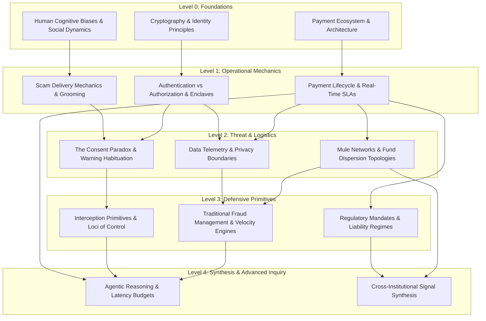

# Knowledge Dependencies: Conceptual Structure & Research Prerequisites

---

## 1. Executive Understanding (Layer 1)

Domain concepts in financial crime and payment engineering do not exist in isolation; they form a **directed acyclic graph of conceptual dependencies**. Attempting to understand or research advanced concepts (such as "agentic interception" or "mule clustering") without first mastering foundational concepts (such as "payment settlement finality" or "the consent paradox") leads directly to flawed architectural assumptions and unrealistic designs.

This document formalizes the **conceptual dependency map** for the project. It outlines the foundational knowledge prerequisites required at each stage of inquiry, ensuring that engineering and domain research progress in a structured, logically sound sequence.

---

## 2. The Global Knowledge Dependency Graph (Layer 2)



---

## 3. Detailed Dependency Sequences & Rationales (Layer 3)

### 3.1 Pathway A: From Settlement Finality to Interception Constraints
```
[ Payment Ecosystem ] ---> [ Payment Lifecycle & SLAs ] ---> [ Interception Primitives ] ---> [ Agentic Reasoning Bounds ]
```
*   *Why this dependency exists*: You cannot reason about "interception" without knowing the transaction state machine. You cannot know when to intercept without knowing that instant rails settle in < 2 seconds. You cannot evaluate "agentic" designs without realizing that multi-second LLM reasoning exceeds the 300ms switch latency ceiling.
*   *Failure to follow*: Leads to proposing fantasy architectures where an AI agent pauses a payment switch for 20 seconds while it analyzes the internet.

### 3.2 Pathway B: From Psychology to Warning Limitations
```
[ Cognitive Biases ] ---> [ Scam Delivery Mechanics ] ---> [ The Consent Paradox ] ---> [ Cognitive Friction Design ]
```
*   *Why this dependency exists*: You cannot understand why scam victims override bank alerts without studying how scammers establish authority and urgency. You cannot design effective UI interventions without understanding warning habituation and emotional cognitive tunneling.
*   *Failure to follow*: Leads to proposing generic modal warning dialogs ("Are you sure this is safe?") that real-world scam victims dismiss in 0.5 seconds.

### 3.3 Pathway C: From Banking Secrecy to Information Asymmetry
```
[ Privacy & Bank Secrecy ] ---> [ Data Telemetry Fragmentation ] ---> [ Cross-Bank Asymmetry ] ---> [ Federated Intelligence ]
```
*   *Why this dependency exists*: You cannot evaluate fraud detection precision without understanding what data is visible to the sending bank. You cannot evaluate sending bank blindness without understanding banking secrecy laws and privacy boundaries that prevent querying the receiving bank’s ledger.
*   *Failure to follow*: Leads to assuming the sending bank can magically inspect the recipient's account age and previous transaction history during payment formulation.

---

## 4. Concept Dependency Matrix (Layer 3)

| Target Concept | Immediate Prerequisites | Why the Prerequisite is Mandatory |
| :--- | :--- | :--- |
| **APP Scam Mechanics** | Authentication vs. Authorization; Social Engineering Fundamentals | You must understand that authentication succeeds in scams before you can analyze how social engineering subverts user intent. |
| **Real-Time Interception** | Payment Lifecycle States; Instant Payment SLAs; Banking Mandate Law | You cannot intercept an event unless you know its state boundaries, its millisecond timeouts, and your legal authority to intervene. |
| **Mule Account Detection** | Account Topologies; Velocity Counters; KYC Baseline Rules | You cannot identify mule anomalies without understanding standard customer baselines, dormancy bursts, and rapid fan-out smurfing. |
| **Agentic Guardian Design** | Hard vs. Soft Real-Time; Asynchronous vs. Synchronous Channels; Prompt/Model Latencies | You cannot select or deploy an autonomous agent without knowing whether it sits on the hard real-time path (impossible) or pre-flight/out-of-band path. |
| **Friction Injection** | Behavioral Biometrics; Warning Habituation; Human Cognitive Capture | You cannot design effective interactive friction without knowing what behavioral signals indicate stress and why static warnings fail. |

---

## 5. Traceability & Authoritative Sources

*   **Russell, S., & Norvig, P.**: *Artificial Intelligence: A Modern Approach* (Knowledge representation and dependency modeling).
*   **CPMI / BIS**: *Fast Payments Framework and System Dependencies*.
*   **NIST SP 800-30 Rev. 1**: *Guide for Conducting Risk Assessments: System Dependency and Threat Path Modeling*.
