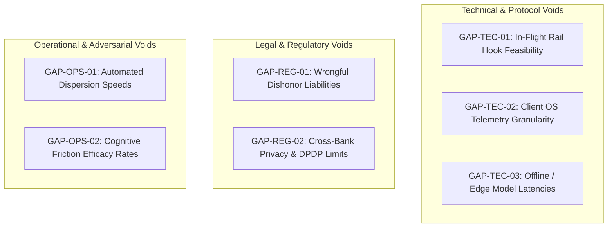

# Residual Domain Knowledge Gaps: Unresolved Inquiries for Phase 2

---

## 1. Executive Understanding (Layer 1)

A rigorous domain analysis must conclude by explicitly mapping its own frontiers and unresolved uncertainties. Identifying **knowledge gaps** is fundamentally different from conducting a product gap analysis:
*   A *product gap* asks: *"What features is our proposed system missing?"* (Premature solutioning).
*   A *knowledge gap* asks: *"What empirical facts, regulatory mechanics, data fields, or operational protocols about the real world do we still not understand?"*

This document catalogs the critical residual unknowns across payment mechanics, regulatory constraints, telemetry availability, and adversary behaviors. These gaps serve as the direct research roadmap for Phase 2.

---

## 2. Comprehensive Knowledge Gap Register (Layer 2)

---

## 3. Structured Gap Analysis Matrix (Layer 3)

| # | Knowledge Gap | Why It Matters | Research / Investigation Needed | Priority |
| :- | :--- | :--- | :--- | :--- |
| **G1** | **Technical Feasibility of In-Flight Rail Hooks** | If modern instant payment switches (e.g., NPCI UPI switch) do not support synchronous external API callouts or "pending hold" states, server-side interception is physically impossible. | Reverse engineer or obtain official switch interface control documents (ICDs); interview payment switch architects. | **Critical (P0)** |
| **G2** | **Permissible Client-Side OS Telemetry on Android 13/14** | We do not know the exact OS permission thresholds required to detect an active phone call, remote screen-sharing app, or rapid typing cadence without triggering an App Store ban. | Empirical testing on modern Android and iOS developer sandboxes; review Google Play Developer Policy updates. | **Critical (P0)** |
| **G3** | **Civil Liability for "Wrongful Payment Interception"** | If an autonomous guardian blocks a legitimate payment (false positive) causing severe customer loss, does the software provider or bank face civil liability under the Banking Ombudsman Scheme or commercial law? | Formal legal analysis of banking contract terms of service and statutory duty of mandate across target jurisdictions. | **High (P1)** |
| **G4** | **Cross-Bank Intelligence Sharing under Data Privacy Laws** | We do not know whether sending banks can legally transmit beneficiary VPAs to an external shared threat pool in real time without violating GDPR or India's DPDP Act 2023. | Regulatory compliance review of data protection exemptions for financial crime defense. | **High (P1)** |
| **G5** | **Exact Velocity and Latency of Mule Network Dispersion** | We lack precise empirical benchmarks on how quickly automated bot networks drain mule accounts after receipt (is it 30 seconds, 2 minutes, or 10 minutes?). | Review police cyber forensics case studies, dark web mule toolkits, and academic crime data. | **High (P1)** |
| **G6** | **Empirical Efficacy of Interactive Cognitive Friction** | While generic text warnings are known to fail, we do not know what specific forms of cognitive friction (e.g., reverse math puzzles, mandatory 2-minute cooling timers, audio verification) reliably break social engineering compliance. | Human-Computer Interaction (HCI) and behavioral economics literature review on crisis de-biasing. | **High (P1)** |
| **G7** | **Inference Latency Bounds of Small Language Models on Handset Hardware** | If an "agentic" component must run on a consumer smartphone, we do not know the battery, RAM, and inference latency profile of quantised SLMs (1B–3B parameters) on low-end hardware. | Hardware benchmarking across budget Android handsets (typical of emerging market user bases). | **Medium (P2)** |
| **G8** | **P2M Merchant Aggregator Underwriting Loopholes** | We do not fully understand the exact onboarding and verification loopholes that allow cybercrime syndicates to acquire verified merchant QR codes and payment gateway accounts. | Payment gateway risk operations and merchant onboarding compliance documentation review. | **Medium (P2)** |

---

## 4. Boundaries and Strategic Guidance for Phase 2 (Layer 4)

### 4.1 How to Treat These Gaps
*   **Do not resolve them through speculation**: If evidence is unavailable, maintain the gap as an explicit unknown.
*   **Do not assume best-case technical scenarios**: When evaluating whether an API exists or whether OS permissions will allow surveillance, assume the most restrictive scenario until empirical proof demonstrates otherwise.
*   **Direct Translation to Phase 2**: The Critical (P0) and High (P1) gaps identified above form the primary investigative mandates for the next phase of research.

---

## 5. Traceability & Authoritative Sources

*   **Bank for International Settlements (BIS)**: *Working Papers on Financial Technology and Fraud Measurement Gaps*.
*   **Google Play Console Help**: *Device and Network Abuse Policy & Accessibility API Usage Restrictions*.
*   **European Data Protection Supervisor (EDPS)**: *Guidelines on Data Protection in Financial Fraud Prevention Technologies*.
