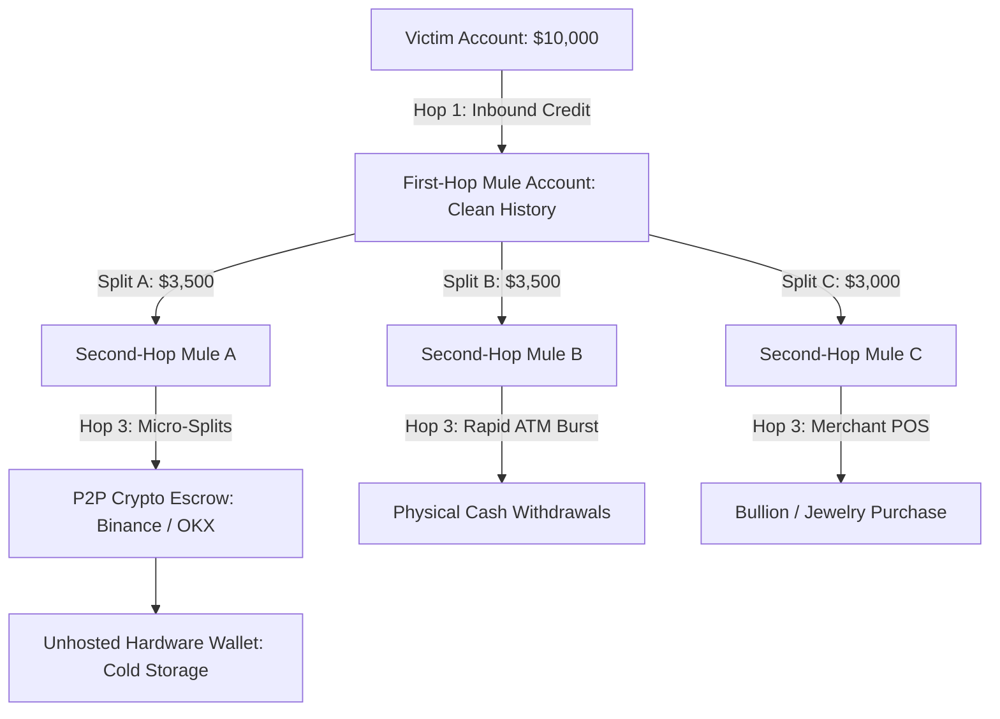

# Money Movement & Mule Accounts: Infrastructure, Layering & Cash-Out Topologies

---

## 1. Executive Understanding (Layer 1)

In electronic payment crime, the **money mule network** is the financial logistics infrastructure that enables cybercrime syndicates to monetize deception. A scammer can possess world-class social engineering scripts, but without a bank account capable of receiving funds and rapidly converting them into untraceable assets, the crime yields zero economic return.

A **money mule** is an individual whose bank account, digital wallet, or virtual payment address is utilized to receive and transfer illicit funds. Mule accounts operate as decentralized "layering" nodes designed to break the digital audit trail between the victim's debit and the criminal's final cash-out point. 

Understanding money mule dynamics is foundational to real-time payment scam interception for a decisive technical reason: **while the payer side of a scam transaction appears completely normal, the payee (mule) side almost always exhibits extreme structural anomalies**. The destination account's age, velocity, clustering, and post-credit behavior represent some of the highest-signal indicators of an active scam.

---

## 2. The Multi-Hop Layering & Off-Ramping Topology (Layer 2)

Once scammed funds land on an instant payment rail, they move through an automated dispersion pipeline:



---

## 3. Taxonomy of Money Mules (Layer 3)

Not all money mules are hardened criminals; law enforcement and banking regulators categorize mules into distinct operational profiles based on intent and awareness:

| Mule Profile | Recruitment & Exploitation Vector | Level of Intent | Account Characteristics |
| :--- | :--- | :--- | :--- |
| **Complicit / Professional Mule** | Recruited via dark web forums or Telegram groups; deliberately sells their bank account, debit card, and net-banking credentials for a 5%–10% commission. | **High (Intentional Criminality)** | Account is handed over entirely to syndicate operators; accessed via commercial VPNs or bot automation. |
| **Deceived / Unwitting Mule** | Believes they have landed a legitimate "remote payment processing" or "freelance bookkeeping" job. Instructed to receive funds and "forward" them after keeping a fee. | **Zero (Victim of Job Scam)** | Normal consumer profile; suddenly exhibits high-value interbank transit flows; cooperative when contacted by police. |
| **Rented / Dormant Account Mule** | College students, low-income laborers, or rural citizens who lease their bank accounts to local agents for a monthly fixed stipend. | **Low / Willful Blindness** | Previously dormant or low-activity savings accounts that suddenly receive sudden bursts of rapid high-volume incoming transfers. |
| **Compromised / Hacked Account** | Legitimate account hijacked via credentials gained through banking trojans or SIM swapping without account owner's knowledge. | **Zero (Innocent Third Party)** | Legitimate user continues to use account for daily expenses while background transfers occur in the dead of night. |
| **Synthetic Identity Mule** | Account opened using fabricated documents or identity fragments (stolen PAN/Aadhaar/SSN combined with fake utility bills). | **Pure Fabricated Entity** | Zero real-world human presence; created exclusively as a disposable single-use node. |

---

## 4. Operational Signatures of Mule Fund Movement (Layer 3)

Mule networks execute specific mathematical and topological patterns to defeat traditional Anti-Money Laundering (AML) transaction monitoring:

```
+-----------------------------------------------------------------------------------------------+
| Structural Signatures of Mule Account Operations                                              |
|                                                                                               |
| Signature Type         Mechanism & Description                                                |
| ---------------------  ---------------------------------------------------------------------- |
| **Rapid In-and-Out**   Funds credited to the account are drained within 60 to 180 seconds,    |
| (Zero Dwell Time)      leaving an overnight closing balance near zero ($0 to $5).             |
|                                                                                               |
| **Fan-Out (Smurfing)** A single large incoming transfer ($10,000) is immediately split into   |
|                        12 smaller transfers ($800–$950) just below statutory reporting limits |
|                        and routed to secondary accounts.                                      |
|                                                                                               |
| **Dormancy Burst**     An account with an average monthly turnover of $50 for two years       |
|                        suddenly experiences $20,000 in credit velocity over a 48-hour window.  |
|                                                                                               |
| **Velocity Spikes**    Receiving 10 to 30 incoming instant P2P payments from different payers |
|                        in different cities within a single 2-hour operational window.         |
|                                                                                               |
| **Off-Ramp Conversion**Immediate liquidation via physical ATM withdrawals across multiple     |
|                        geographically adjacent machines, or rapid purchase of bullion/crypto. |
+-----------------------------------------------------------------------------------------------+
```

### 4.1 The Role of P2P Cryptocurrency Off-Ramps
In contemporary cybercrime syndicates (particularly across Southeast Asia and South Asia), the preferred terminal cash-out mechanism is **Peer-to-Peer (P2P) fiat-to-crypto exchanges**:
1.  The second-hop mule transfers fiat money to a verified P2P crypto merchant on a cryptocurrency exchange.
2.  The P2P merchant releases stablecoins (e.g., USDT) into the scam syndicate’s custodial exchange wallet.
3.  The syndicate immediately sweeps the stablecoins into private, unhosted hardware wallets or decentralized mixing protocols.
4.  *Relevance*: Once funds hit the crypto rail, fiat banking freeze orders (e.g., Indian 1930 / I4C portal liens) can no longer recover the stolen wealth.

---

## 5. Boundaries, Challenges, and Information Asymmetry (Layer 4)

### 5.1 The Cross-Bank Telemetry Asymmetry
The fundamental barrier to utilizing mule intelligence in real-time scam interception is the **structural barrier between sending and receiving banks**:
*   *Sending Bank*: Knows the payer, their baseline, and their behavioral stress—but knows **nothing** about the beneficiary account other than its VPA or account number.
*   *Receiving Bank*: Knows the beneficiary account was opened 4 days ago and has received 18 incoming transfers today—but has **zero visibility** into the sender or why the transfer is happening.
*   *Central Rail*: Routes the message, but historically does not perform deep graph clustering during the synchronous 500ms transit window.
*   *Conclusion*: Unless an interbank intelligence-sharing protocol (e.g., centralized risk registries, real-time payee risk scores) exists, the sending institution is forced to evaluate risk blind to the destination's mule characteristics.

### 5.2 Common Misconceptions
*   *Misconception*: "Banks can easily identify mule accounts because their KYC documents are fake."
    *   *Reality*: Over 80% of modern money mule accounts utilize **100% genuine KYC documentation** belonging to real domestic citizens who were either deceived by fake job offers or rented their accounts for fast cash. The KYC passes all government database verifications.
*   *Misconception*: "Mule accounts are reused for months."
    *   *Reality*: Complicit mule accounts are treated as **disposable, single-use infrastructure**. Syndicates "burn" an account within 24 to 72 hours, extracting maximum throughput before the first victim complaint triggers an automated freeze.

---

## 6. Traceability & Authoritative Sources

*   **Europol**: *European Money Mule Action (EMMA) Operational Reports & Typologies Dossier* (2023).
*   **Reserve Bank of India (RBI)**: *Advisory to Banks on Mule Account Detection and Strengthening of AML Surveillance* (2024).
*   **Financial Action Task Force (FATF)**: *Money Laundering Through the Physical and Digital Movement of Cash: Red Flag Indicators*.
*   **UK Finance**: *Don't Get Fooled: Annual Report on Money Mule Recruitment and Student Vulnerabilities*.
*   **Australian Federal Police (AFP)**: *Operation Spindrift: Disrupting Transnational Money Mule Syndicates*.
