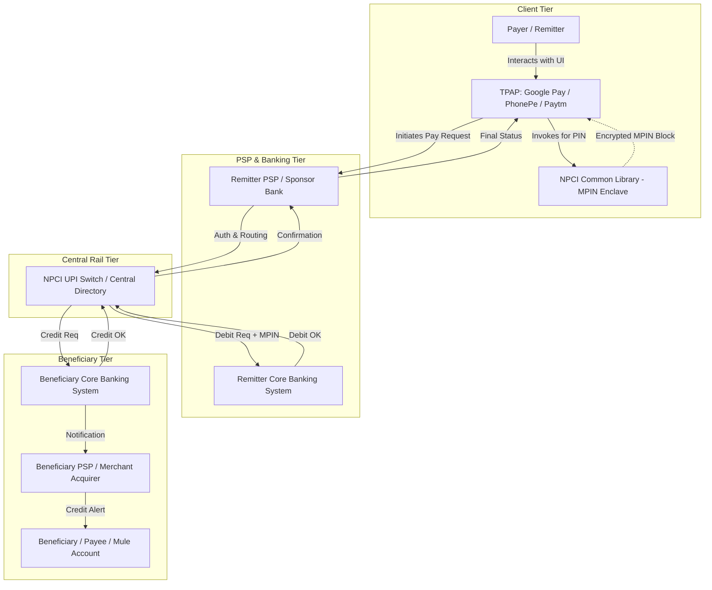

# Relevant Payment Ecosystem: Architecture & Participants

---

## 1. Executive Understanding (Layer 1)

The retail digital payments ecosystem—exemplified most prominently by India's **Unified Payments Interface (UPI)** as well as global counterparts like the UK's Faster Payments System (FPS), Brazil’s Pix, and the US FedNow/The Clearing House RTP—is a federated, multi-layered architecture. It separates the **user experience layer** (mobile apps) from the **banking layer** (underlying accounts and settlement) through standardized interoperable protocols governed by central switches and regulatory bodies.

In this ecosystem, no single entity possesses end-to-end visibility of a transaction. A consumer uses a Third-Party Application Provider (TPAP) operating on their smartphone; the TPAP talks to a Sponsor Bank / Payment Service Provider (PSP); the PSP routes through the central clearinghouse (e.g., NPCI in India); the clearinghouse coordinates between the remitter's core banking system (CBS) and the beneficiary's CBS.

For scam interception, this fragmentation is the central technical reality: **signals that reveal a scam are scattered across decoupled architectural tiers**, while the authority to execute interventions is strictly partitioned by statutory mandates.

---

## 2. The Indian UPI Architectural Model (Layer 2)

India's UPI represents the world's highest-volume real-time retail payment infrastructure. Its 4-party / multi-entity model illustrates the structural division of labor and control.



---

## 3. Institutional & Component Deep Dive (Layer 3)

### 3.1 Reserve Bank of India (RBI)
*   **What it is**: The central bank and statutory monetary authority of India.
*   **Role in Payment Ecosystem**: Regulatory supreme authority governing payment and settlement systems under the *Payment and Settlement Systems Act, 2007 (PSSA)*.
*   **Information & Control**: Sets macro rules, security directives (e.g., mandatory 2-Factor Authentication, tokenization, data localization within Indian borders), transaction velocity limits, and customer liability frameworks (*RBI Circular on Limiting Liability of Customers in Unauthorised Electronic Banking Transactions, 2017*).
*   **What it does NOT control**: Does not operate real-time payment switches directly; does not see individual transaction payloads in real time.

### 3.2 National Payments Corporation of India (NPCI)
*   **What it is**: An umbrella organization for operating retail payments and settlement systems in India, set up with the guidance and support of RBI and the Indian Banks' Association (IBA).
*   **Role in Payment Ecosystem**: Operates the core UPI payment switch, central clearinghouse, and central address mapping directory (linking Virtual Payment Addresses to bank account/IFSC details).
*   **Information & Control**: Sees full interbank clearing messages in transit (payer VPA, payee VPA, remitter bank IFSC, beneficiary bank IFSC, amount, timestamp, merchant category code). Can enforce rail-wide rules, throttle abusive traffic, and operate centralized risk registries.
*   **What it does NOT control**: Does not own deposit accounts; cannot hold customer balances; cannot arbitrarily debit a beneficiary account without standard banking workflows.

### 3.3 Remitter Bank (Issuing Bank)
*   **What it is**: The commercial or public-sector bank where the payer maintains their savings or current account.
*   **Role in Payment Ecosystem**: Verifies account solvency; authenticates the encrypted MPIN block via its internal Hardware Security Modules (HSM); debits customer ledger.
*   **Information & Control**: Knows historical balance, past spending profile, account age, KYC status, and customer branch. Controls the final approval or decline of the debit instruction.
*   **What it does NOT control**: Does not know what the user was doing on their phone before initiating the transfer; has no real-time telemetry regarding the beneficiary's account history at another bank.

### 3.4 Beneficiary Bank (Acquiring Bank)
*   **What it is**: The financial institution hosting the destination account that receives the transferred funds.
*   **Role in Payment Ecosystem**: Receives credit instructions from the central switch; verifies the destination account is active; immediately credits the beneficiary balance.
*   **Information & Control**: Possesses complete historical visibility into the destination account: account creation date, recent velocity of incoming credits, immediate ATM withdrawal attempts, and linked mobile numbers.
*   **What it does NOT control**: Does not know who the remitter is until the `pacs.008` message arrives; does not communicate directly with the remitter.

### 3.5 Payment Service Provider (PSP) / Sponsor Bank
*   **What it is**: A licensed banking entity that operates a UPI PSP gateway server, connecting non-bank applications (TPAPs) to the NPCI switch.
*   **Role in Payment Ecosystem**: Validates API request formatting, attaches cryptographic digital signatures, and manages message queue routing.
*   **Information & Control**: Sees transaction payload metadata passing from the app to the switch.
*   **What it does NOT control**: Cannot inspect the plaintext MPIN (encrypted by the Common Library); cannot inspect local device states beyond what the app sends.

### 3.6 Third-Party Application Provider (TPAP)
*   **What it is**: Consumer-facing mobile payment apps such as Google Pay, PhonePe, Paytm, CRED, or BHIM.
*   **Role in Payment Ecosystem**: Provides the graphical user interface, manages QR code scanning, contacts address book integration, and initiates the payment workflow.
*   **Information & Control**: Has the richest interaction telemetry: user typing cadence, time spent on the confirmation screen, clipboard paste events, active phone call status (if OS permissions allow), and device hardware identifiers.
*   **What it does NOT control**: Completely barred from viewing or intercepting the user's PIN/password (handled by the sandboxed Common Library); has no direct access to core banking ledgers.

---

## 4. Architectural Control & Telemetry Matrix

To evaluate where interception capabilities can technically exist, the following matrix maps data access and intervention power across ecosystem tiers:

| Tier / Component | Available Telemetry | Execution Authority | Latency Budget Impact | Major Blind Spots |
| :--- | :--- | :--- | :--- | :--- |
| **Mobile App (TPAP)** | UI interaction, pacing, clipboard, device info, contacts | Can display UI warnings; can refuse to send API payload | Minimal (pre-network submission) | Blind to destination account age, mule velocity, and interbank fraud history |
| **Common Library (CL)** | Enclave keypresses, MPIN input | Validates UI isolation; generates encrypted credential block | Negligible (local OS) | Strictly isolated by design; possesses zero external context |
| **Remitter Bank (CBS)** | Payer balance, past transaction velocity, remitter KYC | Can decline transaction (`Decline: Auth/Risk`); can hold account | 200ms – 800ms | Blind to client screen state, active calls, and beneficiary account status |
| **Central Switch (NPCI)** | Payer/Payee VPA, interbank routing, macro rail velocity | Can drop/reject message; can flag VPA via risk scoring | 50ms – 200ms | Blind to micro-behavioral client signals; limited contextual reasoning |
| **Beneficiary Bank** | Recipient account age, inflow velocity, rapid cash-out attempts | Can freeze incoming credit; can place lien on funds | Post-credit or in-flight credit ack | Blind to payer intent, scam grooming history, and payer identity |

---

## 5. Comparative Global Instant Payment Architectures (Layer 4)

While the Indian UPI model provides a premier case study, global instant payment architectures share core structural principles while differing in liability and messaging:

```
+----------------------------------------------------------------------------------------------------+
| Global Instant Payment Rails Comparison                                                            |
|                                                                                                    |
| System               Jurisdiction  Clearing SLA     Liability Model        CoP / Name Check        |
| -------------------  ------------  ---------------  ---------------------  ----------------------- |
| UPI                  India         < 2-5 seconds    Customer unless fraud  VPA resolves registered |
|                                                     reported in 3 days     name before payment     |
| Faster Payments      UK            < 15 seconds     Mandatory 50/50 Split  Confirmation of Payee   |
| (Pay.UK / FPS)                                      (PSR Mandate Oct 2024) (CoP) algorithm check   |
| Pix                  Brazil        < 10 seconds     Special Reversal Mech  BCB central directory   |
| (Banco Central)                                     (MED) for fraud runs   (DICT) lookup           |
| FedNow / RTP         United States < 15 seconds     Reg E (Payer bears     Optional recipient      |
|                                                     authorized scam loss)  verification tools      |
+----------------------------------------------------------------------------------------------------+
```

### Key Differences Impacting Interception:
1.  **Liability Allocations**: Under the UK's PSR mandate, both the sending and receiving banks share financial liability for APP scams 50/50. This creates an intense commercial incentive for *both* banks to deploy aggressive real-time fraud intervention. In systems without mandatory reimbursement, sending banks treat user-authorized scams as customer negligence.
2.  **Confirmation of Payee (CoP)**: In the UK, CoP checks whether the name entered by the payer matches the name registered on the receiving bank account. In UPI, addressing via VPA resolves the beneficiary's banking name dynamically before PIN entry. While helpful, scammers circumvent this by registering mule accounts under fake business names matching legitimate services (e.g., "Electricity Department Billing").

---

## 6. Traceability & Authoritative Sources

*   **Reserve Bank of India (RBI)**: *Master Direction on Digital Payment Security Controls* (RBI/2020-21/74).
*   **NPCI**: *Procedural Guidelines for Unified Payments Interface (UPI)* (Version 1.8, 2022).
*   **UK Payment Systems Regulator (PSR)**: *Super-complaint response and Policy Statement PS23/3 on APP Scams*.
*   **Banco Central do Brasil (BCB)**: *Regulamento do Pix e Mecanismo Especial de Devolução (MED)* (Resolução BCB nº 1/2020).
*   **Federal Reserve Board**: *FedNow Service Operating Circular No. 8: Funds Transfers through the FedNow Service* (2023).
