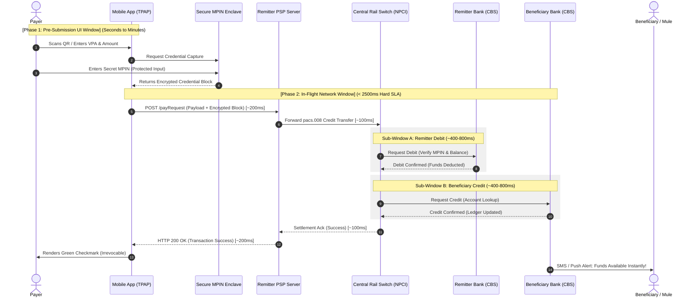
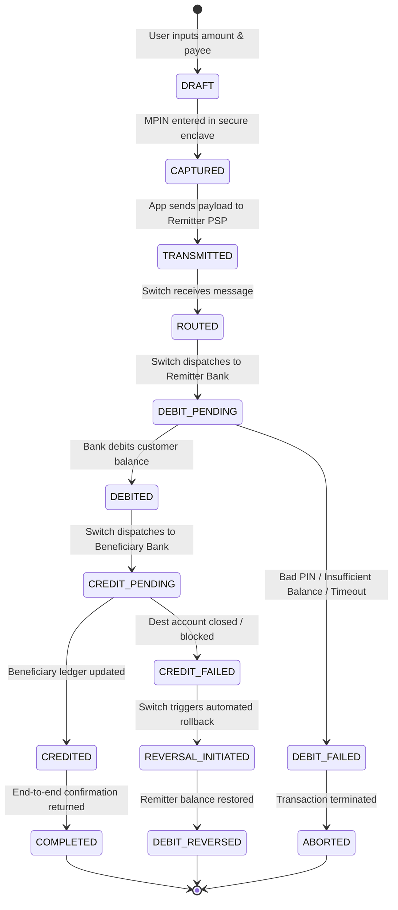

# The Real-Time Payment Lifecycle & Transaction State Machine

---

## 1. Executive Understanding (Layer 1)

In conventional batch-clearing systems (such as ACH or NEFT), payment processing is **asynchronous** and spans hours or days. Batches of payment instructions are accumulated, transmitted, netted, and cleared before accounts are settled and funds become available to recipients. This latency provides an inherent buffer during which fraud checks, manual investigations, and stop-payment orders can be executed.

In contrast, **instant real-time payment rails** (such as UPI, FedNow, UK Faster Payments, and Pix) operate on a **synchronous credit-push** execution model. The payment instruction, authentication, debit validation, network routing, and beneficiary credit occur within a single, continuous technical transaction. From the moment the user taps "Pay" and enters their credential, the end-to-end process completes in under 2 to 5 seconds.

Understanding this compressed lifecycle is essential for the problem of scam interception. Once a transaction state transitions from `In_Flight` to `Credited`, value transfer is permanent and irreversible. Any defensive intervention must operate strictly within the synchronous pre-clearing window, or pivot to pre-flight client-side friction.

---

## 2. End-to-End Sequence & Latency Budget (Layer 2)

The following sequence diagram details the exact synchronous message flow and latency budgets allocated at each hop in an instant payment architecture (based on the UPI / ISO 20022 `pacs.008` model).



---

## 3. Detailed Transaction State Machine (Layer 3)

The internal state of a payment instruction transitions deterministically through well-defined protocol stages:



### 3.1 State Definitions & Scam Implications

| Transaction State | Physical Location | Reversibility | Feasibility of Scam Interception |
| :--- | :--- | :--- | :--- |
| **`DRAFT`** | Local Mobile App Memory | 100% Reversible | **Highest Feasibility**: Payer is in active dialogue with app. Best locus for behavioral friction, cognitive de-biasing, and warning dialogues. |
| **`CAPTURED`** | Secure Enclave / Common Library | 100% Reversible | Minimal context; enclave is designed strictly to protect credential confidentiality, not evaluate context. |
| **`TRANSMITTED`** | In-flight to PSP / Gateway | Abortable | High technical complexity; requires PSP to drop request before issuing switch instruction. |
| **`ROUTED`** | Central Payment Switch | Abortable | Switch can reject message based on central risk registries or blacklisted destination VPAs. |
| **`DEBITED`** | Remitter Bank Core Banking | Asymmetric Risk | Remitter funds are gone. If transaction fails now, money enters a reconciliation suspense ledger. |
| **`CREDITED`** | Beneficiary Bank Core Banking | **Zero Reversibility** | **Point of No Return**. Funds are legally owned by payee. Money mules immediately initiate automated dispersion. |
| **`COMPLETED`** | End-to-End System | Complete | Ex-post investigation only. Interception has failed. |

---

## 4. Synchronous vs. Asynchronous Processing Paradigms

A critical domain distinction is the divergence between the **synchronous payment channel** and the **asynchronous intelligence channel**:

```
+-----------------------------------------------------------------------------------------------+
| SYNCHRONOUS CHANNEL (In-Flight Execution Path)                                                |
| [Mobile App] ====(HTTP POST)====> [Switch] ====(TCP Socket)====> [Core Banking Systems]        |
| Strict Latency Budget: Total window < 2000ms. Hard timeouts trigger auto-failure.             |
| Rule: Heavy computation, multi-hop LLM reasoning, or external HTTP lookups CANNOT sit here!   |
+-----------------------------------------------------------------------------------------------+
                                                |
                                    Event Stream Notification
                                                v
+-----------------------------------------------------------------------------------------------+
| ASYNC / OUT-OF-BAND CHANNEL (Intelligence & Analytical Path)                                  |
| [Mule Intelligence Graph] <---> [Behavioral Scoring Engine] <---> [Cross-Bank Telemetry Pool]  |
| Budget: 500ms to several minutes. Runs in parallel or out-of-band without stalling the switch.|
| Challenge: Output must be ready BEFORE the user initiates payment, or operate pre-flight.     |
+-----------------------------------------------------------------------------------------------+
```

### 4.1 The Latency Ceiling Problem
*   Payment switch protocols impose **hard timeout thresholds** (typically 3,000ms to 5,000ms). If any participant along the chain fails to respond within its allocated sub-window (e.g., Remitter Bank CBS SLA: 800ms), the switch terminates the connection and returns a timeout error.
*   If an inline fraud detection engine takes 1,500ms to perform deep reasoning, it consumes the entire buffer, causing legitimate payments to fail due to network drops.
*   Therefore, modern real-time architectures require **dual-path decisioning**:
    1.  *Fast-path (In-line)*: Synchronous, deterministic, sub-50ms rule/score evaluation.
    2.  *Slow-path (Pre-flight or Out-of-Band)*: Contextual, agentic, or graph-based reasoning evaluated before the user clicks "Submit" or running asynchronously.

---

## 5. Technical Failure States, Reversals, and Disputes (Layer 4)

### 5.1 Technical Reversals vs. Fraud Reversals
*   **Technical Reversals (`Decline: Credit Failed`)**: Occur when the remitter bank successfully debits funds, but the beneficiary bank cannot credit the destination account (e.g., account frozen, invalid IFSC, system timeout). In this scenario, the central switch executes an automated cryptographic rollback, returning the funds to the remitter's ledger.
*   **Fraud Reversals (`Post-Settlement Claim`)**: If the beneficiary bank successfully credits the account, the payment switch **cannot** issue a reversal message. A credit transaction cannot be undone without the explicit written authorization of the beneficiary account holder or a formal legal lien/court order.

### 5.2 Common Misconceptions Regarding Payment Timing
*   *Misconception*: "If we detect a scam 3 seconds after the user enters their PIN, we can cancel the transfer."
    *   *Reality*: In an instant rail, 3 seconds is longer than the entire lifecycle. By the 3rd second, the beneficiary ledger is credited. Any action at T+3s belongs to post-settlement response (freezing accounts), not transaction interception.

---

## 6. Traceability & Authoritative Sources

*   **NPCI**: *Unified Payments Interface (UPI) System Specifications & Procedural Guidelines (v2.0)* (Defining timeout parameters, retry mechanisms, and transaction status query protocols).
*   **ISO 20022 Financial Services Standard**: *Business Application Header (head.001) and Financial Institutional Customer Credit Transfer (`pacs.008.001.10`)*.
*   **Federal Reserve Bank**: *FedNow Service Technical Specifications: Core Message Flows & Exception Handling Rules* (2023).
*   **Bank of England / Pay.UK**: *Faster Payments Service Rules & Standards: Central Infrastructure Operational Specifications*.
