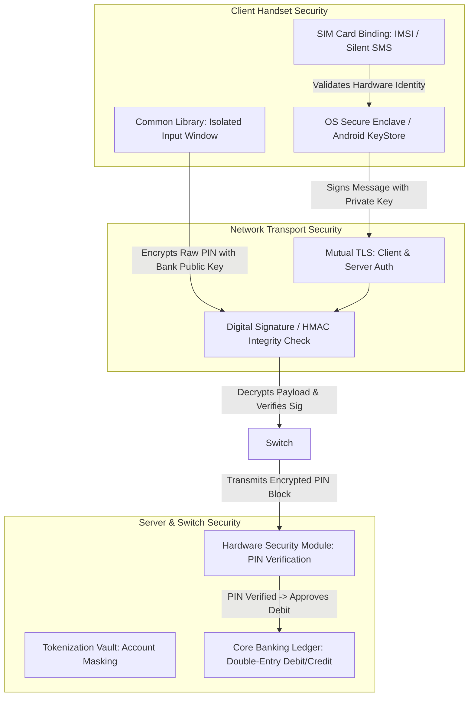

# Payment Security Fundamentals: Cryptography, Identity & Controls

---

## 1. Executive Understanding (Layer 1)

Payment security encompasses the technical protocols, cryptographic controls, identity verification mechanisms, and operational safeguards designed to ensure the **confidentiality, integrity, authenticity, and non-repudiation** of electronic value transfers. Its primary objective is to guarantee that only authorized account holders can move funds, that financial messages cannot be tampered with in flight, and that participating financial institutions can trust the validity of received instructions.

In modern banking, payment security is built on a multi-layered defense model: **identity verification** establishes legal entity ownership during onboarding; **device binding** binds the banking software to a specific physical handset; **mutual TLS and digital signatures** protect the network transmission pipeline; and **Hardware Security Modules (HSMs)** isolate cryptographic PINs and private keys within tamper-resistant hardware.

However, payment security operates under a critical domain axiom: **security mechanisms protect against adversaries who lack authorization; they do not protect against authorized users who have been deceived**. Understanding the precise capabilities and blind spots of each security control is vital for identifying where scam interception must operate.

---

## 2. Core Security Control Architecture (Layer 2)



---

## 3. Comprehensive Analysis of Security Primitives (Layer 3)

The following structured matrix examines every major security concept deployed in modern real-time payment ecosystems:

| Security Concept | Why It Exists & How It Works | Where It Occurs in Flow | What It Protects | What It Does NOT Protect (Scam Blind Spot) |
| :--- | :--- | :--- | :--- | :--- |
| **Authentication** | Verifies that an entity presenting a claim of identity is indeed that entity (e.g., verifying a password or biometric match). | At app login and prior to payment dispatch. | Protects against unauthorized intruders, credential stuffers, and brute-force attacks. | **Zero protection against scams**: Validates that the authentic user is present; cannot assess why the user is paying. |
| **Authorization** | The formal grant of authority by the account holder (and confirmed by the bank) to debit funds for a specific instruction. | At transaction commit (submitting MPIN). | Protects the bank from unauthorized debit claims; guarantees customer consent. | **Enables the scam**: Legally binds the victim to the financial loss because consent was granted. |
| **Device Binding** | Binds the user's mobile payment app to the physical SIM card, IMEI, and hardware cryptographic keystore via silent SMS. | App registration & ongoing session checks. | Protects against clone attacks, session hijacking, remote API replay, and web-based botnets. | Does not protect if the scammer is on a voice call with the victim holding their bound handset. |
| **Common Library (CL)** | Dedicated, isolated native UI window for PIN entry, rendered in a separate OS process inaccessible to the host app. | At the moment of PIN entry. | Protects the customer PIN from being keylogged or captured by malicious payment applications or spyware. | Protects the scammer’s transaction from being inspected; blinds the host app to whether the user hesitated. |
| **Hardware Security Module (HSM)** | Dedicated, tamper-resistant physical crypto-processor installed in bank datacenters for PIN translation and key management. | Inside the Remitter Bank Core Banking switch. | Protects symmetric master keys and raw PINs from being exposed to bank database administrators or hackers. | Operates purely as a mathematical decryptor/verifier; has zero awareness of transaction context or scam status. |
| **Mutual TLS (mTLS)** | Bidirectional cryptographic handshake where both client and server present X.509 digital certificates to establish an encrypted tunnel. | Between App, PSP, Switch, and Banks. | Protects financial messages from Man-in-the-Middle (MitM) eavesdropping and packet tampering. | The contents of the message—even if directing money to a money mule—are securely delivered. |
| **Tokenization & Addressing** | Replaces sensitive primary account numbers (PAN) or bank account numbers with surrogate tokens (e.g., VPAs, card tokens). | During recipient lookup and addressing. | Protects underlying bank account numbers and card details from merchant data leaks. | Scammers easily obtain VPAs or tokens for their mule accounts; does not prevent value transfer to the mule. |

---

## 4. Technical Distinctions: Authentication vs. Authorization vs. Integrity (Layer 3)

A foundational conceptual distinction in payment security is the separation of **Authentication**, **Authorization**, and **Message Integrity**:

```
+-----------------------------------------------------------------------------------------------+
| The Three Pillars of Payment Security                                                         |
|                                                                                               |
| 1. AUTHENTICATION ("Are you who you say you are?")                                            |
|    - Mechanism: MPIN, Fingerprint, SMS OTP, FaceID.                                           |
|    - Evaluator: Device Secure Enclave or Bank HSM.                                            |
|    - Status in Scams: PASSES (User is authentic).                                             |
|                                                                                               |
| 2. AUTHORIZATION ("Do you command this specific value transfer?")                            |
|    - Mechanism: Signing the transaction payload (Payer, Payee, Amount, Timestamp).            |
|    - Evaluator: Remitter Bank Core Banking System.                                            |
|    - Status in Scams: PASSES (User explicitly commands the transfer).                         |
|                                                                                               |
| 3. INTEGRITY ("Has the message been altered in transit?")                                     |
|    - Mechanism: HMAC-SHA256, RSA/ECDSA digital signatures across payload fields.              |
|    - Evaluator: Central Payment Switch & Receiving Bank.                                      |
|    - Status in Scams: PASSES (Message is delivered exactly as formulated).                    |
|                                                                                               |
| CONCLUSION: A scam payment satisfies all three pillars of cryptographic payment security.     |
| The security architecture functions flawlessly while the human objective is catastrophically subverted. |
+-----------------------------------------------------------------------------------------------+
```

---

## 5. Boundaries and Exceptions (Layer 4)

### 5.1 The Security vs. Usability Friction Boundary
*   Increasing payment security friction (e.g., requiring 3 separate passwords, a cooling period for new payees, or biometric facial scans before every payment) reduces certain types of opportunistic fraud.
*   However, excessive friction degrades the core value proposition of instant payments (speed, convenience, seamless commerce) and causes massive commercial drop-offs for merchants and banks.
*   Furthermore, against determined scammers who maintain psychological control over the victim (such as in "digital arrest" scenarios lasting several hours), static security friction is simply absorbed into the scammer’s instructions ("Wait for the 2-hour cooling period, then transfer the rest").

### 5.2 Common Misconceptions
*   *Misconception*: "If we mandate biometric FaceID instead of PINs, scams will stop."
    *   *Reality*: In an APP scam, the victim holds the phone up to their own face. Biometric authentication validates the physical presence of the victim, which makes the transaction even harder to dispute later.
*   *Misconception*: "End-to-end encryption means fraud engines cannot inspect transactions."
    *   *Reality*: End-to-end encryption protects the message payload between authorized network nodes. The bank servers, PSP gateways, and payment apps decrypt the message payload at their respective endpoints to perform routing, balance debiting, and fraud scoring.

---

## 6. Traceability & Authoritative Sources

*   **Payment Card Industry Security Standards Council (PCI SSC)**: *PCI PIN Security Requirements and Testing Procedures* (v3.1).
*   **National Institute of Standards and Technology (NIST)**: *Special Publication 800-52 Rev. 2: Guidelines for the Selection, Configuration, and Use of TLS Implementations*.
*   **NPCI**: *Security Guidelines for UPI Third-Party Application Providers (TPAPs) and PSP Banks* (2021).
*   **European Union**: *Regulatory Technical Standards on Strong Customer Authentication (SCA) under PSD2 (Directive 2015/2366)*.
*   **EMVCo**: *EMV 3-D Secure Protocol and Core Functions Specification (v2.3.1)*.
