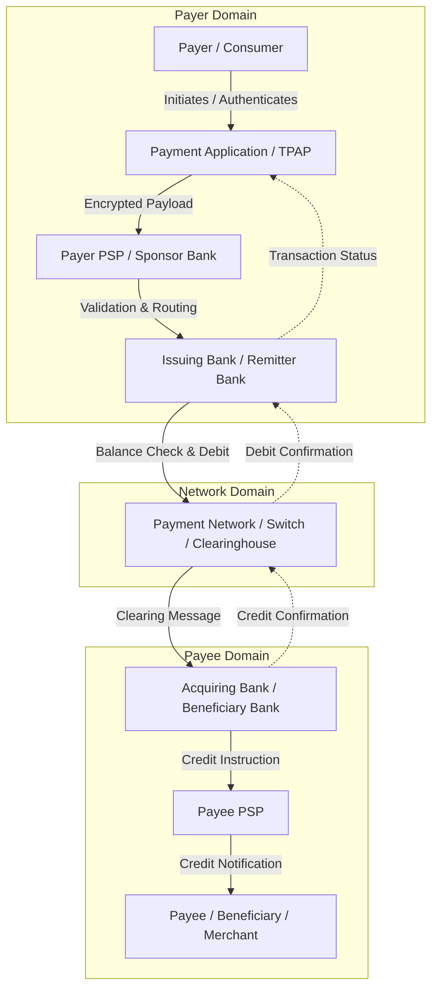
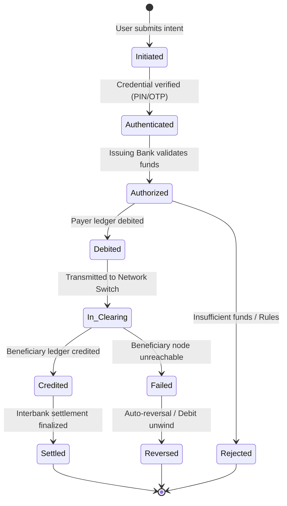

# Payment System Fundamentals

---

## 1. Executive Understanding (Layer 1)

A **digital payment** is an electronic transfer of monetary value from a payer’s account to a payee’s account initiated over an electronic communications network. Unlike physical cash, which achieves instant settlement upon physical handover without intermediaries, digital payments depend on a distributed ledger of account balances maintained by regulated financial institutions. A digital payment is fundamentally an exchange of legally binding **financial messages** that instruct account-servicing entities to debit one ledger and credit another.

In modern retail payment architectures, digital payments rely on a multi-tiered infrastructure comprising client-facing software applications, licensed Payment Service Providers (PSPs), commercial banks, central switching networks, and central bank settlement systems. The integrity of the system requires coordination between identity verification, balance checks, cryptographic message signing, routing, interbank clearing, and gross settlement.

For the problem of **Real-Time Payment Scam Interception**, understanding payment fundamentals is vital. Scams do not break the cryptographic or ledger mechanisms of digital payments; instead, they hijack the human intent that originates the payment instruction. Interception requires identifying the exact operational phases where legitimate instructions can be analyzed and evaluated before value moves irreversibly.

---

## 2. Structural Participants & Relationships (Layer 2)

A payment transaction is not a bilateral exchange; it is a multilateral protocol executed across multiple specialized participants.



### 2.1 Participant Taxonomy

| Participant | Functional Role | Operational Responsibility | Regulatory Locus |
| :--- | :--- | :--- | :--- |
| **Payer (Remitter)** | Originator of funds | Authorizes debit from their account via authentication credentials. | Consumer / Account Holder |
| **Payment Application (TPAP)** | User Interface Provider | Captures user intent, renders UI, interfaces with mobile OS peripherals. | Third-Party Application Provider |
| **Payer PSP (Sponsor Bank / PSP)** | Payment Protocol Handler | Converts UI commands into standardized payment switch message payloads. | Regulated Payment Entity |
| **Issuing / Remitter Bank** | Account Holder & Custodian | Manages payer's deposit account, validates balance, executes ledger debit. | Licensed Commercial Bank |
| **Payment Network / Switch** | Central Routing & Clearinghouse | Authenticates interbank messages, routes transactions, calculates netting. | Financial Market Infrastructure (FMI) |
| **Acquiring / Beneficiary Bank** | Account Holder & Creditor | Manages payee's deposit account, executes ledger credit. | Licensed Commercial Bank |
| **Payee PSP** | Merchant Aggregator / Entity | Provides receiving APIs, merchant routing, settlement dashboards. | Regulated Payment Entity |
| **Payee (Beneficiary)** | Recipient of funds | Receives credited funds to discharge an obligation or as recipient. | Merchant, Business, or Peer |

---

## 3. The Payment Lifecycle & Transaction States (Layer 3)

The journey of an electronic funds transfer traverses distinct operational stages. In real-time payment rails, these stages collapse into a continuous execution lasting between 500 milliseconds and 5 seconds.



### 3.1 Stage-by-Stage Breakdown

1.  **Initiation (Addressing & Formulation)**:
    *   *Action*: Payer enters or scans recipient identifier (Virtual Payment Address, Phone Number, IBAN, Account/Routing Number) and payment amount into the client application.
    *   *State*: `Initiated`.
    *   *Data Context*: App holds device telemetry, recipient handle, user interaction timings, clipboard data, and payment note.
2.  **Authentication (Credential Validation)**:
    *   *Action*: Payer inputs their private credential (e.g., MPIN, biometric token, banking password).
    *   *State*: `Authenticated`.
    *   *Security Isolation*: In secure systems (e.g., UPI Common Library, 3D Secure iframe), credentials are encrypted inside an isolated hardware/software enclave inaccessible to the hosting application.
3.  **Authorization (Remitter Ledger Hold/Debit)**:
    *   *Action*: Payer's issuing bank verifies account status, balances, velocity limits, and credential validity. If valid, the bank reserves or debits the funds.
    *   *State*: `Authorized` / `Debited`.
    *   *Significance*: Funds have left the payer's available balance.
4.  **Clearing (Routing & Network Switching)**:
    *   *Action*: The central payment switch receives the instruction (`pacs.008` credit transfer), matches the beneficiary bank routing identifier, and delivers the message to the receiving institution.
    *   *State*: `In_Clearing`.
5.  **Posting & Credit (Beneficiary Ledger Update)**:
    *   *Action*: The receiving bank validates that the destination account exists, is active, and can receive funds. It immediately updates the beneficiary's ledger balance.
    *   *State*: `Credited`.
    *   *Significance*: Funds are now legally and practically under the control of the payee.
6.  **Settlement (Interbank Value Transfer)**:
    *   *Action*: The central bank or clearinghouse moves central bank money across reserve accounts maintained by the issuing and acquiring commercial banks (either via Deferred Net Settlement or Real-Time Gross Settlement).
    *   *State*: `Settled`.
    *   *Significance*: Finality of payment is legally achieved.

---

## 4. Technical Distinctions: Clearing vs. Settlement vs. Posting

A frequent point of confusion in payment analysis is the distinction between **clearing**, **posting**, and **settlement**:

*   **Clearing**: The process of transmitting, reconciling, and in some cases confirming payment orders prior to settlement, possibly including the netting of instructions and the calculation of final positions.
*   **Posting**: The internal accounting entry made by a commercial bank to update a customer’s account balance (debiting remitter, crediting beneficiary). In instant payment systems, posting to the customer is instantaneous and precedes central settlement.
*   **Settlement**: The definitive, irrevocable discharge of an obligation between financial institutions through the transfer of value on the books of the central bank. In systems like UPI or UK Faster Payments, settlement occurs in scheduled multilateral net settlement batches throughout the day, even though customer posting is real-time.

```
+-----------------------------------------------------------------------------------------------+
| Instant Payment Paradigm: Real-Time Posting vs. Deferred Settlement Batch                     |
|                                                                                               |
| Time: T0 (0s)                  T1 (1.2s)                      T2 (End of Cycle / EOD)         |
| Payer Debited ---------------> Payee Credited --------------> Banks Settle via Central Bank   |
| [Customer Posting]             [Customer Posting]             [Interbank Reserve Settlement]  |
| "Irrevocable to Customer"      "Available to Cash Out"        "Final Legal Discharge"         |
+-----------------------------------------------------------------------------------------------+
```

---

## 5. Boundaries and Exceptions (Layer 4)

### 5.1 What Payment Systems Guarantee
*   **Cryptographic Authenticity**: Verification that the private key or PIN matched the registered credential.
*   **Ledger Consistency**: Prevention of double-spending or unauthorized overdrafts.
*   **Message Delivery**: Atomicity of transfer across participating network nodes.

### 5.2 What Payment Systems Do NOT Guarantee
*   **Validity of Customer Intent**: Payment rails have no inherent mechanism to determine whether a customer authorized a transfer under true free will, fraudulent deception, or psychological duress.
*   **Delivery of Goods or Services**: Traditional account-to-account rails do not tie payment clearing to commercial fulfillment (unlike card escrow or letter-of-credit systems).
*   **Recoupment of Scammed Funds**: Once credited to the beneficiary ledger, the sending institution has no technical or legal authority to unilaterally reverse or debit the receiving account.

### 5.3 Common Misconceptions in Scam Research
*   *Misconception*: "If a transaction is suspicious, the payment switch can simply pull the money back."
    *   *Reality*: Payment switches route credit instructions. They do not possess a debit mandate over beneficiary accounts; recovery requires interbank dispute protocols, police freeze orders, or receiving bank compliance intervention.
*   *Misconception*: "The payment app knows everything the user is doing on their phone."
    *   *Reality*: The payment application operates in a sandboxed user space. It only sees data within its own view hierarchy and explicit OS permissions granted to it.

---

## 6. Traceability & Authoritative Sources

*   **CPMI / BIS (Bank for International Settlements)**: *Statistics on payment, clearing and settlement systems in the CPMI countries* (Basel, Red Book Standards).
*   **ISO 20022 Financial Services Messaging Standard**: *Payments Clearing and Settlement (pacs) message definitions (`pacs.008.001.10`)*.
*   **Federal Reserve System**: *FedNow Service Operating Procedures: Payment Lifecycle and Finality Rules* (2023).
*   **National Payments Corporation of India (NPCI)**: *Unified Payments Interface (UPI) Core System Architecture and Technical Specifications* (v2.0).
