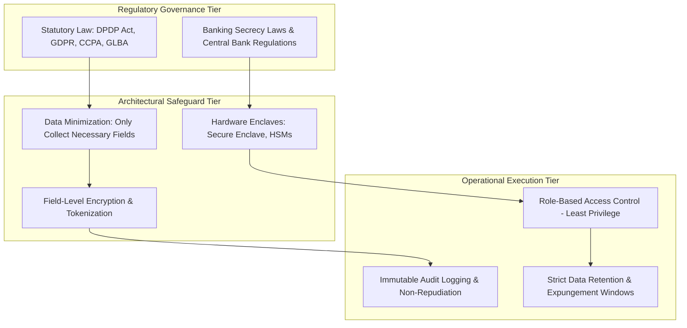

# Privacy & Security Context: Data Protection, Governance & Operational Safeguards

---

## 1. Executive Understanding (Layer 1)

Financial data is among the most highly protected classes of information in modern society. A person’s financial transaction records reveal intimate details of their personal life: medical treatments, religious donations, political affiliations, physical movements, relationship statuses, and psychological vulnerabilities. Consequently, banking and payment operations are subjected to stringent **data privacy, bank secrecy, and security governance frameworks** worldwide.

When researching real-time scam interception, privacy and security constraints represent an unyielding boundary. An engineering team might theoretically hypothesize that the easiest way to detect a scam is to monitor the user's phone calls, inspect their private chat messages, or broadcast their spending profile to an open AI cloud service. In the financial sector, however, such approaches are strictly prohibited by statutory privacy law, constitutional protections, and banking regulations.

Understanding privacy and security context ensures that subsequent research remains grounded in legally permissible, privacy-preserving techniques rather than architecting non-viable surveillance tools.

---

## 2. The Privacy and Security Governance Funnel (Layer 2)



---

## 3. Core Privacy & Security Principles in Payment Systems (Layer 3)

The following principles dictate what data can be captured, stored, transmitted, and processed:

| Principle | Meaning in Payment Systems | Implementation Mechanism | Impact on Scam Interception Research |
| :--- | :--- | :--- | :--- |
| **Bank Secrecy (Confidentiality)** | Financial institutions are legally barred from disclosing customer account details, balances, or transactions to third parties without court orders. | Core banking firewalling, segregated databases, strict tenant isolation. | Sending banks cannot freely query or view beneficiary account details at competing banks in real time. |
| **Data Minimization** | Systems must collect only the minimum data strictly necessary to fulfill the specific payment processing purpose. | Stripping non-essential telemetry from payment payloads (`pacs.008`). | Risk scoring must operate on compact, high-entropy features rather than indiscriminate telemetry harvesting. |
| **Purpose Limitation** | Data collected for processing a payment cannot be repurposed for secondary profiling or commercial tracking without explicit consent. | Purpose-tagged data stores; policy enforcement engines. | Behavioral biometrics collected for fraud defense cannot be monetized for ad targeting or credit scoring. |
| **Field-Level Encryption (FLE)** | Sensitive data fields (e.g., MPIN, CVV, Card Number) are encrypted individually using dedicated keys before reaching the database. | AES-256-GCM / RSA-4096 envelope encryption managed via HSMs. | Fraud inspection engines cannot inspect encrypted credential payloads; evaluation must rely on metadata. |
| **Least Privilege Access (RBAC)**| System components and human operators receive only the minimum permissions required to perform their discrete function. | Cryptographic access tokens (OAuth 2.0 / mTLS), zero-trust networks. | An AI risk component must not have write-access to the ledger or unrestricted read-access to the full database. |
| **Non-Repudiation & Auditability** | Proof that a specific transaction instruction was authorized by the holder and processed without tampering. | Asymmetric digital signatures, tamper-evident write-once audit logs. | Any automated interception decision (especially a payment block) must produce a verifiable, legally defensible audit trail. |
| **Data Localization** | Mandating that all financial transaction data and payment logs be stored within the sovereign borders of the jurisdiction. | Domestic cloud datacenters (e.g., RBI Data Localization Directive). | Telemetry cannot be shipped to offshore third-party AI cloud APIs (e.g., US-hosted LLM endpoints) without violating sovereignty rules. |

---

## 4. Tension Between Surveillance-Based Defense and User Privacy (Layer 3)

The central architectural tension in scam defense is the tradeoff between **observational fidelity** and **civil liberties**:

```
+-----------------------------------------------------------------------------------------------+
| The Scam Defense vs. Privacy Spectrum                                                         |
|                                                                                               |
| INVASIVE SURVEILLANCE                      BALANCED TELEMETRY              LEGITIMATE PRIVACY |
| (Legally Prohibited)                       (Legally Permissible)           (Default State)    |
| -----------------------------------------  ------------------------------  ------------------ |
| - Eavesdropping on phone call audio.       - Checking if phone call is     - Blind to user's  |
| - Scanning private WhatsApp/Telegram text.   active (binary TRUE/FALSE).     real-world state.|
| - Reading full SMS inbox messages.         - Detecting remote screen apps  - Zero device context|
| - Capturing real-time screen recordings.     (e.g., AnyDesk running).        evaluated.       |
| - Inspecting clipboard contents globally.  - Pacing & interaction cadence. - 100% Privacy.   |
|                                            - Transaction amount anomaly.                      |
| Result: App Store Ban, GDPR Violations.    Result: Viable Defense.         Result: Scammed.   |
+-----------------------------------------------------------------------------------------------+
```

### 4.1 Permissible Client-Side Context Extraction
Under contemporary privacy standards, an application may evaluate risk signals provided that:
1.  **Computation is Local / Edge-Based**: The raw telemetry (e.g., typing speed, call state) is evaluated on-device and never exfiltrated to central servers in raw form.
2.  **Explicit Permission Disclosures**: The user is clearly notified that specific accessibility or phone-state checks are active solely for fraud prevention.
3.  **No Content Inspection**: Systems check the *state* of the device (e.g., "call in progress: Yes"), never the *content* of the communication (e.g., what is being said on the call).

---

## 5. Boundaries and Exceptions (Layer 4)

### 5.1 Legal Exemptions for Fraud Prevention
*   Most privacy regulations (including GDPR Article 6(1)(f) "Legitimate Interests" and India's DPDP Act Section 7 "Certain Legitimate Uses") contain explicit exemptions allowing financial institutions to process personal data without explicit prior consent **for the specific purpose of preventing fraud and ensuring network security**.
*   *Limitation*: This exemption is not a blank check. It is strictly bounded by the **proportionality test**: the intrusion on user privacy must be proportionate to the fraud risk being mitigated, and the least intrusive means must always be chosen.

### 5.2 Common Misconceptions
*   *Misconception*: "We can send transaction payloads to external public LLM APIs (e.g., OpenAI, Anthropic) for real-time scam classification."
    *   *Reality*: Transmitting live banking transaction data containing customer identifiers or financial amounts to non-bank third-party multi-tenant cloud APIs violates bank secrecy, PCI-DSS, and central bank data localization regulations. Any model inference must occur within bank-controlled perimeter enclaves or locally on-device.
*   *Misconception*: "Privacy laws prevent banks from doing any fraud monitoring."
    *   *Reality*: Regulators mandate fraud monitoring. Privacy laws do not prohibit monitoring; they prohibit disproportionate, unregulated surveillance, unauthorized data selling, and non-transparent automated profiling.

---

## 6. Traceability & Authoritative Sources

*   **Reserve Bank of India (RBI)**: *Storage of Payment System Data (Directive under Section 10(2) read with Section 18 of Payment and Settlement Systems Act, 2007)* (Mandating data localization).
*   **Ministry of Law and Justice (India)**: *The Digital Personal Data Protection Act, 2023 (Act No. 22 of 2023)*.
*   **European Union**: *General Data Protection Regulation (Regulation (EU) 2016/679 - GDPR)*.
*   **National Institute of Standards and Technology (NIST)**: *Special Publication 800-88 Rev. 1: Guidelines for Media Sanitization*.
*   **Payment Card Industry Security Standards Council (PCI SSC)**: *PCI Data Security Standard (PCI-DSS v4.0)*.
