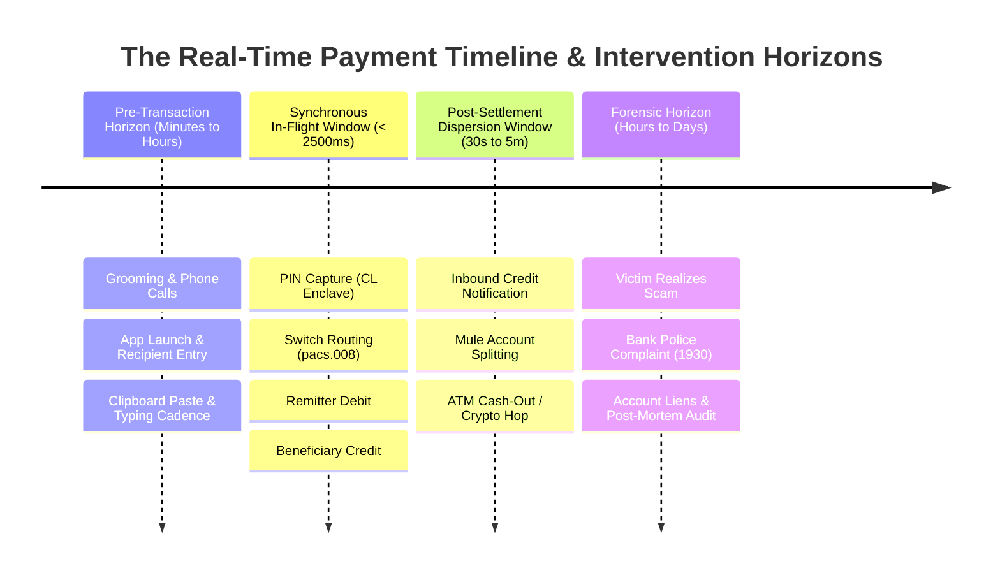

# Real-Time Concepts in Payment Systems: Latency, Synchronicity & Decision Windows

---

## 1. Executive Understanding (Layer 1)

In computer science, **real-time systems** are defined not merely by raw speed, but by **temporal determinism**: the correctness of a computation depends strictly upon both its logical outcome and the delivery of that outcome within an immutable deadline. In payment systems, the phrase **"Real-Time Payments" (RTP)** denotes retail funds transfer rails that provide continuous, immediate, and irrevocable value transfer between accounts 24 hours a day, 365 days a year, with end-to-end clearing and fund availability measured in seconds.

The inclusion of the modifier **"Real-Time"** in the problem statement (*"Agentic Guardian for Real-Time Payment Scam Interception"*) introduces a profound engineering and operational boundary. It dictates that detection and interception must function synchronously within the active transaction execution window, or leverage pre-transaction engagement windows before the payment instruction is committed to the network.

Understanding real-time mechanics is paramount: in instant payment rails, the window between transaction initiation and irreversible settlement is measured in single-digit seconds, while the window between settlement and illicit cash-out by money mules is measured in minutes. A decision delivered even one second after settlement is technically **worthless for interception**.

---

## 2. The Real-Time Payment Latency Hierarchy (Layer 2)

To understand where decisions can occur, the temporal landscape of a payment transaction is divided into distinct operational epochs:



---

## 3. Deep Dive: The Three Classes of Real-Time Processing (Layer 3)

In domain analysis, "real-time" is frequently used loosely. We must distinguish three distinct operational paradigms:

```
+-----------------------------------------------------------------------------------------------+
| Real-Time Processing Taxonomy                                                                |
|                                                                                               |
| Paradigm             Temporal Bound (Deadline)      Application in Payment Systems            |
| -------------------  -----------------------------  ----------------------------------------- |
| **Hard Real-Time**   Strict deadline (< 50ms – 300ms) Inline Fraud Rule Execution, Ledger Debit |
|                      Missing deadline = Protocol    Validation. If timeout occurs, the payment|
|                      failure / connection drop.     is aborted or dropped by the switch.      |
|                                                                                               |
| **Soft Real-Time**   Slightly flexible (500ms – 2s) Payer App UI updates, Confirmation of    |
|                      Value degrades if delayed, but Payee name resolution, pre-flight dynamic |
|                      system does not crash.         risk score calculation.                   |
|                                                                                               |
| **Near-Real-Time**   Seconds to Minutes (5s – 180s) Asynchronous Mule Inflow Surveillance,    |
|                      Post-event data streaming      Complex Event Processing (CEP),           |
|                      (Kafka, Flink, Event Hubs).    Beneficiary Account Freeze / Quarantine.  |
+-----------------------------------------------------------------------------------------------+
```

### 3.1 Pre-Transaction vs. Transaction-Time vs. Post-Transaction Checks

1.  **Pre-Transaction Checks (Pre-Flight Window)**:
    *   *When*: Occurs while the user is inside the payment application formulating the payment (selecting payee, typing note, entering amount).
    *   *Characteristics*: Asynchronous; does not block payment rail switches; can afford richer computation (500ms to 2000ms).
    *   *Signals*: Device telemetry (is a phone call active?), app context (was VPA pasted from clipboard?), behavioral cadence (typing hesitation).
2.  **Transaction-Time Checks (In-Flight Window)**:
    *   *When*: Occurs synchronously between the user tapping "Submit PIN" and the switch returning "Success".
    *   *Characteristics*: Hard real-time; strictly bounded by network socket timeouts (typically < 300ms allocated to fraud evaluation).
    *   *Signals*: Interbank message payload fields (amount, VPA, MCC code, IP, remitter bank risk token).
3.  **Post-Transaction Monitoring (Post-Clearing Window)**:
    *   *When*: Occurs after the payment switch has returned `COMPLETED` and the beneficiary account has been credited.
    *   *Characteristics*: Asynchronous event streaming via message brokers (Kafka/RabbitMQ).
    *   *Signals*: Outflow velocity from beneficiary account, graph clustering of receiving mules.
    *   *Capability*: Cannot intercept the payment (money has already moved); can only freeze downstream accounts before cash-out.

---

## 4. What Changes When a Decision Is Delayed? The Cost of Latency (Layer 3)

The following decay curve illustrates the operational utility of a fraud score or interception command as a function of time:

```
Operational Utility of Interception Command
100% |  [OPTIMAL: Pre-Flight & In-Flight]
     |  Transaction blocked before debit; zero customer loss.
     |
 80% |              [POINT OF NO RETURN: Settlement Commit (T = 1.5s)]
     |              ---------------------------------------------------
 40% |                             [RAPID VALUE DECAY: T = 30s to 180s]
     |                             Mules begin multi-hop automated layering.
  0% +----------------------------------------------------------------- Time
     0s            1.5s            30s           180s          24h (Victim calls police)
```

### 4.1 What Does "Too Late" Mean Conceptually?
In payment scam dynamics, there are two distinct definitions of **"Too Late"**:
1.  **Technical Too Late (T > Settlement SLA, ~2 seconds)**: The moment the central switch writes the credit acknowledgment to its ledger. At this millisecond, the sending bank’s software cannot retract the instruction. The transfer is legally and technically complete.
2.  **Economic Too Late (T > Cash-Out Window, ~90–180 seconds)**: The moment the illicit funds are withdrawn at an ATM, converted into unhosted cryptocurrency, or used to purchase physical bullion. Even if police freeze the beneficiary bank account at T+10 minutes, the account balance is already zero.

---

## 5. Boundaries and Exceptions (Layer 4)

### 5.1 The Misalignment Between AI/Agent Latency and Payment SLAs
*   In contemporary software engineering, autonomous AI agents (powered by large language models or multi-step reasoning frameworks) typically require **2,000 to 15,000 milliseconds** per reasoning step, especially when invoking external tools or APIs.
*   In contrast, payment rail switches allocate **under 300 milliseconds** to external risk scoring hooks before triggering an automated gateway timeout.
*   *Critical Domain Implication*: Placing an LLM-driven agent directly into the synchronous, in-flight authorization pipeline of an instant payment switch is technically impossible under current infrastructure constraints. Any "agentic" interception architecture must operate either **pre-flight** on the client device or **out-of-band** in a streaming near-real-time parallel topology.

### 5.2 Common Misconceptions
*   *Misconception*: "Real-time means immediate, so a 5-second delay is acceptable."
    *   *Reality*: In high-throughput distributed payment networks processing 10,000 transactions per second (such as UPI), an extra 5-second blocking delay would cause massive thread pool exhaustion, gateway queue overflows, and network-wide cascading failures.
*   *Misconception*: "Streaming event architectures (like Apache Kafka) allow real-time payment interception."
    *   *Reality*: Kafka and event-driven architectures are asynchronous publication-subscription systems. They are exceptional for surveillance, analytics, and alerting, but they cannot sit in-line to synchronously block an atomic RPC network request without introducing prohibitive latency.

---

## 6. Traceability & Authoritative Sources

*   **CPMI / Bank for International Settlements (BIS)**: *Fast Payments: Enhancing the speed and availability of retail payments* (Defining real-time clearing, continuous availability, and finality).
*   **National Payments Corporation of India (NPCI)**: *UPI API Service Level Agreements and Operational Timeout Thresholds* (Circular NPCI/UPI/2021-22/045).
*   **Federal Reserve Financial Services**: *FedNow Service Messaging and Settlement Timing Specifications*.
*   **Tanenbaum, A. S., & Van Steen, M.**: *Distributed Systems: Principles and Paradigms* (Foundational computer science literature on synchronous RPC timeouts and latency budgets).
