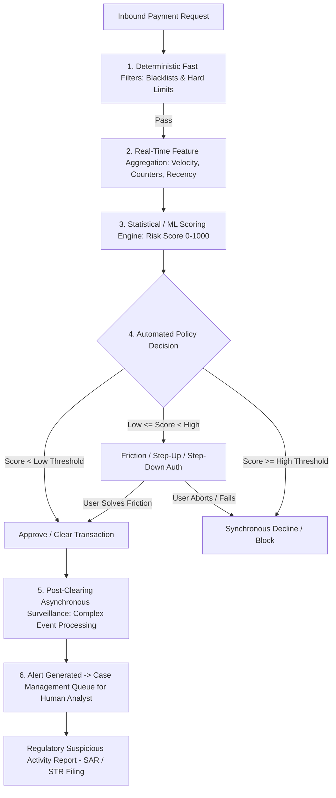

# Fraud & Risk Management Fundamentals: Detection, Monitoring & Operational Workflows

---

## 1. Executive Understanding (Layer 1)

In financial institutions and payment processing networks, **fraud risk management** refers to the comprehensive operational, analytical, and technological discipline employed to identify, assess, mitigate, and resolve illicit financial activity. It operates as a continuous defensive loop that spans **pre-transaction risk assessment**, **real-time synchronous decisioning**, **near-real-time surveillance**, and **post-settlement investigation**.

Historically, fraud management focused on protecting banks from direct balance-sheet loss resulting from unauthorized credit card charges or compromised account takeovers. However, as payment rails have transitioned to real-time, non-reversable instant fund transfers, fraud management teams face an acute operational dilemma: they must evaluate every transaction within a **sub-100 millisecond decision window** while balancing fraud prevention against **customer friction** (false-positive transaction declines that alienate legitimate users).

For scam interception research, understanding how existing risk engines operate is essential. It illuminates why current banking transaction monitoring systems struggle with scams and establishes the baseline operational vocabulary (risk scores, velocity counters, thresholds, alerts, case queues) used across the financial sector.

---

## 2. The Universal Risk Management Pipeline (Layer 2)

Financial fraud risk architectures evaluate transactions through a multi-stage funnel that balances computational latency against analytical depth:



---

## 3. Core Analytical Concepts & Methodologies (Layer 3)

### 3.1 Customer & Transaction Profiling
*   **Customer Profiling (The Baseline)**: Risk engines construct a long-term behavioral baseline for every account holder: typical monthly spending volume, average transaction size, standard transaction hours, usual geographic coordinates, preferred payment categories (groceries, utilities), and common counterparties.
*   **Transaction Profiling (The Event)**: When a payment arrives, the engine compares the current event’s attributes against the historical baseline using statistical distance metrics (e.g., Z-score, Mahalanobis distance).
*   *Scam Vulnerability*: If a wealthy retiree has a baseline of transferring $5,000 to family or investments, a $5,000 scam transfer to a mule account may exhibit zero statistical deviation from their baseline spending amount.

### 3.2 Velocity Monitoring
*   **Velocity Counters**: Real-time distributed counters tracking event frequencies across sliding time windows (e.g., transactions in the last 5 minutes, 1 hour, 24 hours, 7 days).
*   **Dimensional Velocity**: Velocity is tracked across multiple pivot dimensions:
    *   *Payer-centric*: Number of transfers initiated by this user in the past 1 hour.
    *   *Payee-centric*: Number of distinct payers sending money to this beneficiary VPA in the past 10 minutes.
    *   *Device-centric*: Number of different bank accounts accessed from this physical hardware IMEI today.
*   *Scam Relevance*: Payee-centric velocity is one of the most reliable indicators of a money mule account: a newly created account that suddenly receives 15 transfers from 15 different geographic locations within 30 minutes is almost certainly a scam cash-out node.

### 3.3 Rule-Based Heuristics vs. Machine Learning Scoring
*   **Deterministic Rules Engines**: Execute rigid Boolean logic (e.g., `IF amount > $2,000 AND hour BETWEEN 01:00-05:00 AND payee_is_new == TRUE THEN action = CHALLENGE`).
    *   *Strengths*: Ultra-fast execution (<10ms), fully explainable, easy for compliance officers to audit and update.
    *   *Weaknesses*: Brittle, easily bypassed once adversaries deduce the thresholds, high maintenance overhead.
*   **Machine Learning Risk Scoring**: Generates a continuous probabilistic risk score (e.g., 0 to 999) based on gradient-boosted decision trees, random forests, or neural networks trained on historical labeled fraud data.
    *   *Strengths*: Detects complex non-linear combinations of subtle anomalies.
    *   *Weaknesses*: Susceptible to data drift; often trained predominantly on historical *unauthorized* fraud data, leaving blind spots for emerging scam typologies.

---

## 4. Operational Terminology & Case Management Workflows (Layer 3)

When a risk engine flags a transaction, it triggers operational workflows within the bank's Fraud Operations (FraudOps) department:

```
+-----------------------------------------------------------------------------------------------+
| Fraud Operations Vocabulary & Lifecycle                                                       |
|                                                                                               |
| Term                  Definition & Function in Risk Management                                |
| --------------------  ----------------------------------------------------------------------- |
| **Risk Score**        Numerical output (e.g., 0-1000) indicating probability of illicit activity.|
| **Alert**             A system notification triggered when an event crosses a risk threshold. |
| **False Positive (FP)** A legitimate transaction incorrectly flagged, challenged, or blocked. |
| **False Negative (FN)** A fraudulent or scam transaction that successfully bypassed detection.|
| **False Positive Ratio** The ratio of legitimate payments disrupted per single fraud catch   |
|                       (industry standard targets: 10:1 to 30:1; bad models hit 200:1).        |
| **Friction / Step-Up** Introducing secondary challenges (biometric, SMS OTP, phone callback)  |
|                       to confirm intent before committing the transaction.                     |
| **Case Management**   Enterprise ticketing software where high-risk alerts are investigated   |
|                       by human fraud analysts.                                                |
| **SAR / STR**         Suspicious Activity Report / Suspicious Transaction Report—mandatory   |
|                       statutory filings submitted to Financial Intelligence Units (FIU).       |
+-----------------------------------------------------------------------------------------------+
```

### 4.1 The Asynchronous Reality of Human Review
*   Many banking executives claim: *"Our fraud analysts review suspicious payments."*
*   *Domain Reality*: In real-time payment rails, **human analysts never review payments in flight**. With clearing SLAs under 3 seconds, human review is physically impossible. 
*   Human analysts operate purely **ex-post** in case management queues, reviewing alerts hours or days after the funds have settled, primarily to freeze remaining balances, file regulatory SAR reports, or blacklist confirmed mule accounts.

---

## 5. Boundaries and Exceptions (Layer 4)

### 5.1 The Friction Paradox
*   Every layer of security and risk intervention introduces **transaction friction**.
*   If a bank tunes its risk engine aggressively to catch every possible scam, the false positive rate spikes. Legitimate customers face rejected payments when attempting to pay emergency hospital bills, purchase cars, or buy flights.
*   The commercial cost of false positives (lost merchant interchange fees, customer abandonment to competitor banks, customer support call center costs) often exceeds the financial loss of fraud itself. Banks deliberately set risk thresholds to tolerate a certain volume of fraud rather than degrade user experience across millions of clean transactions.

### 5.2 Common Misconceptions
*   *Misconception*: "Banks can simply hold a transaction for 15 minutes to let an analyst or AI investigate."
    *   *Reality*: Payment rail rules strictly penalize or ban participating banks that fail to meet synchronous message response SLAs. Holding a payment in an arbitrary 'limbo' state violates scheme rules and leads to automated system timeouts.
*   *Misconception*: "Anomaly detection catches all scams automatically."
    *   *Reality*: Unsupervised anomaly detection flags *novelty*, not *malice*. A user buying a flight to Paris for the first time is highly anomalous, but legitimate. A user paying a scammer $100 for a bogus utility bill is completely standard in amount, but fraudulent.

---

## 6. Traceability & Authoritative Sources

*   **Federal Financial Institutions Examination Council (FFIEC)**: *Authentication and Access to Financial Institution Services and Systems: Risk Management Guidance* (2021).
*   **Financial Action Task Force (FATF)**: *Guidance on Digital Identity & Transaction Monitoring in Anti-Money Laundering*.
*   **Federal Reserve Bank**: *Payment Fraud Risk Management Framework & Synthetic Identity Mitigation Guidelines*.
*   **UK Finance / Payment Systems Regulator**: *Transaction Monitoring Standards for Confirmation of Payee and APP Scams*.
*   **Hand, D. J., & Blunt, G.**: *Prospecting for Fraud: Statistical Methods for Fraud Detection and Risk Management* (Foundational statistical literature on false-positive tradeoffs).
