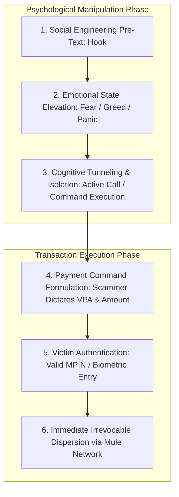

# Scam Fundamentals: Social Engineering & Authorized Push Payment Fraud

---

## 1. Executive Understanding (Layer 1)

In financial and cybercrime terminology, a **scam** is a confidence scheme wherein a perpetrator deceives or manipulates a victim into voluntarily parting with economic assets or executing financial instructions under false pretenses. When executed over electronic payment rails, this phenomenon is formally termed **Authorized Push Payment (APP) fraud**.

The defining characteristic of a payment scam is **voluntary victim authorization**. Unlike unauthorized fraud, where the perpetrator breaches an IT perimeter, intercepts network traffic, or steals authentication secrets, in a scam the legitimate user holds the phone, navigates the banking interface, and physically keys in their private authentication credentials (MPIN, biometric, hardware key). The failure does not occur at the cryptographic, network, or ledger protocol layers; it occurs within the **cognitive decision-making loop of the human user**.

Understanding scam fundamentals is the cornerstone of this project. Traditional defenses fail because the security system is defending the perimeter against an external intruder, while the actual attack vector is psychological manipulation operating through the authorized user’s own hands.

---

## 2. The Mechanics of Deception: The Cognitive Exploitation Loop (Layer 2)

Scams operate by methodically dismantling the victim's rational risk evaluation using established psychological attack vectors:



### 2.1 Core Psychological Attack Primitives

| Psychological Vector | Operational Pre-Text | Victim Cognitive State | Behavioral Indicators |
| :--- | :--- | :--- | :--- |
| **Coercion & Intimidation ("Digital Arrest")** | Impersonation of police, customs, CBI, or tax enforcement claiming victim's Aadhaar/identity is tied to money laundering or narcotics. | **Extreme Terror & Panic**: Victim believes compliance is their only way to avoid immediate physical arrest. | Sustained active video/voice call (>30 mins); high-value transfers; trembling/rapid typing; ignoring app warnings. |
| **Urgency & Crisis Impersonation** | Fake utility notice: "Electricity will be disconnected at 8:00 PM tonight unless outstanding fee of $1.50 is paid immediately." | **Time Scarcity & Cognitive Load**: Victim rushes to resolve nuisance without verifying the source. | Immediate payment after clicking unknown SMS link; payment to random VPA; haste in UI navigation. |
| **Hyper-Greed & Phantom Riches** | Fake cryptocurrency investment schemes, "guaranteed 40% daily yield", part-time Telegram review task schemes. | **Euphoria & Sunk Cost Fallacy**: Victim believes they are depositing into their own investment account. | Sequence of escalating transfers over days; initial small "profit" withdrawn successfully to build trust. |
| **Affection & Romance Manipulation** | Online romantic partner claiming to be a military officer, surgeon, or foreign national stuck in customs or experiencing an emergency. | **Emotional Dependence & Trust**: Victim views transfer as a loving act of rescue. | Payments to newly added personal bank accounts; repeated transfers; emotional distress if questioned. |
| **Inverted Interface Exploitation** | Scammer lists item on marketplace, sends a "Collect Request" or "QR Code" to the seller claiming: "Scan this and enter your PIN to receive the advance payment." | **Technical Illiteracy**: Victim does not understand that a PIN is *only* required to send money, never to receive. | Entering PIN on an incoming payment request; zero delay in confirmation. |

---

## 3. The Conceptual Divide: Unauthorized Fraud vs. Authorized Scam (Layer 3)

The fundamental difference between unauthorized payment fraud and authorized payment scams dictates why entire architectures must change:

```
+----------------------------------------------------------------------------------------------------+
| UNAUTHORIZED FRAUD                                 AUTHORIZED PUSH PAYMENT (APP) SCAM             |
+----------------------------------------------------------------------------------------------------+
| Who enters credentials?                            Who enters credentials?                         |
| -> The Attacker / Malware / Bot                    -> The Genuine Account Holder                   |
|                                                                                                    |
| Where does the request originate?                  Where does the request originate?               |
| -> Compromised device, alien IP, emulator          -> The victim's genuine everyday smartphone     |
|                                                                                                    |
| What does 2FA / MFA accomplish?                    What does 2FA / MFA accomplish?                 |
| -> BLOCKS the attack (attacker lacks token)        -> COMPLETES the attack (victim willingly signs)|
|                                                                                                    |
| Where is the point of failure?                     Where is the point of failure?                 |
| -> Access control / Perimeter authentication       -> Payer perception, intent, and cognitive state|
|                                                                                                    |
| What is the legal status of the transfer order?    What is the legal status of the transfer order? |
| -> Void / Ultra Vires (Bank had no valid mandate)  -> Legally valid mandate executed per customer  |
|                                                                                                    |
| How does the victim react upon discovery?          How does the victim react during transaction?   |
| -> "My account was hacked without my knowledge!"   -> "I am voluntarily paying this official/fund!"|
+----------------------------------------------------------------------------------------------------+
```

### 3.1 The "Consent Paradox" in Scam Defense
*   In unauthorized fraud, the account holder is the ally of the defense system; they want unauthorized transactions stopped.
*   In an APP scam, **the victim actively fights the defense system**. If an automated banking system displays a warning ("This account has been flagged for fraud"), the victim—conditioned by the scammer on an active phone call—will often override the warning, click through confirmation dialogues, or invent false justifications when questioned by bank staff ("Yes, I know this recipient, it is my nephew").
*   This makes scam defense an adversarial problem not merely between the bank and the scammer, but between the protective system and the manipulated victim’s hijacked intent.

---

## 4. Scammer-Controlled Payment Topologies (Layer 3)

Scammers orchestrate specific payment topologies depending on the level of technical sophistication:

```mermaid
graph TD
    subgraph Topology 1: Direct Push
        Victim1[Victim] -->|Sends UPI/RTP| Mule1[First-Hop Personal Mule]
    end

    subgraph Topology 2: Inverted Pull / Collect Request
        Scammer2[Scammer] -->|Sends Collect Request / QR| Victim2[Victim]
        Victim2 -->|Enters PIN thinking it's 'Receive'| Scammer2
    end

    subgraph Topology 3: Screen-Sharing Shadowing
        Victim3[Victim Phone] -.->|AnyDesk / TeamViewer Stream| Scammer3[Scammer Laptop]
        Victim3 -->|Logs into Banking App| Victim3
        Scammer3 -->|Views Credentials & OTPs| Scammer3
    end

    subgraph Topology 4: Merchant Aggregator Impersonation
        Victim4[Victim] -->|Pays Fake Payment Gateway| PaymentGateway[Fake Merchant API]
        PaymentGateway -->|Funds Credited| ShellCorp[Shell Company Merchant Account]
    end
```



1.  **Direct Push (P2P)**: The victim manually enters the scammer's VPA, IBAN, or mobile number and pushes funds directly.
2.  **Inverted Pull (P2P Collect)**: The scammer generates a `Collect Request` (debit pull request) and presents it as an incoming credit, exploiting the victim's ignorance of payment protocols.
3.  **Screen-Sharing Remote Control**: The victim is instructed to install a remote access tool (e.g., AnyDesk, TeamViewer, RustDesk) under the guise of "customer support". The scammer observes the screen, steals secondary OTPs, or guides the victim through transfers.
4.  **Merchant Shell Gateways (P2M)**: Scammers establish fraudulent merchant accounts with online aggregators (disguised as e-commerce or travel booking sites) and direct victims to pay a "merchant gateway", bypassing P2P fraud thresholds.

---

## 5. Boundaries and Exceptions (Layer 4)

### 5.1 APP Scams vs. Civil Disputes
A critical boundary in banking and regulatory enforcement is separating a **criminal scam** from a **commercial civil dispute**:
*   *APP Scam*: Characterized by intentional, premeditated deceit and criminal intent from inception. The goods, services, investment returns, or authority never existed (e.g., fake customs officer, completely fictitious investment portal).
*   *Civil Dispute*: A genuine commercial transaction where fulfillment failed or product quality was substandard (e.g., customer bought shoes from an online store, but the wrong size arrived or delivery was delayed). 
*   *Relevance*: Interception systems cannot treat civil disputes as criminal scams without destroying legitimate merchant commerce and incurring catastrophic false-positive costs.

### 5.2 Common Misconceptions
*   *Misconception*: "Scams only happen to gullible, elderly, or uneducated people."
    *   *Reality*: Empirical cybercrime data shows high prevalence across tech-literate, young demographics (specifically via investment scams, crypto schemes, and job task scams). Scams exploit universal cognitive biases (fear, greed, trust, social proof), not lack of intelligence.
*   *Misconception*: "If we educate users, scams will disappear."
    *   *Reality*: Decades of security awareness training show that in high-stress, high-fear emotional states ("digital arrest"), cognitive reasoning degrades. Awareness campaigns reduce baseline gullibility but fail when active psychological conditioning is applied.

---

## 6. Traceability & Authoritative Sources

*   **Payment Systems Regulator (UK)**: *Fighting Authorised Push Payment Scams: Final Decision (PS23/3)*.
*   **Federal Trade Commission (FTC)**: *Consumer Sentinel Network Data Book: Impersonation & Investment Scams* (2023).
*   **Reserve Bank of India (RBI)**: *Annual Report of the Ombudsman Schemes & Warnings on Digital Arrest Schemes* (2023–2024).
*   **Cialdini, R. B.**: *Influence: The Psychology of Persuasion* (Foundational psychological literature on authority, social proof, urgency, and scarcity).
*   **Financial Crimes Enforcement Network (FinCEN)**: *Financial Trend Analysis: Rapid Movement of Illicit Proceeds via Instant Payment Platforms*.
