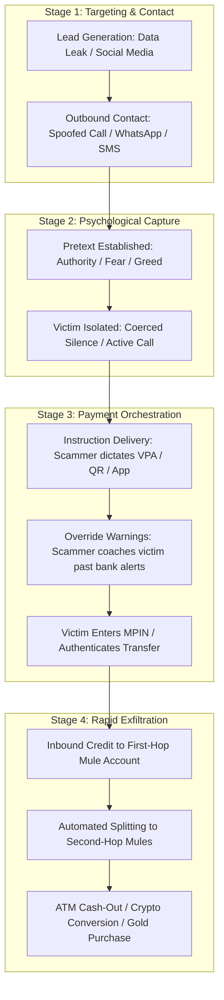

# Payment Scam Mechanisms: Operational Anatomy & Behavioral Vectors

---

## 1. Executive Understanding (Layer 1)

Payment scams are not random, chaotic occurrences; they are structured, reproducible operational pipelines deployed by organized cybercrime syndicates. Unlike opportunist crime, modern scam operations feature specialized divisions of labor: **lead generators** (who harvest target phone numbers and personal data), **social engineers / callers** (who maintain the psychological pre-text and manipulate the victim), **tech facilitators** (who set up spoofed portals, fake apps, or rogue APKs), and **mule network controllers** (who manage the laundering and cash-out pipelines).

The core mechanism of a payment scam involves subverting the victim’s situational awareness so that a voluntary fund transfer appears to the victim as necessary, urgent, official, or profitable. By understanding the end-to-end operational mechanics—from initial contact to final off-ramping—researchers can identify the precise observational signals (behavioral, transactional, network) that manifest during the attack.

---

## 2. The Universal Scam Lifecycle (Layer 2)

Regardless of the specific narrative (police impersonation, electricity bill, romantic interest, or bogus crypto fund), virtually all payment scams advance through four structural stages:



---

## 3. Deep Dive: The Operational Mechanics (Layer 3)

### 3.1 Vector 1: The Initial Approach & Pre-Text Establishment
Scammers select communication channels based on the cognitive state they intend to induce:
*   **Voice Telephony (GSM / VoIP / WhatsApp Audio)**: Used when high emotional urgency and immediate compliance are required (impersonation, digital arrest, family kidnapping scam). Voice allows real-time acoustic monitoring of the victim’s emotional agitation.
*   **Messaging Platforms (Telegram / WhatsApp / SMS)**: Used for recruitment, investment grooming, and task-based scams where asynchronous links, fake dashboard screenshots, and group "social proof" (shill accounts posting fake profits) are leveraged.
*   **Search Engine Spoofing (SEO Poisoning)**: Scammers place sponsored ads on Google Search for customer care numbers of airlines, banks, courier services, or utility providers. When the victim calls, they connect directly to the scam center.

### 3.2 Vector 2: Overcoming Cognitive Friction & Warning Signals
A critical phase of the scam mechanism is **warning neutralization**. Scammers are intimately familiar with payment app warning screens and proactively de-bias the victim before the bank’s alert can appear:

```
+-----------------------------------------------------------------------------------------------+
| The Pre-Emptive Warning Neutralization Script                                                 |
|                                                                                               |
| Scammer Instruction to Victim:                                                                |
| "Sir, when you enter this official government verification VPA, your bank's app will show a   |
| red warning saying 'Unknown Beneficiary' or 'High Risk'. Do not panic. That is normal for     |
| government escrow security transfers because commercial banks do not want you to transfer     |
| funds out of their accounts. Just tap 'Proceed Anyway' and enter your PIN to verify."         |
|                                                                                               |
| Result: When the bank's static fraud warning appears, it CONFIRMS the scammer's narrative     |
| rather than warning the user. The warning backfires completely.                               |
+-----------------------------------------------------------------------------------------------+
```

### 3.3 Vector 3: Payment Formulation & Routing
Scammers manipulate payment formulation using three primary techniques:
1.  **Direct VPA / Account Dictation**: Scammer sends a Virtual Payment Address (e.g., `police.verification.dept@okaxis`) registered to a mule account.
2.  **Dynamic QR Code Generation**: Scammer sends a pre-filled QR code encoding a high-value merchant or P2P credit transfer, instructing the victim: "Scan this official clearance code."
3.  **Inverted Collect Request**: The scammer dispatches a UPI collect request for $500, telling the victim: "I have sent you the $500 refund; enter your PIN to accept the funds into your bank account."

---

## 4. Representative Scenarios: Mechanistic Breakdown (Layer 3)

To clarify how mechanisms diverge, consider three representative operational scenarios:

### Scenario A: The High-Stress Coercion Scam ("Digital Arrest")
*   *Pretext*: Fake police/customs officer claims a courier containing narcotics in the victim's name was intercepted.
*   *Mechanism*: Victim is ordered onto a continuous WhatsApp video call showing fake police station backgrounds. Scammer displays fabricated Supreme Court arrest warrants.
*   *Payment Action*: Scammer instructs victim to liquidate fixed deposits and transfer total savings to a "Reserve Bank Supervision Escrow Account" for financial auditing, promising full refund upon clearance.
*   *Distinguishing Characteristics*: High monetary value; elderly or high-net-worth victim; sustained active telephone call during the payment session; intense panic.

### Scenario B: The Sunk-Cost Task / Investment Scam
*   *Pretext*: "Part-time job rating hotels or YouTube videos from home for $50/day."
*   *Mechanism*: Victim completes trivial tasks and receives real small payments ($5–$20) into their bank account to build absolute trust. Victim is then invited to a "VIP Investment Tier" requiring deposits.
*   *Payment Action*: Victim sends escalating payments ($100 -> $500 -> $2,500 -> $10,000) over days, seeing their "balance" multiply on a fake website. When they attempt to withdraw, the scammer demands a 30% "tax clearance deposit."
*   *Distinguishing Characteristics*: Sequence of increasing transfers to different mule accounts over days; victim is completely cooperative; zero sense of fear; driven by greed and sunk-cost fallacy.

### Scenario C: The Technical Confusion / Screen-Sharing Scam
*   *Pretext*: "Technical support fixing a failed electricity bill or bank KYC update."
*   *Mechanism*: Scammer instructs victim to install AnyDesk/TeamViewer. Scammer asks victim to make a nominal "1 rupee test transfer" to verify the connection.
*   *Payment Action*: Scammer watches screen as victim inputs credentials, or blacks out the victim’s screen while rapidly initiating high-value transfers in the background.
*   *Distinguishing Characteristics*: Screen-sharing or accessibility tool active; remote IP connection; anomalous pacing or rapid automated UI clicking.

---

## 5. What Makes Scam Transactions Difficult to Distinguish from Legitimate Ones? (Layer 4)

From a pure transaction metadata perspective, scam transactions mimic legitimate commerce almost perfectly:

```
+-----------------------------------------------------------------------------------------------+
| Transaction Payload Comparison                                                                |
|                                                                                               |
| Attribute            Legitimate High-Value Payment        Scam-Induced Payment                |
| -------------------  -----------------------------------  ----------------------------------- |
| Payer Account        Active account, 5-year history       Active account, 5-year history      |
| Device ID            Known iPhone 14 (Registered)         Known iPhone 14 (Registered)        |
| Device Location      Home Wi-Fi (Bangalore)               Home Wi-Fi (Bangalore)              |
| Authentication       Valid 6-digit MPIN entered           Valid 6-digit MPIN entered          |
| Payment Method       UPI P2P Credit Transfer              UPI P2P Credit Transfer             |
| Amount               $1,500                               $1,500                              |
| Payment Note         "House rent"                         "House rent" (Coached by scammer)   |
| Destination VPA      `rajesh.sharma@hdfcbank`             `rajesh.sharma@hdfcbank` (Mule)     |
+-----------------------------------------------------------------------------------------------+
```

### Why Rules-Based Systems Fail:
1.  **Valid Credentials**: The transaction is cryptographically indistinguishable from a legitimate transfer.
2.  **Payer Baseline Conformity**: The payment originates from the authentic customer's usual device, IP, and location.
3.  **Innocuous Metadata**: Scammers instruct victims to enter innocent payment notes ("personal loan", "advance rent") to prevent keyword-based risk triggers.
4.  **Mule Cloaking**: The destination account is a real bank account registered under a real domestic citizen's KYC credentials.

---

## 6. Traceability & Authoritative Sources

*   **National Cyber Crime Reporting Portal (I4C, MHA, India)**: *Citizen Financial Cyber Fraud Reporting and Management System (CFCFRMS) Annual Threat Dossier*.
*   **Global Anti-Scam Alliance (GASA)**: *The State of Scams Worldwide: Annual Global Scam Report* (2023).
*   **UK Finance**: *Annual Fraud Report: Detailed Breakdown of Authorised Push Payment Scam Categories*.
*   **Federal Bureau of Investigation (FBI) IC3**: *Internet Crime Report: Investment Fraud and Tech Support Scams* (2023).
*   **Australian Competition and Consumer Commission (ACCC)**: *Targeting Scams: Report of the ACCC on Scam Activity* (Scamwatch Data).
