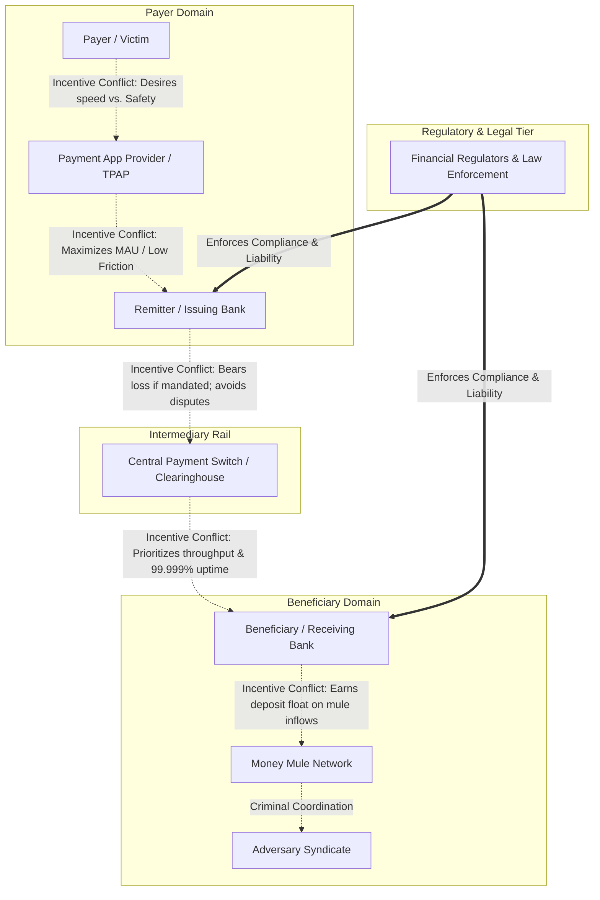

# Actor & Incentive Model: Systemic Dynamics, Blind Spots & Conflicts of Interest

---

## 1. Executive Summary

A critical error in financial crime engineering is treating payment scams as the result of "bad actors exploiting naive victims". In reality, payment scams persist because the modern payments ecosystem is populated by **multiple rational institutional actors operating under misaligned incentives, information asymmetries, and conflicting operational priorities**.

This document constructs a comprehensive **actor-incentive model** for the eight core participants in the payment scam lifecycle. For each actor, it systematically analyzes their **core goals, commercial incentives, legal responsibilities, technical capabilities, visible vs. invisible information, critical decisions, operational constraints, specific failure modes, and structural conflicts of interest**.

---

## 2. Multi-Actor Dynamics & Conflict Map

---

## 3. Exhaustive Actor Profiles

### 3.1 Actor 1: The Payer / Victim
*   **Primary Goals**: Complete financial transactions quickly; avoid legal trouble; resolve urgent household crises; earn high investment returns; protect family.
*   **Incentives**: Driven by immediate emotional payoff (relief from fear, excitement of profit, resolution of an emergency). Highly incentivized to bypass any obstacle or friction slowing down their goal.
*   **Responsibilities**: Maintain confidentiality of MPIN/passwords; exercise reasonable care in verifying counterparties.
*   **Capabilities**: Can initiate, authenticate, or abort payment instructions on their personal smartphone.
*   **Information Available**: Sees the app UI, destination VPA, resolved beneficiary name, transfer amount, and on-screen warnings.
*   **Information Unavailable**: Completely blind to destination account age, inbound mule velocity, scammer’s physical location, or historical fraud complaints against the VPA.
*   **Key Decisions**: Decides whether to believe the scammer's pre-text; decides to input secret MPIN; decides whether to dismiss bank warning dialogues.
*   **Operational Constraints**: Severe cognitive load under stress; limited technical understanding of payment protocols (pull vs. push).
*   **Primary Failure Mode**: **Cognitive Capture & De-biasing**. Systematically rationalizes away warnings because the scammer has pre-conditioned them to expect bank interference.
*   **Conflict of Interest**: Wants total freedom to spend their own money instantly without paternalistic bank blocks, but expects the bank to refund them if the payment turns out to be a scam.

---

### 3.2 Actor 2: The Adversary Syndicate (Callers, Hackers, Groomers)
*   **Primary Goals**: Maximize financial extraction per victim; minimize operational cost; avoid physical detection and arrest.
*   **Incentives**: Pure financial profit. Operating on high commission splits (e.g., 50% to caller, 20% to mule network, 30% to syndicate leadership).
*   **Responsibilities**: Develop high-converting social engineering scripts; manage VoIP infrastructure; maintain cognitive control over victims until clearing commit.
*   **Capabilities**: Advanced psychological manipulation, caller ID spoofing, staged video environments, rapid automated tool deployment.
*   **Information Available**: Leaked victim PII (Aadhaar, address, bank name), real-time emotional state of victim via audio/video stream, deep knowledge of bank UI warnings.
*   **Information Unavailable**: Exact real-time bank account balance of the victim (must induce victim to reveal it); internal bank fraud risk scores.
*   **Key Decisions**: Chooses which scam script to deploy; dictates exact payment amount and VPA; coaches victim past warning dialogues.
*   **Operational Constraints**: Vulnerable to victim delays (if victim consults a family member, the scam collapses); constantly requires fresh mule accounts as old ones are blacklisted.
*   **Primary Failure Mode**: Victim hesitates and consults an independent third party; phone call disconnects before PIN is submitted.

---

### 3.3 Actor 3: The Money Mule Network (Account Holders & Handlers)
*   **Primary Goals**: Monitize bank account access; rapidly transfer incoming funds to secondary nodes; cash out via ATMs or crypto.
*   **Incentives**: Earn commission fees (5% to 10% per transaction) for providing clean banking rails to the syndicate.
*   **Responsibilities**: Open bank accounts using authentic KYC; hand over net-banking credentials and debit cards to syndicate handlers; execute physical ATM withdrawals or P2P crypto purchases.
*   **Capabilities**: Immediate access to debit cards, net-banking passwords, and linked SIM cards across dozens of commercial banks.
*   **Information Available**: Incoming credit SMS alerts; OTPs for outbound transfers.
*   **Information Unavailable**: The identity of the victim; the specific scam narrative used to extract the money.
*   **Key Decisions**: Decides when and where to withdraw cash; decides which secondary mule account to forward funds to.
*   **Operational Constraints**: Account lifespan is typically limited to 24 to 72 hours before police liens or bank AML freezes lock remaining balances.
*   **Primary Failure Mode**: Bank fraud engine freezes the account while funds are still sitting in the ledger before cash-out occurs.

---

### 3.4 Actor 4: The Third-Party Application Provider (TPAP - PhonePe, Google Pay, Paytm)
*   **Primary Goals**: Maximize Monthly Active Users (MAU); maximize transaction throughput; maximize user engagement and ecosystem retention.
*   **Incentives**: Commercial revenue tied to transaction volume, merchant processing fees, in-app financial product cross-selling, and platform market share.
*   **Responsibilities**: Provide a smooth, secure, and compliant UI; implement NPCI/RBI mandated warning banners; pass encrypted payloads to sponsor banks.
*   **Capabilities**: Deep client-side telemetry: captures typing cadence, touch hesitation, app navigation pacing, clipboard events, and device sensor state.
*   **Information Available**: High-resolution user interaction context on the handset; destination VPA; user transaction history within this specific app.
*   **Information Unavailable**: Core banking ledger balance; historical activity of the user across *other* payment apps; internal beneficiary account history at receiving bank.
*   **Key Decisions**: Decides UI layout, styling of warning dialogues, and whether to inject friction (e.g., confirmation modals).
*   **Operational Constraints**: Strict prohibition against accessing or modifying the secure Common Library MPIN window; intense commercial pressure to eliminate user friction.
*   **Primary Failure Mode**: Renders generic, passive warning dialogues that users dismiss instantly due to warning habituation.
*   **Conflict of Interest**: **Friction vs. Growth**. Adding friction (e.g., a mandatory 60-second pause or cognitive test) protects users from scams, but drives users to switch to a competing payment app that offers faster, friction-free checkout.

---

### 3.5 Actor 5: The Remitter / Issuing Bank (Payer Bank)
*   **Primary Goals**: Protect deposit balances; maintain low customer service costs; satisfy regulatory compliance; avoid operational losses.
*   **Incentives**: Minimizing liability for fraud claims while maintaining high customer satisfaction and low infrastructure downtime.
*   **Responsibilities**: Authenticate customer credentials in hardware HSMs; verify ledger solvency; execute debit instructions; report fraud to central authorities.
*   **Capabilities**: Final authority to approve or decline the debit instruction (`Approve` / `Decline: Risk`); can freeze customer accounts.
*   **Information Available**: Payer account balance, historical turnover baseline, past transaction velocity, KYC status, and customer age.
*   **Information Unavailable**: Completely blind to real-time client screen state, active phone calls, user psychological stress, and beneficiary account state.
*   **Key Decisions**: Decides whether to clear the transaction within its 800ms CBS decision window; decides whether to honor post-scam customer dispute claims.
*   **Operational Constraints**: Hard latency timeout SLAs imposed by the central switch; common law duty of mandate penalizing wrongful dishonor.
*   **Primary Failure Mode**: Approves scam transactions because all cryptographic credentials and device fingerprints match the legitimate customer baseline perfectly.
*   **Conflict of Interest**: If the legal regime does not mandate reimbursement for authorized scams (e.g., traditional Indian/US rules), the bank has **zero direct balance-sheet loss** when a customer is scammed. Implementing expensive fraud systems yields no direct financial return.

---

### 3.6 Actor 6: The Beneficiary / Acquiring Bank (Payee Bank)
*   **Primary Goals**: Grow deposit base; expand customer accounts; maximize incoming clearing volume; avoid AML regulatory sanctions.
*   **Incentives**: Commercial growth driven by acquiring new account holders; earning float interest on balances sitting in customer accounts.
*   **Responsibilities**: Conduct rigorous Know Your Customer (e-KYC) onboarding; monitor accounts for suspicious Anti-Money Laundering (AML) patterns; freeze illicit accounts upon law enforcement notice.
*   **Capabilities**: Complete historical and real-time visibility into the destination account: account tenure, inflow velocity, rapid cash-out attempts, IP geolocations.
*   **Information Available**: High-resolution destination account telemetry: knows if account was opened 2 days ago and has received 15 rapid incoming transfers.
*   **Information Unavailable**: Zero knowledge of the payer’s identity, mental state, or whether the inbound transfer was coerced.
*   **Key Decisions**: Decides whether to allow instant withdrawal of incoming funds; decides whether to freeze accounts on risk score triggers.
*   **Operational Constraints**: Risk of false-positive account freezes disrupting legitimate small businesses; customer support costs of handling frozen account complaints.
*   **Primary Failure Mode**: Fails to detect freshly activated mule accounts; allows rapid ATM cash-out within 90 seconds of fund arrival.
*   **Conflict of Interest**: **Deposit Inflow vs. Friction**. Receiving banks benefit from deposit inflows and account creation metrics. Unless held legally liable for scam losses (as under the UK 50/50 split mandate), receiving banks have minimal incentive to aggressively block incoming transfers.

---

### 3.7 Actor 7: The Central Payment Network Switch (NPCI / FedNow / Pay.UK)
*   **Primary Goals**: Maximize network throughput; ensure 99.999% high availability; enforce protocol standards across participating member banks.
*   **Incentives**: Volume-based scheme fees; maintaining institutional credibility as the national payment backbone.
*   **Responsibilities**: Route interbank clearing messages; calculate multilateral net settlement positions; maintain centralized directory mappings (VPA to Account).
*   **Capabilities**: Sees macro network transaction flows across all participating commercial banks in real time.
*   **Information Available**: Payer VPA, Payee VPA, Remitter IFSC, Beneficiary IFSC, Amount, Timestamp, Merchant Category Code.
*   **Information Unavailable**: Zero client-side behavioral context; zero visibility into customer account balance histories.
*   **Key Decisions**: Decides network timeout thresholds; decides whether to reject messages routed to centralized blacklist registries.
*   **Operational Constraints**: Extreme throughput requirements (>10,000 TPS) requiring sub-100ms packet switching without heavy analytical overhead.
*   **Primary Failure Mode**: Acts purely as a passive routing switch; passes fraudulent messages with identical speed to legitimate commercial messages.

---

### 3.8 Actor 8: Financial Regulators & Law Enforcement (RBI, I4C, Police)
*   **Primary Goals**: Protect consumer economic welfare; preserve public trust in national digital infrastructure; deter criminal syndicates; recover stolen assets.
*   **Incentives**: Public accountability, political mandates, national economic security.
*   **Responsibilities**: Issue binding security directives; arbitrate customer ombudsman complaints; coordinate interbank account freezing infrastructure (e.g., Indian `1930` helpline).
*   **Capabilities**: Statutory authority to mandate liability rules, impose fines on non-compliant banks, and issue judicial account freeze orders.
*   **Information Available**: Aggregated macro fraud statistics, formal police First Information Reports (FIRs), national cybercrime portal complaints.
*   **Information Unavailable**: Real-time transaction streams (relies on periodic regulatory reporting or post-incident victim complaint filings).
*   **Key Decisions**: Decides whether to shift financial liability to banks (e.g., UK PSR model); decides whether to mandate strict transaction friction.
*   **Operational Constraints**: Police forces are severely understaffed and technologically outmatched by transnational cybercrime cartels; cross-border jurisdictional gridlock.
*   **Primary Failure Mode**: Post-facto enforcement. Interventions occur hours or days after the crime, resulting in <2% asset recovery rates.

---

## 4. Synthesis: The Systemic Ecosystem Trap

When these eight actors interact, they create a self-reinforcing systemic equilibrium that allows scams to flourish:
1.  The **Victim** is psychologically captured and fights the system.
2.  The **TPAP** fears adding friction because it loses users to competitors.
3.  The **Sending Bank** has no balance-sheet loss (under traditional rules) and lacks client context.
4.  The **Switch** must maintain sub-second throughput and cannot perform heavy reasoning.
5.  The **Receiving Bank** earns deposit metrics and lacks payer context.
6.  The **Mule** rapidly disperses funds before **Law Enforcement** can issue a manual freeze order.

**Conclusion**: Payment scams persist not because criminals are geniuses, but because **the ecosystem's structural architecture divides information, authority, and incentives across decoupled participants who cannot coordinate in real time.**
