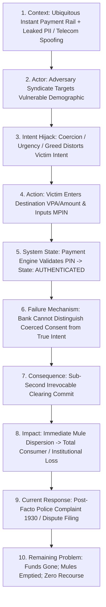

# Core Problem Definition: The Anatomy of Real-Time Payment Scams

---

## 1. Formal Definition of the Core Problem

The core problem investigated in this project is **not** that payment networks are insecure, nor that encryption algorithms are vulnerable, nor that mobile apps are buggy. The core problem is:

> **The total structural decoupling between cryptographic authentication and genuine human intent in instant, irrevocable payment systems.**

In modern retail payment networks (such as UPI in India, Faster Payments in the UK, and Pix in Brazil), identity and authorization are verified purely through possession of cryptographic credentials (e.g., MPIN, biometric token, SMS OTP). When an adversary successfully manipulates an account holder's psychological state through deception, fear, or urgency, the authentic user willingly generates and presents valid cryptographic credentials. 

Because the payment infrastructure is designed to execute authentic instructions immediately and irrevocably, the system **faithfully and flawlessly transfers funds to an adversary-controlled mule network within seconds**, after which the funds are permanently irretrievable.

---

## 2. What Makes This a Problem? (The Structural Dilemma)

This phenomenon constitutes a severe and escalating crisis in global financial engineering due to four converging systemic properties:

```
+----------------------------------------------------------------------------------------------------+
| THE FOUR PILLARS OF THE SCAM INTERCEPTION DILEMMA                                                 |
|                                                                                                    |
| 1. THE CONSENT PARADOX                                                                             |
|    - The victim believes the transfer is necessary, urgent, or beneficial.                        |
|    - Security controls treat the user as the authority; here, the user is the vulnerability.      |
|    - Paternalistic friction is actively bypassed or resented by the victim.                       |
|                                                                                                    |
| 2. ASYMMETRIC TEMPORAL DYNAMICS                                                                    |
|    - Clearing and settlement: 1 to 3 seconds (Instant, Irrevocable).                               |
|    - Downstream mule dispersion: 90 to 180 seconds (Automated Layering).                           |
|    - Victim realization & reporting: 2 to 24 hours (Average post-scam shock/discovery window).     |
|    - Result: Intervention is too late before the victim even realizes a crime has occurred.        |
|                                                                                                    |
| 3. DISTRIBUTED INFORMATION SILOS                                                                   |
|    - The Payer App sees behavioral hesitation and active phone calls, but zero recipient history.  |
|    - The Sending Bank sees balance and account velocity, but zero client device state.             |
|    - The Central Rail sees routing metadata, but has <200ms and zero behavioral context.           |
|    - The Beneficiary Bank sees mule account anomalies, but has no visibility into the payer.       |
|                                                                                                    |
| 4. FRICTION VS. COMMERCE TENSION                                                                   |
|    - 99.8% of daily instant payment volume is legitimate commerce and personal transfers.          |
|    - Heavy, blunt friction (e.g., cooling periods, phone calls) destroys the utility of RTP.       |
|    - False positives cause immediate commercial loss, user frustration, and merchant abandonment.  |
+----------------------------------------------------------------------------------------------------+
```

---

## 3. The Universal Problem Causal Chain

The problem manifests through a deterministic operational chain linking external manipulation to irreversible economic loss:



### 3.1 Step-by-Step Chain Deconstruction

1.  **Context**: The widespread adoption of low-cost, smartphone-based instant payment rails (UPI handling >14 billion transactions monthly in India) paired with widespread leaks of personal identifying information (PII) from telecommunications and commercial databases.
2.  **Actor**: Professional transnational scam syndicates operating industrial call centers deploy tailored psychological scripts.
3.  **Intent Hijack**: Through social engineering (impersonating law enforcement, tax officials, or customer support), the scammer overrides the victim’s critical thinking, establishing **cognitive tunneling**.
4.  **Action**: Under active coaching, the victim opens their payment app, inputs the scammer's beneficiary identifier (VPA/QR), and confirms the payment details.
5.  **System State**: The mobile app invokes the secure enclave; the victim enters their authentic secret credential (MPIN/biometric). The enclave generates an authentic cryptogram.
6.  **Failure Mechanism**: The remitter bank’s fraud detection system evaluates the transaction. The device fingerprint is genuine, the geolocation is normal, and the MPIN is correct. The system cannot observe the user’s mental state or active phone call.
7.  **Observable Consequence**: The transaction is cleared and posted in < 1,500 milliseconds. Value transfers irrevocably across the switch.
8.  **Impact**: The victim loses savings; within 120 seconds, the funds are split across multiple second-hop mule accounts and withdrawn at ATMs or converted to crypto.
9.  **Current Response**: Hours later, the victim realizes the deceit and calls the bank or national helpline (`1930`).
10. **Remaining Problem**: The recipient account balance is already zero. The bank denies liability because the transfer was authorized. Law enforcement cannot recover the dispersed funds.

---

## 4. Who Experiences the Problem? (Stakeholder Impact Matrix)

The problem generates asymmetric harms and operational burdens across multiple ecosystem participants:

| Participant | Nature of the Problem Experienced | Measurable Harm / Burden |
| :--- | :--- | :--- |
| **Payer / Victim** | Direct, unrecoverable monetary loss; acute psychological distress, depression, and loss of confidence in digital public infrastructure. | Complete depletion of savings; average scam loss in digital arrest cases exceeds $5,000 to $50,000. |
| **Sending Bank / PSP** | Severe reputational degradation, surging call-center dispute volumes, regulatory scrutiny, and looming mandatory reimbursement liability. | High operational cost to investigate unrecoverable fraud; customer attrition to competitors. |
| **Beneficiary Bank** | Unwittingly hosts criminal infrastructure (mule accounts); faces AML/CFT compliance audits, regulatory fines, and account lien enforcement overhead. | Regulatory penalties from central banks for substandard e-KYC and negligent mule surveillance. |
| **Payment Network Operator** | Systemic risk; degradation of public trust in real-time retail payment rails; friction between participating member banks. | Political pressure and threat of heavy regulatory caps on transaction limits or processing fees. |
| **Law Enforcement / Regulators** | Overwhelmed by massive volumes of cross-jurisdictional, low-to-medium value digital crimes that cannot be solved with traditional policing. | Case clearance rates for digital payment scams remain below 2% to 5% globally. |

---

## 5. Under What Circumstances Does the Problem Occur?

Empirical analysis of reported scam incidents across India (I4C), the UK (PSR), and the US (FTC) reveals that scams occur predominantly under four specific operational conditions:

1.  **Channel Asymmetry**: The interaction inducing the scam occurs on an **unmonitored external communications channel** (GSM telephone call, WhatsApp audio, Telegram group), while the execution occurs on a decoupled payment application.
2.  **High-Emotionality Cognitive States**: The victim is plunged into acute fear (threat of immediate physical arrest), time panic (utility disconnection in 30 minutes), or euphoric greed (guaranteed 300% investment returns).
3.  **Novel Recipient Counterparty**: The transaction is routed to a Virtual Payment Address or bank account with which the payer has **zero prior transaction history**.
4.  **Absence of Shared Interbank Context**: The sending bank has no access to the beneficiary account's real-time risk status (e.g., account opened yesterday, high inbound velocity, zero historical balance).

---

## 6. Core Problem Synthesis

To summarize: **The real-time payment scam problem is not an authentication failure, but a situational awareness failure.**

The payment ecosystem possesses world-class protocols to verify *who* is transacting, but possesses virtually zero capability to verify *why* they are transacting, *under whose influence* they are acting, and *where* the funds are actually going in real time.
