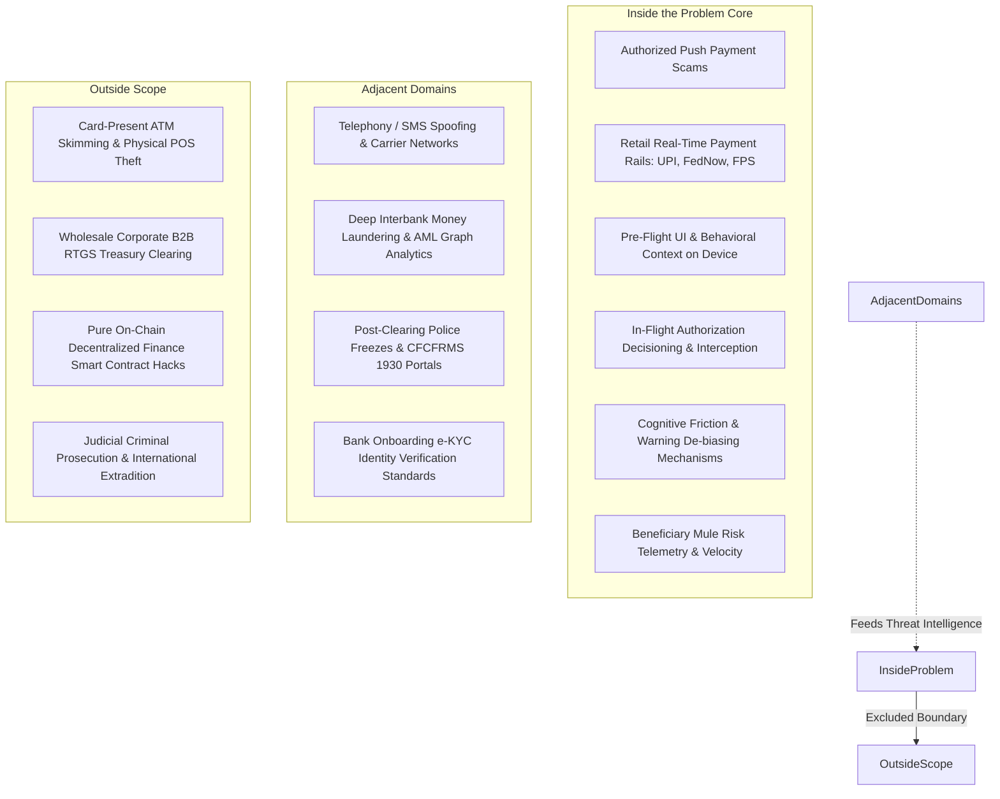

# Problem Boundaries: Scope Calibration & Boundary Uncertainties

---

## 1. Executive Summary

A common failure mode in complex engineering initiatives is **scope ambiguity**: either expanding the problem so broadly that the team attempts to solve all financial crime and cyber warfare, or narrowing it so artificially that the resulting analysis only addresses trivial edge cases.

This document formally establishes the **tripartite boundary taxonomy** for the project:
1.  **Inside the Problem**: Phenomena, actors, protocols, and failure modes that are core, necessary, and direct components of real-time payment scam interception.
2.  **Adjacent to the Problem**: Domains that interface closely with the problem or provide vital contextual intelligence, but do not represent the primary point of intervention.
3.  **Outside the Scope**: Phenomena that belong to different legal, technical, or operational categories and must be explicitly excluded to keep the inquiry tractable.

Additionally, it identifies and analyzes **critical boundary uncertainties** where domain classification remains contested.

---

## 2. Comprehensive Problem Boundary Map



---

## 3. Detailed Boundary Analysis

### 3.1 Inside the Problem (Core Focus)
The following elements constitute the mandatory core of this problem space:

*   **Authorized Push Payment (APP) Scams**: All fraudulent transactions where the authentic account holder is manipulated into issuing valid payment commands (impersonation, task fraud, digital arrest, collect request deception).
*   **Retail Instant Account-to-Account (A2A) Rails**: Payment systems operating continuous, synchronous clearing and settlement with transaction completion windows under 5 seconds (e.g., UPI, Faster Payments, FedNow, Pix).
*   **Pre-Flight Client Context Extraction**: Observable behavioral and device telemetry captured during the payment formulation session (active telephone call states, typing hesitation, clipboard pasting, session duration).
*   **In-Flight Transaction Decisioning**: The computational moment and protocol hooks between the user clicking "Submit" and the payment switch committing the credit instruction.
*   **Cognitive De-Biasing & Interactive Friction**: The science and design of human-computer interaction mechanisms capable of breaking psychological manipulation without creating unacceptable commercial friction.
*   **Real-Time Payee Risk Synthesis**: The integration of recipient account velocity, account tenure, and risk indicators into the pre-settlement decisioning path.

---

### 3.2 Adjacent to the Problem (Contextual Interfaces)
The following elements touch the problem and provide essential intelligence, but do not constitute the primary system responsibility:

*   **Telecommunications Carrier Infrastructure**:
    *   *Role*: The channel over which voice spoofing and phishing SMS occur.
    *   *Relationship*: Highly relevant as an external signal source (e.g., carrier reputation feeds, STIR/SHAKEN verification), but fixing cellular carrier protocol vulnerabilities is outside this software problem.
*   **Anti-Money Laundering (AML) Post-Event Graph Analytics**:
    *   *Role*: Deep, multi-hop forensic graph analysis tracing stolen funds across weeks of banking records.
    *   *Relationship*: Adjacent; provides threat intelligence regarding mule syndicates, but operates on hours/days time scales rather than real-time interception.
*   **Post-Settlement Law Enforcement Portals (Indian 1930 / US IC3)**:
    *   *Role*: Reporting infrastructure for freezing accounts after funds have cleared.
    *   *Relationship*: Downstream consumer of fraud data, but represents a post-facto response rather than real-time prevention.
*   **Bank e-KYC Onboarding Protocols**:
    *   *Role*: How mule accounts are initially opened.
    *   *Relationship*: Upstream vulnerability that creates the mule supply, but reforming national digital ID verification frameworks is an adjacent institutional policy issue.

---

### 3.3 Outside the Scope (Explicitly Excluded)
To preserve project rigor and avoid mission creep, the following domains are strictly excluded:

*   **Card-Present & Physical POS Skimming**:
    *   *Why Excluded*: Physical card cloning, ATM hardware skimmers, and retail terminal tampering represent unauthorized physical theft, governed by EMV chip standards and physical surveillance.
*   **Wholesale Corporate Treasury & B2B Wire Clearing**:
    *   *Why Excluded*: Corporate RTGS transfers involve multi-signature authorization, dual-custody corporate governance, and formal enterprise invoicing workflows that do not suffer from retail consumer social engineering.
*   **Pure On-Chain Decentralized Finance (DeFi) Smart Contract Exploits**:
    *   *Why Excluded*: Smart contract bugs, re-entrancy attacks, flash loan exploits, and private key theft on non-custodial blockchains operate without intermediaries or central legal jurisdictions (though fiat off-ramps to exchanges interface with our problem).
*   **Long-Term Criminal Prosecution & Extradition Workflows**:
    *   *Why Excluded*: The trial, physical arrest, and diplomatic extradition of cybercartel leaders in foreign countries is a geopolitical and judicial matter, not a software or payment systems challenge.

---

## 4. Boundary Uncertainties Requiring Ongoing Review

Certain operational areas lie on the knife-edge of scope inclusion and must be continually monitored as research progresses:

```
+----------------------------------------------------------------------------------------------------+
| CRITICAL BOUNDARY UNCERTAINTIES                                                                    |
|                                                                                                    |
| 1. SCREEN-SHARING TOOLS (AnyDesk / TeamViewer): Scam or Malware?                                   |
|    - Uncertainty: If a user installs AnyDesk and the scammer operates the screen, is it an        |
|      authorized scam or an unauthorized device compromise?                                         |
|    - Working Boundary: INCLUDED if the victim is on the phone and willingly inputs the MPIN;       |
|      EXCLUDED if pure autonomous trojan malware silently executes background debits.               |
|                                                                                                    |
| 2. P2M MERCHANT AGGREGATORS: Consumer Fraud or Merchant Breach?                                    |
|    - Uncertainty: When a victim is scammed into paying a fake e-commerce merchant gateway, is      |
|      the problem retail scam interception or merchant acquirer underwriting?                       |
|    - Working Boundary: INCLUDED at the consumer payment touchpoint; EXCLUDED regarding the         |
|      internal underwriting audit of the merchant gateway.                                          |
|                                                                                                    |
| 3. FIAT-TO-CRYPTO P2P ESCROWS: Banking Rail or Crypto Rail?                                        |
|    - Uncertainty: The final hop of many scams is a UPI transfer to a P2P crypto trader on Binance. |
|    - Working Boundary: INCLUDED for the domestic fiat payment to the trader's mule account;        |
|      EXCLUDED once stablecoins are transferred on the blockchain.                                  |
+----------------------------------------------------------------------------------------------------+
```

---

## 5. Methodological Summary

By firmly bounding the problem around **Retail Instant A2A Rails, Authorized User Manipulation, Pre-Flight Client Context, and In-Flight Interception Primitives**, the project focuses on the precise architectural failure point where modern financial technology currently breaks down, without becoming distracted by unrelated cybersecurity or physical crime domains.
