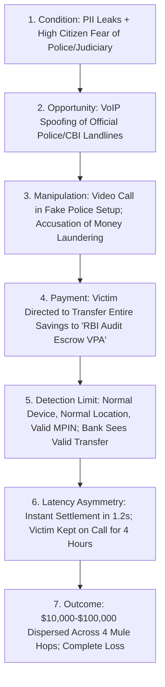
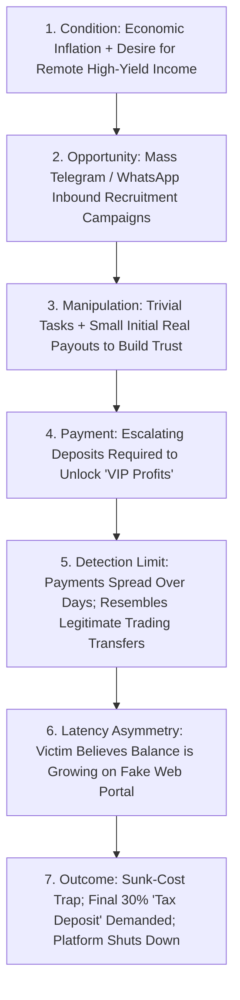
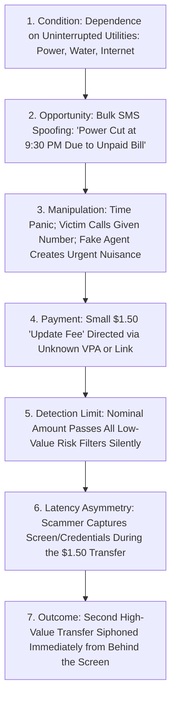
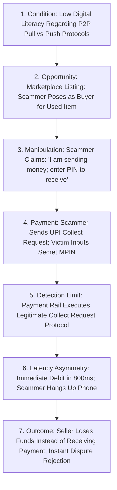
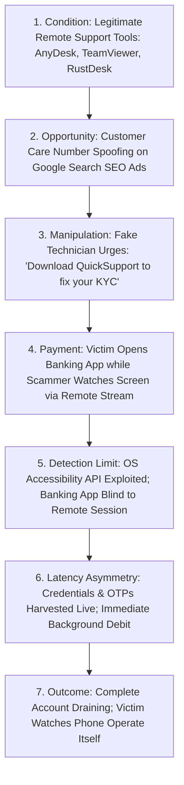

# Problem Causal Mechanics: Deep-Dive Causal Chains Across Scam Typologies

---

## 1. Executive Summary

Understanding why payment scams succeed requires moving past high-level generalizations and examining the **exact causal mechanics** of specific scam typologies. A single uniform causal model cannot explain both an elderly retiree sending $20,000 under the terror of a fake police arrest and a tech worker sending $500 on an inverted UPI collect request.

This document formalizes the rigorous causal chains for the **five dominant classes of payment scams** observed in instant payment ecosystems. Each causal chain traces the path from the underlying macroeconomic and technical conditions to the final irreversible loss, explicitly isolating the human, system, and institutional limitations at every step.

---

## 2. Universal Causal Model Framework

Every causal chain is structured across seven deterministic transitions:

```
[ 1. Underlying Condition ] 
       ↓
[ 2. Attacker Opportunity & Exploitation ]
       ↓
[ 3. Victim Cognitive Manipulation ]
       ↓
[ 4. Payment Interaction & Authentication ]
       ↓
[ 5. Detection Limitation & Switch Blind Spot ]
       ↓
[ 6. Latency Asymmetry & Delayed Intervention ]
       ↓
[ 7. Irreversible Economic Loss & Mule Dispersion ]
```

---

## 3. Causal Chain Deep Dives by Typology

### 3.1 Class 1: Coercive Authority Impersonation ("Digital Arrest")



*   **1. Underlying Condition**: Deep societal fear of state judicial/police machinery; widespread availability of Aadhaar/PAN and mobile data leaked on dark web forums; ubiquitous adoption of video calling.
*   **2. Attacker Opportunity**: Scammers use VoIP gateway tools to display official police headquarters caller IDs; set up physical stages mimicking Indian police stations or customs offices with uniforms and logos.
*   **3. Victim Cognitive Manipulation**: Scammer claims a parcel containing narcotics or passports was intercepted in the victim's name; issues fabricated Supreme Court arrest warrants; demands continuous video surveillance ("digital arrest") to isolate the victim from family and legal counsel.
*   **4. Payment Interaction**: Scammer instructs victim to liquidate mutual funds, fixed deposits, or savings and transfer the balance to a "Reserve Bank of India Verification Escrow Account" (in reality, a newly opened corporate mule account).
*   **5. Detection Limitation**: 
    *   *Bank System Limitation*: The payment is initiated from the customer's known iPhone, at their regular home IP address, using their valid MPIN.
    *   *Context Blindness*: The bank switch has zero visibility into the ongoing 3-hour WhatsApp video call or the extreme stress state of the customer.
*   **6. Latency Asymmetry**: The payment clears in 1.5 seconds. The victim remains under "digital arrest" for another 4 to 8 hours before realizing the scam, giving the syndicate massive temporal runway to disperse funds.
*   **7. Outcome & Loss**: Multi-lakh financial ruin; total loss; mule accounts emptied at physical ATMs across multiple cities.

---

### 3.2 Class 2: Phantom Investment & Sunk-Cost Task Scams



*   **1. Underlying Condition**: High public demand for work-from-home income; widespread familiarity with cryptocurrency trading and stock market speculation.
*   **2. Attacker Opportunity**: Low barrier to mass-messaging millions of mobile numbers via automated Telegram/WhatsApp bots offering "hotel rating" or "YouTube video liking" freelance jobs.
*   **3. Victim Cognitive Manipulation**: The victim is paid real money ($10–$50) for trivial tasks during Stage 1. This completely disarms suspicion. The victim is then enrolled in a "prepaid trading task" with a fabricated online dashboard showing astronomical paper profits.
*   **4. Payment Interaction**: The victim initiates repeated payments ($500 -> $2,000 -> $10,000) via UPI/IMPS to different beneficiary VPAs provided by "customer support".
*   **5. Detection Limitation**: Because payments are spaced over hours or days and amounts increase progressively, traditional velocity algorithms treat the behavior as a customer voluntarily funding an investment portfolio.
*   **6. Latency Asymmetry**: The victim does not realize they are scammed until days or weeks later when they attempt to withdraw funds and are told to pay a "30% tax clearance fee".
*   **7. Outcome & Loss**: Catastrophic loss driven by the **sunk-cost fallacy** (the victim keeps sending money in the desperate hope of recovering previous deposits).

---

### 3.3 Class 3: Urgent Impersonation (Utility Disconnection / Distress)



*   **1. Underlying Condition**: Universal reliance on continuous municipal electricity and mobile data; anxiety over utility disconnection.
*   **2. Attacker Opportunity**: Bulk SMS gateways permit sending unverified short-code messages masquerading as regional power distribution companies.
*   **3. Victim Cognitive Manipulation**: Victim receives an SMS at 7:00 PM: *"Dear consumer, your electricity will be disconnected tonight at 9:30 PM because previous month bill was not updated. Immediately call electricity officer at X."* The victim panics over household disruption and calls the number.
*   **4. Payment Interaction**: Fake officer tells victim: *"Your bill is paid, but the software update fee of 10 rupees is pending. Pay 10 rupees right now on this link or VPA to update the server."*
*   **5. Detection Limitation**: A 10-rupee ($0.15) payment triggers zero fraud alerts; bank engines treat low-value transfers as completely benign.
*   **6. Latency Asymmetry & Secondary Exploit**: The link directs the victim to a phishing gateway or instructs them to install a support APK (e.g., AnyDesk) to "clear the server token", allowing the scammer to capture primary banking credentials in real time.
*   **7. Outcome & Loss**: Account drained via immediate unauthorized secondary transfers or recurring authorized push payments under active coaching.

---

### 3.4 Class 4: Technical Interface Confusion & Inverted Collect Requests



*   **1. Underlying Condition**: Millions of new-to-digital payment users do not understand the fundamental technical axiom: **a PIN is required ONLY to send money, NEVER to receive money**.
*   **2. Attacker Opportunity**: Online peer-to-peer marketplaces (OLX, Facebook Marketplace, Quikr) where individuals sell used furniture, vehicles, or electronics.
*   **3. Victim Cognitive Manipulation**: Scammer agrees to buy the item immediately without bargaining; claims to be an army officer or corporate executive; insists on paying via UPI immediately as an "advance deposit".
*   **4. Payment Interaction**: Scammer generates a UPI `Collect Request` (a debit pull request) for $500 with the note: *"Payment Received from Army Canteen"*. Scammer tells victim on the phone: *"I have sent the money; check your app, click Pay, and enter your PIN to accept it into your bank."*
*   **5. Detection Limitation**: The UPI protocol specifically includes Collect Requests as a legitimate feature. The user willingly enters their MPIN. The switch sees a valid authorization on a valid pull request.
*   **6. Latency Asymmetry**: The victim’s account is debited in 800ms. The scammer immediately blocks the victim’s phone number.
*   **7. Outcome & Loss**: The victim loses money while attempting to sell an item; banks reject dispute claims because the user explicitly authorized the debit.

---

### 3.5 Class 5: Screen-Sharing Remote Shadowing



*   **1. Underlying Condition**: Complex digital banking KYC procedures causing regular customer confusion; widespread availability of legitimate remote screen-sharing tools on app stores.
*   **2. Attacker Opportunity**: Scammers run paid Google Search ads targeting keywords like *"SBI customer care helpline"*, routing stranded customers to scam call centers.
*   **3. Victim Cognitive Manipulation**: Scammer pretends to be a senior bank technical support executive; informs victim their account is frozen due to incomplete KYC; instructs victim to install AnyDesk or TeamViewer to allow "automated server verification".
*   **4. Payment Interaction**: The scammer tells the victim to open their banking application. The scammer views the screen in real time, observes the login pattern, or asks the victim to perform a small transaction, capturing credentials.
*   **5. Detection Limitation**: In older OS versions (or unhardened apps), the banking application cannot detect that another process is capturing or overlaying the screen.
*   **6. Latency Asymmetry**: The scammer executes transfers directly or guides the victim through transfers with microsecond coordination.
*   **7. Outcome & Loss**: Complete account drain; victim watches their own screen perform unauthorized actions while powerless to stop them.

---

## 4. Synthesis of Failure Points & Unknowns

Across all five causal chains, three systemic bottlenecks emerge:
1.  **The Pre-Payment Observational Void**: In 100% of cases, the social engineering pre-text occurs on external communications channels completely invisible to the payment switch.
2.  **The Protocol Verification Gap**: Payment switches verify cryptographic integrity, but have no mechanism to evaluate the psychological state of the user.
3.  **The Off-Ramp Velocity Mismatch**: Instant settlement gives scammers immediate possession of funds, while victims require hours to break out of psychological manipulation.

### Explicit Causal Unknowns
*   *Unknown*: What percentage of victims realize they are being scammed *during* the payment process vs. *after* the payment has settled?
*   *Unknown*: Does introducing a 60-second interactive cooling period cause scammers to abandon the call, or does the scammer simply adapt their script to coach the victim through the delay?
