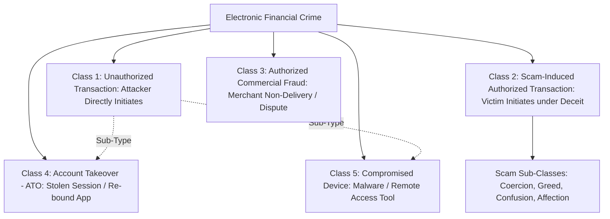

# Conceptual Demarcation: Fine-Grained Problem Typologies & Problem Classes

---

## 1. Executive Summary

In casual conversation, any event resulting in financial loss is labeled a "scam" or "fraud". In domain engineering and regulatory enforcement, however, treating fundamentally different failure modes as a single homogeneous problem creates catastrophic design flaws. A system designed to detect a compromised phone will be completely blind to a digital arrest extortion; a model trained on stolen credit cards will output zero risk on an authorized push payment.

This document establishes a **rigorous, multi-dimensional conceptual taxonomy** separating related but fundamentally distinct problem classes. It distinguishes between **Unauthorized Transactions**, **Authorized Fraudulent Transactions**, **Scam-Induced Authorized Transactions**, **Compromised Accounts**, and **Compromised Devices**. Furthermore, it decomposes the broad category of "scams" into distinct sub-classes based on their cognitive vectors, technical signatures, and operational dynamics.

---

## 2. The Core Problem Class Taxonomy



---

## 3. High-Resolution Problem Class Comparison Matrix

The following table provides the formal reference taxonomy for distinguishing problem classes:

| Problem Dimension | 1. Unauthorized Transaction | 2. Scam-Induced Authorized Transfer (APP Scam) | 3. Authorized Commercial Dispute | 4. Compromised Account (ATO) | 5. Compromised Device (Trojan / Malware) |
| :--- | :--- | :--- | :--- | :--- | :--- |
| **Who Enters Credentials?** | Attacker, bot, or skimmer. | **The legitimate account holder.** | The legitimate account holder. | Attacker using harvested credentials. | Automated malware script or attacker via remote session. |
| **Device Utilized** | Alien device, cloud emulator, or stolen SIM. | **The victim's authentic, everyday smartphone.** | The victim's authentic everyday device. | Alien device or newly bound phone. | The victim's physical device, but infected with malware. |
| **Victim Cognitive State** | Unaware, sleeping, or offline. | **Active, conscious, but psychologically manipulated.** | Conscious, intending to buy genuine goods/services. | Unaware; may notice loss of cell reception (SIM swap). | Unaware; believes device is running normal apps. |
| **Authentication Result** | Stolen or bypassed credentials. | **100% Valid credentials entered in native enclave.** | 100% Valid credentials entered by user. | Valid credentials, but on unrecognized hardware. | Valid credentials harvested via keylogger or injected overlay. |
| **Transaction Mandate** | **Void ab initio** (Bank had no valid customer mandate). | **Legally valid mandate** executed per customer order. | Legally valid commercial contract. | **Void ab initio** (Attacker lacked legal mandate). | **Void ab initio** (Software executed without human agency). |
| **Locus of Failure** | Identity / Access Control Perimeter. | **Human Intent & Situational Awareness.** | Merchant fulfillment / Commercial ethics. | Credential hygiene; multi-factor enforcement. | Mobile OS sandboxing & app permissions. |
| **Legal Loss Allocation** | **Bank absorbs loss** under Zero-Liability regulations. | **Customer absorbs loss** (unless UK PSR mandate applies). | Civil courts / Consumer dispute resolution. | **Bank absorbs loss** under unauthorized fraud rules. | **Bank/Customer contested**; depends on user negligence in sideloading. |

---

## 4. Fine-Grained Sub-Classes of Payment Scams

Within the domain of **Scam-Induced Authorized Transfers (APP Scams)**, operational dynamics vary dramatically based on the psychological exploitation vector:

```
+----------------------------------------------------------------------------------------------------+
| TAXONOMY OF AUTHORIZED PUSH PAYMENT (APP) SCAM SUB-CLASSES                                        |
+----------------------------------------------------------------------------------------------------+
| SUB-CLASS A: COERCIVE EXTORTION & STATE IMPERSONATION ("Digital Arrest")                           |
| - Psychological Vector: Extreme terror, panic, isolation, fear of state apparatus.                 |
| - Transaction Profile: High-value ($5,000–$50,000); single or multi-tranche; life savings.         |
| - Behavioral Signature: Ongoing active phone/video call; rapid typing; ignoring app warnings.      |
| - Target Demographic: Elderly citizens, retirees, high-net-worth individuals living alone.        |
|                                                                                                    |
| SUB-CLASS B: PHANTOM INVESTMENT & SUNK-COST REVIEWS (Task Scams)                                  |
| - Psychological Vector: Euphoric greed, gamification, escalating commitment, sunk-cost trap.       |
| - Transaction Profile: Sequential escalating transfers over days ($50 -> $500 -> $2,500 -> $10,000). |
| - Behavioral Signature: Spaced transactions; perfectly calm pacing; user defends platform to bank. |
| - Target Demographic: Underemployed youth, college students, work-from-home seekers.              |
|                                                                                                    |
| SUB-CLASS C: URGENT NUISANCE & UTILITY SPOOFING                                                    |
| - Psychological Vector: Time scarcity, immediate nuisance avoidance, anxiety over power/cell cut.  |
| - Transaction Profile: Nominal micro-payment ($1–$5) used as a Trojan hook for credential harvest. |
| - Behavioral Signature: Immediate payment after clicking SMS link; haste in interface navigation.  |
| - Target Demographic: Broad general public, household heads, working professionals.               |
|                                                                                                    |
| SUB-CLASS D: PROTOCOL CONFUSION & INVERTED REQUESTS (Collect Fraud)                                |
| - Psychological Vector: Technical illiteracy regarding digital payment protocol semantics.         |
| - Transaction Profile: Moderate value ($50–$1,000) matching an agreed-upon marketplace sale price. |
| - Behavioral Signature: Entering PIN on an incoming debit request; instantaneous submission.       |
| - Target Demographic: Second-hand goods sellers on online classifieds (OLX, Marketplace).         |
|                                                                                                    |
| SUB-CLASS E: EMOTIONAL DEPENDENCY & ROMANCE FRAUD                                                  |
| - Psychological Vector: Deep emotional trust, romantic affection, social isolation rescue.         |
| - Transaction Profile: High cumulative value over months; framed as 'customs fees' or 'emergencies'|
| - Behavioral Signature: Payments to varied personal accounts; user actively lies to bank staff.   |
| - Target Demographic: Widows, widowers, socially isolated individuals on dating apps.              |
+----------------------------------------------------------------------------------------------------+
```

---

## 5. Methodological Significance for System Research

This fine-grained demarcation provides three vital engineering guardrails:

1.  **Rejection of Monolithic Models**: A machine learning model or rule set optimized to detect Sub-Class A (Digital Arrest: active phone call, high-stress typing, sudden large liquidation) will completely fail to detect Sub-Class B (Task Scams: calm user, multi-day spaced transfers, voluntary investment intent).
2.  **Boundary Enforcement**: Transactions falling into Class 1 (Unauthorized), Class 3 (Commercial Disputes), Class 4 (ATO), or Class 5 (Pure Malware) must not be treated as core scam interception targets, preventing scope creep.
3.  **Intervention Customization**: Different scam sub-classes require radically different intervention primitives. Sub-Class D (Collect Confusion) requires clear interface semantics, while Sub-Class A (Coercion) requires breaking telephone-induced cognitive capture.
