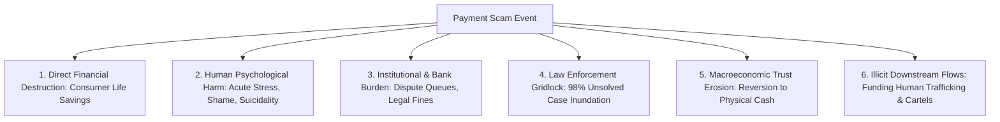

# Problem Severity & Impact Analysis: Multi-Dimensional Harm Assessment

---

## 1. Executive Summary

The severity of real-time payment scams cannot be measured solely by direct financial balance-sheet loss. Because payments are the foundational nervous system of modern economic life, scams inflict compound harm across multiple interconnected dimensions: **direct financial destruction, acute human psychological trauma, severe operational overhead on banking institutions, systemic resource exhaustion in law enforcement, and downstream funding of transnational organized crime**.

This document establishes a rigorous, evidence-based assessment of problem severity. Every quantitative metric is cited with its exact geographical scope, reporting period, institutional source, and measurement methodology. Where assessments represent analytical interpretations rather than official statistics, they are explicitly labeled as such.

---

## 2. Multi-Dimensional Severity Framework



---

## 3. Quantitative Evidence & Impact Dimensions

### 3.1 Dimension 1: Direct Financial Loss

```
+-----------------------------------------------------------------------------------------------+
| Global & Domestic Financial Loss Metrics                                                      |
|                                                                                               |
| Jurisdiction | Metric & Value              | Period & Scope       | Authoritative Source      |
| ------------ | --------------------------- | -------------------- | ------------------------- |
| **India**    | **₹11,269 Crore ($1.35B)**  | FY 2023–24           | Citizen Financial Cyber   |
|              | lost to digital financial   | National reporting;  | Fraud Reporting System    |
|              | cyber fraud.                 | 1.3M+ complaints.    | (CFCFRMS / MHA / I4C).    |
| **India**    | **₹120 Crore ($14.4M)**     | Q1–Q3 2024           | Ministry of Home Affairs  |
|              | lost specifically to        | Special task force   | (MHA Parliamentary Reply,  |
|              | "Digital Arrest" scams.     | data compendium.     | Aug 2024).                |
| **UK**       | **£459.7 Million ($585M)**  | Calendar Year 2023   | UK Finance Annual Fraud   |
|              | lost to Authorized Push      | Gross Faster Payments| Report 2024 & PSR Policy  |
|              | Payment (APP) scams.        | & CHAPS transfers.   | Statement PS23/3.         |
| **US**       | **$10.3 Billion**            | Calendar Year 2023   | Federal Bureau of         |
|              | total online fraud loss;     | 880,000+ complaints; | Investigation (FBI) IC3   |
|              | $4.57B in investment scams. | elder fraud: $3.4B.  | Annual Report 2023.       |
| **Global**   | **$1.02 Trillion**           | Calendar Year 2023   | Global Anti-Scam Alliance |
|              | estimated global scam loss.  | Global survey data.  | (GASA) / Scamwatch.       |
+-----------------------------------------------------------------------------------------------+
```

*   **Average Loss Per Victim**:
    *   *Digital Arrest Scams*: Average loss ranges between **₹5,00,000 to ₹50,00,000 ($6,000 to $60,000)** per incident, frequently representing the victim’s entire lifetime retirement corpus (I4C Data).
    *   *Task / Investment Scams*: Average loss ranges between **₹1,00,000 to ₹8,00,000 ($1,200 to $9,600)**, often funded through high-interest personal loans or borrowings from relatives.
    *   *Marketplace Inverted Collect Scams*: Average loss ranges between **₹15,000 to ₹40,000 ($180 to $480)** per incident.

---

### 3.2 Dimension 2: Human Psychological Trauma & Social Harm
*   **Acute Stress and Cognitive Collapse**: Victims of coercive impersonation scams report intense psychological devastation comparable to physical violent crime. The experience of being held under "digital arrest" for hours induces severe panic attacks, hypertension, and cognitive disorientation.
*   **The "Shame Barrier" & Secondary Victimization**: Victims of investment and romance scams experience intense social stigma, self-blame, and family estrangement. Empirical surveys by the Global Anti-Scam Alliance (GASA) reveal that **over 55% of scam victims never disclose the incident to family members** due to acute shame.
*   **Suicidality**: In multiple high-profile cases documented by Indian and international press (e.g., Hyderabad Cyber Crime Police reports, 2024), victims of task scams who borrowed massive sums from instant lending apps committed suicide following total financial ruin.

---

### 3.3 Dimension 3: Institutional & Banking Operational Burden
*   **Dispute Center Overload**: Commercial banks handle millions of customer dispute tickets annually. In India, cyber fraud complaints under the Reserve Bank Integrated Ombudsman Scheme (RB-IOS) rose by **68% year-on-year in 2023–24**, overwhelming bank compliance and legal departments.
*   **Customer Service Call Costs**: Handling distressed scam victims requires extended phone consultations (averaging 25–45 minutes per call vs. 3 minutes for standard banking inquiries), driving up bank operational expenditures.
*   **Looming Reimbursement Liabilities**: Under the UK's PSR PS23/3 mandate, commercial banks face direct bottom-line deductions to reimburse 100% of consumer APP scam losses up to £85,000. If similar mandates are adopted by the RBI or CFPB, scam losses will become a direct, multi-billion-dollar charge against bank profitability.

---

### 3.4 Dimension 4: Law Enforcement Gridlock & Near-Zero Asset Recovery

```
+-----------------------------------------------------------------------------------------------+
| The Asset Recovery Deficit (Indian National Cybercrime Reporting Portal Data - 2023/24)      |
|                                                                                               |
| Total Reported Scam Loss (FY 2023-24):   ₹11,269 Crore ($1.35 Billion)                        |
| Total Funds Successfully Frozen / Saved:  ₹1,127 Crore (~10.0%)                               |
| Total Funds Physically Restored to Victims: < ₹250 Crore (~2.2%)                              |
| Unrecoverable Capital Loss:              > 97.8%                                              |
+-----------------------------------------------------------------------------------------------+
```

*   **Why Recovery Fails**: Even when the national `1930` helpline successfully freezes a mule account, the funds recovered represent only a tiny fraction of the loss because **bot-driven cash-out happens within 180 seconds**, while police action requires hours. Furthermore, funds frozen in bank accounts require tedious, multi-month judicial clearance under Section 457 of the Criminal Procedure Code (CrPC) before they can be legally released back to the victim.

---

### 3.5 Dimension 5: Downstream Funding of Organized Crime & National Security
*   *Analytical Finding*: Payment scams are not uncoordinated petty thefts; they are the primary funding mechanism for **transnational organized crime syndicates**.
*   *United Nations Office on Drugs and Crime (UNODC) Report (2024)*: Documented that the vast majority of scam call centers operating in Southeast Asia (Myanmar, Cambodia, Laos) are operated by organized cartels that utilize **human trafficking victims** (duped job seekers held in compound compounds under armed guard) to execute social engineering scripts.
*   *Macro Threat*: Scam proceeds are laundered through cryptocurrency exchanges and underground hawala networks to finance narcotics trafficking, illicit arms purchases, and transnational money laundering.

---

## 4. Severity Assessment Matrix

| Dimension | Measured Severity | Velocity of Harm | Reversibility | Systemic Threat Level |
| :--- | :--- | :--- | :--- | :--- |
| **Consumer Life Savings** | Extreme ($10B+ globally) | Minutes | **Near Zero (<2.5% recovery)** | **Catastrophic** |
| **Psychological Harm** | Severe (Trauma / Suicidality)| Immediate | Long-Term (Years) | **High** |
| **Bank Dispute Costs** | High (Millions of hours) | Ongoing | Irreversible Overhead | **High** |
| **Police Enforcement** | Gridlocked (<5% clearance) | Backlogged | Institutional Drain | **Severe** |
| **Digital Trust Erosion** | Moderate to Severe | Cumulative | Reversion to Cash / Hesitation | **Existential for RTP** |

---

## 5. Methodological Summary

This severity analysis demonstrates that the real-time payment scam crisis is **not an acceptable cost of doing business**; it is a severe macroeconomic, humanitarian, and institutional crisis. 

Because post-facto recovery is statistically futile (>97% unrecoverable), **the only mathematically and operationally viable point of intervention is pre-settlement interception.**
