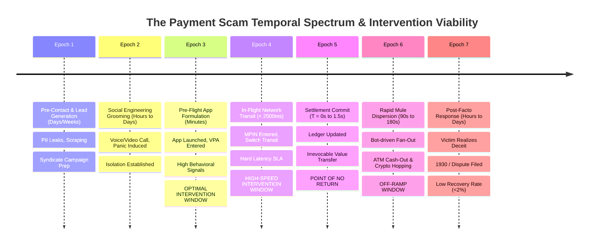

# Temporal Analysis: Horizons, Intervention Windows & The Time-Decay of Control

---

## 1. Executive Summary

Time is the most critical and unforgiving dimension in real-time payment scam interception. The problem cannot be understood as a static snapshot; it is an evolving physical and digital process characterized by **violent asymmetries in temporal velocity**.

While the preparatory phase (psychological grooming and social engineering) unfolds over **hours, days, or weeks**, the transactional phase (formulation, clearing, and settlement) collapses into **sub-second or single-digit second execution**, and the subsequent criminal off-ramping phase (mule dispersion and cash-out) completes in **minutes**. Conversely, the institutional and victim response phase (realization, dispute filing, police reporting, account freezes) requires **hours, days, or months**.

This document conducts a rigorous **temporal decomposition of the payment scam lifecycle**. It maps the operational states across seven chronological epochs, defines where defensive intervention is viable versus where it decays into futility, and analyzes the temporal physics of scam execution—without prematurely converting these observations into rigid technical latency requirements.

---

## 2. The Comprehensive Temporal Lifecycle Map



---

## 3. Epoch-by-Epoch Deep Dive

The following detailed analysis examines the system state, actor velocity, observable signals, and defensive viability across each chronological epoch:

### Epoch 1: Pre-Contact & Targeting (Duration: Days to Weeks)
*   *What Happens*: Cybercrime syndicates acquire bulk databases of leaked citizen records (phone numbers, names, Aadhaar numbers, recent courier shipments, electricity utility accounts). Lead generators filter targets based on vulnerability heuristics (elderly demographics, recent bank account updates).
*   *System State*: Zero payment activity. Normal banking operations.
*   *Defensive Viability*: **Zero Direct Intervention Viability**. The payment rail and banking software have no contact with the victim; this phase exists entirely within the external cyber underground.

### Epoch 2: Social Engineering & Grooming (Duration: Hours to Days)
*   *What Happens*: The scammer initiates outbound contact (VoIP spoofed phone call, WhatsApp video call, Telegram group invitation). The pretext is deployed; fear, urgency, or greed is cultivated. The victim is isolated from their physical and digital support network (commanded to stay on a continuous call or keep the matter confidential).
*   *System State*: External communications active; payment applications remain closed.
*   *Observable Signals*: Cellular call duration spikes; video call active; elevated heart rate and physiological stress (observable on wearable devices, but inaccessible to banks).
*   *Defensive Viability*: **Pre-Emptive Telecom Viability Only**. Intervention is viable only through telecommunications carrier-level spam labeling or call blocking. Payment infrastructure remains completely blind.

### Epoch 3: Pre-Flight In-App Formulation (Duration: 30 Seconds to 5 Minutes)
*   *What Happens*: Under active verbal coaching or script guidance, the victim opens their mobile payment application (e.g., Google Pay, PhonePe, Bank App). The victim navigates to "New Payment", pastes or types the destination VPA/account number, enters the transfer amount, and reads the recipient confirmation name.
*   *System State*: Local client application memory in `DRAFT` state. No network clearing message has been transmitted to the payment switch.
*   *Observable Signals*:
    *   *High-Resolution Behavioral Signals*: Typing hesitation on the numeric keypad; pasting VPA from clipboard; unusually rapid or hesitant screen taps; prolonged dwelling on the confirmation screen.
    *   *Device State*: Mobile OS telephony state indicates an ongoing phone call; remote desktop tool (AnyDesk) may be executing in the background.
*   *Defensive Viability*: **OPTIMAL INTERVENTION WINDOW**. The transaction has not been submitted. The application has maximum operational freedom to display contextual warnings, introduce reflective friction, require cognitive confirmation, or trigger mandatory cooldown pauses.

### Epoch 4: In-Flight Network Transit (Duration: 300 to 2,500 Milliseconds)
*   *What Happens*: The victim submits their MPIN/biometric into the secure enclave. The app dispatches the encrypted authorization payload to the PSP; the PSP forwards the `pacs.008` message to the central switch; the switch queries the remitter CBS for debit and the beneficiary CBS for credit.
*   *System State*: Active distributed transaction in `IN_FLIGHT` state.
*   *Observable Signals*: Pure message payload attributes: Payer VPA, Payee VPA, IFSC, Amount, Timestamp, Merchant Category Code.
*   *Defensive Viability*: **HIGH-SPEED SYNCHRONOUS INTERVENTION WINDOW**. This is the final physical checkpoint before value moves. However, any evaluation here is strictly constrained by switch timeout ceilings (< 300ms allocated to risk scoring). If the system can execute an algorithmic determination within this budget, it can return an authoritative `DECLINE` or `HOLD` before settlement occurs.

### Epoch 5: Settlement Commit (Duration: Instantaneous / Milliseconds)
*   *What Happens*: The central switch commits the credit instruction to the beneficiary bank ledger. Both ledgers are updated; the switch returns an atomic `SUCCESS` confirmation to all nodes.
*   *System State*: Transaction state transitions to `COMPLETED`.
*   *Defensive Viability*: **THE POINT OF NO RETURN**. At this exact millisecond, legal and technical ownership of the funds transfers to the beneficiary account holder. The remitter bank’s technical authority over the funds is extinguished. Reversal without beneficiary consent is legally impossible.

### Epoch 6: Rapid Mule Dispersion & Layering (Duration: 60 Seconds to 15 Minutes)
*   *What Happens*: Automated webhooks or bot scripts running on the first-hop mule account detect the incoming credit alert. Within 90 to 180 seconds, the balance is split into multiple sub-threshold transfers (`smurfing`) and routed to second- and third-tier mule accounts. Handlers at physical ATMs withdraw cash, or P2P crypto merchants release stablecoins.
*   *System State*: Post-clearing interbank fund movement across the banking graph.
*   *Observable Signals*: High-velocity outbound transfers from newly credited account; immediate debit card ATM balance inquiries.
*   *Defensive Viability*: **NEAR-REAL-TIME ACCOUNT FREEZE ONLY**. Interception of the original payment is impossible. The only viable action is for the *beneficiary bank* or *central switch* to detect the rapid outbound dispersion and place an immediate administrative lien or freeze on the receiving mule account before the money leaves the fiat banking system.

### Epoch 7: Post-Facto Discovery, Reporting & Dispute (Duration: 2 Hours to 30 Days)
*   *What Happens*: The victim breaks out of the cognitive trance (the scammer hangs up, the fake investment portal shuts down, or a family member intervenes). The victim experiences realization and shock. Hours later, the victim calls the bank branch, dials the national cyber helpline (`1930`), or visits a police station.
*   *System State*: Historical ledger entries; dispute tickets; formal police First Information Reports (FIRs).
*   *Defensive Viability*: **FORENSIC AUDIT & LEGAL PURSUIT ONLY**. Asset recovery rates in this epoch are statistically negligible (<2% to 5%) because the banking ledgers have long been emptied. The process shifts from software engineering to judicial asset forfeiture.

---

## 4. The Time-Decay Curve of Defensive Control

The following operational curve illustrates how defensive agency, legal certainty, and recovery probability decay as a function of elapsed time:

```
Defensive Agency & Recovery Probability
100% |  [EPOCH 3: Pre-Flight UI Window]
     |  Total control; zero customer loss; frictionless cancellation.
     |
 80% |              [EPOCH 4: In-Flight Network Window]
     |              High control; sub-second decision; aborts debit.
     |
  0% +==============[EPOCH 5: Settlement Commit (T = 1.5s)]================= [POINT OF NO RETURN]
     |
-40% |                             [EPOCH 6: Rapid Mule Dispersion (90s - 180s)]
     |                             Beneficiary freeze possible; fiat off-ramping underway.
     |
-95% |                                            [EPOCH 7: Post-Facto Police Report (T > 4 Hours)]
     |                                            Accounts empty; irreversible total loss.
-----+------------------------------------------------------------------------------------------ Time
     0m             2m             1.5s           180s                       4h - 24h
```

---

## 5. Synthesis: Where Does Timing Truly Matter?

From this temporal deconstruction, two decisive problem insights emerge:

1.  **The Pre-Flight Asymmetry Advantage**: The user spends **2 to 5 minutes** formulating the payment in the app UI, while the network switch transit lasts only **1 to 2 seconds**. Trying to cram complex contextual reasoning into the 1-second network transit window is an architectural trap; the 3-minute pre-flight drafting window provides orders of magnitude more temporal runway to evaluate behavioral signals and introduce cognitive friction.
2.  **The 180-Second Cliff**: If in-flight interception fails and the payment settles, a hard operational cliff exists at **180 seconds**. Any beneficiary bank surveillance or centralized risk response that takes longer than 3 minutes to flag the mule account will arrive after the cash has already been withdrawn from an ATM.
