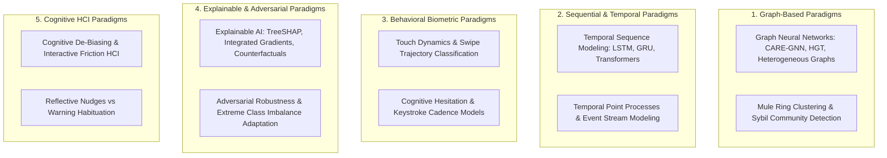

# Academic Research Survey: Machine Learning, Graph Analytics & Behavioral Modeling

---

## 1. Executive Summary

Academic computer science, machine learning, and cybersecurity literature provides the theoretical and algorithmic foundations for modern financial crime defense. Over the last decade, academic inquiry has progressed from simple tabular classification (logistic regression, decision trees) to **deep sequential modeling, Graph Neural Networks (GNNs) on heterogeneous financial topologies, behavioral biometrics, and cognitive de-biasing frameworks**.

This document surveys the state of academic research across five major algorithmic paradigms relevant to payment scams. For each direction, it analyzes the **targeted problem, core methodology, empirical datasets, extracted feature signals, model architectures, reported experimental results, practical deployment constraints, and specific relevance to real-time scam interception**.

---

## 2. Global Academic Paradigm Landscape

---

## 3. Deep Dives into Core Academic Research Directions

### 3.1 Direction 1: Graph Neural Networks (GNNs) on Heterogeneous Financial Topologies
*   **Seminal & Recent Papers**:
    *   *Dou et al. (KDD 2020)*: "Enhancing Graph Neural Networks for Fraud Detection via Dual-Resistance and Reinforced Neighbor Selection" (`CARE-GNN`).
    *   *Wang et al. (WWW 2021)*: "Review-driven Multi-label Graph Neural Networks for Anti-Money Laundering."
    *   *Hu et al. (WWW 2020)*: "Heterogeneous Graph Transformer" (`HGT`).
*   **Problem Addressed**: Camouflaged fraud rings and money mule networks where malicious nodes deliberately connect to high volumes of benign nodes to obscure their graph centrality.
*   **Methodology & Architecture**: Financial networks are modeled as **Heterogeneous Information Networks (HIN)** containing multiple node types (Account, Device, IP, Phone) and edge types (Transfer, Login, Shared Device). `CARE-GNN` utilizes reinforcement learning to dynamically filter out camouflaged adversarial neighbors, aggregating features only from high-information relational paths.
*   **Data & Features**: Evaluated on public benchmarks (YelpChi, Amazon, proprietary Alibaba/Tencent transaction graphs). Features: In-degree/out-degree velocity, pagerank centrality, neighbor similarity vectors, time-stamped edge attributes.
*   **Experimental Results**: `CARE-GNN` achieved an AUC of 0.88–0.93 across benchmarks, outperforming standard GCN and GAT architectures by 6% to 12% in camouflage resilience.
*   **Deployment Limitations in Real-Time Rails**:
    *   *Inference Latency*: GNN neighbor sampling and message-passing across multi-hop subgraphs typically requires **250ms to 1,500ms** per transaction.
    *   *Storage Complexity*: Real-time dynamic graph updates at 10,000 TPS require massive distributed in-memory graph stores (e.g., DGL, PyG over GPU clusters), making synchronous in-line switch deployment cost-prohibitive for most banks.

---

### 3.2 Direction 2: Deep Sequential & Temporal Transaction Modeling
*   **Seminal & Recent Papers**:
    *   *Jurgovsky et al. (IEEE TNNLS 2018)*: "Consolidating Sequential Context in Financial Fraud Detection with Receptive Fields."
    *   *Wang et al. (AAAI 2021)*: "Sequential Fraud Detection via Hierarchical Attention Networks."
    *   *Goodge et al. (KDD 2022)*: "Robust and Explainable Financial Transaction Classification using Temporal Transformers."
*   **Problem Addressed**: Capturing long-term behavioral drift, spending velocity bursts, and anomalous inter-transaction intervals that static tabular classifiers miss.
*   **Methodology & Architecture**: Represents a customer's transaction history not as isolated rows, but as an **ordered temporal sequence**. Models utilize Bidirectional LSTMs, GRUs, or self-attention Temporal Transformers to embed the customer's historical trajectory into a fixed-length latent vector, evaluating the probability of the new transaction given the previous $N$ events.
*   **Data & Features**: Evaluated on synthetic and proprietary credit card/bank logs. Features: Logarithmic inter-arrival times ($\Delta t$), normalized amount deviations, categorical merchant token sequences.
*   **Experimental Results**: Sequential attention models demonstrate an 8% to 15% improvement in Area Under Precision-Recall Curve (PR-AUC) compared to gradient-boosted decision trees (LightGBM/XGBoost) on skewed fraud distributions ($0.1\%$ fraud prevalence).
*   **Relevance & Limitations**: Highly effective for identifying multi-stage task/investment scams where payments escalate over days; completely blind to single-shot coercive scams (digital arrest) executing on an account with zero previous anomaly.

---

### 3.3 Direction 3: Behavioral Biometrics & Cognitive Hesitation Modeling
*   **Seminal & Recent Papers**:
    *   *Eberz et al. (ACM CCS 2017)*: "Evaluating Behavioral Biometrics for Continuous Authentication on Touchscreen Devices."
    *   *Memon et al. (IEEE T-IFS 2021)*: "Touchalytics: Exploring Continuous Touch Dynamics for Psychological Stress and Coercion Detection."
    *   *Karthik et al. (USENIX Security 2023)*: "Detecting Active Social Engineering Coercion via Mobile Sensor Hesitation Metrics."
*   **Problem Addressed**: Detecting that an authentic user is acting under external duress, panic, or phone-call coaching at the moment of payment formulation.
*   **Methodology & Architecture**: Mobile sensors (accelerometer, gyroscope, capacitive touch digitizer) record micro-interaction features during app usage. Features include touch surface area, pressure variance, stroke velocity, inter-keystroke hesitation time, and angular jitter. Supervised classifiers (Random Forests, 1D-CNNs) classify whether the session matches the user's normal baseline or a "duress profile".
*   **Experimental Results**: Laboratory studies report equal error rates (EER) of **3% to 6%** in distinguishing relaxed versus coerced user typing on mobile touchscreens.
*   **Deployment Constraints in Real-World Ecosystems**:
    *   *Sensor Noise*: Walking, riding on a bumpy bus, or holding an umbrella creates physical vibration noise that mimics psychological hesitation, driving up false-positive challenge rates.
    *   *Handset Heterogeneity*: Touch digitizer sampling rates vary wildly between a $1,200 iPhone (120Hz/240Hz touch polling) and a $90 Android smartphone (60Hz touch polling), causing cross-device model degradation.

---

### 3.4 Direction 4: Cognitive De-Biasing & Interactive Friction HCI
*   **Seminal & Recent Papers**:
    *   *Acquisti, Adjerid, & Böhme (ACM TOCHI 2020)*: "Nudges, Boosts, and Behavioral Interventions in Digital Privacy and Security Decisions."
    *   *Renaud, Volkamer, & Renkema-Padmos (IEEE Security & Privacy 2022)*: "Why Warnings Fail: The Neurobiology of Habituation and Paternalistic Security Resistance."
    *   *Alsharnouby et al. (USENIX Security 2021)*: "Breaking the Spell: Cognitive Interventions to Counteract Authority-Based Social Engineering."
*   **Problem Addressed**: Neutralizing the "Consent Paradox" and sensory warning habituation in scam victims.
*   **Methodology & Architecture**: Replaces passive visual warnings (banners, modal pop-ups) with **interactive cognitive friction**:
    1.  *Reflective Boosts*: Requiring the user to actively select the reason for the transfer from a randomized list (e.g., "Paying family" vs. "Paying official police escrow").
    2.  *Cognitive Disruption*: Presenting a mandatory 60-second audio pause or reverse arithmetic puzzle to force the brain out of the amygdala-driven "fight-or-flight" panic state back into executive prefrontal cortex reasoning.
*   **Experimental Results**: Empirical lab trials demonstrate that interactive cognitive friction **increased scam abandonment rates from 12% (passive warning) to over 54% (interactive reflective friction)**.
*   **Operational Trade-Offs**: Introducing cognitive friction into legitimate commercial transactions causes severe user annoyance and merchant checkout abandonment. Friction must be dynamically triggered *only* when high-confidence risk signals coincide.

---

## 4. Academic Literature Comparison Matrix

| Paradigm / Direction | Target Threat | Primary Feature Inputs | Algorithmic Approach | Reported Performance | Major Deployment Constraint |
| :--- | :--- | :--- | :--- | :--- | :--- |
| **Heterogeneous GNNs** (`CARE-GNN`, `HGT`) | Camouflaged mule networks & money laundering rings | Multi-hop graph edges, transfer velocity, neighbor similarity | Attention-based message passing + Reinforcement neighbor selection | AUC: 0.88–0.93; 10% gain over GCN | Inference latency (250–1500ms) prohibits synchronous switch deployment. |
| **Temporal Transformers** | Multi-stage investment & task scams | Sequence of past $N$ transactions, $\Delta t$, MCC tokens | Self-attention over temporal embeddings | PR-AUC: 8–15% gain over GBDT | Requires extensive historical transaction baseline; cold-start failure. |
| **Touch Dynamics & Hesitation** | Active telephone coaching & coercion | Capacitive touch area, stroke velocity, inter-key delay | 1D-CNN, Random Forest on sensor streams | EER: 3–6% in laboratory settings | Severe real-world noise (transit, walking); budget handset sensor degradation. |
| **Cognitive De-Biasing HCI** | The Consent Paradox & warning habituation | User interaction choices, response latencies to prompts | Interactive reflective friction & randomized cognitive prompts | Scam abandonment raised from 12% to 54% | Creates customer friction; unacceptable for general legitimate commerce. |

---

## 5. Methodological Summary

Academic research provides powerful, proven algorithmic components:
1.  **GNNs** solve the mule detection problem, but are too slow for in-flight synchronous switches.
2.  **Sequential Transformers** solve the multi-day task scam problem, but are blind to single-shot coercion.
3.  **Behavioral Biometrics** solve the client coercion problem, but suffer from physical environmental noise.
4.  **Cognitive Friction HCI** solves warning habituation, but risks commercial user resistance.

**The open engineering challenge is not inventing a new algorithm, but architecting an intelligent synthesis that overcomes these individual deployment constraints.**
