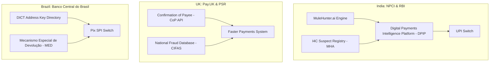

# Payment-Network & Institutional Mechanisms: Infrastructure, Central Registries & Protocols

---

## 1. Executive Summary

Beyond commercial vendor software, payment market infrastructures (central clearinghouses, national payment switches, and central banks) have implemented systemic controls directly into the plumbing of instant payment rails. These institutional mechanisms operate at a layer above individual commercial banks, leveraging regulatory mandates and centralized network visibility to combat payment scams.

This document systematically examines the primary **institutional and network-level mechanisms** deployed across the world’s leading real-time payment ecosystems: India’s **NPCI / RBI (DPIP, MuleHunter.ai, I4C Suspect Registry)**, the UK’s **Pay.UK (Confirmation of Payee - CoP)**, the United States' **Federal Reserve (FedNow FraudClassifier & Scams Toolkit)**, and Brazil’s **Banco Central do Brasil (Pix MED - Special Reversal Mechanism)**. Each mechanism is evaluated based on its architectural design, operational workflow, empirical effectiveness, and systemic limitations.

---

## 2. Institutional Architecture Comparison

---

## 3. Deep Dives into Core Institutional Mechanisms

### 3.1 India: NPCI DPIP, MuleHunter.ai & The I4C Suspect Registry
*   **The Digital Payments Intelligence Platform (DPIP)**:
    *   *What It Is*: A centralized, AI-driven intelligence-sharing platform initiated by the Reserve Bank of India (RBI) and operated by NPCI to create a unified fraud shield across banks, non-bank PSPs, and fintechs.
    *   *Mechanism*: Uses federated intelligence to correlate cross-bank transaction signals in near-real-time. When a destination VPA or account exhibits high-risk velocity across multiple issuing banks, the DPIP distributes an alert to participating institutions within minutes.
*   **MuleHunter.ai (RBI Innovation Engine)**:
    *   *What It Is*: An AI/ML model developed under RBI initiatives to identify bank accounts exhibiting "money mule" behavioral profiles (rapid fund transit, zero overnight dwell time, newly activated accounts receiving high-velocity credits).
    *   *Operational Role*: Assesses accounts at the receiving bank level, flagging accounts for enhanced KYC re-verification or temporary debit freezes.
*   **I4C Suspect Registry (Ministry of Home Affairs)**:
    *   *What It Is*: A centralized national database maintained by the Indian Cyber Crime Coordination Centre (I4C) that aggregates reported fraudulent phone numbers, VPAs, bank accounts, and IMEI hashes from the `1930` national reporting portal.
    *   *Limitation*: Because it relies on post-incident victim reports, blacklisted entities represent *already burned* accounts. Scammers rapidly rotate to fresh, unlisted mule accounts.

---

### 3.2 United Kingdom: Pay.UK Confirmation of Payee (CoP)
*   **What It Is**: An account name checking service mandated by the UK Payment Systems Regulator (PSR) for all payment service providers participating in Faster Payments and CHAPS.
*   **Operational Mechanism**:
    1.  Before the payer confirms an electronic transfer, the sending bank sends an API request to the receiving bank carrying the recipient's sort code, account number, and the full name entered by the payer.
    2.  The receiving bank matches the input string against the legal name registered on the destination account.
    3.  The system returns one of four cryptographic verdicts:
        *   `Match`: Full name matches perfectly.
        *   `Close Match`: Minor spelling variation; returns the actual legal name to the payer for verification.
        *   `No Match`: Name does not match; displays a prominent warning.
        *   `Unavailable`: Technical failure or non-participating institution.
*   **Empirical Impact & Scam Circumvention**:
    *   *Impact*: Successfully reduced simple "invoice redirection" fraud (where a scammer changes the bank details on a legitimate invoice) by over 35%.
    *   *Scam Vulnerability*: **Completely ineffective against social engineering impersonation and digital arrest scams**. In a digital arrest scam, the scammer simply instructs the victim: *"The account is in the name of Rajesh Kumar, our authorized Supreme Court verification officer; enter his name."* When the name matches, CoP displays a green `Match` checkmark, which **validates the scammer's legitimacy in the eyes of the victim**.

---

### 3.3 United States: Federal Reserve FedNow FraudClassifier & Scams Toolkit
*   **The FraudClassifier Model**:
    *   *What It Is*: A standardized industry taxonomy developed by the Federal Reserve to enable commercial banks and credit unions to classify fraud holistically across the payment chain.
    *   *Core Function*: Dissects fraud into three hierarchical questions: (1) Who initiated the payment? (Authorized vs. Unauthorized); (2) How was authorization secured? (Social engineering scam vs. Compromised credentials); (3) What was the ultimate fraudulent action?
*   **FedNow Scams Mitigation Toolkit (2023–2024)**:
    *   Provides participating financial institutions with technical guidance on setting risk-based transaction velocity limits, implementing voluntary multi-factor step-up thresholds, and integrating pre-authorization recipient verification tools.
    *   *Systemic Limitation*: FedNow operates under Regulation E, where the Federal Reserve explicitly designates fraud monitoring as the **sole responsibility of participating commercial banks**. The FedNow central rail switch performs no native in-flight scam blocking.

---

### 3.4 Brazil: Banco Central do Brasil (BCB) Pix MED (Special Reversal Mechanism)
*   **What It Is**: The *Mecanismo Especial de Devolução* (MED), an official regulatory and technical protocol mandated by the Central Bank of Brazil specifically for reversing fraudulent or scam transactions on the Pix instant payment rail.
*   **Operational Mechanism**:
    1.  When a victim reports an APP scam to their bank within 80 days, the sending bank initiates a formal `MED Request` through the central Pix switch.
    2.  The receiving bank immediately places a **precautionary block (freeze)** on the funds sitting in the beneficiary account for up to 72 hours while both banks analyze transaction logs.
    3.  If fraud is confirmed, the central switch executes an automated debit from the beneficiary account and returns the funds to the victim.
*   **Empirical Limitations**:
    *   *The "Empty Mule" Problem*: Central bank audit data reveals that the MED successfully returns funds in **less than 9% of scam cases**. Why? Because automated mule cartels drain incoming Pix credits within 60 seconds. When the MED precautionary block is applied 2 hours later, the destination account balance is already zero.

---

## 4. Comprehensive Evaluation of Institutional Mechanisms

| Institutional Mechanism | Sponsoring Authority | Operational Stage | Primary Defensive Strength | Critical Structural Limitation |
| :--- | :--- | :--- | :--- | :--- |
| **DPIP & MuleHunter** | RBI / NPCI (India) | In-Flight & Near-Real-Time | Macro interbank signal correlation; automated mule detection. | Pilot stage; cannot inspect client-side handset psychological duress. |
| **I4C Suspect Registry** | MHA (India) | Pre-Transaction & Post-Facto | National centralized blacklist of verified scam VPAs and phones. | High latency; blacklists already-burned accounts; reactive. |
| **Confirmation of Payee (CoP)** | Pay.UK / PSR (UK) | Pre-Transaction Formulation | Verifies recipient account name matches input name. | Counterproductive in impersonation scams; validates scammer's mule name. |
| **FedNow FraudClassifier**| Federal Reserve (US) | Post-Incident Reporting | Standardizes industry fraud reporting and root-cause taxonomy. | Diagnostic only; possesses zero real-time interception capability. |
| **Pix MED Reversal** | Banco Central (Brazil) | Post-Settlement Protocol | Official protocol for automated interbank clawback of fraud funds. | Defeated by rapid mule off-ramping; >90% of requests hit empty accounts. |

---

## 5. Methodological Summary

This institutional survey demonstrates that central payment authorities have recognized the crisis and are deploying systemic tools:
1.  **Name Verification (CoP)** solves identity spoofing, but backfires during social engineering by confirming mule legitimacy.
2.  **Central Registries (I4C, CIFAS)** solve historical tracking, but lag behind disposable mule creation.
3.  **Automated Clawback Protocols (Pix MED)** solve legal reversal authority, but are defeated by the 180-second off-ramp velocity of mule botnets.

**Conclusion**: Institutional mechanisms provide essential infrastructure, but **none currently intercept scams synchronously during the pre-flight window before funds leave the payer's bank.**
