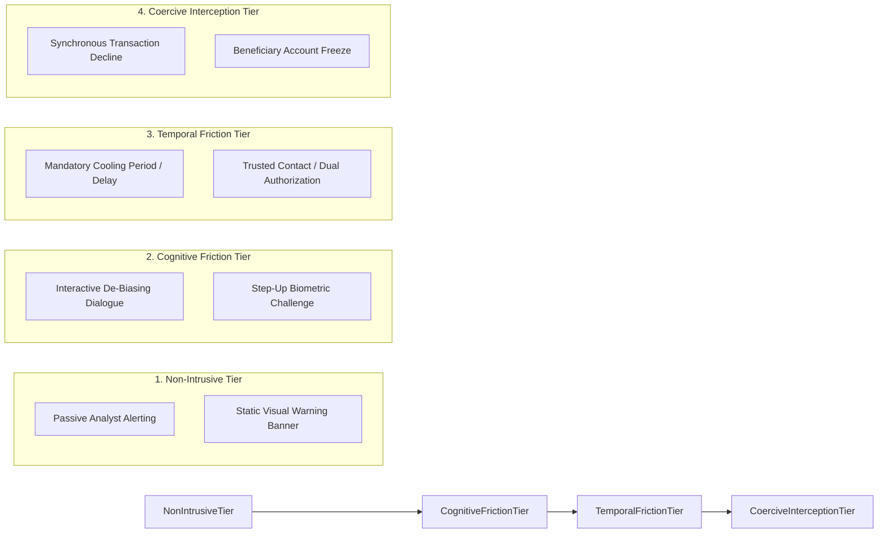

# Intervention Approach Taxonomy: Action Primitives, Friction Paradigms & Operational Impact

---

## 1. Executive Summary

In financial crime engineering, detection is meaningless without **effective intervention**. Identifying a scam with 99% accuracy yields zero economic protection if the resulting response mechanism fails to prevent value transfer or is casually dismissed by a manipulated victim.

Existing systems employ a wide spectrum of intervention paradigms that navigate the delicate tension between **consumer protection, user autonomy, operational cost, and commercial friction**. This document establishes a comprehensive taxonomy of eight distinct intervention mechanisms: **Passive Alerting**, **Static Visual Warnings**, **Interactive Cognitive Friction**, **Step-Up Authentication**, **Dynamic Transaction Cooldowns**, **Hard Synchronous Blocking**, **Beneficiary Account Liens**, and **Post-Settlement Clawback Protocols**.

---

## 2. Global Intervention Spectrum



---

## 3. Comprehensive Intervention Taxonomy Matrix

The following reference matrix details the operational triggers, execution loci, user experience impacts, and empirical limitations of each intervention paradigm:

| # | Intervention Paradigm | Operational Trigger | Locus of Execution | Deciding Actor | Action Taken & UX Impact | Advantages & Evidence | Critical Operational Limitations |
| :- | :--- | :--- | :--- | :--- | :--- | :--- | :--- |
| **I-01** | **Passive Alerting** | Anomaly score exceeds internal audit threshold. | Back-office Case Management queue. | Automated Risk Engine. | **Zero user impact**; transaction clears normally; alert placed in analyst queue. | Zero customer friction; perfect for AML audits. | Fails completely against real-time scams; analyst opens alert hours after funds leave. |
| **I-02** | **Static Visual Warnings** | Recipient is new payee or unverified VPA. | Client Mobile App (TPAP) UI screen. | Client App Rule Engine. | Displays red/yellow banner: *"Unknown Payee. Be Alert."* User taps 'Proceed'. | Non-blocking; maintains seamless commercial flow. | Completely neutralized by warning habituation and scammer coaching scripts (<500ms dismissal). |
| **I-03** | **Interactive Cognitive Friction** | High behavioral duress (e.g., active phone call + hesitation + new VPA). | Client Mobile App UI prior to MPIN window. | Client-side Guardian Component. | Mandatory interactive dialogue: User must select transfer reason from randomized options; 30s audio pause. | Triples scam abandonment rates (Acquisti et al. 2020: 12% -> 54% abandonment). | High user friction; risks merchant checkout abandonment if triggered on false alarms. |
| **I-04** | **Step-Up Authentication** | High amount or anomalous device location. | Common Library / Bank CBS. | Remitter Bank CBS. | Demands secondary factor (FaceID, hardware token, SMS OTP). | Stops credential theft and unauthorized account takeovers. | **Zero effect on APP scams**: Coerced victim willingly supplies the secondary biometric factor. |
| **I-05** | **Mandatory Transaction Cooldown** | First transfer to a newly added beneficiary exceeding threshold. | Remitter Bank CBS / Payer PSP. | Remitter Bank Core Policy. | Payment is accepted but **held in suspense for 2 to 4 hours** before switch dispatch. | Proven effective: Gives victim time to disconnect from scam call and consult family. | Severely degrades instant payment utility; breaks emergency hospital bills or auction deposits. |
| **I-06** | **Hard Synchronous Blocking** | Recipient VPA listed on confirmed police/mule registry (I4C/CIFAS). | Remitter Bank CBS or Payment Switch. | Central Switch / Bank Policy Engine. | Transaction terminated with `DECLINE_FRAUD_SUSPECTED`; money does not move. | 100% loss prevention on confirmed repeat offender accounts. | High legal risk (wrongful dishonor); ineffective against fresh, unlisted mule accounts. |
| **I-07** | **Beneficiary Account Freeze** | Receiving account receives rapid multi-bank burst credits. | Beneficiary Bank CBS. | Beneficiary Bank AML Engine. | Placing an administrative lien on incoming funds; prevents ATM withdrawal. | Halts fund dispersion even if payment has already cleared. | Requires receiving bank compliance cooperation; requires legal authority (police notice or AML rule). |
| **I-08** | **Post-Clearing Clawback Protocol** | Victim files formal scam report within statutory window (e.g., Pix MED). | Central Payment Rail Switch. | Interbank Dispute Arbitration. | Central switch issues automated debit instruction against receiving account. | Official legal mechanism for fund recovery without court order. | Defeated by 180s mule off-ramp velocity; >90% of requests hit empty accounts with $0 balance. |

---

## 4. Deep Dive: Cognitive Friction vs. Temporal Delay

The two most effective interventions identified in empirical literature are **Interactive Cognitive Friction** and **Mandatory Temporal Cooldowns**:

```
+-----------------------------------------------------------------------------------------------+
| THE TWO VIABLE INTERVENTION PARADIGMS FOR COERCED SCAMS                                       |
|                                                                                               |
| PARADIGM A: COGNITIVE FRICTION (In-Session De-Biasing)                                        |
| - Operational Moment: Within the 2-minute pre-flight formulation window on the phone.         |
| - Psychological Target: Breaks the "digital arrest" or urgency trance by forcing executive    |
|   prefrontal cortex reasoning (e.g., asking: "Did someone instruct you to keep this secret?").|
| - Strength: Immediate execution; preserves the sub-second settlement capability of the rail.  |
| - Weakness: Requires sophisticated client-side UX; highly sensitive to false-alarm annoyance. |
|                                                                                               |
| PARADIGM B: TEMPORAL COOLDOWN (The 2-Hour Pause)                                              |
| - Operational Moment: Payer submits payment, but remitter bank delays dispatch by 2 hours.    |
| - Psychological Target: Breaks the scammer's synchronous control. Scammers cannot maintain    |
|   active phone calls for 4 hours; victims naturally break out of panic and consult family.     |
| - Strength: Extremely high real-world scam prevention rate on high-value transfers.           |
| - Weakness: Destroys the "instant" value proposition of RTP rails; creates commercial dispute.|
+-----------------------------------------------------------------------------------------------+
```

---

## 5. Methodological Summary

This intervention taxonomy proves that:
1.  **Passive warnings and step-up auth** are completely obsolete against authorized push payment scams.
2.  **Hard blocking** is legally risky and fails against fresh, unlisted mule accounts.
3.  **The only empirically supported intervention mechanisms** that successfully stop coerced victims are **dynamic interactive cognitive friction** (pre-flight) and **risk-based temporal cooldowns** (pre-clearing).
