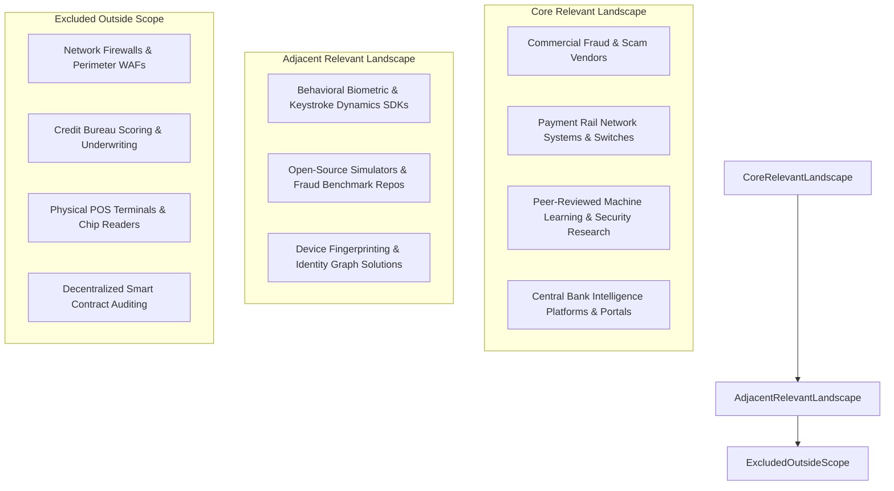

# Landscape Scope & Inclusion Criteria: Categorical Taxonomy of Prior Art

---

## 1. Executive Summary

Before surveying prior art, engineering and research teams must rigorously define what constitutes an **"existing solution"** or **"prior art"** for the problem of *Real-Time Payment Scam Interception*. Without explicit inclusion and exclusion boundaries, landscape research degenerates into an unfocused directory of hundreds of generic cybersecurity startups and legacy banking tools.

This document establishes the formal **prior art taxonomy, inclusion criteria, and evidentiary standards** for Phase 3. It categorizes existing solutions into eight distinct functional families across commercial enterprise software, central payment networks, academic computer science, open-source repositories, and government infrastructure.

---

## 2. Landscape Scope & Inclusion Boundaries

To qualify for inclusion in this landscape study, a technology, system, or research effort must directly address at least one of the three core challenges identified in Phase 2:
1.  **Detection of social engineering manipulation or behavioral duress** in digital environments.
2.  **Real-time or near-real-time evaluation of transaction risk** within retail payment lifecycles.
3.  **Active intervention, cognitive friction, or blocking mechanisms** prior to irrevocable fund settlement.



---

## 3. Prior Art Category Taxonomy & Qualification Standards

The following matrix defines the eight functional categories surveyed in Phase 3, detailing the inclusion justification, qualified evidence types, and explicit exclusion rules:

| Category | Description & Industry Examples | Why It Belongs in the Landscape | Qualifying Evidence Standards | Exclusion Criteria |
| :--- | :--- | :--- | :--- | :--- |
| **1. Commercial Scam & Fraud Platforms** | Enterprise vendor platforms deployed by tier-1 banks (e.g., BioCatch, Featurespace, Feedzai, LexisNexis ThreatMetrix, Sardine.ai). | Directly claims to detect and mitigate APP scams, social engineering, and payment fraud in real time. | Independently verified case studies, regulatory filings, technical patents, third-party benchmarks. | Unverified vendor marketing claims, pure sales decks, generic PR announcements. |
| **2. Payment Network Infrastructure** | Central rail switches and network-level risk engines (e.g., Mastercard Scam Protect, Visa Protect for A2A, NPCI DPIP, Pay.UK CoP). | Operates at the central clearinghouse layer; possesses macro interbank visibility across all member banks. | Network operating rules, technical interface control documents (ICDs), central bank pilot reports. | General card interchange marketing, merchant payment gateway sales materials. |
| **3. Academic Machine Learning & Security** | Peer-reviewed research from top-tier venues (ACM CCS, IEEE S&P, USENIX Security, KDD, NeurIPS). | Formalizes algorithmic paradigms: Graph Neural Networks (GNNs), temporal sequence modeling, behavioral biometrics. | Peer-reviewed publications, reproducible datasets, mathematical proofs, experimental baselines. | Non-peer-reviewed blog posts, undergraduate thesis drafts lacking experimental validation. |
| **4. Open-Source Systems & Simulators** | Public GitHub repositories, synthetic financial data generators, and benchmarking suites (e.g., PaySim, BAF, Elliptic). | Provides reproducible codebases, algorithmic implementations, and public evaluation baselines. | Active GitHub commits, documentation, published dataset licenses, verifiable code. | Abandoned codebases with zero documentation, toy homework assignments. |
| **5. Behavioral Biometrics & Device Intelligence** | Specialized client-side SDKs inspecting physical interaction and sensor telemetry (e.g., BioCatch Scams360, Incognia). | Operates on the client handset during the pre-flight formulation window; detects user hesitation and duress. | Patent documentation, OS developer API integrations, empirical error rate benchmarks. | Static CAPTCHA tools, basic IP-based geolocation lookups. |
| **6. Regulatory & Institutional Infrastructure** | Government-operated cybercrime hotlines, reporting portals, and suspect registries (e.g., Indian I4C `1930`, UK CIFAS). | Represents the current operational mechanism for post-incident asset freezing and interbank data sharing. | Government parliamentary reports, central bank circulars, statutory standard operating procedures (SOPs). | Political commentary, opinion editorials lacking operational data. |
| **7. User-Facing Interaction & Cognitive Friction** | In-app warning dialogs, confirmation modals, interactive cognitive friction, and dynamic delay mechanisms. | Explores the direct human-computer interaction (HCI) boundary between the payment app and the coerced victim. | Published HCI experiments, behavioral economics studies, A/B test conversion metrics. | Generic advice articles ("10 tips to stay safe online"). |
| **8. Autonomous AI & Agentic Systems** | Emerging systems utilizing LLMs, multi-agent frameworks, or autonomous decision agents in fraud operations. | Directly tests the feasibility and prior art surrounding the "Agentic" descriptor in the problem statement. | Documented enterprise deployments, AI research papers, formal agent evaluation metrics. | Simple rule-based bots rebranded as "agentic" for marketing purposes. |

---

## 4. Evidence Hierarchy & Triangulation Standard

To ensure that the landscape reflects **operational reality rather than marketing hyperbole**, all claims are evaluated against a three-tier evidence hierarchy:

```
+-----------------------------------------------------------------------------------------------+
| EVIDENTIARY HIERARCHY FOR PRIOR ART RESEARCH                                                  |
|                                                                                               |
| TIER 1: PRIMARY INDEPENDENT EVIDENCE (Gold Standard)                                          |
| - Regulatory enforcement audits (e.g., UK PSR Annual Fraud Reports).                          |
| - Peer-reviewed academic conference papers with open code/data (KDD, IEEE S&P).               |
| - Official payment rail technical specifications and central bank circulars.                  |
|                                                                                               |
| TIER 2: DOCUMENTED ENTERPRISE METRICS (Silver Standard)                                       |
| - Verified bank case studies with named institutions (e.g., NatWest deploying BioCatch).      |
| - Published patents detailing algorithmic mechanisms and signal pipelines.                    |
| - Official government cybercrime task force operational dossiers (I4C, FBI IC3).              |
|                                                                                               |
| TIER 3: VENDOR CLAIMS & SELF-REPORTED DATA (Bronze Standard - Handled with Skepticism)        |
| - Vendor whitepapers, product documentation, and corporate press releases.                    |
| - Rule: Vendor claims must be explicitly marked as [Vendor Claim] and never cited as fact     |
|   unless corroborated by Tier 1 or Tier 2 evidence.                                           |
+-----------------------------------------------------------------------------------------------+
```

---

## 5. Methodological Summary

By establishing strict inclusion boundaries and evidentiary standards, Phase 3 ensures that our landscape analysis is **comprehensive across approach families, evidence-dense, free of vendor gullibility, and focused exclusively on real-time scam interception**.
