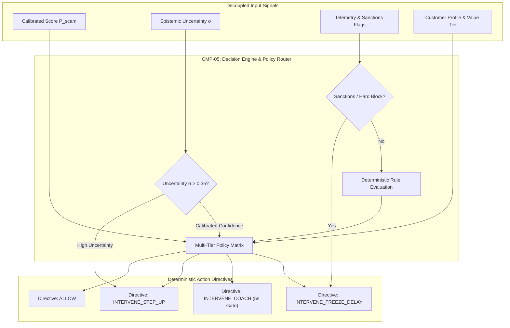
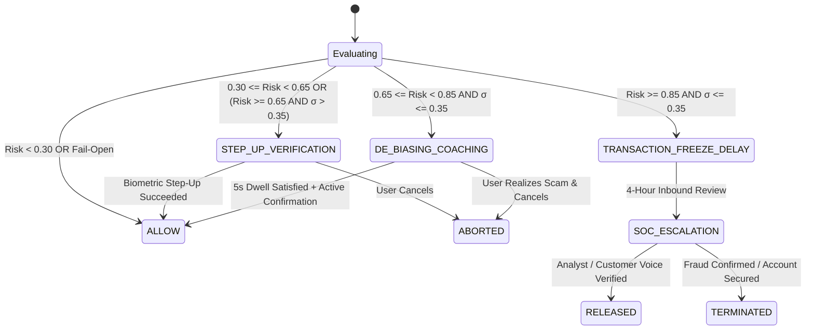
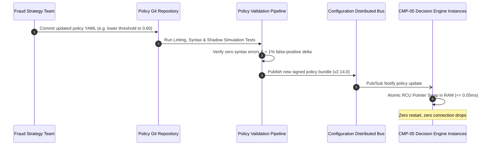

# Decision Engine & Policy Router Architecture

## 1. Architectural Philosophy: Decoupling Risk from Policy

A fatal flaw in legacy fraud systems is hardcoding business rules inside machine learning models or scattering decision logic across API gateways.

In Kurukshetra, **Risk Scoring and Decision Policy are strictly decoupled**:
- **The Risk Engine calculates what is happening**: Calibrated probability of scam $P_{\text{scam}} \in [0.0, 1.0]$, epistemic uncertainty $\sigma$, and exact feature attributions.
- **The Decision Engine determines what must be done**: Translating statistical outputs, compliance mandates, customer relationship profiles, and jurisdiction-specific regulatory constraints into deterministic **Action Directives**.

---

## 2. Decision State Machine & Directive Taxonomy

Every transaction evaluated by Kurukshetra terminates in exactly one of four mutually exclusive, strongly-typed **Action Directives**:

### Directive Specifications

| Directive Enum | Client UI Behavior | Backend Payment State | Audit Logging Level | Typical Typology Target |
| :--- | :--- | :--- | :--- | :--- |
| `ALLOW` | Standard flow; render PIN/biometric prompt instantly. | Forward transaction to core switch for processing. | Standard telemetry log | Normal commerce, low-value peer transfers |
| `INTERVENE_STEP_UP` | Prompt for secondary out-of-band biometric authentication (e.g. FaceID / FIDO2). | Hold transaction in pending status (max 60s). | Elevated telemetry | New payee, slight velocity burst, high uncertainty |
| `INTERVENE_COACH` | Render full-screen blocking modal with 5-second countdown timer and targeted coercion questions. | Hold transaction state in temporary reservation lock. | High-resolution forensic snapshot | Active impersonation scam, screen sharing, high stress |
| `INTERVENE_FREEZE` | Render sympathetic security hold screen; disable immediate payment; initiate 4-hour cooling-off. | Quarantine payment; issue ISO 20022 `pacs.002` rejection or hold; alert receiving bank. | Immutable WORM record + instant SOC alert | Confirmed multi-hop syndicate mule, high-value drain |

---

## 3. The 4-Tier Policy Matrix Specification

To prevent unpredictable edge cases, the Policy Router evaluates rules sequentially across four priority tiers:

### Tier 0: Regulatory & Hard Safety Overrides (Priority 1 - Absolute Precedence)
- **Rule 0.1 (Sanctions / Blacklist)**: If recipient IBAN/account matches national terror or sanctions blacklist $\rightarrow$ `INTERVENE_FREEZE` immediately; suppress detailed explanation to user to comply with AML anti-tipping-off laws.
- **Rule 0.2 (Active Remote Screen Control)**: If remote access software (AnyDesk, TeamViewer) is actively controlling the device AND payment $> \$500 \rightarrow$ Force `INTERVENE_FREEZE`.

### Tier 1: Uncertainty & Safe-Harbor Clamping (Priority 2)
- **Rule 1.1 (Epistemic Downgrade)**: If $P_{\text{scam}} \ge 0.85$ but epistemic uncertainty $\sigma > 0.35 \rightarrow$ Clamp directive to `INTERVENE_STEP_UP`. Prohibit outright freezes for transactions the model has never observed in training data.

### Tier 2: Statistical Risk Scoring Matrix (Priority 3)
When no overrides trigger and uncertainty is within bounds ($\sigma \le 0.35$):
- $0.00 \le P_{\text{scam}} < 0.30 \rightarrow$ `ALLOW`
- $0.30 \le P_{\text{scam}} < 0.65 \rightarrow$ `INTERVENE_STEP_UP`
- $0.65 \le P_{\text{scam}} < 0.85 \rightarrow$ `INTERVENE_COACH` (triggers 5-second dwell gate + specific counter-narrative)
- $0.85 \le P_{\text{scam}} \le 1.00 \rightarrow$ `INTERVENE_FREEZE` (triggers cooling-off quarantine + mule alert)

### Tier 3: Customer Value & Vulnerability Modifiers (Priority 4)
- **Rule 3.1 (Vulnerable Customer Safe-Harbor)**: If customer age $\ge 70$ or flag `vulnerable_customer=TRUE`, lower the `INTERVENE_COACH` threshold from $0.65$ to $0.50$ to provide earlier educational safeguarding against predatory pension/impersonation scams.
- **Rule 3.2 (Commercial Treasury Override)**: Pre-registered corporate treasury accounts with dual-controller signing keys are exempted from client-side coaching modals and routed to multi-sign authorization queues.

---

## 4. Policy Versioning, Canary Routing & Zero-Downtime Hot-Reload

1. **Policy as Code (GitOps)**: All thresholds, weights, and text templates are stored in versioned YAML schemas in git.
2. **Atomic Pointer Swapping**: The Go Decision Engine loads policies into memory-mapped structures. When a new policy is pushed via Redis Pub/Sub, the engine verifies the cryptographic signature of the policy file and executes an atomic pointer swap in $< 50\mu\text{s}$.
3. **Canary Policy Evaluation**: Policies can be routed conditionally based on `mod(user_id, 100)`:
   - 95% traffic evaluated on `policy_v1.0.0` (Active Champion).
   - 5% traffic evaluated on `policy_v1.1.0` (Candidate Challenger).
