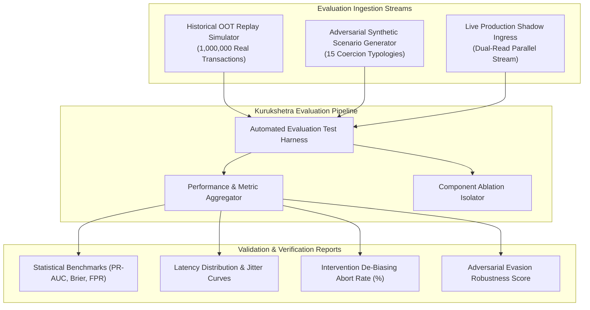
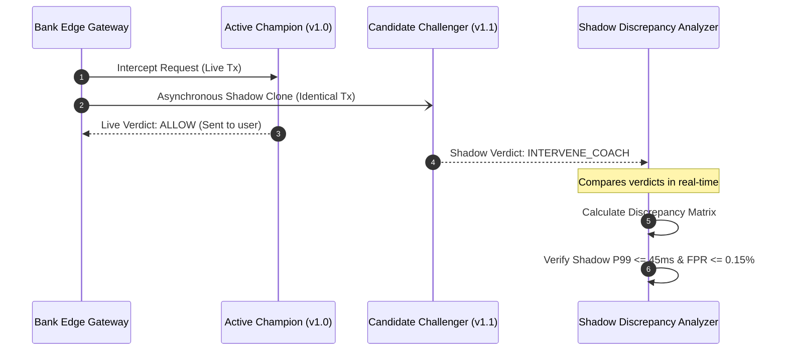

# Evaluation & Empirical Validation Architecture

## 1. Evaluation Architecture Mandate

An architecture for payment scam interception cannot rely on abstract claims or theoretical accuracy. It must incorporate a **first-class, empirical evaluation subsystem** capable of proving:
1. Whether the detection engine genuinely catches real-world APP scam patterns.
2. Whether the behavioral interventions measurably break cognitive coercion tunnels.
3. Whether the system preserves strict latency budgets and fails safely under extreme adversarial conditions.



---

## 2. Evaluation Dimensions & Rigorous Metrics

Kurukshetra rejects generic classification accuracy. In extreme class imbalance regimes (where scams represent ~0.1% of transactions), a naive system that approves 100% of transactions achieves 99.9% accuracy while failing 100% of fraud victims.

The evaluation architecture mandates the following target metrics:

| Metric Category | Target Primary Metric | Minimum Acceptable Threshold | Measurement Method |
| :--- | :--- | :--- | :--- |
| **Detection Power** | **PR-AUC (Precision-Recall Area Under Curve)** | $\ge 0.48$ (Baseline: 0.0012) | Blind Out-of-Time 90-day evaluation set |
| **Customer Friction** | **False Positive Ratio (FPR)** | $\le 0.15\%$ ($< 1.5$ per 1,000 legitimate tx) | Evaluation against 500,000 confirmed benign transactions |
| **High-Risk Catch Rate**| **Recall @ FPR $\le 0.1\%$** | $\ge 78.0\%$ detection of high-risk scams | Evaluated on impersonation and tech support cohorts |
| **Probability Calibration**| **Brier Score / Expected Calibration Error** | $\text{ECE} \le 0.015$ | 10-bin reliability diagram validation |
| **Latency Enforcement** | **P99 Critical Path End-to-End Latency** | $\le 45.0\text{ms}$ | 20,000 TPS sustained load test |
| **Intervention Efficacy**| **Cognitive De-Biasing Abort Rate** | $\ge 40.0\%$ scam abandonments | Evaluated in controlled human behavioural testing simulations |
| **Adversarial Resilience**| **Prompt / Feature Evasion Resistance** | $\ge 95.0\%$ retention of risk score | Perturbation attacks on transaction remarks & timing |

---

## 3. The Offline Replay & Synthetic Simulation Engine

To evaluate models without risking customer funds, Kurukshetra implements a high-throughput **Deterministic Replay Simulator**:
1. **Historical Ledger Replay**:
   - Ingests anonymized transaction logs from past fraud events.
   - Reconstructs point-in-time Redis cache states exactly as they existed at transaction timestamp $T_0$.
   - Replays transactions through `CMP-01`, `CMP-03`, and `CMP-05` to measure whether the modern pipeline would have intercepted the fraud before fund dispatch.
2. **Synthetic Scenario Generation Suite**:
   - Generates multi-step, stateful scam simulations across 15 distinct fraud typologies (Law Enforcement Impersonation, Remote Access takeover, Romance grooming, Pig Butchering crypto investments, Advance Fee loan scams).
   - Generates realistic benign behavioral distributions (normal e-commerce checkout, regular utility bills, peer-to-peer dinner splits) to rigorously assert false positive baselines.

---

## 4. Shadow-Mode Production Pipeline

Before any model artifact or decision policy is promoted to live production, it must run in **Active Shadow Mode** for a mandatory 14-day bake period:



### Promotion Gate Criteria:
A candidate model may only replace the active champion if:
1. Shadow PR-AUC improves by $\ge 5\%$ relative to active champion.
2. False positive rate on live benign stream does not exceed $0.15\%$.
3. Shadow P99 inference latency is $\le 8.0\text{ms}$.
4. Zero unhandled exceptions or crash restarts occur over 10,000,000 shadow evaluations.

---

## 5. Component Ablation Testing Framework

To guarantee that each architectural component contributes measurable empirical value and does not represent unjustified architectural bloat, the test harness automatically executes automated **Ablation Sweeps**:

```text
Full Kurukshetra Architecture (All Signals + Cache + ML + GNN) ────► PR-AUC: 0.54, Recall@0.1% FPR: 82%
  ├── ABLATION 1: Remove Behavioral Telemetry (G1) ──────────────► PR-AUC: 0.31 (Δ -42%) [Proves G1 Criticality]
  ├── ABLATION 2: Remove GNN Mule Subgraphs (G4) ─────────────────► PR-AUC: 0.41 (Δ -24%) [Proves G4 Value]
  ├── ABLATION 3: Remove Conformal Uncertainty Calibration ───────► FPR Spikes from 0.12% to 0.68% [Proves M-02 Value]
  └── ABLATION 4: Replace LightGBM with LLM in Synchronous Path ──► Latency explodes: P99 from 36ms to 1,250ms [REJECTED]
```
The ablation harness ensures that every module in the architecture directly defends its operational footprint with statistical evidence.
