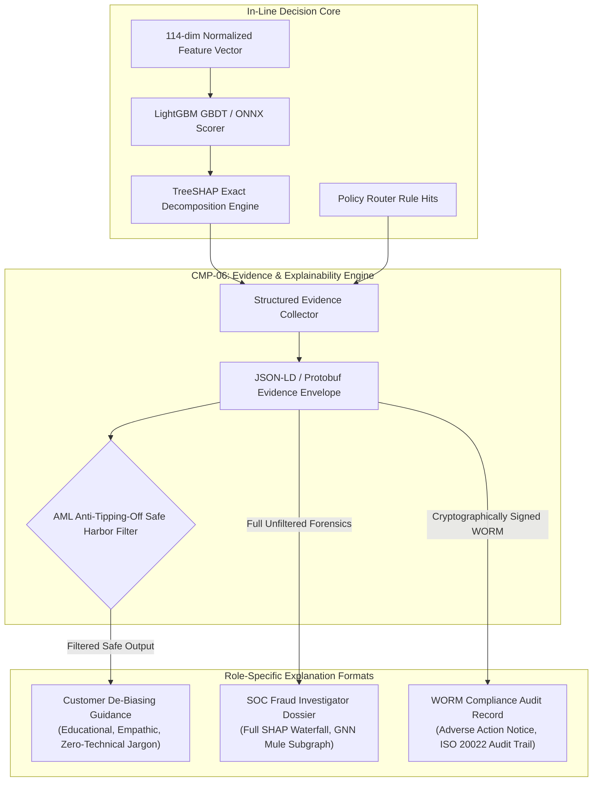

# Explainability & Evidence Architecture

## 1. Core Architectural Tenet: Causal Evidence over Post-Hoc Hallucination

A critical failure mode of generative AI in financial risk compliance is the creation of **post-hoc rationalizations**: convincing, fluent narratives fabricated by an LLM that bear no mathematical connection to the actual weights or mathematical variables that caused the algorithm to block or flag a transaction.

In Kurukshetra, **Explainability is grounded strictly in deterministic causal evidence**:
1. Every decision is driven by **Exact TreeSHAP Values** and **Deterministic Rule Triggers** calculated during inference.
2. Explanations are represented as structured, typed **Evidence Dossiers** containing raw telemetry metrics, feature attributions, and exact model version identifiers.
3. Natural language explanations are generated via strictly constrained templates or verified grammar parsers, ensuring 100% fidelity to the underlying mathematical signals.



---

## 2. Structured Evidence Representation: The `EvidenceDossier` Schema

Every transaction evaluated produces an immutable, cryptographically verifiable `EvidenceDossier` serialized in Google Protocol Buffers:

```protobuf
syntax = "proto3";
package kurukshetra.evidence.v1;

message EvidenceDossier {
  string transaction_id = 1;
  int64 timestamp_epoch_ms = 2;
  string sender_account_hash = 3;
  string recipient_account_hash = 4;
  
  // Scoring Core
  float calibrated_risk_score = 5;
  float epistemic_uncertainty = 6;
  string model_version = 7;
  string policy_version = 8;
  string directive_issued = 9;

  // Causal Attributions (Top-5 Exact TreeSHAP values)
  repeated FeatureAttribution feature_attributions = 10;

  // Direct Telemetry Evidence
  TelemetrySnapshot telemetry_snapshot = 11;

  // Regulatory & Audit Proofs
  string digital_signature_sha256 = 12;
  bool is_tipping_off_sanitized = 13;
}

message FeatureAttribution {
  string feature_name = 1;
  float feature_value = 2;
  float shap_attribution_value = 3;
  string human_readable_description = 4;
}

message TelemetrySnapshot {
  bool active_gsm_call = 1;
  int32 call_duration_seconds = 2;
  bool remote_access_software_active = 3;
  string remote_access_package_name = 4;
  float touch_entropy_variance = 5;
  float 24h_outflow_velocity_ratio = 6;
  float recipient_mule_cluster_score = 7;
}
```

---

## 3. The AML Anti-Tipping-Off Safe-Harbor Filter

Financial institutions are legally prohibited under international Anti-Money Laundering (AML) statutes (e.g., UK Proceeds of Crime Act s.333A, US Bank Secrecy Act, Indian PMLA s.12) from "tipping off" a criminal suspect that they are under surveillance or that an interbank mule investigation is underway.

If a fraud system informs a scammer or collusive mule account holder: *"Your transaction was blocked because Recipient IBAN XYZ is tagged as a Money Mule Cluster in our GNN graph,"* the syndicate will instantly burn that mule account and migrate funds through alternative channels.

Kurukshetra solves this regulatory tension via a **Dual-Surface Projection Filter**:

```text
Full Evidence Dossier (Internal SOC & Regulatory Audit)
  ├── 1. Recipient is flagged in Mule Cluster #419 (GNN Score: 0.94)
  ├── 2. Sender is on active GSM call with scammer spoofing police
  └── 3. Account balance being drained by 94% within 15 minutes

              │
              ├── [AML Anti-Tipping-Off Safe Harbor Filter]
              │
              ▼
Customer-Facing Projection (Safe-Harbor Compliant)
  ├── "For your security, we paused this transfer because high-value payments to first-time recipients require extra protection."
  └── "We noticed screen-sharing or active call activity commonly associated with impersonation scams."
  (ALL REFERENCES TO MULE CLUSTERS, GNN EMBEDDINGS, AND POLICE BLACKLISTS ARE STRIPPED)
```

---

## 4. Adverse Action Notice Generation (FCRA / ECOA / GDPR Art. 22)

Under regulations governing algorithmic decision-making (Fair Credit Reporting Act, Equal Credit Opportunity Act, and GDPR Article 22), any customer whose transaction is denied or subject to adverse account holds has the legal right to understand the primary factors that led to the determination.

The Explainability Engine generates an automated, legally compliant **Adverse Action Notice**:
1. Extracts the top-4 negative TreeSHAP contributors where $\text{SHAP}_i > 0.08$.
2. Maps each feature to a pre-certified, non-discriminatory adverse action reason code:
   - `RAT_ACTIVE`: *"An unverified remote desktop application was actively running during transaction authorization."*
   - `VELOCITY_SPIKE`: *"Transaction volume over the past 24 hours significantly exceeds historical account baselines."*
   - `NEW_BENEFICIARY_DRAIN`: *"High-value outbound transfer requested within 10 minutes of adding a new, unverified payee."*
3. Guarantees that protected demographic attributes (race, gender, religion, national origin) are mathematically excluded from both the feature store and the adverse action generator.

---

## 5. Storage, Archival & WORM Compliance

- **Storage Target**: AWS S3 Glacier with **Object Lock in Compliance Mode** (`COMPLIANCE_MODE = TRUE`).
- **Retention Period**: Strictly enforced 7-year retention to comply with Basel III and FATF financial recordkeeping standards.
- **Tamper Evident Merkle Trees**: Dossiers are batched every 60 seconds into a Merkle tree root hash published to an immutable cryptographic ledger, providing non-repudiation during regulatory audits.
