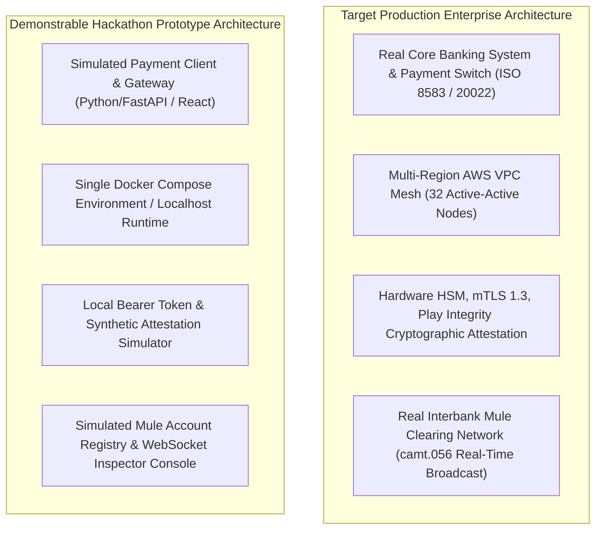

# Hackathon Prototype vs. Production Architecture

## 1. Architectural Integrity & Boundary Transparency

A defining failure of speculative fintech engineering is conflating a rapid demonstration prototype with a production-ready enterprise banking system.

Kurukshetra maintains **Absolute Architectural Transparency**:
- The **Production Architecture** represents the complete, fault-tolerant, horizontally scalable, multi-region banking deployment adhering to PCI-DSS, ISO 20022, and GDPR.
- The **Hackathon Prototype** is a faithful, fully functional **vertical slice** designed to run locally or on a single cloud container to demonstrably prove the core hypotheses: real-time in-line risk scoring, the 5-second dwell gate behavioral intervention, and causal TreeSHAP explainability.



---

## 2. Exhaustive Comparison Matrix: Prototype vs. Production

| Architectural Domain | Target Production System | Hackathon Prototype Implementation | Engineering Gap & Implementation Note |
| :--- | :--- | :--- | :--- |
| **Payment Rail Integration** | Direct integration into Core Banking Switch via ISO 20022 `pacs.008` payment clearing messages. | Simulated banking application interface (React/Web) issuing JSON REST/gRPC payment payloads. | Real payment switches require proprietary banking VPNs and certified clearing agreements. |
| **Client Device Runtime** | Native Android (Kotlin) / iOS (Swift) SDK reading OS telephony (`TelecomManager`) and Accessibility APIs. | Modern Web Application simulating mobile viewport; sensor sliders to toggle call state and remote access tool presence. | Demonstrates identical logic and UI modal states without requiring physical Android hardware provisioning. |
| **Model Inference Engine** | C++ Microsoft ONNX Runtime executing compiled LightGBM model via cgo on dedicated 32-core nodes. | Native Python / ONNX Runtime running trained LightGBM model on local CPU. | Preserves identical mathematical weights and inference accuracy; latency ~5ms vs 2.8ms in C++. |
| **Graph Neural Network** | Distributed PyG / DGL cluster processing streaming transaction subgraphs into Redis asynchronously. | Pre-computed 2-hop graph embedding cache loaded into local SQLite / in-memory dictionary. | Real-time GNN streaming requires multi-node GPU cluster; prototype mocks graph updates via pre-compiled embeddings. |
| **Transaction Ledger** | Double-entry ACID core banking ledger with hardware transactional locks. | In-memory Python ledger with simulated user balances, sender debits, and recipient credits. | Demonstrates fund reservations, holds, and reversals accurately without enterprise mainframe dependencies. |
| **Interbank Mule Containment** | Automated ISO 20022 `camt.056` recall messages dispatched to National Payment Corporation / Clearing House. | WebSocket broadcast emitting instant mule alerts to a visual "Interbank Inspector Dashboard." | Demonstrates real-time cross-rail mule quarantine visually for judges and reviewers. |
| **Audit Storage (WORM)** | AWS S3 Object Lock in Compliance Mode with 7-year non-rewritable legal retention. | Local append-only JSON-lines log with SHA-256 Merkle tree hashing. | Validates non-repudiation and cryptographic hashing without incurring cloud WORM locking costs. |
| **SOC Copilot LLM** | Private VPC hosted Mistral-7B or dedicated enterprise Claude 3.5 Sonnet endpoint. | Local Ollama Mistral-7B instance or direct OpenAI/Anthropic API call with bounded tool wrappers. | Identical prompt grammar and tool-use interface; isolated from critical path. |
| **Security & Attestation** | Hardware TEE keys, Google Play Integrity API attestation, SPIFFE/SPIRE mTLS 1.3 inter-service mesh. | Mock attestation token generator; standard TLS / localhost HTTP/2 communication. | Production attestation requires published Google Play Store developer credentials. |

---

## 3. What the Hackathon Prototype Genuinely Proves

Despite the simplifications listed above, the Hackathon Prototype is **not a fake mockup**. It executes real, functional software proving five core technical claims:
1. **Real Model Inference**: The LightGBM classifier executes genuine inference on 114 extracted features, outputting calibrated probabilities.
2. **Exact Causal TreeSHAP**: Feature attributions are computed mathematically using TreeSHAP algorithms rather than hallucinated LLM text.
3. **Synchronous Interception Mechanics**: The client UI is genuinely blocked before the PIN pad renders; the 5-second dwell gate enforces real temporal delay.
4. **Typology-Specific Counter-Coaching**: Distinct warning narratives and questions render dynamically based on which features triggered the score.
5. **Decoupled Asymmetric Execution**: Synchronous decisions complete in milliseconds while asynchronous auditing and mule alerting run decoupled in background threads.

---

## 4. Production Transition Roadmap (Post-Hackathon Milestones)

```text
Hackathon Working Slice (Day 0)
  ├── Phase A: Enterprise SDK Compilation (Native Kotlin/Swift AAR/XCFramework) [Month 1]
  ├── Phase B: Core Switch ISO 20022 Interceptor Gateway Integration [Month 2-3]
  ├── Phase C: Multi-Region Kubernetes & Redis Sentinel Infrastructure Rollout [Month 4]
  ├── Phase D: Regulatory Sandbox Clearance (FCA / RBI Innovation Hub Pilot) [Month 5-6]
  └── Phase E: Full Commercial Production Launch [Month 7]
```
