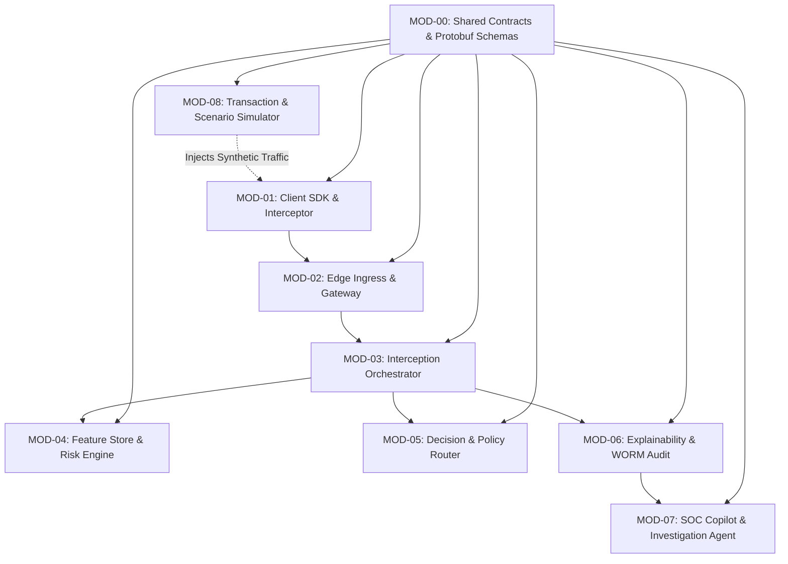

# Implementation Boundaries & Module Decomposition

## 1. Modular Boundary Architecture

To enable concurrent, decoupled development across multiple engineering teams and subagents without merge conflicts or circular dependencies, Kurukshetra enforces strict **Explicit Module Boundaries**.

Dependencies strictly flow downward in a Directed Acyclic Graph (DAG):

---

## 2. Exhaustive Module Specifications

### MOD-00: Core Contracts & Common Schemas (`core-contracts`)
- **Responsibility**: Houses canonical Protocol Buffer definitions, typed Go/Python structs, error codes, and shared constants.
- **Public Interface**: `kurukshetra.proto.v1` (Protobuf code-generated libraries for Go, Python, TypeScript).
- **Dependencies**: None (Leaf dependency node).
- **Test Boundary**: Schema compilation tests, backward-compatibility linting (`buf breaking`).

### MOD-01: Client Interceptor SDK (`client-sdk`)
- **Responsibility**: Native mobile UI interceptor; hooks "Pay" click; renders 5-second dwell gate; collects local telemetry summary.
- **Inputs**: User payment intent payload, raw OS call/accessibility state flags.
- **Outputs**: `InterceptRequest` Protobuf packet sent to Ingress Gateway; UI directive rendered.
- **Dependencies**: `MOD-00`.
- **Test Boundary**: Mock UI tests, countdown timer integrity assertions, client-side fallback tests.

### MOD-02: Edge Ingress Gateway (`edge-gateway`)
- **Responsibility**: TLS 1.3 termination, rate-limiting, JWT/mTLS token validation, payload deserialization.
- **Inputs**: HTTPS/HTTP2 payloads from mobile clients.
- **Outputs**: Verified gRPC unary calls routed to `MOD-03`.
- **Dependencies**: `MOD-00`.
- **Test Boundary**: High-volume mock flood tests, token validation unit tests.

### MOD-03: Interception Orchestrator (`orchestrator`)
- **Responsibility**: Enforces 45ms P99 synchronous critical path; coordinates parallel cache lookup, risk scoring, and policy routing.
- **Inputs**: Inbound payment intent gRPC call.
- **Outputs**: Strongly typed `InterceptVerdict` returned to Gateway; asynchronous audit event published to Kafka.
- **Dependencies**: `MOD-00`, `MOD-04`, `MOD-05`, `MOD-06`.
- **Test Boundary**: End-to-end latency benchmark harness, circuit breaker trip tests, chaos fault injection.

### MOD-04: Feature Store & Risk Engine (`risk-engine`)
- **Responsibility**: Assembles 114-dim feature vector; executes compiled LightGBM model via ONNX runtime; computes TreeSHAP values.
- **Inputs**: Raw transaction parameters + client telemetry flags + Redis context slice.
- **Outputs**: `RiskScoreResult` (P_scam float, uncertainty float, top-5 SHAP features).
- **Dependencies**: `MOD-00`.
- **Test Boundary**: Model accuracy regression tests, benchmark inference latency under AVX2, null-value robustness tests.

### MOD-05: Decision Engine & Policy Router (`policy-router`)
- **Responsibility**: Evaluates 4-tier decision matrix; applies epistemic uncertainty clamping and sanctions overrides; yields Action Directives.
- **Inputs**: `RiskScoreResult` + customer vulnerability profile.
- **Outputs**: Strongly typed `ActionDirective` (`ALLOW`, `STEP_UP`, `COACH`, `FREEZE`).
- **Dependencies**: `MOD-00`.
- **Test Boundary**: 100% path coverage unit tests across all policy matrix combinations and override conditions.

### MOD-06: Explainability & WORM Audit Engine (`audit-engine`)
- **Responsibility**: Synthesizes `EvidenceDossier`; applies AML anti-tipping-off filter; commits cryptographically signed dossiers to immutable storage.
- **Inputs**: Transaction context, scoring outputs, policy verdict, timestamp.
- **Outputs**: Sanitized customer de-biasing copy + raw forensic record in S3/ClickHouse.
- **Dependencies**: `MOD-00`.
- **Test Boundary**: Anti-tipping-off regex leakage tests, Merkle root hash verification, S3 Object Lock compliance tests.

### MOD-07: SOC Copilot & Investigation Agent (`soc-copilot`)
- **Responsibility**: Bounded agentic LLM workflow; assists fraud analysts by pulling multi-hop graph context and drafting case dossiers.
- **Inputs**: Asynchronous high-risk alert event from Kafka.
- **Outputs**: Structured Markdown/JSON investigation summary in Analyst Workbench.
- **Dependencies**: `MOD-00`, `MOD-06`.
- **Test Boundary**: Prompt injection defense suites, tool timeout assertions, schema validation tests.

### MOD-08: Transaction & Scenario Simulator (`scenario-simulator`)
- **Responsibility**: Generates deterministic benign and scam transactions across 15 fraud typologies for testing and demonstration.
- **Inputs**: Seed parameters, scenario script definitions.
- **Outputs**: Synthetic transaction streams dispatched to `MOD-01` or `MOD-02`.
- **Dependencies**: `MOD-00`.
- **Test Boundary**: Scenario fidelity checks, statistical balance tests.

---

## 3. Circular Dependency Prohibition & Interface Decoupling

To ensure independent testability:
1. No two modules may import each other (`MOD-A` $\rightarrow$ `MOD-B` and `MOD-B` $\rightarrow$ `MOD-A` is an immediate build failure).
2. Inter-module communication across process boundaries is strictly executed over versioned gRPC APIs or asynchronous Kafka messages.
3. Every module includes a dedicated `mock/` package allowing dependent modules to run comprehensive unit tests completely offline.
