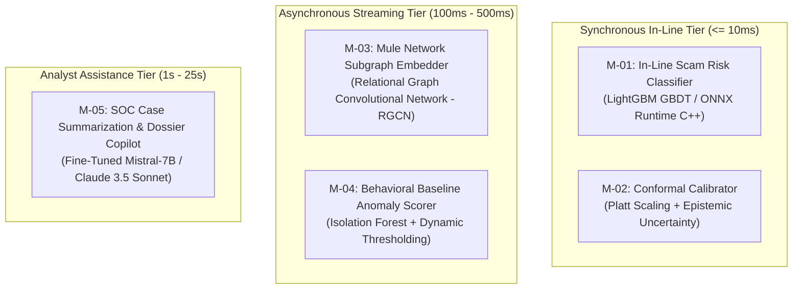
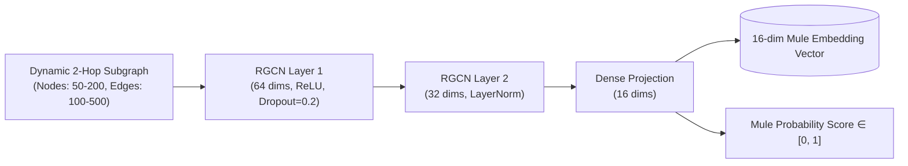
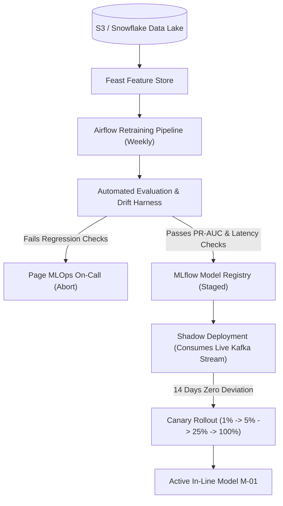

# Model Architecture & ML Lifecycle Specification

## 1. Model Portfolio Overview

Kurukshetra employs a targeted ensemble of purpose-built machine learning models, strictly matching model complexity to the latency, interpretability, and execution constraints of each subsystem:

---

## 2. In-Line Risk Classifier (`M-01` LightGBM GBDT)

### 2.1 Model Specification
- **Algorithm**: Gradient Boosted Decision Tree (LightGBM).
- **Hyperparameters**: 250 trees, max depth 6, num_leaves 31, learning rate 0.05, feature fraction 0.8.
- **Inference Runtime**: Microsoft ONNX Runtime C++ library linked via cgo to the Go Interception Orchestrator (`CMP-01`).
- **Target Variable**: Binary classification $y \in \{0, 1\}$, where $y=1$ indicates an authorized push payment scam attempt (confirmed via subsequent recall or fraud victim report).
- **Inference Benchmark**: P50 = 2.8ms, P99 = 6.2ms on standard 4-core AWS c6i.xlarge instances.

### 2.2 Feature Preprocessing & Normalization
- All numeric features (ratios, velocities, amounts) are scaled using robust quantile transformation to suppress extreme financial outliers without information loss.
- Categorical features (device OS, connection type, bank ID) are frequency-encoded and mapped to fixed integer IDs.
- Missing values are explicitly preserved and routed along dedicated missing-value split branches in LightGBM, avoiding artificial imputation artifacts.

### 2.3 Exact TreeSHAP Feature Attribution
Unlike deep networks requiring sampling-based LIME or KernelSHAP approximations, LightGBM permits **Exact TreeSHAP** calculation in polynomial time $O(T L D^2)$, generating mathematically exact feature contributions for every transaction in $< 1.2\text{ms}$. These Shapley values directly feed the downstream Explainability Engine (`CMP-06`).

---

## 3. Conformal Prediction & Epistemic Uncertainty (`M-02`)

### 3.1 Mathematical Formulation
To distinguish between known fraud patterns and ambiguous out-of-distribution transactions, Kurukshetra wraps `M-01` in a non-exchangeable conformal prediction framework:
1. **Calibrated Probability**:
   $$P(y=1 | x) = \frac{1}{1 + \exp(A \cdot f(x) + B)}$$
   where parameters $A$ and $B$ are fitted via Platt scaling on an independent calibration set of 50,000 recent transactions.
2. **Epistemic Uncertainty Metric**:
   $$u(x) = 1 - \max_{c \in \{0, 1\}} \hat{P}(y=c | x) + \mathbb{D}_{\text{KL}}\left(\mathcal{P}_{\text{ensemble}} \parallel \mathcal{P}_{\text{prior}}\right)$$
   Transactions with $u(x) > 0.35$ trigger policy constraints that prevent high-impact false-positive account freezes.

---

## 4. Graph Neural Network Mule Embedder (`M-03` RGCN)

### 4.1 Architecture & Formulation
- **Model Type**: 2-layer Relational Graph Convolutional Network (RGCN) with heterogeneous edge types:
  - `EDGES`: `TRANSFERS_TO`, `SHARES_DEVICE_WITH`, `SHARES_IP_WITH`, `CONTACT_SAVED_AS`.
- **Node Features**: Account age, 30-day cumulative inflow, 30-day cumulative outflow, in/out degree ratio, KYC tier.
- **Hidden Dimensions**: 64 $\rightarrow$ 32 $\rightarrow$ 16 (output embedding).
- **Loss Function**: Weighted binary cross-entropy with focal loss $(\gamma = 2.0)$ to handle extreme class imbalance (mule accounts constitute $< 0.1\%$ of total network nodes).

---

## 5. Training, Validation & Data Governance

### 5.1 Dataset Composition & Split Strategy
- **Training Corpus**: 10,000,000 anonymized historical payment transactions spanning 12 months.
- **Scam Incident Proportion**: 0.12% confirmed APP scam cases (12,000 positive instances).
- **Temporal Splitting**: Strictly out-of-time (OOT) validation splits:
  - Months 1–8: Model Training.
  - Months 9–10: Conformal Calibration & Hyperparameter Tuning.
  - Months 11–12: Blind Out-of-Time Performance Testing.
- **Data Hygiene**: Synthetic minority oversampling (SMOTE) is strictly prohibited on real financial records to avoid creating non-physical transaction artifacts. Real-world hard negative mining is used instead.

### 5.2 Metrics & Success Thresholds
Because scam detection is an extreme class imbalance problem, standard accuracy is discarded in favor of:
- **Precision-Recall Area Under Curve (PR-AUC)**: $\ge 0.45$ (relative to a 0.0012 base rate, representing a $> 350\times$ lift).
- **Recall at Fixed False Positive Rate**:
  - Minimum 75% recall of high-risk impersonation scams at $\text{FPR} \le 0.1\%$.
  - Minimum 85% recall of investment/advance-fee scams at $\text{FPR} \le 0.2\%$.
- **Brier Score (Calibration Accuracy)**: $\le 0.008$.

---

## 6. Model Lifecycle, Retraining & Safe Rollout

### Automated Rollback Trigger
The Interception Orchestrator automatically rolls back to the previous model artifact within 30 seconds if any of the following live telemetry signals are breached:
1. P99 inference latency exceeds $8.0\text{ms}$ over a 5-minute rolling window.
2. In-line feature imputation rate exceeds $1.0\%$ (indicating schema corruption or upstream Redis degradation).
3. Live intervention triggering rate spikes $> 3.0\times$ above the 30-day diurnal baseline (indicating threshold divergence).
