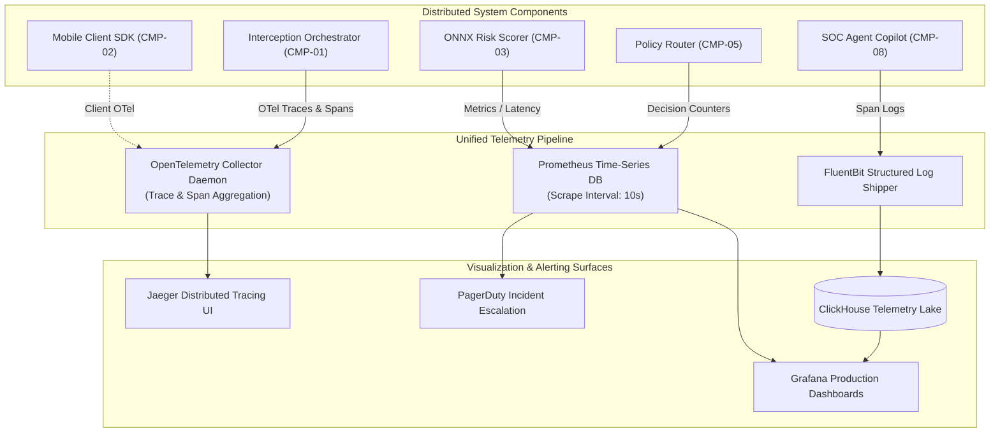
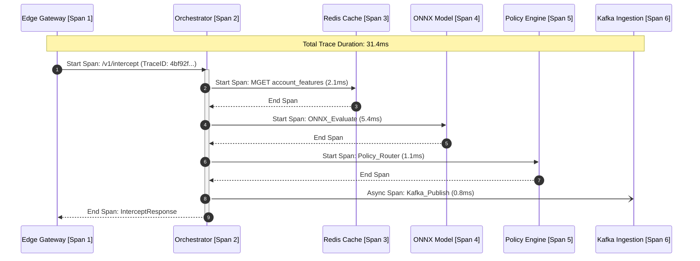

# Observability & Telemetry Architecture

## 1. Observability Framework Overview

Operating an in-line payment scam interception platform requires multi-dimensional, real-time observability across four distinct operational planes:
1. **Systems Performance & Infrastructure Telemetry**: Latency percentiles (P50/P95/P99/P99.9), memory, CPU, queue depths, and circuit breaker trip states.
2. **Machine Learning & Model Health Telemetry**: Score distributions, prediction drift (PSI), feature null rates, calibration curves, and TreeSHAP attribution shifts.
3. **Agentic & Copilot Telemetry**: Tool call latencies, token consumption, reasoning iterations, grammar validation failures, and timeout rates.
4. **Behavioral Fraud & Intervention Telemetry**: Intervention modal display rates, user 5-second dwell completion rates, user payment abort rates, and post-intervention dispute callbacks.



---

## 2. Core Operational Metrics (Prometheus Specification)

Kurukshetra exposes high-resolution Prometheus metrics on `/metrics` endpoints across all service instances:

| Metric Name | Type | Labels | Operational Purpose & SLA Alert Threshold |
| :--- | :--- | :--- | :--- |
| `kurukshetra_intercept_latency_ms` | Histogram | `route`, `status`, `degraded_tier` | **Critical SLA**: Alert if P99 $> 40.0\text{ms}$ over 2-minute rolling window. Buckets: `[2, 5, 10, 20, 30, 40, 45, 50, 100]`. |
| `kurukshetra_decisions_total` | Counter | `directive`, `typology`, `policy_ver` | Monitors volume of `ALLOW`, `STEP_UP`, `COACH`, and `FREEZE` actions. Alert if `FREEZE` rate spikes $> 300\%$ above diurnal baseline. |
| `kurukshetra_circuit_breaker_state` | Gauge | `target_service` | Tracks circuit breaker status: `0=Closed (Normal)`, `1=Half-Open`, `2=Open (Degraded)`. Alert instantly on state change to 2. |
| `kurukshetra_model_inference_latency_ms` | Histogram | `model_id`, `version` | Monitors C++ ONNX scoring duration. Alert if P99 $> 8.0\text{ms}$. |
| `kurukshetra_feature_imputation_ratio` | Gauge | `feature_group` | Fraction of features falling back to defaults due to cache miss. Alert if ratio $> 0.02$ (2%). |
| `kurukshetra_dwell_gate_aborts_total` | Counter | `typology`, `amount_tier` | Key success metric: Counts payments aborted by victims during the 5-second intervention dwell gate. |
| `kurukshetra_agent_tool_duration_ms` | Histogram | `tool_name`, `status` | Monitors SOC copilot tool latencies. Alert if P90 $> 3,000\text{ms}$. |
| `kurukshetra_agent_schema_violations_total`| Counter | `agent_id` | Counts output grammar validation failures. Alert if count $> 0$. |

---

## 3. Distributed Tracing Architecture (OpenTelemetry & Jaeger)

Every payment evaluation request is tagged at the Edge Gateway with a globally unique W3C Trace Context header: `traceparent: 00-4bf92f3577b34da6a3ce929d0e0e4736-00f067aa0ba902b7-01`.



### Trace Sampling Strategy:
- **100% Full-Trace Capture**: For any request where:
  - Final decision is `INTERVENE_COACH` or `INTERVENE_FREEZE`.
  - Latency exceeds $35.0\text{ms}$.
  - Any circuit breaker or degradation tier was engaged.
  - An error or exception was raised.
- **1% Uniform Head-Based Sampling**: For routine, low-risk `ALLOW` transactions to limit storage costs while preserving baseline profiling.

---

## 4. Structured Decision Logging (ClickHouse & JSON-LD)

Kurukshetra writes structured logs in JSON format via FluentBit to ClickHouse. **Zero PII is permitted in stdout logs.**

```json
{
  "timestamp": "2026-09-11T08:35:12.412Z",
  "level": "INFO",
  "trace_id": "4bf92f3577b34da6a3ce929d0e0e4736",
  "span_id": "00f067aa0ba902b7",
  "service": "interception-orchestrator",
  "event": "DECISION_EMITTED",
  "transaction_id": "tx_9981a7b4c2",
  "sender_account_hash": "a1f8c49e2...",
  "recipient_account_hash": "e9b21087d...",
  "risk_score": 0.824,
  "epistemic_uncertainty": 0.082,
  "directive": "INTERVENE_COACH",
  "dwell_gate_enforced": true,
  "typology": "IMPERSONATION_POLICE",
  "top_shap_features": [
    {"feature": "active_gsm_call", "attribution": 0.38},
    {"feature": "remote_access_active", "attribution": 0.29},
    {"feature": "balance_drain_ratio", "attribution": 0.18}
  ],
  "total_latency_ms": 28.4
}
```

---

## 5. Production Health Dashboards & Alert Escalation Rules

### Grafana Dashboard Hierarchy:
1. **Tier-1 Executive & NOC Wallboard**: Live TPS, Global P99 Latency, Availability SLA (99.999%), Interventions per Minute, Total Stolen Value Prevented ($).
2. **Tier-2 Fraud Strategy Console**: Typology breakdown pie chart, False Positive Ratio vs. Customer Friction, Dwell Gate Abort Funnel, Overridden Interventions vs. Eventual Disputes.
3. **Tier-3 MLOps & Model Drift Dashboard**: Feature drift (PSI heatmaps), TreeSHAP contribution shifts, calibration curve alignment, shadow model performance divergence.

### PagerDuty P1 Severity Alerts (Immediate On-Call Page):
- **SLA Breach**: System P99 latency $> 45.0\text{ms}$ for $> 60$ seconds.
- **Circuit Breaker Engaged**: Primary Redis or ONNX model circuit breaker trips to `OPEN`.
- **Anomalous Interventions**: Intervention trigger rate surges $> 5.0\times$ baseline (indicating catastrophic false positive cascade or model weight corruption).
- **Zero-Traffic Condition**: Total ingress TPS drops by $> 75\%$ relative to historical seasonal diurnal baseline.
